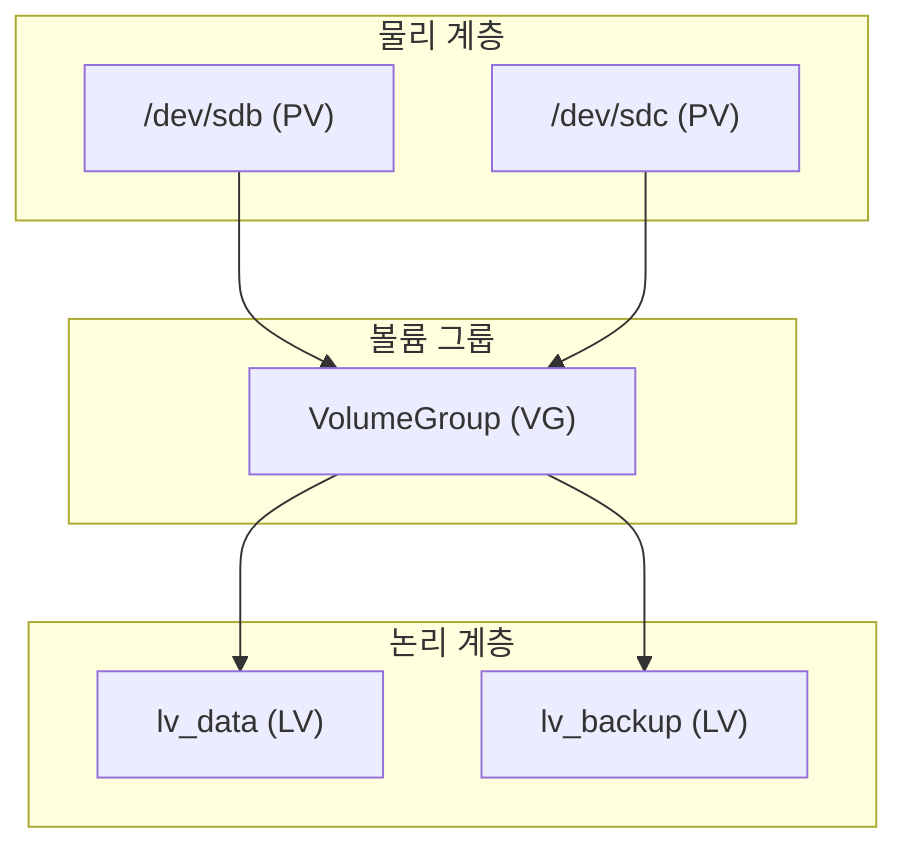

## 1. 개념

**LVM (Logical Volume Manager)**은 물리적 스토리지를 논리적으로 추상화하여 디스크 공간을 유연하게 관리하는 리눅스 커널 기능입니다.
파티션 크기의 제약 없이 볼륨을 동적으로 확장하거나 축소할 수 있으며, 스냅샷 등의 고급 기능을 제공합니다.

### 기본 정보

| 항목 | 설명 |
|------|------|
| 목적 | 디스크 공간의 동적 확장/축소 |
| 구성 요소 | PV → VG → LV |
| 장점 | 리부팅 없이 볼륨 크기 조절 가능 |

### LVM 구조



### 용어 정리

| 약어 | 전체 명칭 | 설명 |
|------|-----------|------|
| PV | Physical Volume | 물리 디스크 또는 파티션 |
| VG | Volume Group | PV들의 집합 (스토리지 풀) |
| LV | Logical Volume | 실제로 마운트되는 논리 볼륨 |
| PE | Physical Extent | PV의 최소 할당 단위 (기본 4MB) |

---

## 2. 설치 방법

### Rocky Linux / CentOS
```bash
# LVM 패키지 설치 (대부분 기본 설치됨)
dnf install -y lvm2

# LVM 서비스 확인
systemctl status lvm2-lvmetad
```

### 디스크 추가 (VM 환경)
1. VM에 새 디스크 추가
2. `lsblk`로 새 디스크 확인 (/dev/sdb 등)
3. 파티션 없이 바로 PV로 사용 가능

---

## 3. 사용법

### LVM 생성 순서
```bash
# 1. Physical Volume 생성
pvcreate /dev/sdb /dev/sdc

# 2. Volume Group 생성
vgcreate vg_data /dev/sdb /dev/sdc

# 3. Logical Volume 생성 (10GB)
lvcreate -L 10G -n lv_data vg_data

# 4. 파일시스템 생성 및 마운트
mkfs.xfs /dev/vg_data/lv_data
mount /dev/vg_data/lv_data /mnt/data
```

### 주요 명령어

| 명령어 | 설명 |
|--------|------|
| `pvs` | PV 목록 |
| `vgs` | VG 목록 |
| `lvs` | LV 목록 |
| `pvdisplay` | PV 상세 정보 |
| `vgdisplay` | VG 상세 정보 |
| `lvdisplay` | LV 상세 정보 |

---

## 4. 실습 예시

### 볼륨 확장 (용량 부족 해결)

Kali Linux 등에서 용량 부족 시 LVM 확장으로 해결:

```bash
# 1. 현재 상태 확인
df -h
lvs
vgs

# 2. VG에 여유 공간 확인
vgdisplay | grep Free

# 3. LV 확장 (VG 여유 공간 전부 사용)
lvextend -l +100%FREE /dev/mapper/kali--vg-root

# 4. 파일시스템 확장
# ext4인 경우
resize2fs /dev/mapper/kali--vg-root

# xfs인 경우
xfs_growfs /dev/mapper/kali--vg-root

# 5. 확장 결과 확인
df -h
```

### 새 디스크 추가로 VG 확장
```bash
# 새 디스크를 PV로 초기화
pvcreate /dev/sdd

# 기존 VG에 PV 추가
vgextend vg_data /dev/sdd

# LV 확장
lvextend -L +20G /dev/vg_data/lv_data
resize2fs /dev/vg_data/lv_data
```

---

## 5. 트러블슈팅

### 파일시스템 타입 확인
```bash
# 파일시스템 종류에 따라 확장 명령어가 다름
lsblk -f
# xfs → xfs_growfs
# ext4 → resize2fs
```

### LV 축소 시 주의사항
- **xfs는 온라인 축소 불가** (xfs_growfs는 확장만 지원)
- ext4는 `resize2fs` 후 `lvreduce` 순서

### LVM 삭제 순서
```bash
# 역순으로 삭제: LV → VG → PV
umount /mnt/data
lvremove /dev/vg_data/lv_data
vgremove vg_data
pvremove /dev/sdb /dev/sdc
```

<hr class="short-rule">
