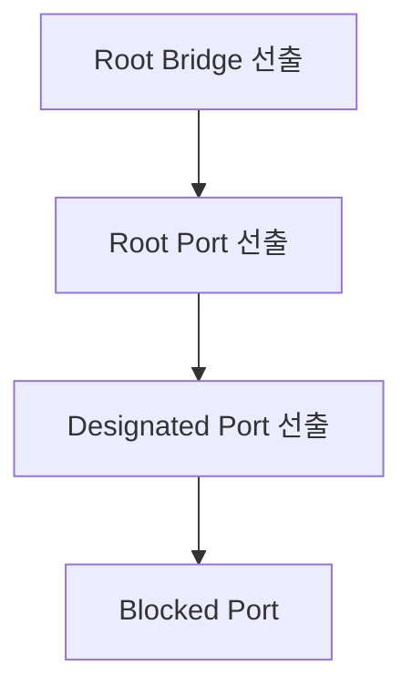

## 1. 개념

**STP (Spanning Tree Protocol)**는 이중화된 스위치 경로에서 발생하는 L2 브로드캐스트 루프를 방지하는 프로토콜입니다.
논리적으로 특정 포트를 차단(Blocking)하여 루프 없는 트리 구조의 경로를 생성합니다.

### 기본 정보
| 항목 | 설명 |
|------|------|
| 표준 | IEEE 802.1D |
| 목적 | L2 루프 방지 |
| 수렴 시간 | 30-50초 (기본) |

### 왜 STP가 필요한가?
- 스위치 이중화 구성 시 물리적 루프 발생
- 브로드캐스트 스톰 → 네트워크 마비
- MAC 플래핑 → 테이블 불안정

### STP 버전
| 버전 | 표준 | 수렴 시간 |
|------|------|-----------|
| STP (CST) | 802.1D | 30-50초 |
| RSTP | 802.1w | 1-5초 |
| PVST+ | Cisco | VLAN별 STP |
| Rapid PVST+ | Cisco | VLAN별 RSTP |
| MST | 802.1s | 다중 인스턴스 |

---

## 2. STP 동작 원리

### 역할 선출 순서



### Bridge ID 구성
```
Priority (2 bytes) + MAC Address (6 bytes)
기본 Priority: 32768
```

### 포트 상태
| 상태 | 설명 | 시간 |
|------|------|------|
| Blocking | 프레임 수신만, BPDU 처리 | 20초 |
| Listening | BPDU 송수신 | 15초 |
| Learning | MAC 학습 시작 | 15초 |
| Forwarding | 정상 동작 | - |
| Disabled | 관리자가 비활성화 | - |

### 타이머
| 타이머 | 기본값 | 설명 |
|--------|--------|------|
| Hello | 2초 | BPDU 전송 간격 |
| Forward Delay | 15초 | Listening/Learning 시간 |
| Max Age | 20초 | BPDU 수신 대기 시간 |

---

## 3. 설정 방법

### Root Bridge 설정
```cisco
! Priority를 낮춰서 Root Bridge로 지정
Switch(config)# spanning-tree vlan 1 priority 4096

! 또는 자동으로 Root 설정
Switch(config)# spanning-tree vlan 1 root primary
! Secondary (백업 Root)
Switch(config)# spanning-tree vlan 1 root secondary
```

### PortFast 설정
```cisco
! PC가 연결되는 포트 (즉시 Forwarding)
Switch(config)# interface fa0/1
Switch(config-if)# spanning-tree portfast

! 전체 Access 포트에 적용
Switch(config)# spanning-tree portfast default
```

### BPDU Guard
```cisco
! PortFast 포트에 BPDU 수신 시 Shutdown
Switch(config-if)# spanning-tree bpduguard enable

! 전역 설정
Switch(config)# spanning-tree portfast bpduguard default
```

### Rapid PVST+ 활성화
```cisco
Switch(config)# spanning-tree mode rapid-pvst
```

---

## 4. 확인 명령어

```cisco
! STP 상태 요약
Switch# show spanning-tree

! 특정 VLAN
Switch# show spanning-tree vlan 10

! Root Bridge 정보
Switch# show spanning-tree root

! 포트별 상태
Switch# show spanning-tree interface fa0/1

! BPDU 통계
Switch# show spanning-tree detail
```

### 출력 예시
```
VLAN0001
  Spanning tree enabled protocol rstp
  Root ID    Priority    4097
             Address     0001.0001.0001
             This bridge is the root
  Bridge ID  Priority    4097
             Address     0001.0001.0001
```

---

## 5. 트러블슈팅

### Root Bridge 변경됨
```cisco
! 현재 Root 확인
Switch# show spanning-tree root

! Priority 강제 지정으로 되찾기
Switch(config)# spanning-tree vlan 1 priority 0
```

### 포트가 Blocking 상태
- 정상: 루프 방지를 위해 의도적 차단
- 비정상: 케이블 문제 또는 설정 오류

### BPDU Guard로 인한 Shutdown
```cisco
! 포트 복구
Switch(config)# interface fa0/1
Switch(config-if)# shutdown
Switch(config-if)# no shutdown

! 자동 복구 설정
Switch(config)# errdisable recovery cause bpduguard
Switch(config)# errdisable recovery interval 300
```

<hr class="short-rule">
