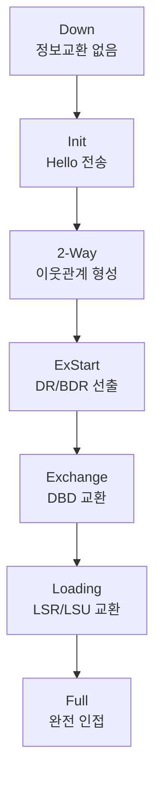

## 1. 개념

**OSPF (Open Shortest Path First)**는 링크 상태 기반 동적 라우팅 프로토콜.

### 기본 정보

| 항목 | 내용 |
|------|------|
| 타입 | Link-State (링크 상태) |
| 표준 | OSPFv2 (RFC 2328), OSPFv3 (IPv6) |
| 메트릭 | Cost (링크 비용) |
| AD (관리 거리) | 110 |
| 알고리즘 | Dijkstra SPF (최단 경로 우선) |

### Distance Vector vs Link State

| 구분 | Distance Vector (RIP) | Link State (OSPF) |
|------|----------------------|-------------------|
| 정보 공유 | 라우팅 테이블 | 토폴로지 전체 |
| 수렴 속도 | 느림 | 빠름 |
| 홉 제한 | 15홉 | 무제한 |
| 업데이트 | 주기적 (30초) | 변화 시 즉시 |

### OSPF 장점
- 빠른 수렴 속도 (토폴로지 변경 시 즉시 업데이트)
- VLSM/CIDR 지원 (Classless)
- 대규모 네트워크에 적합 (영역 분할)
- 대역폭 기반 경로 선택 (고속 경로 우선)

---

## 2. OSPF 동작 원리

### 세 가지 데이터베이스

| 데이터베이스 | 역할 | 명령어 |
|--------------|------|--------|
| Neighbor Table | 이웃 라우터 목록 | `show ip ospf neighbor` |
| Topology Table (LSDB) | 네트워크 전체 토폴로지 | `show ip ospf database` |
| Routing Table | 최적 경로 | `show ip route` |

### OSPF 7단계 상태


### OSPF 패킷 타입

| 타입 | 이름 | 역할 |
|------|------|------|
| 1 | Hello | 이웃 발견 및 유지 |
| 2 | DBD (Database Description) | 링크상태 요약 전송 |
| 3 | LSR (Link State Request) | 상세 정보 요청 |
| 4 | LSU (Link State Update) | 링크상태 정보 전송 |
| 5 | LSAck | 수신 확인 |

### Hello 패킷 타이머

| 네트워크 유형 | Hello 간격 | Dead 간격 |
|---------------|------------|-----------|
| Broadcast / Point-to-Point | 10초 | 40초 |
| NBMA (Frame Relay) | 30초 | 120초 |

> **Hello/Dead 간격이 다르면 이웃 관계 형성 불가!**

---

## 3. DR/BDR 선출

**Multi-Access 네트워크**(이더넷)에서는 DR/BDR을 선출하여 라우팅 정보 교환을 효율화.

### 역할

| 역할 | 설명 |
|------|------|
| DR (Designated Router) | 라우팅 정보 중앙 수집/배포 |
| BDR (Backup DR) | DR 장애 시 승계 |
| DROther | 일반 라우터. DR/BDR과만 통신 |

### 선출 기준 (높은 값 우선)
1. **Priority** (0~255, 기본값 1, 0이면 선출 제외)
2. **Router ID** (수동설정 > Loopback IP > 물리 인터페이스 중 최대 IP)

### 멀티캐스트 주소

| 주소 | 대상 |
|------|------|
| 224.0.0.5 | 모든 OSPF 라우터 (AllSPFRouters) |
| 224.0.0.6 | DR/BDR만 (AllDRouters) |

---

## 4. 링크 비용 (Cost) 계산

### 공식
```
Cost = Reference Bandwidth / Interface Bandwidth
     = 10^8 / 대역폭(bps)
```

### 기본 Cost 값

| 인터페이스 | 대역폭 | Cost |
|------------|--------|------|
| FastEthernet | 100 Mbps | 1 |
| Ethernet | 10 Mbps | 10 |
| T1 (Serial) | 1.544 Mbps | 64 |
| T3 | 44.736 Mbps | 2 |
| GigabitEthernet | 1 Gbps | 1 |

> **GigabitEthernet 문제**: 10G도 Cost 1. → Reference Bandwidth 변경 권장

### Reference Bandwidth 변경
```cisco
Router(config-router)# auto-cost reference-bandwidth 10000
! 10 Gbps 기준으로 변경
```

---

## 5. 설정 방법

### 기본 OSPF 설정
```cisco
Router(config)# router ospf 10
! Process ID (로컬에서만 의미, 라우터별 달라도 됨)

Router(config-router)# network 192.168.1.0 0.0.0.255 area 0
Router(config-router)# network 10.10.10.0 0.0.0.255 area 0
! 와일드카드 마스크: 서브넷 마스크의 비트 반전
! SM 255.255.255.0 → WM 0.0.0.255
```

### 와일드카드 마스크

| 서브넷 마스크 | 와일드카드 마스크 |
|---------------|-------------------|
| 255.0.0.0 | 0.255.255.255 |
| 255.255.0.0 | 0.0.255.255 |
| 255.255.255.0 | 0.0.0.255 |
| 255.255.255.128 | 0.0.0.127 |
| 255.255.255.252 | 0.0.0.3 |

### Router ID 수동 설정
```cisco
Router(config-router)# router-id 1.1.1.1
```

### Priority 설정 (DR 선출용)
```cisco
Router(config)# interface fa0/0
Router(config-if)# ip ospf priority 100
! 0: DR 선출에서 제외
```

### 인증 설정
```cisco
! 영역에 인증 활성화
Router(config)# router ospf 10
Router(config-router)# area 0 authentication message-digest

! 인터페이스에 키 설정
Router(config)# interface serial 0/0/0
Router(config-if)# ip ospf message-digest-key 1 md5 MyPassword
```

### 타이머 변경
```cisco
Router(config-if)# ip ospf hello-interval 5
Router(config-if)# ip ospf dead-interval 20
! Dead = Hello × 4 권장
```

---

## 6. 확인 명령어

```cisco
! 이웃 테이블
Router# show ip ospf neighbor

! 토폴로지 테이블 (LSDB)
Router# show ip ospf database

! 인터페이스 정보
Router# show ip ospf interface

! 라우팅 테이블
Router# show ip route
Router# show ip route ospf

! OSPF 프로토콜 정보
Router# show ip protocols
```

### show ip ospf neighbor 출력 예시
```
Neighbor ID   Pri   State       Dead Time   Address       Interface
192.168.2.1   1     FULL/DR     00:00:34    10.10.10.2    Serial0/0/0
```
- **FULL**: 완전 인접 상태 (정상)
- **DR/BDR/-**: 해당 라우터의 역할

### show ip route 출력 해석
```
O    192.168.2.0/24 [110/65] via 10.10.10.2, 00:00:31, Serial0/0/0
```
| 항목 | 의미 |
|------|------|
| O | OSPF로 학습한 경로 |
| 192.168.2.0/24 | 목적지 네트워크 |
| [110/65] | [AD/Cost] |
| via 10.10.10.2 | 다음 홉 (Next-Hop) |
| Serial0/0/0 | 출구 인터페이스 |

---

## 7. 트러블슈팅

### Neighbor 관계 안됨
```cisco
! 양쪽 확인 사항:
- Area ID 일치
- Hello/Dead 타이머 일치
- 인증 설정 일치
- 서브넷 마스크 일치
```

### 오류 메시지 예시
```
%OSPF-5-ADJCHG: Process 10, Nbr 192.168.1.1 on Serial0/0/0 from FULL to DOWN
! 이웃 다운됨. 케이블/설정 확인 필요
```

### 라우팅 정보 없음
```cisco
! network 명령어 확인
! 인터페이스 no shutdown 확인
! show ip ospf interface에서 해당 인터페이스 표시되는지 확인
```

<hr class="short-rule">
