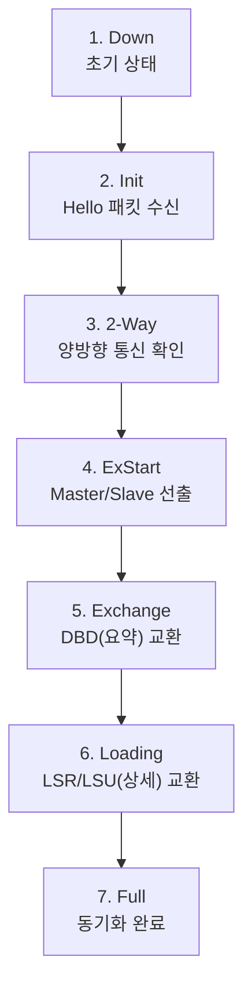

---
layout: post
title: "OSPF"
date: 2025-07-23 17:00:00 +0900
categories: [network]
---

## 1. 개요

**OSPF (Open Shortest Path First)**는 링크 상태(Link-State) 기반의 표준 동적 라우팅 프로토콜이다.
Dijkstra의 SPF(Shortest Path First) 알고리즘을 사용하여 네트워크 토폴로지의 최단 경로를 계산하고 라우팅 테이블을 구성한다.

### 핵심 특징
*   **빠른 수렴 (Fast Convergence)**: 네트워크 변화 시 즉시 업데이트하여 반영한다.
*   **루프 없음 (Loop-Free)**: 전체 토폴로지를 이해하고 최단 경로 트리를 구성하므로 루프가 발생하지 않는다.
*   **효율적 업데이트**: 주기적인 전체 테이블 전송(RIP) 대신 변화된 정보(LSA)만 전송한다.
*   **계층적 구조**: Area 개념을 도입하여 대규모 네트워크를 효율적으로 관리한다.

### Distance Vector vs Link State
| 구분 | Distance Vector (RIP) | Link State (OSPF) |
|---|---|---|
| **정보 공유** | 라우팅 테이블 전체 | 링크 상태(Link-State) 정보 |
| **수렴 속도** | 느림 | 빠름 |
| **홉 제한** | 15 홉 | 무제한 |
| **업데이트** | 주기적 (30초) | 변화 발생 시 즉시 |

---

## 2. OSPF 동작 원리

### 세 가지 데이터베이스
OSPF는 다음 세 가지 테이블을 유지하며 동작한다.

| 데이터베이스 | 역할 | 확인 명령어 |
|---|---|---|
| **Neighbor Table** | 인접한 OSPF 라우터 목록 (Hello 패킷으로 식별) | `show ip ospf neighbor` |
| **Topology Table (LSDB)** | 네트워크 전체 지도 (LSA 정보 저장소) | `show ip ospf database` |
| **Routing Table** | 알고리즘으로 계산된 최적 경로 | `show ip route` |

### OSPF 7단계 상태 변화
라우터가 인접 관계를 맺고 동기화되는 과정이다.



### OSPF 패킷 타입
| 타입 | 이름 | 역할 |
|---|---|---|
| 1 | **Hello** | 이웃 발견 및 관계 유지 (Keepalive) |
| 2 | **DBD** (Database Description) | LSDB의 요약 정보 전송 |
| 3 | **LSR** (Link State Request) | 상대방에게 상세 정보를 요청할 때 사용 |
| 4 | **LSU** (Link State Update) | 요청받은 상세 정보(LSA)를 전송 |
| 5 | **LSAck** (Link State Acknowledgment) | 수신 확인 |

### Hello 패킷 타이머
네트워크 유형에 따라 기본 타이머 값이 다르다. **이웃 간에 이 설정이 다르면 관계가 형성되지 않는다.**

| 네트워크 유형 | Hello 간격 | Dead 간격 |
|---|---|---|
| Broadcast (Ethernet) | 10초 | 40초 |
| Point-to-Point (Serial) | 10초 | 40초 |
| NBMA (Frame Relay) | 30초 | 120초 |

---

## 3. DR/BDR 선출

Multi-Access 네트워크(이더넷 등)에서는 모든 라우터가 서로 연결될 경우(Full Mesh) 트래픽이 급증하므로, 대표 라우터를 선출하여 통신 효율을 높인다.

| 역할 | 설명 |
|---|---|
| **DR (Designated Router)** | 모든 LSA 정보를 수집하여 다른 라우터들에게 중계 및 배포하는 반장 역할 |
| **BDR (Backup DR)** | DR 장애 시 즉시 역할을 승계하는 부반장 역할 |
| **DROther** | 일반 라우터. DR/BDR과만 통신한다. |

### 선출 기준 (높은 값 우선)
1.  **OSPF Priority**: 0~255 (기본값 1). **0**으로 설정하면 DR 선출에서 제외된다.
2.  **Router ID**: 
    1. 수동 설정된 Router ID
    2. 가장 높은 Loopback 인터페이스 IP
    3. 가장 높은 물리 인터페이스 IP

### 멀티캐스트 주소
*   **224.0.0.5 (AllSPFRouters)**: 모든 OSPF 라우터가 수신
*   **224.0.0.6 (AllDRouters)**: DR/BDR만 수신 (DROther가 정보를 보낼 때 사용)

---

## 4. 링크 비용 (Cost) 계산

OSPF는 대역폭(Bandwidth)을 기준으로 경로 비용(Cost)을 계산한다. **Cost 합이 가장 낮은 경로**가 최적 경로로 선택된다.

### 공식
```
Cost = Reference Bandwidth / Interface Bandwidth
     = 10^8 (100Mbps) / 대역폭(bps)
```

### 기본 Cost 값 (Reference BW = 100Mbps 기준)
| 인터페이스 | 대역폭 | Cost |
|---|---|---|
| FastEthernet | 100 Mbps | 1 |
| Ethernet | 10 Mbps | 10 |
| Serial (T1) | 1.544 Mbps | 64 |
| GigabitEthernet | 1 Gbps | 1 (구별 불가!) |

> **중요**: 1Gbps 이상의 고속 링크가 보편화된 현재 환경에서는 기본 기준 대역폭(100Mbps)으로는 1G와 100M를 구분할 수 없다(둘 다 Cost 1). 따라서 `auto-cost reference-bandwidth` 명령어로 기준 값을 1000 이상으로 올려주어야 정확한 경로 계산이 가능하다.

```cisco
Router(config-router)# auto-cost reference-bandwidth 1000
! 단위를 Mbps로 입력 (1000 = 1Gbps)
```

---

## 5. 설정 방법

### 기본 OSPF 설정
```cisco
Router(config)# router ospf 10
! Process ID 10 (로컬 라우터 내에서만 식별하는 번호)

Router(config-router)# router-id 1.1.1.1
! Router ID 수동 설정 (권장)

Router(config-router)# network 192.168.1.0 0.0.0.255 area 0
Router(config-router)# network 10.10.10.0 0.0.0.255 area 0
! network [네트워크주소] [와일드카드마스크] area [영역번호]
```

### 와일드카드 마스크 (Wildcard Mask)
서브넷 마스크의 비트를 반전시킨 값이다.
*   255.255.255.0 → **0.0.0.255**
*   255.255.255.252 → **0.0.0.3**
*   255.255.0.0 → **0.0.255.255**

### Priority 설정 (DR 선출 조정)
특정 라우터를 DR로 만들고 싶다면 Priority를 높인다.
```cisco
Router(config)# interface g0/0
Router(config-if)# ip ospf priority 100
! 기본값 1, 0이면 DR 선출 불가
```

### 인증 설정 (Authentication)
보안을 위해 라우터 간 인증을 설정한다. (MD5 권장)
```cisco
! 영역 전체에 인증 활성화
Router(config)# router ospf 10
Router(config-router)# area 0 authentication message-digest

! 인터페이스별 키 설정
Router(config)# interface serial 0/0/0
Router(config-if)# ip ospf message-digest-key 1 md5 MySecretKey
```

### 타이머 변경
Hello/Dead 간격을 조정하여 수렴 속도를 높이거나 부하를 줄일 수 있다. **양쪽 라우터가 동일해야 한다.**
```cisco
Router(config-if)# ip ospf hello-interval 5
Router(config-if)# ip ospf dead-interval 20
! Dead는 보통 Hello의 4배로 설정
```

---

## 6. 확인 명령어

```cisco
! 1. 이웃 상태 확인 (가장 중요)
Router# show ip ospf neighbor
! State가 FULL 또는 2-WAY인지 확인해야 함. (Init, ExStart 등은 문제 상황)

! 2. 토폴로지 테이블 확인 (LSDB)
Router# show ip ospf database

! 3. 인터페이스 OSPF 설정 확인
Router# show ip ospf interface

! 4. 라우팅 테이블 확인 (OSPF 경로)
Router# show ip route ospf

! 5. 프로토콜 상세 정보 확인
Router# show ip protocols
```

### show ip ospf neighbor 출력 예시
```
Neighbor ID   Pri   State       Dead Time   Address       Interface
192.168.2.1   1     FULL/DR     00:00:34    10.10.10.2    Serial0/0/0
```
*   **Neighbor ID**: 상대방 Router ID
*   **Pri**: 상대방 Priority
*   **State**: 상태 (FULL이면 정상, DR/BDR/DROther 역할 표시)
*   **Address**: 상대방 IP 주소

### show ip route 출력 해석
```
O    192.168.2.0/24 [110/65] via 10.10.10.2, 00:00:31, Serial0/0/0
```
*   **O**: OSPF로 학습한 경로
*   **[110/65]**: [관리거리(AD) / Cost값]
    *   OSPF의 기본 AD는 **110**이다.

---

## 7. 트러블슈팅

### 이웃 관계(Neighbor)가 맺어지지 않는 경우
양쪽 라우터의 설정이 다음 항목들에서 일치하는지 확인해야 한다. 하나라도 다르면 이웃이 될 수 없다.
1.  **Area ID**: 연결된 인터페이스가 동일한 Area에 속해야 한다.
2.  **Hello/Dead 타이머**: 값이 서로 같아야 한다.
3.  **Authentication**: 인증 유형과 비밀번호가 일치해야 한다.
4.  **Subnet Mask**: 연결된 링크의 서브넷 마스크가 동일해야 한다.
5.  **Stub Area Flag**: 스터브 영역 설정 여부가 같아야 한다.

### 오류 메시지 예시
```
%OSPF-5-ADJCHG: Process 10, Nbr 192.168.1.1 on Serial0/0/0 from FULL to DOWN
```
*   이웃 상태가 변경되었음을 의미한다. 물리적 링크 다운이나 설정 변경을 확인한다.

### 라우팅 정보가 보이지 않는 경우
*   `network` 명령어로 올바른 대역을 선언했는지 확인한다.
*   인터페이스가 `no shutdown` 상태인지 확인한다.
*   `show ip ospf interface` 명어로 해당 인터페이스가 OSPF에 포함되었는지 확인한다.

---

## 8. 보안 고려사항

*   **인증 필수 적용**: 라우터 간 MD5 또는 SHA 인증을 설정하여 위조 라우터가 라우팅 정보를 주입하는 것을 방지한다.
*   **Passive Interface**: 사용자 네트워크가 연결된 인터페이스는 `passive-interface`로 설정하여 OSPF 패킷을 보내지 않도록 한다. 내부 토폴로지 정보 노출을 막는다.
    ```cisco
    Router(config-router)# passive-interface g0/1
    ```
*   **네트워크 선언 최소화**: `network` 명령어로 필요한 인터페이스만 정확하게 OSPF에 포함시킨다.
*   **Stub Area 활용**: 외부 라우팅 정보가 불필요한 영역은 Stub Area로 설정하여 LSDB 크기와 CPU 부하를 줄인다.

<hr class="short-rule">
