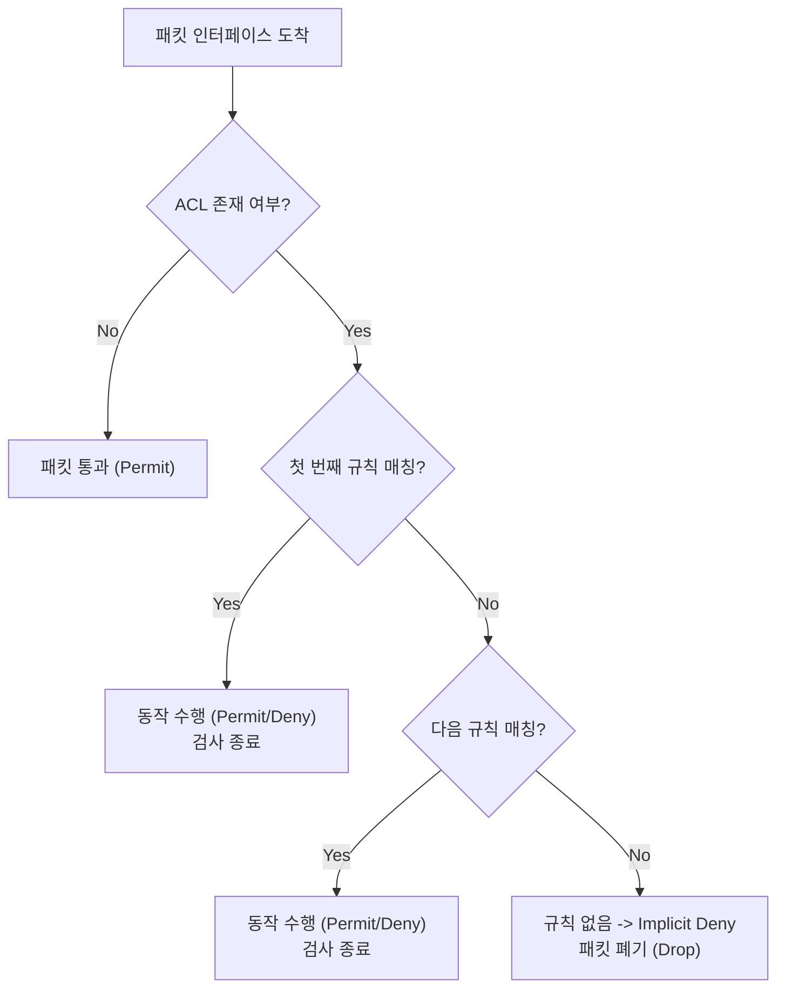

---
layout: post
title: "ACL"
date: 2025-07-24 17:00:00 +0900
categories: [network]
---

## 1. 개요

**ACL (Access Control List)**은 라우터나 스위치의 인터페이스를 통과하는 패킷을 필터링하는 규칙들의 리스트이다.
방화벽의 가장 기초적인 형태로, 출발지 IP, 목적지 IP, 포트 번호, 프로토콜 등을 검사하여 트래픽을 허용(Permit)하거나 차단(Deny)한다.

### 기본 정보
| 항목 | 설명 |
|---|---|
| **목적** | 불필요한 트래픽 차단, 보안 강화, 대역폭 관리 |
| **동작** | 패킷 헤더 정보와 규칙을 순차적으로 비교하여 매칭 시 수행 |
| **적용 위치** | 라우터/스위치 인터페이스의 Inbound 또는 Outbound |

### ACL의 주요 활용
*   **보안**: 외부에서 내부로 들어오는 해킹 시도 차단
*   **트래픽 제어**: 특정 부서의 인터넷 접속 제한 (예: 업무 시간에 게임 사이트 차단)
*   **NAT**: 주소 변환 대상을 지정할 때 사용
*   **QoS**: 우선순위를 부여할 트래픽을 식별할 때 사용
*   **VPN**: 암호화 터널을 통과할 트래픽(Interesting Traffic)을 정의할 때 사용

### 동작 메커니즘 (Flow)

> **Implicit Deny (암시적 거부)**: 모든 ACL의 맨 마지막 줄에는 보이지 않는 `deny any` 규칙이 있다. 즉, **허용되지 않은 모든 트래픽은 자동으로 차단된다.**

---

## 2. ACL 종류 및 비교

### 표준 ACL (Standard ACL)
*   **검사 항목**: 오직 **출발지(Source) IP 주소**만 검사한다.
*   **번호 범위**: 1 ~ 99, 1300 ~ 1999
*   **적용 위치**: **목적지(Destination)**에 가까운 라우터 인터페이스에 적용한다.
    *   이유: 출발지 근처에서 차단해버리면, 해당 출발지가 가려는 다른 모든 목적지까지 차단될 수 있기 때문이다.

### 확장 ACL (Extended ACL)
*   **검사 항목**: 출발지 IP, 목적지 IP, 프로토콜(TCP/IP/ICMP), 포트 번호 등을 모두 검사한다.
*   **번호 범위**: 100 ~ 199, 2000 ~ 2699
*   **적용 위치**: **출발지(Source)**에 가까운 라우터 인터페이스에 적용한다.
    *   이유: 불필요한 트래픽이 네트워크 대역폭을 낭비하며 목적지까지 가는 것을 방지하기 위해, 발생 지점에서 가장 가까운 곳에서 미리 차단하는 것이 효율적이다.

### Named ACL
*   번호 대신 **이름**을 식별자로 사용한다.
*   표준 및 확장 ACL 모두 Named 방식으로 생성 가능하다.
*   **가장 큰 장점**: 개별 규칙을 중간에 삽입하거나 삭제할 수 있다. (Numbered ACL은 수정이 어렵다)

| 항목 | 표준 ACL | 확장 ACL |
|---|---|---|
| **번호** | 1-99 | 100-199 |
| **필터링 기준** | 출발지 IP | 출발지/목적지 IP, 포트, 프로토콜 |
| **정밀도** | 낮음 | 높음 |
| **적용권장 위치** | 목적지 근처 | 출발지 근처 |

---

## 3. 와일드카드 마스크 (Wildcard Mask)

ACL에서는 서브넷 마스크 대신 와일드카드 마스크를 사용한다. 이는 서브넷 마스크의 비트를 반전시킨 값이다.

### 변환 규칙
*   **0**: 비트가 반드시 일치해야 함 (Check)
*   **1**: 비트가 일치하지 않아도 됨 (Ignore)

### 계산 예시
| 서브넷 마스크 | 와일드카드 마스크 | 설명 |
|---|---|---|
| 255.255.255.0 | **0.0.0.255** | C클래스 (/24) 네트워크 전체 |
| 255.255.255.128 | **0.0.0.127** | /25 서브넷 |
| 255.255.255.252 | **0.0.0.3** | P2P 직렬 연결 (/30) |
| 255.255.0.0 | **0.0.255.255** | B클래스 (/16) |

### 특수 표기법
*   **host**: 특정 단일 IP를 지정할 때 사용. (와일드카드 0.0.0.0과 동일)
    *   `192.168.1.1 0.0.0.0` → `host 192.168.1.1`
*   **any**: 모든 IP를 지정할 때 사용. (와일드카드 255.255.255.255와 동일)
    *   `0.0.0.0 255.255.255.255` → `any`

---

## 4. 표준 ACL 설정 (Standard)

### 문법
```
access-list [번호] [permit|deny] [출발지IP] [와일드카드마스크]
```

### 예제: 특정 네트워크 차단
192.168.1.0/24 대역에서 오는 트래픽을 차단하고, 나머지는 모두 허용한다.
```cisco
Router(config)# access-list 10 deny 192.168.1.0 0.0.0.255
Router(config)# access-list 10 permit any
! 마지막에 permit any를 넣지 않으면 나머지 트래픽도 모두 차단됨 (Implicit Deny)

! 인터페이스에 적용 (목적지 라우터의 인터페이스)
Router(config)# interface fa0/0
Router(config-if)# ip access-group 10 out
```

### 예제: 특정 호스트만 허용
```cisco
Router(config)# access-list 2 permit host 192.168.1.10
! 나머지는 자동 차단됨 (Implicit Deny 활용)
```

---

## 5. 확장 ACL 설정 (Extended)

### 문법
```
access-list [번호] [permit|deny] [프로토콜] [출발지] [목적지] [옵션(eq 포트)]
```

### 연산자
| 연산자 | 의미 | 설명 |
|---|---|---|
| **eq** | Equal | 포트 번호가 같을 때 |
| **neq** | Not Equal | 포트 번호가 다를 때 |
| **lt** | Less Than | 포트 번호보다 작을 때 |
| **gt** | Greater Than | 포트 번호보다 클 때 |
| **range** | Range | 포트 번호 범위 지정 |

### 예제: Telnet(23) 차단
192.168.1.0 네트워크에서 192.168.2.0 네트워크로 가는 Telnet 트래픽을 차단한다.
```cisco
Router(config)# access-list 100 deny tcp 192.168.1.0 0.0.0.255 192.168.2.0 0.0.0.255 eq 23
Router(config)# access-list 100 permit ip any any

! 인터페이스 적용 (출발지 라우터의 인터페이스)
Router(config)# interface serial 0/0/0
Router(config-if)# ip access-group 100 in
```

### 예제: 웹 서버(80)만 허용
특정 호스트(192.168.1.10)만 외부 웹 서버(10.0.0.100)에 접속 가능하게 한다.
```cisco
Router(config)# access-list 101 permit tcp host 192.168.1.10 host 10.0.0.100 eq 80
Router(config)# access-list 101 deny tcp any host 10.0.0.100 eq 80
Router(config)# access-list 101 permit ip any any
```

### 예제: Ping(ICMP) 차단
```cisco
! echo (Ping Request) 차단
Router(config)# access-list 102 deny icmp 192.168.1.0 0.0.0.255 any echo
Router(config)# access-list 102 permit ip any any
```

---

## 6. Named ACL 설정

### 문법
```cisco
ip access-list {standard|extended} {이름}
 [sequence] {permit|deny} ...
```

### 예제: Telnet 차단용 Named ACL
```cisco
Router(config)# ip access-list extended BLOCK_TELNET
Router(config-ext-nacl)# deny tcp 192.168.1.0 0.0.0.255 any eq 23
Router(config-ext-nacl)# permit ip any any
Router(config-ext-nacl)# exit

! 적용
Router(config)# interface fa0/0
Router(config-if)# ip access-group BLOCK_TELNET in
```

### Named ACL 관리 (규칙 삭제)
Numbered ACL은 한 줄을 지우면 전체 리스트가 삭제되지만, Named ACL은 **번호(Sequence Number)**를 이용해 특정 줄만 삭제가 가능하다.
```cisco
Router(config-ext-nacl)# no 10
! 10번 줄의 규칙만 삭제됨
```

---

## 7. VTY (Telnet/SSH) 접근 제어

라우터 자체에 접속하는 관리 트래픽을 제어할 때는 `access-group`이 아닌 `access-class` 명령어를 사용한다.

```cisco
! 1. 관리자 IP만 허용하는 표준 ACL 생성
Router(config)# access-list 10 permit 192.168.1.0 0.0.0.255
Router(config)# access-list 10 deny any

! 2. VTY 라인(가상 터미널)에 적용
Router(config)# line vty 0 4
Router(config-line)# access-class 10 in
Router(config-line)# transport input ssh
Router(config-line)# login local
```

---

## 8. 확인 및 관리

### 명령어 목록
```cisco
! ACL 목록 확인
Router# show access-lists
Router# show ip access-lists

! 인터페이스 적용 여부 확인
Router# show ip interface fa0/0
! 출력 중 "Outgoing access list is 10" 같은 문구 확인

! 특정 ACL 매치 통계 확인
Router# show access-lists 100
! (15 matches) 등으로 패킷이 몇 번 필터링되었는지 확인 가능
```

---

## 9. ACL 삭제

```cisco
! Numbered ACL 삭제 (전체 삭제)
Router(config)# no access-list 100

! Named ACL 삭제
Router(config)# no ip access-list extended BLOCK_TELNET

! 인터페이스 적용 해제
Router(config)# interface fa0/0
Router(config-if)# no ip access-group 100 in
```

---

## 10. 트러블슈팅

### ACL 작성 및 적용 규칙 (Best Practice)
1.  **순서가 중요하다**: 좁은 범위(Specific, 구체적인 조건)의 규칙을 **먼저(위쪽)** 배치하고, 넓은 범위(General, any)를 나중에 배치해야 한다.
2.  **Implicit Deny 주의**: 모든 트래픽이 차단되는 현상이 발생하면, 맨 끝에 `permit ip any any`가 있는지 확인한다.
3.  **성능 고려**: 자주 매칭될 가능성이 높은 규칙(예: 웹 트래픽 허용)을 리스트 상단에 배치하면 CPU 부하를 줄일 수 있다.
4.  **방향(Direction) 확인**: `in`과 `out`을 반대로 적용하면 통신이 완전히 끊길 수 있다.
    *   **In**: 라우터가 패킷을 받아들일 때 검사
    *   **Out**: 라우터가 패킷을 다른 인터페이스로 내보내기 직전에 검사

### 적용이 안 될 때
`show ip interface [인터페이스명]` 명령어로 `access list is ...` 부분이 설정되어 있는지 확인한다. ACL을 만들기만 하고 인터페이스에 `ip access-group`으로 적용하지 않는 실수가 흔하다.

<hr class="short-rule">
