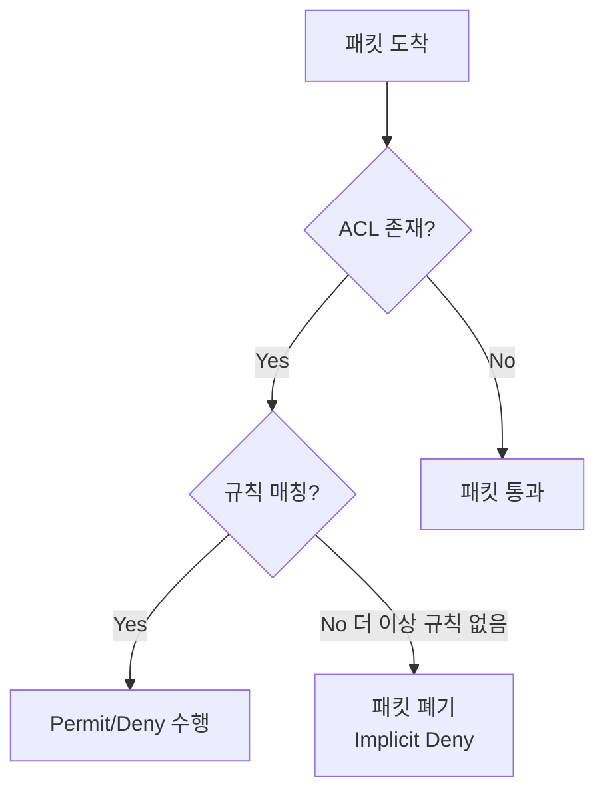

## 1. 개념

**ACL (Access Control List)**은 라우터/스위치에서 패킷을 필터링하는 규칙 집합.

### 기본 정보
| 항목 | 설명 |
|------|------|
| 목적 | 트래픽 제어, 보안 구현 |
| 동작 | 패킷 허용(permit) 또는 차단(deny) |
| 적용 위치 | 라우터 인터페이스 |

### ACL의 활용
- **보안**: 불필요한 트래픽 차단
- **트래픽 제어**: 특정 서비스만 허용/차단
- **NAT 정책**: 변환 대상 정의
- **QoS**: 우선순위 트래픽 식별
- **VPN**: 암호화 대상 트래픽 정의

### ACL 동작 원리



> **Implicit Deny**: 모든 ACL 끝에는 암묵적으로 `deny any`가 있음!

---

## 2. ACL 종류

### 표준 ACL (Standard ACL)
- **출발지 IP만** 검사
- 번호: **1-99**, 1300-1999
- **목적지에 가깝게** 적용 (너무 일찍 차단하면 다른 서비스도 차단됨)

### 확장 ACL (Extended ACL)
- **출발지, 목적지, 프로토콜, 포트** 검사
- 번호: **100-199**, 2000-2699
- **출발지에 가깝게** 적용 (불필요한 트래픽을 빨리 차단)

### Named ACL
- 번호 대신 **이름** 사용
- 개별 규칙 삭제/수정 가능

### 비교표
| 항목 | 표준 ACL | 확장 ACL |
|------|----------|----------|
| 번호 | 1-99 | 100-199 |
| 검사 항목 | 출발지 IP | 출발지, 목적지, 프로토콜, 포트 |
| 적용 위치 | 목적지 근처 | 출발지 근처 |
| 세밀도 | 낮음 | 높음 |

---

## 3. 와일드카드 마스크

서브넷 마스크의 **비트 반전** 값. ACL과 OSPF에서 사용.

### 변환 규칙
```
서브넷 마스크 비트 0 → 와일드카드 비트 1 (검사 안함)
서브넷 마스크 비트 1 → 와일드카드 비트 0 (일치 검사)
```

### 계산 예시
| 서브넷 마스크 | 와일드카드 마스크 |
|---------------|-------------------|
| 255.255.255.0 | 0.0.0.255 |
| 255.255.255.128 | 0.0.0.127 |
| 255.255.255.252 | 0.0.0.3 |
| 255.255.0.0 | 0.0.255.255 |

### 특수 표기
| 표현 | 의미 |
|------|------|
| `host 192.168.1.10` | `192.168.1.10 0.0.0.0` (단일 호스트) |
| `any` | `0.0.0.0 255.255.255.255` (모든 호스트) |

---

## 4. 표준 ACL 설정

### 문법
```cisco
access-list {1-99} {permit|deny} {source} [wildcard-mask]
```

### 예제: 특정 네트워크 차단
```cisco
! 192.168.1.0/24에서 오는 트래픽 차단
Router(config)# access-list 1 deny 192.168.1.0 0.0.0.255
Router(config)# access-list 1 permit any
! 마지막에 permit any 필수! (Implicit Deny 방지)

! 인터페이스에 적용 (목적지 근처)
Router(config)# interface fa0/0
Router(config-if)# ip access-group 1 out
```

### 예제: 특정 호스트만 허용
```cisco
Router(config)# access-list 2 permit host 192.168.1.10
Router(config)# access-list 2 deny any
! 또는 permit any 생략 (Implicit Deny 활용)
```

---

## 5. 확장 ACL 설정

### 문법
```cisco
access-list {100-199} {permit|deny} {protocol} 
    {source} [source-wildcard] [operator port]
    {destination} [dest-wildcard] [operator port]
```

### 연산자
| 연산자 | 의미 |
|--------|------|
| eq | 같음 (equal) |
| neq | 다름 (not equal) |
| lt | 작음 (less than) |
| gt | 큼 (greater than) |
| range | 범위 |

### 예제: Telnet 차단
```cisco
! 192.168.1.0에서 192.168.2.0으로 Telnet(23) 차단
Router(config)# access-list 100 deny tcp 192.168.1.0 0.0.0.255 192.168.2.0 0.0.0.255 eq 23
Router(config)# access-list 100 permit ip any any

! 출발지 근처 인터페이스에 적용
Router(config)# interface serial 0/0/0
Router(config-if)# ip access-group 100 in
```

### 예제: 웹 서버만 허용
```cisco
! 특정 호스트만 웹 서버 접근 허용
Router(config)# access-list 101 permit tcp host 192.168.1.10 host 10.0.0.100 eq 80
Router(config)# access-list 101 deny tcp any host 10.0.0.100 eq 80
Router(config)# access-list 101 permit ip any any
```

### 예제: Ping 차단
```cisco
! ICMP Echo (ping) 차단
Router(config)# access-list 102 deny icmp 192.168.1.0 0.0.0.255 192.168.2.0 0.0.0.255 echo
Router(config)# access-list 102 permit ip any any
```

---

## 6. Named ACL 설정

### 문법
```cisco
ip access-list {standard|extended} {name}
    {permit|deny} ...
```

### 예제
```cisco
! Named Extended ACL
Router(config)# ip access-list extended BLOCK_TELNET
Router(config-ext-nacl)# deny tcp 192.168.1.0 0.0.0.255 any eq 23
Router(config-ext-nacl)# permit ip any any
Router(config-ext-nacl)# exit

! 적용
Router(config)# interface fa0/0
Router(config-if)# ip access-group BLOCK_TELNET in
```

### Named ACL 장점
- 개별 규칙 삭제 가능: `no deny tcp ...`
- 의미있는 이름으로 관리 용이

---

## 7. VTY (Telnet/SSH) 접근 제어

가상 터미널 접속을 제어할 때는 `access-class` 사용.

```cisco
! 표준 ACL로 허용할 네트워크 정의
Router(config)# access-list 10 permit 192.168.1.0 0.0.0.255
Router(config)# access-list 10 deny any

! VTY 라인에 적용
Router(config)# line vty 0 4
Router(config-line)# access-class 10 in
Router(config-line)# login local
Router(config-line)# transport input ssh
```

---

## 8. 확인 명령어

```cisco
! ACL 목록 확인
Router# show access-lists
Router# show ip access-lists

! 인터페이스의 ACL 적용 확인
Router# show ip interface fa0/0
! "Outgoing access list is 1" 확인

! ACL 매칭 통계
Router# show access-lists 100
Extended IP access list 100
    10 deny tcp 192.168.1.0 0.0.0.255 any eq 23 (15 matches)
    20 permit ip any any (1024 matches)
```

---

## 9. ACL 삭제

```cisco
! 번호 ACL 삭제 (전체 삭제됨!)
Router(config)# no access-list 100

! Named ACL 개별 규칙 삭제
Router(config)# ip access-list extended BLOCK_TELNET
Router(config-ext-nacl)# no 10
! 시퀀스 번호 10번 규칙만 삭제

! 인터페이스 적용 해제
Router(config-if)# no ip access-group 100 in
```

---

## 10. 트러블슈팅

### ACL 작성 규칙
1. **좁은 범위 먼저**: 구체적인 규칙을 앞에
2. **자주 매칭되는 규칙 먼저**: 성능 향상
3. **permit any 잊지 않기**: Implicit Deny 주의
4. **방향 확인**: in/out 올바른지 확인

### 적용 안됨
```cisco
! ACL이 인터페이스에 적용되었는지 확인
Router# show ip interface fa0/0 | include access
```

### 모든 트래픽 차단됨
- `permit any` 규칙 추가 확인
- ACL 순서 확인 (넓은 deny가 앞에 있으면 모두 차단)

<hr class="short-rule">
