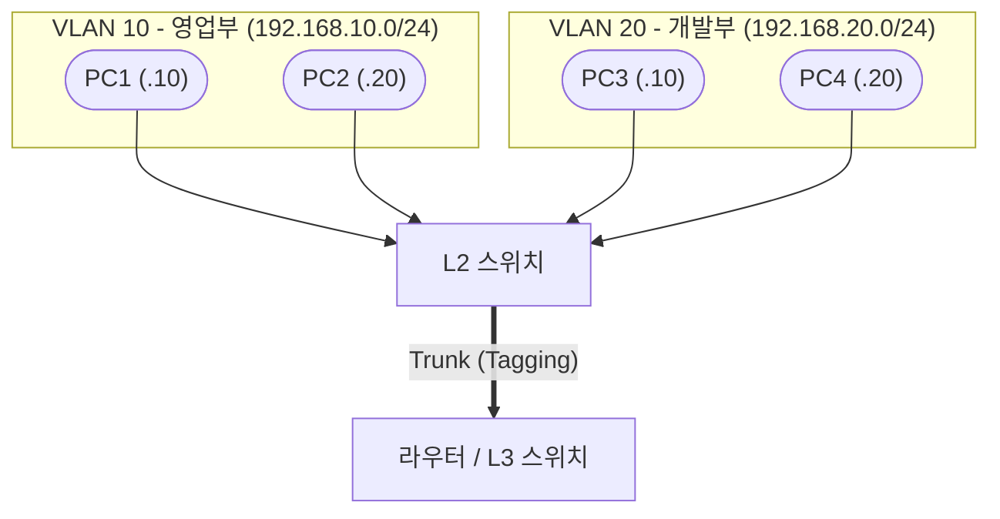

---
layout: post
title: "VLAN & Inter-VLAN Routing"
date: 2025-07-25 17:00:00 +0900
categories: [network]
---

## 1. 개요

**VLAN (Virtual LAN)**은 물리적인 스위치 네트워크를 논리적으로 분리하는 L2 계층의 핵심 기술이다.
스위치 포트를 그룹화하여 브로드캐스트 도메인을 축소하고 보안을 강화하며, 유연한 네트워크 구성을 가능하게 한다.

### 기본 정보
| 항목 | 설명 |
|---|---|
| **계층** | Layer 2 (데이터링크) |
| **목적** | 브로드캐스트 도메인 분리, 네트워크 세그멘테이션 |
| **장점** | 보안성 강화, 성능 향상(불필요한 트래픽 감소), 관리 유연성 |

### 왜 VLAN이 필요한가?
1.  **브로드캐스트 제어**: 기본적으로 스위치는 브로드캐스트를 모든 포트로 플러딩(Flooding)한다. 호스트가 많아지면 네트워크 성능이 저하된다.
2.  **보안 강화**: 인사팀과 개발팀 같은 서로 다른 부서를 논리적으로 격리하여 무단 접근을 방지한다.
3.  **비용 절감**: 물리적인 스위치를 추가로 구매하지 않고도 네트워크를 분리할 수 있다.

### VLAN의 핵심 개념
```
VLAN이 다르다 = 브로드캐스트 도메인이 다르다 = 서브넷(네트워크 대역)이 다르다
```
따라서 서로 다른 VLAN 간의 통신(Inter-VLAN)을 위해서는 반드시 라우터(L3 장비)가 필요하다.

### 통신 구조


---

## 2. VLAN 할당 방식

### 정적 VLAN (Static VLAN)
*   **포트 기반(Port-based)**: 관리자가 스위치 포트별로 VLAN을 수동으로 할당하는 방식이다.
*   설정이 직관적이고 관리가 쉬워 가장 일반적으로 사용된다.
*   사용자가 자리를 이동하면 포트 설정을 변경해줘야 한다.

### 동적 VLAN (Dynamic VLAN)
*   **MAC 주소 기반**: VMPS(VLAN Management Policy Server)를 이용하여 단말의 MAC 주소에 따라 자동으로 VLAN을 할당한다.
*   사용자가 이동해도 설정 변경 없이 VLAN이 유지된다.
*   초기 구축 및 관리가 복잡하여 잘 사용되지 않는다.

---

## 3. 포트 유형 (Access vs Trunk)

### Access Port (액세스 포트)
*   **하나의 VLAN**에만 소속된 포트.
*   PC, 서버, 프린터 등 **End Device**가 연결된다.
*   이더넷 프레임에 별도의 **태그(Tag)를 붙이지 않는다**.

### Trunk Port (트렁크 포트)
*   **여러 VLAN**의 트래픽을 동시에 전송할 수 있는 포트.
*   **스위치 간 연결** 또는 **스위치-라우터 연결**에 사용된다.
*   프레임이 어느 VLAN 소속인지 구별하기 위해 태그(Tag)를 붙인다.

### 프레임 태깅 (Frame Tagging)
*   **IEEE 802.1Q (dot1q)**: 표준 프로토콜. 원본 프레임 사이에 4바이트 태그를 삽입한다.
*   **ISL (Inter-Switch Link)**: Cisco 전용 (현재 거의 사용 안 함).

### 802.1Q 프레임 구조
```
[D.MAC] [S.MAC] [802.1Q Tag (4Byte)] [Type] [Data] [FCS]
                  ↓
          [TPID (0x8100)] [TCI (Priority + CFI + VLAN ID)]
```
*   **VLAN ID (12bit)**: 4096개의 VLAN을 구분 (0, 4095 제외 1~4094 사용 가능)

### Native VLAN
*   트렁크 포트에서 **태깅되지 않은(Untagged) 프레임**을 처리하기 위한 기본 VLAN이다.
*   기본값은 VLAN 1이다.
*   **보안 권고**: VLAN Hopping 공격을 막기 위해 사용하지 않는 VLAN 번호(예: 99)로 변경하고, 양쪽 스위치 설정을 일치시켜야 한다.
*   **불일치 시 에러**: `%CDP-4-NATIVE_VLAN_MISMATCH` 발생.

---

## 4. 설정 방법

### 1) VLAN 생성
```cisco
Switch(config)# vlan 10
Switch(config-vlan)# name Sales
Switch(config-vlan)# exit
Switch(config)# vlan 20
Switch(config-vlan)# name Dev
```

### 2) Access 포트 설정
```cisco
Switch(config)# interface fa0/1
Switch(config-if)# switchport mode access
Switch(config-if)# switchport access vlan 10
```
```cisco
! 범위 지정 설정
Switch(config)# interface range fa0/10 - 20
Switch(config-if-range)# switchport mode access
Switch(config-if-range)# switchport access vlan 20
```

### 3) Trunk 포트 설정
```cisco
Switch(config)# interface gi0/1
Switch(config-if)# switchport mode trunk
! (옵션) 캡슐화 방식 지정 (구형 장비용)
Switch(config-if)# switchport trunk encapsulation dot1q 

! (보안) 필요한 VLAN만 허용 (Pruning)
Switch(config-if)# switchport trunk allowed vlan 10,20

! (보안) Native VLAN 변경
Switch(config-if)# switchport trunk native vlan 99
```

---

## 5. VTP (VLAN Trunking Protocol)

Cisco 전용 프로토콜로, 스위치 간에 VLAN 정보를 자동으로 동기화하여 관리 편의성을 제공한다.

### VTP 모드 비교
| 모드 | VLAN 생성/삭제 | 정보 동기화 | 타 스위치 중계 |
|---|---|---|---|
| **Server** | 가능 | 보냄/받음 | 가능 |
| **Client** | 불가능 | 받아서 반영만 함 | 가능 |
| **Transparent** | 자신의 로컬 VLAN만 관리 | 반영 안 함 | 릴레이(중계)만 함 |

### VTP 설정
```cisco
Switch(config)# vtp mode server
Switch(config)# vtp domain MyHome
Switch(config)# vtp password cisco
Switch(config)# vtp version 2
```

### VTP 확인 확인
```cisco
Switch# show vtp status
```
> **주의사항**: VTP는 `Configuration Revision` 번호가 높은 스위치의 정보를 덮어쓴다. 새 스위치를 연결할 때 Revision이 높으면 기존망을 덮어써서 망 전체의 VLAN이 사라질 수 있다. 연결 전 Revision을 0으로 초기화해야 한다.

---

## 6. Inter-VLAN 라우팅

VLAN 간 통신을 위해 L3 기능을 수행하는 장비를 구성한다.

### 방식 1: Router-on-a-Stick (ROAS)
라우터의 물리 인터페이스 하나를 여러 개의 서브 인터페이스로 쪼개어 사용한다.
*   **장점**: 저렴하다 (포트 절약)
*   **단점**: 트래픽 병목 현상 발생 가능, 라우터 부하 증가

**[설정 코드]**
```cisco
! 물리 인터페이스 활성화
Router(config)# interface gi0/0
Router(config-if)# no shutdown

! 서브 인터페이스 설정 (VLAN 10)
Router(config)# interface gi0/0.10
Router(config-subif)# encapsulation dot1Q 10
Router(config-subif)# ip address 192.168.10.1 255.255.255.0

! 서브 인터페이스 설정 (VLAN 20)
Router(config)# interface gi0/0.20
Router(config-subif)# encapsulation dot1Q 20
Router(config-subif)# ip address 192.168.20.1 255.255.255.0
```

### 방식 2: L3 Switch (MLS)
스위치 내부의 가상 인터페이스(SVI)를 통해 고속으로 라우팅한다.
*   **장점**: 하드웨어 기반 라우팅으로 속도가 매우 빠르다.
*   **단점**: 장비가 비싸다.

**[설정 코드]**
```cisco
! 라우팅 기능 활성화 (필수)
Switch(config)# ip routing

! SVI 생성
Switch(config)# interface vlan 10
Switch(config-if)# ip address 192.168.10.1 255.255.255.0
Switch(config-if)# no shutdown

Switch(config)# interface vlan 20
Switch(config-if)# ip address 192.168.20.1 255.255.255.0
Switch(config-if)# no shutdown
```

---

## 7. 확인 명령어

```cisco
! VLAN DB 확인 (가장 기본)
Switch# show vlan brief
! 출력 예:
! 10   Sales   active   Fa0/1, Fa0/2
! 20   Dev     active   Fa0/10, Fa0/11

! 트렁크 포트 상세 정보 확인
Switch# show interfaces trunk
! 출력 예:
! Port    Mode    Encapsulation    Status    Native vlan
! Gi0/1   on      802.1q           trunking  1

! 특정 포트의 설정 상태 확인
Switch# show interfaces fa0/1 switchport
```

---

## 8. 트러블슈팅

### VLAN 간 통신이 안 될 때
1.  **L3 장비 확인**: 라우터나 L3 스위치에 IP 라우팅 설정이 되어 있는가? (`ip routing`)
2.  **게이트웨이 확인**: PC의 기본 게이트웨이가 해당 VLAN의 인터페이스 IP(SVI)로 설정되어 있는가?
3.  **Trunk 허용 확인**: 트렁크 포트에서 해당 VLAN이 차단(Pruning)되지 않았는지 확인한다. (`allowed vlan` 리스트 체크)

### Trunk가 맺어지지 않을 때
1.  **모드 불일치**: 한쪽이 `access` 모드이거나, 양쪽 다 `auto` 모드이면 트렁킹이 되지 않는다.
2.  **Native VLAN 불일치**: 양쪽 스위치의 Native VLAN이 다르면 STP에 의해 포트가 차단될 수 있다.
3.  **Encapsulation 불일치**: 한쪽은 ISL, 다른 쪽은 dot1q인 경우 (드물지만 확인 필요).

### VLAN 삭제가 안 될 때
VLAN 정보는 `vlan.dat` 파일에 저장되므로, `erase startup-config` 만으로는 삭제되지 않는다.
```cisco
Switch# delete flash:vlan.dat
Switch# erase startup-config
Switch# reload
```

---

## 9. 보안 고려사항

공격자가 VLAN 격리를 뚫고 다른 VLAN의 트래픽에 접근하는 공격이다.

### Switch Spoofing (스위치 위장)
공격자의 PC가 **스위치인 척 DTP(Dynamic Trunking Protocol) 협상을 시도**하여 트렁크 포트를 형성한다. 트렁크가 맺어지면 모든 VLAN 트래픽을 수신할 수 있다.

**방어 설정:**
```cisco
! 사용자 포트는 Access 모드로 고정 (DTP 비활성화)
Switch(config-if)# switchport mode access
Switch(config-if)# switchport nonegotiate   ! DTP 협상 시도 차단
```

### Double Tagging (이중 태깅)
공격자가 **두 개의 802.1Q 태그**가 붙은 프레임을 전송한다. 첫 번째 태그(Native VLAN)는 첫 스위치에서 제거되고, 두 번째 태그(Target VLAN)가 다음 스위치에서 인식되어 **다른 VLAN으로 프레임이 전달**된다.

*   **조건**: 공격자가 Native VLAN과 동일한 VLAN에 연결되어 있어야 함.
*   **한계**: 단방향 공격(응답 수신 불가), Layer 2 브로드캐스트만 가능.

**방어 설정:**
```cisco
! 1. Native VLAN을 사용하지 않는 VLAN 번호로 변경 (양쪽 스위치 동일하게)
Switch(config-if)# switchport trunk native vlan 999

! 2. Native VLAN에도 태깅 강제 (권장)
Switch(config)# vlan dot1q tag native

! 3. 사용하지 않는 포트는 Shutdown
Switch(config-if)# shutdown
```

### 미사용 VLAN 삭제
공격 표면을 줄이기 위해 사용하지 않는 VLAN은 삭제하고, 미사용 포트는 격리된 VLAN(예: VLAN 999)에 할당한다.

<hr class="short-rule">
