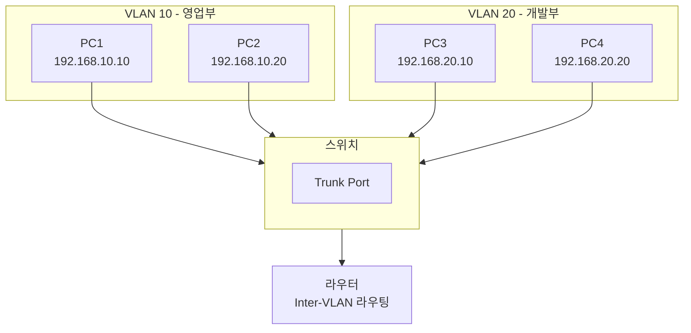

## 1. 개념

**VLAN (Virtual LAN)**은 물리적 네트워크를 논리적으로 분리하는 기술.

### 기본 정보

| 항목 | 설명 |
|------|------|
| 계층 | L2 (데이터링크) |
| 목적 | 브로드캐스트 도메인 분리 |
| 장점 | 보안 강화, 성능 향상 |

### 왜 VLAN이 필요한가?
- **브로드캐스트 도메인 축소**: 불필요한 브로드캐스트 트래픽 감소
- **보안 강화**: 논리적 네트워크 분리로 접근 제한
- **유연성**: 물리적 위치와 관계없이 논리적 그룹화
- **비용 절감**: 라우터 없이 스위치로 네트워크 분리

### VLAN의 핵심 개념
```
VLAN이 다름 = 브로드캐스트 도메인이 다름 = 네트워크가 다름 = 네트워크 주소가 다름
```

### VLAN 통신 방식



---

## 2. VLAN 할당 방식

### 정적 VLAN (Static VLAN)
- **포트 기반 멤버십**: 관리자가 수동으로 포트별 VLAN 할당
- 설정이 간단하고 관리가 쉬움
- 네트워크 변화가 적은 경우 적합
- **가장 많이 사용됨**

### 동적 VLAN (Dynamic VLAN)
- **MAC 주소 기반**: VMPS(VLAN Management Policy Server) 사용
- 호스트 이동 시 자동으로 VLAN 재할당
- 설정이 복잡하지만 유연함

---

## 3. 포트 유형

### Access Port
- **특정 VLAN 하나에만 속함**
- PC, 서버 등 **종단 장치** 연결
- 해당 VLAN의 프레임만 송수신

### Trunk Port
- **여러 VLAN의 프레임을 전달**
- **스위치 간 연결**에 사용
- 프레임에 VLAN ID 태그 부착 (802.1Q)

### 프레임 태깅 (Frame Tagging)

| 표준 | 설명 |
|------|------|
| IEEE 802.1Q (dot1q) | 업계 표준, 12비트 VLAN ID (4096개) |
| ISL (Inter-Switch Link) | Cisco 전용, Legacy |

### 802.1Q 프레임 구조
```
| Preamble | 목적지 MAC | 출발지 MAC | [802.1Q Tag] | EtherType | Payload | FCS |
                                        ↓
                             TPID(2B) + TCI(2B)
                                        Priority(3bit) + DEI(1bit) + VLAN ID(12bit)
```

### Native VLAN
- **태깅하지 않는 VLAN** (기본값: VLAN 1)
- 양쪽 스위치에서 **동일하게 설정 필수**
- 불일치 시 오류 발생:
```
%CDP-4-NATIVE_VLAN_MISMATCH: Native VLAN mismatch discovered on Fa0/1 (20), with SW2 Fa0/1 (1)
```

---

## 4. 설정 방법

### VLAN 생성
```cisco
! 전역 설정 모드에서 VLAN 생성
Switch(config)# vlan 10
Switch(config-vlan)# name Sales_Dept
Switch(config-vlan)# exit
Switch(config)# vlan 20
Switch(config-vlan)# name Dev_Dept
```

### Access 포트 설정
```cisco
! 포트를 특정 VLAN에 할당
Switch(config)# interface fa0/5
Switch(config-if)# switchport mode access
Switch(config-if)# switchport access vlan 10
Switch(config-if)# exit

! 여러 포트 동시 설정
Switch(config)# interface range fa0/10 - 15
Switch(config-if-range)# switchport mode access
Switch(config-if-range)# switchport access vlan 20
```

### Trunk 포트 설정
```cisco
! 스위치 간 트렁크 설정
Switch(config)# interface fa0/1
Switch(config-if)# switchport mode trunk
Switch(config-if)# switchport trunk allowed vlan all

! 특정 VLAN만 허용
Switch(config-if)# switchport trunk allowed vlan 10,20,30

! 특정 VLAN 제외
Switch(config-if)# switchport trunk allowed vlan remove 30

! Native VLAN 변경
Switch(config-if)# switchport trunk native vlan 99
```

---

## 5. VTP (VLAN Trunking Protocol)

Cisco 전용. 스위치 간 VLAN 정보 자동 동기화.

### VTP 모드

| 모드 | VLAN 관리 | 동기화 | 전달 |
|------|-----------|--------|------|
| Server | 생성/삭제/변경 ✅ | ✅ | ✅ |
| Client | ❌ | ✅ | ✅ |
| Transparent | 생성/삭제/변경 ✅ | ❌ | ✅ |

### VTP 설정
```cisco
Switch(config)# vtp mode server
Switch(config)# vtp domain MyDomain
Switch(config)# vtp password MyPass
Switch(config)# vtp version 2
```

### VTP 확인
```cisco
Switch# show vtp status
```

> **주의**: VTP는 Revision 번호가 높은 쪽으로 동기화됨. 새 스위치 추가 시 VLAN 정보가 삭제될 수 있음!

---

## 6. Inter-VLAN 라우팅

### 방식 비교

| 방식 | 설명 | 장단점 |
|------|------|--------|
| Router-on-a-Stick | 하나의 트렁크로 여러 VLAN 라우팅 | 저렴, 대역폭 제한 |
| L3 스위치 (MLS) | 스위치에서 직접 라우팅 | 고속, 비쌈 |

### Router-on-a-Stick 설정
```cisco
! 라우터 서브인터페이스 설정
Router(config)# interface fa0/0
Router(config-if)# no shutdown
Router(config-if)# exit

Router(config)# interface fa0/0.10
Router(config-subif)# encapsulation dot1Q 10
Router(config-subif)# ip address 192.168.10.1 255.255.255.0
Router(config-subif)# exit

Router(config)# interface fa0/0.20
Router(config-subif)# encapsulation dot1Q 20
Router(config-subif)# ip address 192.168.20.1 255.255.255.0
```

### L3 스위치 (MLS) 설정
```cisco
! IP 라우팅 활성화
Switch(config)# ip routing

! VLAN 인터페이스 설정 (SVI)
Switch(config)# interface vlan 10
Switch(config-if)# ip address 192.168.10.1 255.255.255.0
Switch(config-if)# no shutdown

Switch(config)# interface vlan 20
Switch(config-if)# ip address 192.168.20.1 255.255.255.0
Switch(config-if)# no shutdown
```

---

## 7. 확인 명령어

```cisco
! VLAN 목록 확인
Switch# show vlan
Switch# show vlan brief

! 트렁크 포트 확인
Switch# show interfaces trunk

! 특정 포트의 스위치포트 정보
Switch# show interfaces fa0/1 switchport

! VTP 상태
Switch# show vtp status
```

### show vlan brief 출력 예시
```
VLAN Name                 Status    Ports
---- -------------------- --------- -----------------------
1    default              active    Fa0/2, Fa0/3, Fa0/4
10   Sales_Dept           active    Fa0/5, Fa0/6
20   Dev_Dept             active    Fa0/10, Fa0/11, Fa0/12
```

### show interfaces trunk 출력 예시
```
Port     Mode         Encapsulation  Status   Native vlan
Fa0/1    on           802.1q         trunking 1

Port     Vlans allowed on trunk
Fa0/1    1-4094

Port     Vlans allowed and active in management domain
Fa0/1    1,10,20
```

---

## 8. 트러블슈팅

### VLAN 간 통신 안됨
1. 라우터/L3스위치가 Inter-VLAN 라우팅하고 있는가?
2. PC의 기본 게이트웨이 설정이 올바른가?
3. 트렁크 포트에서 해당 VLAN이 허용되어 있는가?

### Trunk 연결 안됨
```cisco
! 양쪽 캡슐화 확인
Switch# show interfaces trunk
! Native VLAN 일치 확인
```

### VLAN 삭제
```cisco
Switch(config)# no vlan 30

! VLAN 파일 완전 삭제 (초기화)
Switch# delete flash:vlan.dat
Switch# erase startup-config
Switch# reload
```

<hr class="short-rule">
