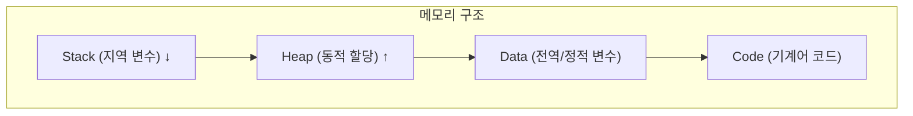

## 1. 개요

**포인터(Pointer)**는 메모리의 특정 주소(Address) 값을 저장하여 데이터나 함수를 간접적으로 참조하는 변수이다.
하드웨어 및 시스템 리소스에 대한 저수준(Low-level) 제어를 가능하게 하여 C언어의 강력한 성능을 뒷받침하지만, 잘못 관리할 경우 버퍼 오버플로우나 메모리 누수와 같은 치명적인 보안 취약점의 원인이 된다.

### 핵심 개념
1.  **직접 메모리 접근**: 변수의 주소를 통해 메모리 값을 직접 읽거나 변경할 수 있다.
2.  **동적 할당**: 런타임 시점에 필요한 만큼의 메모리(Heap)를 할당하고 해제하여 자원을 효율적으로 관리한다.
3.  **참조 전달 (Call by Reference)**: 함수 호출 시 데이터 복사 없이 원본 변수를 수정할 수 있게 한다.

### 메모리 구조 레이아웃


---

## 2. 포인터 기초

### 선언과 사용
```c
int num = 10;
int *ptr = &num;    // 변수 num의 주소를 포인터 ptr에 저장

printf("Value: %d\n", *ptr);    // 역참조 연산자(*): 주소가 가리키는 값(10) 출력
printf("Address: %p\n", ptr);   // 주소값 출력
```

### 배열과 포인터
배열의 이름은 배열 첫 번째 요소의 주소와 같다.
```c
int arr[5] = {1, 2, 3, 4, 5};
int *p = arr;

printf("%d\n", *p);       // 1 (첫 번째 요소)
printf("%d\n", *(p + 1)); // 2 (포인터 연산)
printf("%d\n", p[2]);     // 3 (배열 인덱스 접근과 동일)
```

---

## 3. 동적 메모리 할당

런타임에 메모리 크기를 결정해야 할 때 **Heap** 영역을 사용한다.

### malloc / free
```c
#include <stdlib.h>

// 메모리 할당
int *arr = (int*)malloc(5 * sizeof(int));
if (arr == NULL) {
    perror("malloc failed");
    exit(1);
}

// 사용
for (int i = 0; i < 5; i++) {
    arr[i] = i * 10;
}

// 할당 해제 (필수)
free(arr);
arr = NULL;  // 댕글링 포인터 방지
```

### calloc (할당 및 초기화)
```c
// 할당된 메모리를 모두 0으로 초기화
int *arr = (int*)calloc(5, sizeof(int));
```

### realloc (재할당)
```c
// 기존 할당된 메모리 크기를 변경
int *arr = malloc(5 * sizeof(int));
arr = realloc(arr, 10 * sizeof(int));
```

---

## 4. 함수 호출 방식 비교

### Call by Value (값 전달)
값을 복사해서 전달하므로 함수 내에서 변경해도 원본에는 영향이 없다.
```c
void swap_wrong(int a, int b) {
    int temp = a; a = b; b = temp;
}
// main에서 호출해도 원본 변수 값은 바뀌지 않음
```

### Call by Reference (참조 전달)
주소를 전달하므로 함수 내에서 역참조를 통해 원본 값을 수정할 수 있다.
```c
void swap_correct(int *a, int *b) {
    int temp = *a;
    *a = *b;
    *b = temp;
}
// swap_correct(&x, &y) 호출 시 원본 x, y 값이 교환됨
```

---

## 5. 구조체와 포인터

```c
struct Person {
    char name[50];
    int age;
};

int main() {
    // 동적 할당을 이용한 구조체 생성
    struct Person *p2 = malloc(sizeof(struct Person));
    
    // 화살표 연산자(->)를 사용하여 멤버 접근
    strcpy(p2->name, "Bob");
    p2->age = 30;
    
    printf("%s, %d\n", p2->name, p2->age);
    
    free(p2);
    return 0;
}
```

---

## 6. 트러블슈팅 (보안 취약점)

포인터와 메모리를 잘못 다룰 때 발생하는 대표적인 문제들이다.

### 버퍼 오버플로우 (Buffer Overflow)
할당된 메모리 범위를 넘어서 데이터를 쓸 때 발생하며, 실행 흐름을 조작하는 공격에 악용될 수 있다.
```c
// [취약] 입력 크기를 검증하지 않음
char buffer[10];
strcpy(buffer, argv[1]);

// [안전] 크기를 제한하여 복사
strncpy(buffer, argv[1], sizeof(buffer) - 1);
buffer[sizeof(buffer) - 1] = '\0';
```

### 댕글링 포인터 (Dangling Pointer) 및 UAF
해제된 메모리(`free`)를 계속 참조하려고 할 때 발생한다. (Use-After-Free)
```c
free(ptr);
*ptr = 10;  // 이미 해제된 공간 접근 (위험)

// 해결: 해제 후 NULL 대입
free(ptr);
ptr = NULL;
```

### 메모리 누수 (Memory Leak)
할당(`malloc`)한 메모리를 해제(`free`)하지 않으면 프로그램이 종료될 때까지 메모리가 점유된 상태로 남는다. 장시간 실행되는 서버 프로그램에서 치명적이다.
```c
void leak() {
    int *p = malloc(100);
    // free(p) 없이 함수 종료 시 누수 발생
}
```

### 더블 프리 (Double Free)
이미 해제된 메모리를 다시 해제하려고 하면 메모리 관리 구조가 훼손되어 크래시가 발생할 수 있다.
```c
free(ptr);
free(ptr); // 에러 발생
```

---

## 7. 보안 고려사항

*   **입력 크기 검증**: 사용자 입력을 버퍼에 저장할 때 반드시 크기를 검증하여 버퍼 오버플로우를 방지한다.
*   **안전한 함수 사용**: `strcpy` 대신 `strncpy`, `sprintf` 대신 `snprintf`처럼 크기 제한이 있는 함수를 사용한다.
*   **해제 후 NULL 대입**: 메모리 해제(`free`) 직후 포인터를 `NULL`로 설정하여 댕글링 포인터와 Double-Free를 방지한다.
*   **ASLR/DEP/Canary 활용**: 컴파일 및 OS 레벨에서 보안 옵션(ASLR, DEP, Stack Canary)을 활성화한다.

<hr class="short-rule">
