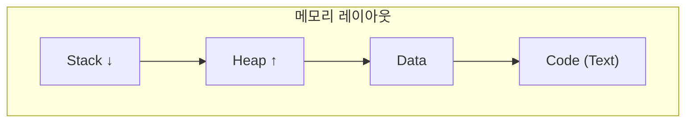

## 1. 개념

**포인터(Pointer)**는 메모리의 특정 위치 주소 값을 저장하고 직접 참조하는 변수입니다.
하드웨어 및 시스템 리소스에 대한 저수준(Low-level) 접근을 가능하게 하지만, 잘못된 사용은 버퍼 오버플로우와 같은 심각한 보안 취약점을 유발할 수 있습니다.

### 메모리 구조

| 영역 | 용도 |
|------|------|
| Stack | 지역 변수, 함수 호출 |
| Heap | 동적 할당 (malloc) |
| Data | 전역/정적 변수 |
| Code | 프로그램 코드 |



---

## 2. 포인터 기초

### 선언과 사용
```c
int num = 10;
int *ptr = &num;    // 포인터 선언 및 주소 저장

printf("Value: %d\n", *ptr);    // 역참조: 10
printf("Address: %p\n", ptr);   // 주소 출력
```

### 배열과 포인터
```c
int arr[5] = {1, 2, 3, 4, 5};
int *p = arr;       // 배열명은 첫 번째 요소 주소

printf("%d\n", *p);       // 1
printf("%d\n", *(p + 1)); // 2
printf("%d\n", p[2]);     // 3 (포인터도 [] 연산 가능)
```

### 배열 vs 포인터

| 특성 | 배열 | 포인터 |
|------|------|--------|
| 크기 | sizeof = 전체 크기 | sizeof = 8 (64bit) |
| 수정 | 다른 주소 불가 | 변경 가능 |
| 본질 | 상수 포인터 | 변수 |

---

## 3. 동적 메모리 할당

### malloc/free
```c
#include <stdlib.h>

// 동적 할당
int *arr = (int*)malloc(5 * sizeof(int));
if (arr == NULL) {
    perror("malloc failed");
    exit(1);
}

// 사용
for (int i = 0; i < 5; i++) {
    arr[i] = i * 10;
}

// 해제
free(arr);
arr = NULL;  // 댕글링 포인터 방지
```

### calloc (0으로 초기화)
```c
int *arr = (int*)calloc(5, sizeof(int));
// 모든 값이 0으로 초기화됨
```

### realloc (크기 변경)
```c
int *arr = malloc(5 * sizeof(int));
arr = realloc(arr, 10 * sizeof(int));  // 크기 확장
```

---

## 4. Call by Value vs Reference

### Call by Value (값 복사)
```c
void swap_wrong(int a, int b) {
    int temp = a;
    a = b;
    b = temp;
}  // 원본 변경 안됨

int main() {
    int x = 10, y = 20;
    swap_wrong(x, y);
    printf("%d %d\n", x, y);  // 10 20 (변경 안됨)
}
```

### Call by Reference (주소 전달)
```c
void swap_correct(int *a, int *b) {
    int temp = *a;
    *a = *b;
    *b = temp;
}

int main() {
    int x = 10, y = 20;
    swap_correct(&x, &y);
    printf("%d %d\n", x, y);  // 20 10 (변경됨)
}
```

---

## 5. 구조체와 포인터

```c
struct Person {
    char name[50];
    int age;
};

int main() {
    // 정적 할당
    struct Person p1 = {"Alice", 25};
    
    // 동적 할당
    struct Person *p2 = malloc(sizeof(struct Person));
    strcpy(p2->name, "Bob");
    p2->age = 30;
    
    // 화살표 연산자 vs 점 연산자
    printf("%s, %d\n", p1.name, p1.age);
    printf("%s, %d\n", p2->name, p2->age);
    // p2->age == (*p2).age
    
    free(p2);
    return 0;
}
```

---

## 6. 보안 취약점

### 버퍼 오버플로우
```c
// 취약한 코드
char buffer[10];
strcpy(buffer, argv[1]);  // 입력 크기 검증 안함!

// 안전한 코드
strncpy(buffer, argv[1], sizeof(buffer) - 1);
buffer[sizeof(buffer) - 1] = '\0';
```

### 댕글링 포인터
```c
// 취약
int *ptr = malloc(sizeof(int));
free(ptr);
*ptr = 10;  // Use After Free!

// 안전
free(ptr);
ptr = NULL;
```

### 메모리 누수
```c
// 누수 발생
void leak() {
    int *p = malloc(100);
    return;  // free 없이 함수 종료
}

// 항상 free 호출
```

### 더블 프리
```c
// 취약
free(ptr);
free(ptr);  // Double Free!

// 방지
free(ptr);
ptr = NULL;  // NULL은 free해도 안전
```

<hr class="short-rule">
