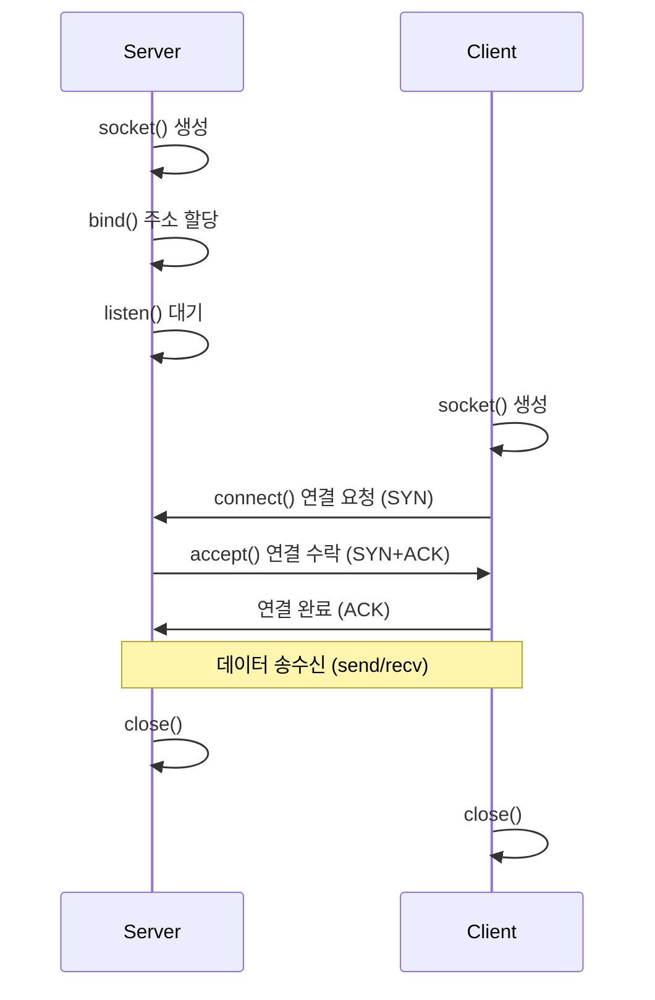

## 1. 개요

**소켓(Socket)**은 네트워크 상에서 실행되는 두 프로그램이 데이터를 주고받을 수 있도록 연결해주는 엔드포인트(Endpoint)이다.
운영체제의 TCP/IP 스택을 통해 프로세스 간 통신(IPC)을 수행하며, 클라이언트-서버 모델을 구현하는 가장 기본적인 인터페이스이다.

### 핵심 개념
1.  **엔드포인트**: IP 주소와 포트 번호의 조합으로 통신 대상을 식별한다.
2.  **프로토콜**: 신뢰성 있는 연결형 통신인 **TCP (SOCK_STREAM)**와 비연결형 통신인 **UDP (SOCK_DGRAM)** 등을 지원한다.
3.  **흐름 제어**: `bind`, `listen`, `accept` 등의 시스템 콜을 통해 연결을 수립하고 관리한다.

### 통신 흐름도 (TCP 3-Way Handshake)


---

## 2. 서버 구현 (Server)

서버는 특정 포트에서 클라이언트의 연결 요청을 기다리는(Listen) 역할을 한다.

```c
#include <stdio.h>
#include <stdlib.h>
#include <string.h>
#include <unistd.h>
#include <arpa/inet.h>

#define PORT 8080
#define BUFFER_SIZE 1024

int main() {
    int server_fd, client_fd;
    struct sockaddr_in server_addr, client_addr;
    socklen_t client_len;
    char buffer[BUFFER_SIZE];

    // 1. 소켓 생성
    if ((server_fd = socket(AF_INET, SOCK_STREAM, 0)) == -1) {
        perror("Socket creation failed");
        exit(1);
    }

    // 2. 주소 구조체 초기화
    memset(&server_addr, 0, sizeof(server_addr));
    server_addr.sin_family = AF_INET;
    server_addr.sin_addr.s_addr = INADDR_ANY; // 모든 인터페이스에서 수신
    server_addr.sin_port = htons(PORT);       // 호스트->네트워크 바이트 순서 변환

    // 3. Bind (소켓에 IP:Port 할당)
    if (bind(server_fd, (struct sockaddr*)&server_addr, sizeof(server_addr)) == -1) {
        perror("Bind failed");
        exit(1);
    }

    // 4. Listen (연결 대기열 생성)
    if (listen(server_fd, 5) == -1) {
        perror("Listen failed");
        exit(1);
    }
    printf("Server listening on port %d...\n", PORT);

    // 5. Accept (클라이언트 연결 수락)
    client_len = sizeof(client_addr);
    client_fd = accept(server_fd, (struct sockaddr*)&client_addr, &client_len);
    if (client_fd == -1) {
        perror("Accept failed");
        exit(1);
    }
    printf("Client connected: %s\n", inet_ntoa(client_addr.sin_addr));

    // 6. 데이터 송수신 (Echo)
    while (1) {
        memset(buffer, 0, BUFFER_SIZE);
        int bytes = recv(client_fd, buffer, BUFFER_SIZE - 1, 0);
        if (bytes <= 0) break; // 연결 종료
        
        printf("Received: %s", buffer);
        send(client_fd, buffer, bytes, 0); // 받은 데이터 그대로 전송
    }

    // 7. 소켓 종료
    close(client_fd);
    close(server_fd);
    return 0;
}
```

---

## 3. 클라이언트 구현 (Client)

클라이언트는 서버의 IP와 포트로 연결을 요청(Connect)한다.

```c
#include <stdio.h>
#include <arpa/inet.h>
// ... (헤더 생략)

#define SERVER_IP "127.0.0.1"
#define PORT 8080

int main() {
    int sock;
    struct sockaddr_in server_addr;
    char buffer[1024];

    // 1. 소켓 생성
    sock = socket(AF_INET, SOCK_STREAM, 0);

    // 2. 서버 주소 설정
    server_addr.sin_family = AF_INET;
    server_addr.sin_port = htons(PORT);
    inet_pton(AF_INET, SERVER_IP, &server_addr.sin_addr);

    // 3. Connect (서버 연결)
    if (connect(sock, (struct sockaddr*)&server_addr, sizeof(server_addr)) == -1) {
        perror("Connection failed");
        exit(1);
    }
    printf("Connected to server!\n");

    // 4. 데이터 송신
    while (1) {
        printf("Message: ");
        fgets(buffer, sizeof(buffer), stdin);
        send(sock, buffer, strlen(buffer), 0);
        
        memset(buffer, 0, sizeof(buffer));
        recv(sock, buffer, sizeof(buffer) - 1, 0);
        printf("Echo: %s", buffer);
    }

    close(sock);
    return 0;
}
```

---

## 4. 엔디안 변환 (Byte Order)

네트워크는 **빅 엔디안(Big Endian)** 방식을 사용하므로, 시스템(보통 리틀 엔디안)의 데이터를 네트워크로 보낼 때 변환이 필요하다.

| 함수 | 설명 | 예시 |
|------|------|------|
| **htons** | Host to Network Short (16bit) | 포트 번호 변환 |
| **htonl** | Host to Network Long (32bit) | IP 주소 변환 |
| **ntohs** | Network to Host Short | 수신된 포트 변환 |
| **ntohl** | Network to Host Long | 수신된 IP 변환 |

```c
server_addr.sin_port = htons(8080); // 8080 -> 네트워크 바이트 순서
```

---

## 5. 컴파일 및 실행

```bash
# 서버 빌드 및 실행
gcc -o server server.c
./server

# 클라이언트 빌드 및 실행 (새 터미널)
gcc -o client client.c
./client
```

---

## 6. 트러블슈팅

### Address already in use
서버를 강제 종료한 직후 다시 실행하면, 포트가 `TIME_WAIT` 상태로 남아 있어 바인딩 에러가 발생할 수 있다. `SO_REUSEADDR` 옵션으로 해결한다.
```c
int opt = 1;
setsockopt(server_fd, SOL_SOCKET, SO_REUSEADDR, &opt, sizeof(opt));
// 이후 bind() 호출
```

### Connection refused
*   서버 프로그램이 실행 중이지 않음.
*   IP 주소나 포트 번호가 불일치함.
*   서버 방화벽이 해당 포트 접속을 차단함.

---

## 7. 보안 고려사항

*   **입력 검증**: 클라이언트로부터 수신한 데이터는 반드시 크기와 형식을 검증하여 버퍼 오버플로우를 방지한다.
*   **TLS/SSL 적용**: 민감한 데이터를 전송할 때는 평문 TCP 대신 TLS 암호화 (OpenSSL 등)를 적용한다.
*   **DoS 방어**: `accept()` 후 스레드를 무한정 생성하면 리소스 고갈 공격에 취약하므로, 연결 수 제한이나 스레드 풀을 사용한다.
*   **타임아웃 설정**: 비정상 클라이언트가 연결을 점유하는 것을 방지하기 위해 `recv`에 타임아웃을 설정한다.

<hr class="short-rule">
