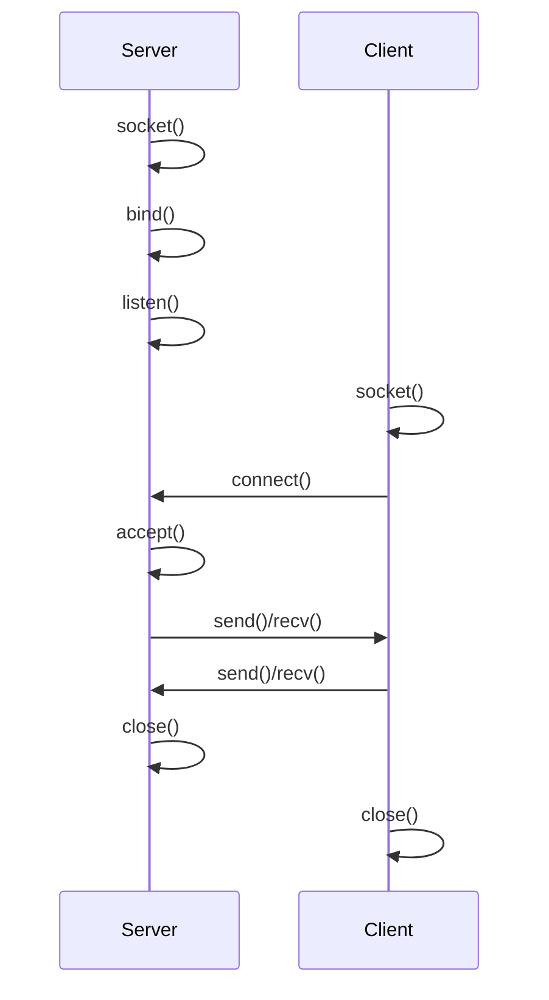

## 1. 개념

**소켓(Socket)**은 네트워크 상에서 실행되는 두 프로그램 간의 양방향 통신을 위한 엔드포인트(Endpoint)입니다.
운영체제의 네트워크 스택(TCP/IP)을 통해 프로세스 간 통신(IPC)을 수행하는 표준 인터페이스를 제공합니다.

### 소켓 함수 흐름



### 주요 함수

| 함수 | 설명 |
|------|------|
| socket() | 소켓 생성 |
| bind() | 주소/포트 바인딩 |
| listen() | 연결 대기 |
| accept() | 연결 수락 |
| connect() | 서버 연결 |
| send()/recv() | 데이터 송수신 |
| close() | 소켓 종료 |

---

## 2. 서버 구현

```c
#include <stdio.h>
#include <stdlib.h>
#include <string.h>
#include <unistd.h>
#include <arpa/inet.h>

#define PORT 8080
#define BUFFER_SIZE 1024

int main() {
    int server_fd, client_fd;
    struct sockaddr_in server_addr, client_addr;
    socklen_t client_len;
    char buffer[BUFFER_SIZE];

    // 1. 소켓 생성
    server_fd = socket(AF_INET, SOCK_STREAM, 0);
    if (server_fd == -1) {
        perror("socket");
        exit(1);
    }

    // 2. 주소 설정
    memset(&server_addr, 0, sizeof(server_addr));
    server_addr.sin_family = AF_INET;
    server_addr.sin_addr.s_addr = INADDR_ANY;
    server_addr.sin_port = htons(PORT);

    // 3. 바인딩
    if (bind(server_fd, (struct sockaddr*)&server_addr, 
             sizeof(server_addr)) == -1) {
        perror("bind");
        exit(1);
    }

    // 4. 리스닝
    if (listen(server_fd, 5) == -1) {
        perror("listen");
        exit(1);
    }

    printf("Server listening on port %d...\n", PORT);

    // 5. 연결 수락
    client_len = sizeof(client_addr);
    client_fd = accept(server_fd, (struct sockaddr*)&client_addr, 
                       &client_len);
    if (client_fd == -1) {
        perror("accept");
        exit(1);
    }

    printf("Client connected: %s\n", 
           inet_ntoa(client_addr.sin_addr));

    // 6. 통신
    while (1) {
        memset(buffer, 0, BUFFER_SIZE);
        int bytes = recv(client_fd, buffer, BUFFER_SIZE - 1, 0);
        if (bytes <= 0) break;
        
        printf("Received: %s", buffer);
        send(client_fd, buffer, bytes, 0);  // Echo
    }

    // 7. 종료
    close(client_fd);
    close(server_fd);
    return 0;
}
```

---

## 3. 클라이언트 구현

```c
#include <stdio.h>
#include <stdlib.h>
#include <string.h>
#include <unistd.h>
#include <arpa/inet.h>

#define SERVER_IP "127.0.0.1"
#define PORT 8080
#define BUFFER_SIZE 1024

int main() {
    int sock;
    struct sockaddr_in server_addr;
    char buffer[BUFFER_SIZE];

    // 1. 소켓 생성
    sock = socket(AF_INET, SOCK_STREAM, 0);
    if (sock == -1) {
        perror("socket");
        exit(1);
    }

    // 2. 서버 주소 설정
    memset(&server_addr, 0, sizeof(server_addr));
    server_addr.sin_family = AF_INET;
    server_addr.sin_port = htons(PORT);
    inet_pton(AF_INET, SERVER_IP, &server_addr.sin_addr);

    // 3. 연결
    if (connect(sock, (struct sockaddr*)&server_addr, 
                sizeof(server_addr)) == -1) {
        perror("connect");
        exit(1);
    }

    printf("Connected to server!\n");

    // 4. 통신
    while (1) {
        printf("Enter message: ");
        fgets(buffer, BUFFER_SIZE, stdin);
        
        send(sock, buffer, strlen(buffer), 0);
        
        memset(buffer, 0, BUFFER_SIZE);
        recv(sock, buffer, BUFFER_SIZE - 1, 0);
        printf("Server: %s", buffer);
    }

    close(sock);
    return 0;
}
```

---

## 4. 엔디안 변환

네트워크는 빅 엔디안(Network Byte Order) 사용.

| 함수 | 설명 |
|------|------|
| htons() | Host to Network Short (16bit) |
| htonl() | Host to Network Long (32bit) |
| ntohs() | Network to Host Short |
| ntohl() | Network to Host Long |

```c
// 포트 변환
uint16_t port = htons(8080);

// IP 주소 변환
struct in_addr addr;
inet_pton(AF_INET, "192.168.1.1", &addr);
```

---

## 5. 컴파일 및 실행

```bash
# 서버 컴파일 및 실행
gcc -o server server.c
./server

# 클라이언트 컴파일 및 실행 (다른 터미널)
gcc -o client client.c
./client
```

---

## 6. 트러블슈팅

### Address already in use
```c
// SO_REUSEADDR 옵션 설정
int opt = 1;
setsockopt(server_fd, SOL_SOCKET, SO_REUSEADDR, &opt, sizeof(opt));
```

### Connection refused
- 서버가 실행 중인지 확인
- 방화벽 설정 확인
- 포트 번호 일치 확인

<hr class="short-rule">
