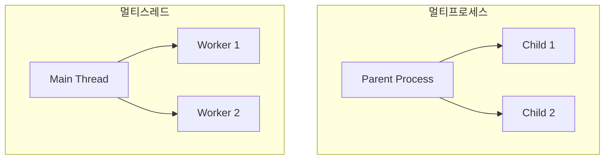

## 1. 개요

**멀티프로세스(Multi-Process)**와 **멀티스레드(Multi-Thread)**는 시스템 자원을 병렬로 사용하여 여러 작업을 동시에 처리(Concurrency)하기 위한 기술이다.
프로세스는 독립적인 메모리 공간을 가져 안정성이 높지만 생성 비용이 크고, 스레드는 메모리를 공유하여 가볍고 빠르지만 동기화 이슈가 발생할 수 있다.

### 핵심 차이점
| 특징 | 멀티프로세스 (fork) | 멀티스레드 (pthread) |
|------|--------------------|---------------------|
| **메모리** | 독립적 (별도 공간) | 공유 (Stack 제외) |
| **생성 오버헤드** | 큼 (메모리 복사 등) | 작음 (자원 공유) |
| **통신 비용** | 큼 (IPC 필요) | 작음 (공유 변수) |
| **안정성** | 하나가 죽어도 영향 없음 | 하나가 죽으면 전체 종료 |

### 구조 비교


---

## 2. 멀티프로세스 (fork)

`fork()` 시스템 콜을 호출하면 현재 프로세스를 그대로 복제하여 자식 프로세스를 생성한다.

### fork 예제
```c
#include <stdio.h>
#include <unistd.h>

int main() {
    pid_t pid = fork(); // 프로세스 복제

    if (pid == -1) {
        perror("fork failed");
    } else if (pid == 0) {
        // 자식 프로세스 영역
        printf("Child Process (PID: %d)\n", getpid());
    } else {
        // 부모 프로세스 영역
        printf("Parent Process (PID: %d)\n", getpid());
    }
    return 0;
}
```

### 좀비 프로세스 처리
자식 프로세스가 종료되었는데 부모가 `wait()`로 회수하지 않으면 좀비 프로세스가 된다.
```c
#include <sys/wait.h>
// 부모 프로세스에서 자식 종료 대기
wait(NULL);
```

---

## 3. 멀티스레드 (pthread)

POSIX 스레드 라이브러리(`pthread`)를 사용하여 하나의 프로세스 내에서 여러 실행 흐름을 만든다.

### pthread 예제
```c
#include <pthread.h>
#include <stdio.h>

void *worker(void *arg) {
    int id = *(int*)arg;
    printf("Thread %d working...\n", id);
    return NULL;
}

int main() {
    pthread_t t1, t2;
    int id1 = 1, id2 = 2;

    // 스레드 생성
    pthread_create(&t1, NULL, worker, &id1);
    pthread_create(&t2, NULL, worker, &id2);

    // 스레드 종료 대기 (Join)
    pthread_join(t1, NULL);
    pthread_join(t2, NULL);

    return 0;
}
```
*   컴파일 시 `-lpthread` 옵션 필요: `gcc -o main main.c -lpthread`

### Mutex (상호 배제)
여러 스레드가 공유 자원(변수 등)에 동시에 접근하면 값이 꼬이는 **Data Race**가 발생한다. `Mutex`로 보호해야 한다.

```c
pthread_mutex_t lock;
pthread_mutex_init(&lock, NULL);

// 임계 영역 진입 전 잠금
pthread_mutex_lock(&lock);
shared_counter++; // 안전하게 수정
pthread_mutex_unlock(&lock);
```

---

## 4. 실습: 멀티스레드 채팅 서버

각 클라이언트 연결을 별도의 스레드로 처리하여, 동시에 여러 사용자와 통신하는 서버 모델이다.

```c
while (1) {
    int *client_fd = malloc(sizeof(int));
    *client_fd = accept(server_fd, ...);
    
    pthread_t t;
    // 클라이언트마다 새로운 스레드 생성
    pthread_create(&t, NULL, handle_client, client_fd);
    
    // 메인 스레드는 대기하지 않고 즉시 다음 연결 수락 (Detach)
    pthread_detach(t);
}
```

---

## 5. 트러블슈팅

### Race Condition (경쟁 상태)
*   **증상**: 실행할 때마다 결과가 달라지거나 카운터 값이 맞지 않음.
*   **해결**: 공유 자원 접근 구간(Critical Section)을 정확히 파악하고 `Mutex`나 `Semaphore`를 적용한다. `Atomic` 연산을 사용하는 것도 방법이다.

### Deadlock (교착 상태)
*   **증상**: 프로그램이 멈추고 응답하지 않음.
*   **해결**: 두 개 이상의 락을 사용할 때 획득 순서를 항상 일정하게 유지해야 한다. (A->B 순서로 통일)

### Context Switching Overhead
*   스레드가 너무 많아지면 문맥 교환 비용으로 인해 오히려 성능이 저하된다. **Thread Pool**을 사용하여 스레드 개수를 제한하는 것이 좋다.

<hr class="short-rule">
