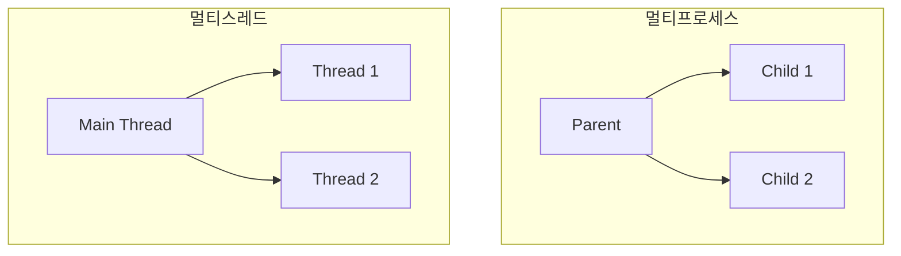

## 1. 개념

**멀티프로세스(Multi-Process)**와 **멀티스레드(Multi-Thread)**는 시스템 자원을 효율적으로 사용하여 동시에 여러 작업을 수행하는 병렬 처리 모델입니다.
각각의 메모리 구조와 실행 단위에 따라 안정성과 성능 간의 트레이드오프가 존재합니다.
 
### 프로세스 vs 스레드
| 항목 | 프로세스 | 스레드 |
|------|----------|--------|
| 메모리 | 독립 공간 | 힙/데이터 공유 |
| 생성 비용 | 높음 | 낮음 |
| 통신 | IPC 필요 | 공유 메모리 |
| 안정성 | 격리됨 | 동기화 필요 |

### 동시 처리 방식



---

## 2. 멀티프로세스 (fork)

### fork() 기본
```c
#include <stdio.h>
#include <unistd.h>
#include <sys/types.h>

int main() {
    pid_t pid = fork();

    if (pid == -1) {
        perror("fork");
        return 1;
    } else if (pid == 0) {
        // 자식 프로세스
        printf("Child PID: %d, Parent: %d\n", getpid(), getppid());
    } else {
        // 부모 프로세스
        printf("Parent PID: %d, Child: %d\n", getpid(), pid);
    }

    return 0;
}
```

### 좀비 프로세스 방지
```c
#include <sys/wait.h>

// 방법 1: wait() 사용
int status;
wait(&status);

// 방법 2: 시그널 핸들러
#include <signal.h>

void sigchld_handler(int sig) {
    while (waitpid(-1, NULL, WNOHANG) > 0);
}

int main() {
    signal(SIGCHLD, sigchld_handler);
    // fork() ...
}
```

### 다중 클라이언트 서버
```c
while (1) {
    int client_fd = accept(server_fd, ...);
    
    pid_t pid = fork();
    if (pid == 0) {
        // 자식: 클라이언트 처리
        close(server_fd);
        handle_client(client_fd);
        close(client_fd);
        exit(0);
    } else {
        // 부모: 다음 연결 대기
        close(client_fd);
    }
}
```

---

## 3. 멀티스레드 (pthread)

### pthread 기본
```c
#include <pthread.h>
#include <stdio.h>

void *thread_func(void *arg) {
    int id = *(int*)arg;
    printf("Thread %d running\n", id);
    return NULL;
}

int main() {
    pthread_t threads[3];
    int ids[3] = {1, 2, 3};

    for (int i = 0; i < 3; i++) {
        pthread_create(&threads[i], NULL, thread_func, &ids[i]);
    }

    for (int i = 0; i < 3; i++) {
        pthread_join(threads[i], NULL);
    }

    return 0;
}
```

### 컴파일
```bash
gcc -o multi multi.c -lpthread
```

### Mutex (상호 배제)
```c
#include <pthread.h>

pthread_mutex_t lock = PTHREAD_MUTEX_INITIALIZER;
int counter = 0;

void *increment(void *arg) {
    for (int i = 0; i < 100000; i++) {
        pthread_mutex_lock(&lock);
        counter++;
        pthread_mutex_unlock(&lock);
    }
    return NULL;
}

int main() {
    pthread_t t1, t2;
    
    pthread_create(&t1, NULL, increment, NULL);
    pthread_create(&t2, NULL, increment, NULL);
    
    pthread_join(t1, NULL);
    pthread_join(t2, NULL);
    
    printf("Counter: %d\n", counter);  // 200000
    return 0;
}
```

---

## 4. 실습: 멀티스레드 채팅 서버

```c
#include <pthread.h>
#include <stdio.h>
#include <stdlib.h>
#include <string.h>
#include <unistd.h>
#include <arpa/inet.h>

#define PORT 8080
#define BUFFER_SIZE 1024

void *handle_client(void *arg) {
    int client_fd = *(int*)arg;
    char buffer[BUFFER_SIZE];
    
    while (1) {
        memset(buffer, 0, BUFFER_SIZE);
        int bytes = recv(client_fd, buffer, BUFFER_SIZE - 1, 0);
        if (bytes <= 0) break;
        
        printf("Received: %s", buffer);
        send(client_fd, buffer, bytes, 0);
    }
    
    close(client_fd);
    free(arg);
    return NULL;
}

int main() {
    int server_fd;
    struct sockaddr_in addr;
    
    server_fd = socket(AF_INET, SOCK_STREAM, 0);
    
    addr.sin_family = AF_INET;
    addr.sin_addr.s_addr = INADDR_ANY;
    addr.sin_port = htons(PORT);
    
    bind(server_fd, (struct sockaddr*)&addr, sizeof(addr));
    listen(server_fd, 5);
    
    printf("Server listening on port %d\n", PORT);
    
    while (1) {
        int *client_fd = malloc(sizeof(int));
        *client_fd = accept(server_fd, NULL, NULL);
        
        pthread_t thread;
        pthread_create(&thread, NULL, handle_client, client_fd);
        pthread_detach(thread);  // 자동 리소스 정리
    }
    
    return 0;
}
```

---

## 5. 트러블슈팅

### Race Condition
- 공유 자원 접근 시 Mutex 사용
- atomic 연산 활용

### Deadlock 방지
- 락 획득 순서 통일
- 타임아웃 설정

<hr class="short-rule">
