### Azure CLI로 구축한 하이브리드 클라우드 보안 아키텍처

이 프로젝트는 Azure CLI를 사용해 온프레미스와 클라우드를 안전하게 연결하는 하이브리드 네트워크를 구축하는 과정입니다. 실제 기업 환경을 가정하여 **Site-to-Site VPN**과 **BGP 기반 동적 라우팅**으로 견고한 연결성을 확보하고, **Ansible**을 통해 구성 관리를 자동화했습니다. 또한, **NSG 정책**을 조합하여 네트워크 수준에서부터 **심층 방어(Defense in Depth)**와 **최소 권한 원칙(Principle of Least Privilege)**을 구현하는 데 중점을 두었습니다.

---

### 1. 전체 아키텍처 개요

본 아키텍처는 On-prem 시뮬레이션 환경과 Azure 클라우드 환경으로 구성됩니다. 특히 On-prem의 제어 노드가 VPN을 통해 Azure 내부의 관리 노드들을 제어하고, 각 티어는 NSG를 통해 엄격하게 격리되는 구조입니다.


*   ***온프레미스 시뮬레이션 VNet***: `192.168.0.0/16`
    -   **제어 노드(Ansible Controller)**: Azure VM들의 구성을 자동화하는 컨트롤 타워 역할을 수행합니다.
*   ***Azure 클라우드 VNet***: `10.42.0.0/16`
    -   **Web Tier (`10.42.10.0/24`)**: 외부 요청을 처리하는 웹 서버 영역입니다.
    -   **DB Tier (`10.42.20.0/24`)**: 내부 데이터를 저장하는 데이터베이스 서버 영역입니다.
    -   **Monitoring Tier (`10.42.30.0/24`)**: 중앙 로깅 및 모니터링을 위한 ELK Stack 서버 영역입니다.
*   ***연결 방식***: **Route-based VPN Gateway + BGP**
    -   IPsec 기반 암호화 터널을 통해 통신 데이터를 보호합니다.
    -   BGP를 통해 양쪽 네트워크의 경로 정보를 동적으로 교환하여 관리의 효율성과 확장성을 확보합니다.
*   ***보안 정책***: **NSG (Network Security Group)**
    -   각 티어(Web, DB, Monitoring) 앞에 L4 가상 방화벽을 배치하여, 허가된 트래픽만 통과시키는 최소 권한 원칙을 적용합니다.
    -   **Web-NSG**: On-Prem → Web (80, 443, 22), 그 외 모든 인바운드 차단.
    -   **DB-NSG**: Web Tier → DB (3306), On-Prem → DB (22), 그 외 모든 인바운드 차단.
    -   **ELK-NSG**: On-Prem → Kibana (5601), Web/DB Tier → Logstash (5044), On-Prem → ELK (22).

---

### 2. 환경 구축 절차

각 단계는 Azure CLI 명령어를 통해 진행했으며, 모든 리소스 이름에는 일관성을 위해 `st421-` 접두사를 사용했습니다.

#### ***1. 리소스 그룹 및 VNet 생성***

On-prem과 Azure 환경을 논리적으로 분리하기 위해 별도의 리소스 그룹을 생성합니다. 각 환경의 VNet과 서브넷을 설계에 맞게 구성합니다. 특히 모니터링 티어를 위한 서브넷(`st421-subnet-monitoring`)을 추가로 생성하여 역할을 분리했습니다.


```bash
# 리소스 그룹 생성
az group create --name st421-rg-onprem --location koreacentral
az group create --name st421-rg-azure --location koreacentral

# On-prem VNet 및 서브넷 생성
az network vnet create -g st421-rg-onprem -n st421-vnet-onprem --address-prefix 192.168.0.0/16 --subnet-name st421-subnet-client --subnet-prefix 192.168.10.0/24
az network vnet subnet create -g st421-rg-onprem --vnet-name st421-vnet-onprem -n GatewaySubnet --address-prefix 192.168.254.0/27

# Azure VNet 및 서브넷 생성
az network vnet create -g st421-rg-azure -n st421-vnet-azure --address-prefix 10.42.0.0/16
az network vnet subnet create -g st421-rg-azure --vnet-name st421-vnet-azure -n GatewaySubnet --address-prefix 10.42.254.0/27
az network vnet subnet create -g st421-rg-azure --vnet-name st421-vnet-azure -n st421-subnet-web --address-prefix 10.42.10.0/24
az network vnet subnet create -g st421-rg-azure --vnet-name st421-vnet-azure -n st421-subnet-db --address-prefix 10.42.20.0/24
az network vnet subnet create -g st421-rg-azure --vnet-name st421-vnet-azure -n st421-subnet-monitoring --address-prefix 10.42.30.0/24
```

#### ***2. BGP 활성화 VPN Gateway 및 연결 구성***

정적 라우팅(Static Routing)과 달리 BGP 동적 라우팅을 사용하는 이유는 **확장성과 관리 효율성** 때문입니다. 향후 On-prem이나 클라우드에 새로운 서브넷이 추가될 경우, BGP가 자동으로 경로를 학습하고 전파하므로 수동으로 라우팅 테이블을 수정할 필요가 없습니다.

이 과정에서 가장 중요한 점은, Local Network Gateway 생성 시 **상대방 게이트웨이의 BGP 피어링 IP 주소(`--bgp-peering-address`)**를 명확히 지정해주는 것입니다. 이는 게이트웨이가 BGP 통신을 위해 내부적으로 사용하는 Private IP로, VNet Gateway 생성 후 동적으로 조회하여 설정해야 합니다.

```bash
# 1. 공인 IP 생성
az network public-ip create -g st421-rg-onprem -n st421-pip-onprem --sku Standard
az network public-ip create -g st421-rg-azure -n st421-pip-azure --sku Standard

# 2. VNet Gateway 생성
az network vnet-gateway create -g st421-rg-onprem -n st421-vng-onprem --public-ip-address st421-pip-onprem --vnet st421-vnet-onprem --gateway-type Vpn --vpn-type RouteBased --sku VpnGw3 --asn 65501
az network vnet-gateway create -g st421-rg-azure -n st421-vng-azure --public-ip-address st421-pip-azure --vnet st421-vnet-azure --gateway-type Vpn --vpn-type RouteBased --sku VpnGw3 --asn 65502

# 3. 각 게이트웨이의 BGP 피어링 IP 조회
ONPREM_BGP_IP=$(az network vnet-gateway show -g st421-rg-onprem -n st421-vng-onprem --query "bgpSettings.bgpPeeringAddress" -o tsv)
AZURE_BGP_IP=$(az network vnet-gateway show -g st421-rg-azure -n st421-vng-azure --query "bgpSettings.bgpPeeringAddress" -o tsv)

# 4. 공인 IP 조회
ONPREM_GW_IP=$(az network public-ip show -g st421-rg-onprem -n st421-pip-onprem --query ipAddress -o tsv)
AZURE_GW_IP=$(az network public-ip show -g st421-rg-azure -n st421-pip-azure --query ipAddress -o tsv)

# 5. BGP 피어링 IP를 지정하여 Local Network Gateway 생성
az network local-gateway create -g st421-rg-azure -n st421-lng-onprem --gateway-ip-address $ONPREM_GW_IP --local-address-prefixes "192.168.0.0/16" --asn 65501 --bgp-peering-address $ONPREM_BGP_IP
az network local-gateway create -g st421-rg-onprem -n st421-lng-azure --gateway-ip-address $AZURE_GW_IP --local-address-prefixes "10.42.0.0/16" --asn 65502 --bgp-peering-address $AZURE_BGP_IP

# 6. VPN 연결 생성
SHARED_KEY="YourSecureSharedKey"
az network vpn-connection create -g st421-rg-azure -n st421-conn-azure-to-onprem --vnet-gateway1 st421-vng-azure --local-gateway2 st421-lng-onprem --shared-key "$SHARED_KEY" --enable-bgp
az network vpn-connection create -g st421-rg-onprem -n st421-conn-onprem-to-azure --vnet-gateway1 st421-vng-onprem --local-gateway2 st421-lng-azure --shared-key "$SHARED_KEY" --enable-bgp
```

#### ***3. NSG 정책 적용***

NSG는 네트워크 수준에서 **최소 권한 원칙을 구현하는 핵심 요소**입니다. 기본적으로 모든 인바운드 트래픽을 차단하고, 각 티어의 역할에 맞는 최소한의 트래픽만 명시적으로 허용하는 '화이트리스트' 방식으로 보안을 강화합니다.

예를 들어, DB 티어는 오직 Web 티어로부터의 MySQL(3306) 트래픽과 관리 목적으로 On-Prem 제어 노드로부터의 SSH(22) 트래픽만 허용합니다. 이 외의 모든 접근은 차단되어, On-Prem의 일반 사용자가 DB에 직접 접근하는 것을 원천적으로 막습니다.

```bash
# DB 서버용 NSG 생성 및 규칙 설정
az network nsg create -g st421-rg-azure -n st421-nsg-db
az network nsg rule create -g st421-rg-azure --nsg-name st421-nsg-db -n "Allow-MySQL-From-Web" --priority 100 --source-address-prefixes "10.42.10.0/24" --destination-port-ranges 3306 --access Allow --protocol Tcp
az network nsg rule create -g st421-rg-azure --nsg-name st421-nsg-db -n "Allow-SSH-From-OnPrem" --priority 110 --source-address-prefixes "192.168.0.0/16" --destination-port-ranges 22 --access Allow --protocol Tcp
```


#### ***4. VM 배포 및 Ansible을 이용한 구성 자동화***

Ansible과 같은 구성 관리 도구를 사용하는 목적은 **일관성과 반복성 확보**입니다. 수동으로 서버를 설정할 때 발생할 수 있는 실수를 방지하고, 모든 서버가 코드(플레이북)에 정의된 동일한 상태를 유지하도록 보장합니다(멱등성). 이는 보안 설정 누락과 같은 리스크를 크게 줄여줍니다.

On-prem 제어 노드에서 Ansible 플레이북을 실행하여 각 서버의 역할을 정의하고 필요한 소프트웨어를 설치 및 설정합니다.
*   **Web 서버 플레이북 (`web-playbook.yml`)**: `httpd` 패키지를 설치하고 서비스를 활성화하며, 기본 웹 페이지를 배포합니다.
*   **DB 서버 플레이북 (`db-playbook.yml`)**: `mariadb-server`를 설치하고, 데이터베이스 및 사용자를 생성합니다.
*   **ELK 서버 플레이북 (`elk-playbook.yml`)**: `Elasticsearch`와 `Kibana`를 설치하고, 외부에서 접속할 수 있도록 설정을 변경한 후 서비스를 활성화합니다.

```yaml
# DB 서버 플레이북 예시 (db-playbook.yml)
---
- hosts: db
  become: yes
  tasks:
    - name: Install MariaDB and PyMySQL
      dnf:
        name: ['mariadb-server', 'python3-PyMySQL']
        state: present
    - name: Start and enable mariadb service
      service:
        name: mariadb
        state: started
        enabled: yes
```

---

### 3. 검증 결과

구축한 아키텍처가 의도대로 동작하는지 검증을 진행합니다. 모든 검증은 **On-Prem 제어 노드(`192.168.10.4`)** 에서 수행했습니다.

#### ***1. On-Prem → Web 서버 접속***

VPN과 BGP 라우팅이 정상적으로 동작하는지, 그리고 Web 티어 NSG 정책이 올바른지 확인하기 위해 `curl` 명령어로 웹 서버에 접속합니다.

```bash
# On-Prem 제어 노드에서 실행
curl http://10.42.10.4
```


> Ansible 플레이북으로 배포한 환영 메시지가 정상적으로 수신되었습니다. 이를 통해 On-Prem에서 Azure 내부 Private IP로의 통신이 원활함을 확인했습니다.

#### ***2. On-Prem → DB 서버 직접 접속 차단***

최소 권한 원칙이 잘 적용되었는지 확인하기 위해, 허용되지 않은 경로인 On-Prem에서 DB 서버로 직접 접속을 시도합니다.

```bash
# On-Prem 제어 노드에서 실행
mysql -u webuser -p'WebPass123!' -h 10.42.20.4 --connect-timeout=5
```


> 예상대로 접속이 차단되었습니다. 이 실패는 DB 티어의 NSG가 설계대로 동작하고 있음을 증명합니다.

#### ***3. BGP 동적 라우팅 상태 검증***

Azure CLI를 통해 BGP 피어링 상태를 확인합니다. `Connected` 상태와 `RoutesReceived` 값을 통해 동적 라우팅이 성공적으로 수립되었음을 객관적인 데이터로 검증할 수 있습니다.

```bash
az network vnet-gateway list-bgp-peer-status -g st421-rg-azure -n st421-vng-azure -o table
```


---

### 4. 마무리

이번 프로젝트를 통해 BGP 기반의 동적 라우팅을 적용한 하이브리드 클라우드 네트워크를 구축하고, Ansible을 이용해 구성 관리를 자동화하는 전 과정을 경험할 수 있었습니다. 특히, Local Network Gateway 설정 시 BGP 피어링 주소를 명시하는 것의 중요성과 NSG를 통한 티어 간 접근 제어가 보안 아키텍처의 핵심임을 이해하는 의미 있는 과정이었습니다.

---

### 5. 하이브리드 환경 보안 위협과 대응

하이브리드 클라우드는 온프레미스와 클라우드의 이점을 결합하지만, **두 환경 모두의 공격 표면**을 가지게 된다. 특히 연결 지점이 공격자의 주요 타겟이 된다.

#### 주요 위협 시나리오

| 위협 | 설명 | 공격 경로 |
|------|------|-----------|
| **VPN Gateway 침해** | S2S VPN 자격 증명 탈취로 전체 네트워크 접근 | On-Prem 침해 → VPN 설정 파일 탈취 |
| **Lateral Movement** | 온프레미스에서 클라우드로의 횡적 이동 | On-Prem DC 장악 → Azure AD Connect → Azure 전체 |
| **AD Connect 서버 공격** | 하이브리드 ID 동기화 서버 타겟 | DPAPI로 저장된 자격 증명 추출 |
| **IMDS 토큰 탈취** | Azure VM의 Managed Identity 악용 | VM 침해 → 메타데이터 서비스 접근 |
| **NSG 우회** | 잘못된 NSG 규칙으로 인한 접근 허용 | 과도한 "Any" 규칙 악용 |

#### 공격 시나리오: 온프레미스 → 클라우드 침투

```mermaid
sequenceDiagram
    participant Attacker as 공격자
    participant OnPrem as On-Prem 서버
    participant VPN as VPN Gateway
    participant Azure as Azure VNet
    participant DC as Azure 리소스
    
    Attacker->>OnPrem: 1. 초기 침해 (피싱/취약점)
    OnPrem->>OnPrem: 2. VPN 자격 증명 탈취
    OnPrem->>VPN: 3. VPN 터널 통해 Azure 접근
    VPN->>Azure: 4. 내부 네트워크 스캔
    Azure->>DC: 5. NSG 허용된 서비스 공격
    Note over DC: 6. 클라우드 리소스 장악
```



#### 방어 대책 체크리스트

**🔴 필수**
- [ ] **VPN 인증 강화**: 인증서 기반 인증 + MFA
- [ ] **NSG 화이트리스트**: 기본 Deny-All, 필요한 포트만 명시적 허용
- [ ] **Tier 0 자산 격리**: AD Connect 서버를 별도 관리 네트워크에 배치

**🟠 권장**
- [ ] **PIM 활성화**: 관리 권한 Just-In-Time 접근
- [ ] **IMDS 접근 제한**: NSG로 169.254.169.254 아웃바운드 제한
- [ ] **VPN 로깅**: Azure Network Watcher로 VPN 연결 모니터링
- [ ] **비밀 관리**: Shared Key를 Key Vault에 저장

#### Azure CLI 보안 점검

**NSG 규칙 감사**
```bash
# 과도한 Any-Any 규칙 탐지
az network nsg list -g st421-rg-azure --query "[].securityRules[?access=='Allow' && sourceAddressPrefix=='*']" -o table
```

**VPN 연결 상태 모니터링**
```bash
# VPN 연결 상태 확인
az network vpn-connection show -g st421-rg-azure -n st421-conn-azure-to-onprem --query "connectionStatus" -o tsv

# 연결 실패 로그 확인 (진단 로그 활성화 필요)
az monitor activity-log list --resource-group st421-rg-azure --query "[?contains(operationName.value, 'vpn')]" -o table
```

**VM에서 IMDS 접근 차단 (선택적)**
```bash
# NSG에 IMDS 차단 규칙 추가 (Managed Identity 미사용 시)
az network nsg rule create -g st421-rg-azure --nsg-name st421-nsg-web \
    -n DenyIMDS --priority 100 \
    --source-address-prefixes "*" \
    --destination-address-prefixes "169.254.169.254" \
    --destination-port-ranges 80 \
    --access Deny --protocol Tcp --direction Outbound
```

<hr class="short-rule">