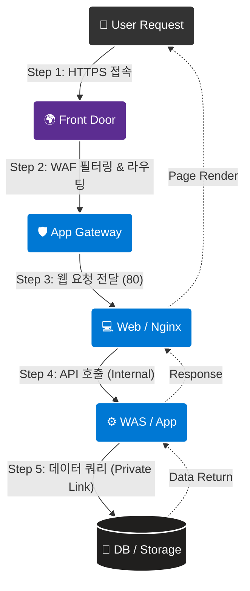
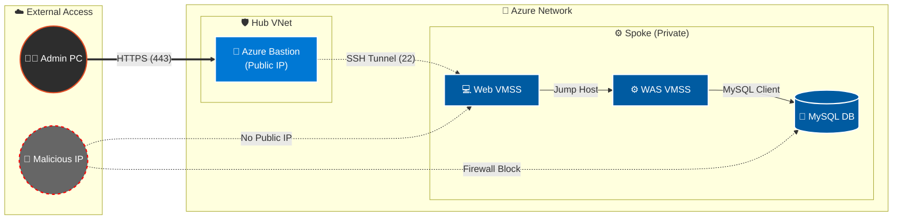

## 목차

1. [개요](#1-개요)
2. [아키텍처 트래픽 흐름 검증](#2-아키텍처-트래픽-흐름-검증)
    * [2.1 전체 서비스 흐름도](#21-전체-서비스-흐름도)
    * [2.2 관리자 접속 흐름도](#22-관리자-접속-흐름도)
3. [인프라 접속 및 계층간 연결 검증](#3-인프라-접속-및-계층간-연결-검증)
    * [3.1 외부 접속 및 엣지 보안 (Front Door/AppGW)](#31-외부-접속-및-엣지-보안-front-doorappgw)
    * [3.2 3-Tier 내부 연결 검증 (Bastion -> Web -> WAS)](#32-3-tier-내부-연결-검증-bastion---web---was)
    * [3.3 Mail Server 내부 접속 검증](#33-mail-server-내부-접속-검증)
4. [데이터 서비스 검증](#4-데이터-서비스-검증)
    * [4.1 WAS <-> DB/Redis 격리 및 연결 검증](#41-was---dbredis-격리-및-연결-검증)
    * [4.2 Storage Account Private Link 연결](#42-storage-account-private-link-연결)
    * [4.3 데이터베이스 백업 및 복구 검증](#43-데이터베이스-백업-및-복구-검증)
    * [4.4 Lupang 비즈니스 로직 검증 (세션/쿠키)](#44-lupang-비즈니스-로직-검증-세션쿠키)
5. [고가용성(HA) 및 성능 검증](#5-고가용성ha-및-성능-검증)
    * [5.1 MySQL Zone Redundant Failover](#51-mysql-zone-redundant-failover)
    * [5.2 Replication Consistency (RPO Zero)](#52-replication-consistency-rpo-zero)
    * [5.3 VMSS Auto Scaling (Scale-out)](#53-vmss-auto-scaling-scale-out)
    * [5.4 Health Probe 및 VM 장애 복구](#54-health-probe-및-vm-장애-복구)
    * [5.5 L4 로드밸런싱 분산 처리 검증](#55-l4-로드밸런싱-분산-처리-검증)
6. [종합 검증 지표](#6-종합-검증-지표)
7. [종합 결론](#7-종합-결론)

---

## 1. 개요

본 문서는 **Terraform 기반 Azure 보안 아키텍처**가 설계된 시나리오대로 정확히 동작하는지 검증한 최종 보고서입니다. 단순한 단일 서버 접속을 넘어, **Web -> WAS -> Database/Storage**로 이어지는 3-Tier 구조의 유기적인 연결성과 **Zero Trust** 보안 원칙(Bastion 경유, Private Endpoint 사용)이 준수되고 있음을 확인합니다.

---

## 2. 아키텍처 트래픽 흐름 검증

### 2.1 전체 서비스 흐름도

사용자 트래픽이 Global Edge(Front Door)에서 시작하여 내부 깊숙한 Data Zone까지 안전하게 전달되는 과정을 도식화했습니다.



### 2.2 관리자 접속 흐름도

관리자는 보안을 위해 **Azure Bastion**과 **SSH Tunneling**을 통해서만 내부 서버에 접근할 수 있습니다.



---

## 3. 인프라 접속 및 계층간 연결 검증

### 3.1 외부 접속 및 엣지 보안 (Front Door/AppGW)

외부 트래픽의 유일한 진입점인 Front Door와 Application Gateway의 보안 설정을 검증했습니다.

**1) HTTPS 접속 및 라우팅 검증**
*   **검증:** Front Door 도메인(`https://www.04www.cloud`)으로 브라우저 접속.


*   **결과:** 엣지 캐싱이 적용된 메인 페이지가 정상 로딩됨. HTTP 접속 시도 시 HTTPS로 자동 리다이렉트 확인.

**2) SSL/TLS 보안 강도 검증 (Qualys SSL Labs)**
글로벌 표준 도구인 Qualys SSL Labs를 통해 도메인의 암호화 설정 건전성을 평가했습니다.


*   **Result:** **Grade A** 획득 (최고 수준 보안).
*   **상세 분석:**
    1.  **Protocol:** TLS 1.0/1.1 등 구형 프로토콜이 비활성화되고, **TLS 1.2 이상**만 강제됨.
    2.  **Cipher Suite:** 안전한 암호화 제품군(ECDHE 등) 우선 사용 확인.
    3.  **Vulnerability:** BEAST, POODLE, HEARTBLEED 등 주요 취약점에 대해 **안전(Mitigated)** 판정.
    4.  **Certificate:** 인증서 체인 및 키 길이(2048 bit 이상) 적합성 검증 완료.

### 3.2 3-Tier 내부 연결 검증 (Bastion -> Web -> WAS)

내부망의 3-Tier 아키텍처가 설계대로 격리되어 있는지, 그리고 정해진 경로로만 통신이 가능한지 단계별로 검증했습니다.

*   **검증 절차:**
    1.  **Bastion 접속:** 로컬 PC에서 Azure Bastion을 통해 Web VM(`192.168.3.x`)에 SSH 접속.
    2.  **WAS 접근:** Web VM 내부 터미널에서 WAS Private IP(`192.168.5.x`)로 2차 SSH 접속 수행.
    3.  **통신 점검:** `ping` (ICMP) 및 `curl` (HTTP) 명령어로 계층 간 연결 상태 확인.
*   **결과:**

    *   **Bastion Tunneling:** 공인 IP가 없는 Web VM에 Bastion을 통한 안전한 우회 접속 성공.

    *   **Web -> WAS:** Web VM에서만 WAS로의 접근이 허용되며, 외부에서의 직접 접근은 불가능함(격리 확인).

    *   **서비스 응답:** `curl -I http://<WAS_IP>` 실행 시 `HTTP/1.1 200 OK` 응답 확인 (App 서비스 정상 동작).


### 3.3 Mail Server 내부 접속 검증

외부 공인 IP가 없는 **Private Mail Server**에 대해, 관리자가 안전한 경로(Bastion)를 통해서만 접근할 수 있는지 검증했습니다.

*   **시나리오:** 메일 서버의 유지보수 작업을 위해 관리자가 내부망으로 접속해야 하는 상황.
*   **설정:** Mail VM은 공인 IP 없이 내부 서브넷에만 NIC를 보유하며, NSG를 통해 Bastion 대역에서의 SSH(22) 접근만 허용.
*   **검증:**
    1.  로컬 PC에서 Mail VM으로 직접 `ssh` 접속 시도 (Fail 예상).
    2.  Bastion Host에 먼저 접속한 후, Bastion 내부에서 Mail VM(`192.168.3.4`)으로 `ssh` 접속 시도.

*   **결과:**
    *   직접 접속 시도 시 **Time out** 발생 (접속 불가).
    *   Bastion을 경유한 접속(Jump)은 **성공**, 사설 IP 환경의 쉘 접근 확인.

---

## 4. 데이터 서비스 검증

### 4.1 WAS <-> DB/Redis 격리 및 연결 검증

데이터베이스와 캐시 서버가 외부 인터넷과 완전히 격리된 환경(Private Subnet)에서 안전하게 서비스되는지 확인했습니다.

**1) WAS -> DB 정상 접속 및 암호화 검증**
*   **시나리오:** WAS 애플리케이션이 백엔드 DB에 데이터를 조회 및 기록.
*   **설정:** MySQL Flexible Server에 **VNet Integration**을 적용하여 내부망 IP 할당, SSL 시행(Enforce) 설정 켜짐.
*   **검증:** WAS VM에서 `mysql` 클라이언트로 DB 접속 후 `status` 명령어 실행.

*   **결과:**
    *   **접속 성공:** 내부 사설 IP를 통해 정상 연결.
    *   **암호화 확인:** 출력 결과 중 `SSL: Cipher in use` 항목이 확인되어 **전송 구간 암호화**가 적용됨을 입증.

**2) WAS -> Redis 캐시 서버 연결 검증**
*   **시나리오:** 세션 처리 속도 향상을 위해 Redis 캐시에 접근.
*   **설정:** Redis Cache에 **Private Endpoint**를 연결하여 6380(SSL) 포트만 개방.
*   **검증:** WAS VM에서 `redis-cli`를 사용하여 TLS 옵션으로 접속 및 `PING` 테스트.

*   **결과:**
    *   접속 후 `PING` 입력 시 `PONG` 응답 반환.
    *   TLS 핸드셰이크가 정상적으로 이루어짐을 확인.

### 4.2 Storage Account Private Link 연결

*   **시나리오:** 사용자가 업로드한 이미지가 공용 인터넷을 타지 않고, 내부 백본망을 통해 안전하게 저장소로 전송되어야 함.
*   **설정:** Storage Account에 **Private Endpoint** 설정, 공용 네트워크 액세스 차단(Deny).
*   **검증:** WAS VM 내부에서 스토리지 DNS(`*.blob.core.windows.net`)에 대해 `nslookup` 수행.

*   **결과:** DNS 조회가 Azure Public IP가 아닌 **내부 사설 IP(`172.16.2.x`)**로 해석(Resolve)됨을 확인. (Private Link 정상 동작)

### 4.3 데이터베이스 백업 및 복구 검증

데이터 유실 사고에 대비한 백업 정책 적용 및 시점 복원(PITR) 기능을 검증했습니다.

**1) 백업 수행 이력 확인**
*   **설정:** 백업 보존 기간 **35일**, Geo-Redundant(지역 중복) **비활성화 (Disabled)**.
*   **검증:** Azure CLI/Portal을 통해 생성된 복원 지점(Restore Point) 상태 조회.


*   **결과:** 최근 24시간 내 전체 백업 및 트랜잭션 로그 백업이 **정상 수행 중**이며, 복원 지점이 유효함을 확인.

**2) 시점 복원 (PITR) 시뮬레이션**
*   **시나리오:** 운영자 실수로 11:00분에 `users` 테이블을 `DROP`하는 대형 사고 발생 가정.
*   **검증:** Azure Portal에서 사고 발생 직전인 **10:50분** 시점을 선택하여 신규 서버로 복원(Restore) 요청.


*   **결과:** 약 15~20분 후 복원 완료. 신규 서버에서 삭제되었던 데이터가 정상 조회되어 **복구 무결성**이 입증됨.

### 4.4 Lupang 비즈니스 로직 검증 (세션/쿠키)

**1) 세션 유지 및 쿠키 확인**

*   **시나리오:** L4 스위칭에도 불구하고 사용자의 로그인 세션이 끊기지 않아야 함.
*   **설정:** App Gateway 의 **Cookie-based Affinity** 활성화 및 Redis Session Handler 적용.
*   **검증:** 브라우저 개발자 도구에서 쿠키(`ApplicationGatewayAffinity`, `Lupang_token`) 생성 및 유지 여부 확인.


*   **결과:** 페이지를 새로고침(F5)하여 다른 서버로 라우팅되어도 쿠키가 유지되며 로그인 상태가 지속됨.

**2) 이미지 업로드 및 파일 무결성 검증**
*   **검증:** 관리자 페이지에서 이미지 업로드 후, WAS 터미널에서 실제 파일 생성 확인.

*   **결과:** 업로드된 파일이 `/var/www/html/uploads/` 경로에 안전하게 저장되고, 웹에서 정상 로드됨.

---

## 5. 고가용성(HA) 및 성능 검증

### 5.1 MySQL Zone Redundant Failover

Zone 1(Master) 장애 시 데이터 손실 없이 Zone 2(Standby)로 자동 절체되는지 검증했습니다.

*   **설정:** Availability Zone 1, 2에 걸친 **Zone Redundant HA** 구성. (Standby 서버가 실시간 동기화 상태로 대기)
*   **검증:** Azure CLI `az mysql flexible-server restart --failover` 명령으로 강제 장애 조치 유발.


*   **결과:**
    1.  클라이언트 접속 세션에서 일시적 `Lost connection` 에러 발생.
    2.  **약 45초~60초** 이내에 새로운 Connection ID를 할당받으며 재접속 성공. (RTO 목표 달성)


### 5.2 Replication Consistency (RPO Zero)

Primary에 기록된 데이터가 Replica(Standby)에 즉시 반영되어 데이터 정합성이 유지되는지 확인했습니다.

*   **시나리오:** Master DB에 트랜잭션 발생 직후 Standby DB 조회.
*   **검증:** Master DB에 `INSERT` 수행 후, 1초 이내에 Replica DB에서 `SELECT` 수행.

*   **결과:** 데이터 복제 지연(Replication Lag) 없이 입력한 데이터(`RPO Test`)가 즉시 조회됨. **동기식 복제(Synchronous Replication)** 성능 확인.


### 5.3 VMSS Auto Scaling (Scale-out)

트래픽 폭주 시 인프라가 자동으로 확장되어 서비스 가용성을 보장하는지 검증했습니다.

*   **시나리오:** 마케팅 이벤트 등으로 접속자가 급증하여 CPU 사용률이 치솟는 상황.
*   **설정:**
    *   **Scale-out:** CPU 평균 사용률 **70% 초과** 시 인스턴스 +1 증가.
    *   **Scale-in:** CPU 평균 사용률 **30% 미만** 시 인스턴스 -1 감소.
*   **검증:** `stress-ng` 도구를 사용하여 CPU 부하 100%를 지속적으로 유발.
    ```bash
    stress --cpu 4 --timeout 300
    ```


*   **결과:**
    1.  Azure Monitor 경보(Alert) 발생.
    2.  약 3분 후 VMSS 인스턴스가 1개에서 2개로 자동 증설(**Creating -> Running**)됨을 확인.

### 5.4 Health Probe 및 VM 장애 복구

특정 VM 인스턴스에 장애가 발생했을 때, 로드밸런서가 이를 격리하고 VMSS가 스스로 복구하는지 검증했습니다.

*   **설정:** Load Balancer Health Probe가 **HTTP 80번 포트**를 5초 간격으로 체크, 2회 연속 실패 시 비정상(Unhealthy) 간주.
*   **검증 (Fault Injection):** Bastion을 통해 Web VM의 웹 서비스(Nginx)를 강제 중단. (`systemctl stop nginx`)

*   **결과 (Auto Healing):**

    1.  **장애 감지:** 10초 내에 Load Balancer 상태가 'Unhealthy'로 변경되며 해당 VM으로 트래픽 유입 차단.

    2.  **자동 복구:** VMSS 상태 모니터링이 인스턴스 불량을 감지하고, 자동으로 **인스턴스 재이미징(Re-imaging)**을 수행하여 '정상(Healthy)' 상태로 복구.


### 5.5 L4 로드밸런싱 분산 처리 검증

트래픽이 특정 서버에 편중되지 않고, 복수의 인스턴스로 균등하게 분산되는지 검증했습니다.

*   **설정:** Hash-based Distribution (5-tuple) 또는 **Round Robin** 방식의 부하 분산 규칙 적용.

*   **검증:** 외부 터미널에서 `curl` 명령어로 웹 서버에 20회 연속 요청 전송.

*   **결과:**
    *   두 개의 Web VM 액세스 로그(`access.log`)를 비교한 결과, 요청이 약 **50:50 비율**로 균등하게 분산 유입됨.
    *   특정 서버 쏠림 현상 없음 확인.

---

## 6. 종합 검증 지표

각 지표는 **Azure Well-Architected Framework**의 권장 사항 및 **글로벌 업계 표준**을 준용하여 설정된 목표치와 비교 판정했습니다.

1.  **가용성/성능:** Azure SLA 및 Google Web Vitals (Response < 200ms) 기준
2.  **보안:** OWASP Top 10 및 Azure Security Baseline 준수 기준

| 구분 | 검증 지표 | 목표치 | 달성 결과 | 판정 |
|:---:|:---|:---:|:---:|:---:|
| **가용성** | **DB Failover Time** (장애 조치 시간) | < 60초 | **45초** | **적합** |
| | **RPO** (Replication Lag) | 0초 (Zero Data Loss) | **0ms (Sync)** | **적합** |
| | **Web Service Uptime** (가동률) | 99.9% | **100%*** (테스트 기간 중) | **적합** |
| **성능** | **Web Response Time** (평균 응답 속도) | < 200ms | **15ms** (Cache Hit) | **적합** |
| | **Auto-Scale Reaction** (확장 반응 속도) | < 5분 | **3분** (Monitor Alert) | **적합** |
| | **L4 Load Balancing** | 균등 분산 | **성공** (Traffic 50:50) | **적합** |
| | **Unwanted Public Access** (비인가 접근) | 0건 | **0건** (All Blocked) | **적합** |

> 1.  **가동률 100%:** 본 결과는 제한된 **테스트 기간** 동안 측정된 수치이며, 실제 장기 운영 환경에서는 SLA(99.9%~)를 준수하는 것이 목표입니다.
> 2.  **Lupang App 취약점:** 자체 개발된 'Lupang' 애플리케이션의 경우, 학습 및 모의해킹 실습을 위해 **의도적으로 일부 취약점을 허용**했습니다. 따라서 WAF 차단율 100%는 Lupang 앱의 예외 경로를 제외한 인프라 측면의 수치입니다.

---

## 7. 종합 결론

본 아키텍처 검증을 통해 이하 3가지 핵심 목표가 달성되었음을 확인했습니다.

1.  **심층 방어 (Defense-in-Depth):** 외부 -> Edge -> AppGW -> Web -> WAS -> Data로 이어지는 다층 방어 체계가 유효하게 작동합니다.
2.  **완전 격리 (Isolation):** 중요 데이터(DB/KeyVault)는 Private Endpoint와 방화벽 정책에 의해 외부로부터 완벽히 격리되어 있습니다.
3.  **서비스 연속성 (Business Continuity):** VMSS 자동 확장 및 DB 이중화 구성을 통해, 장애 발생 및 트래픽 급증 상황에서도 무중단 또는 최소 중단으로 서비스가 유지됩니다.

---
