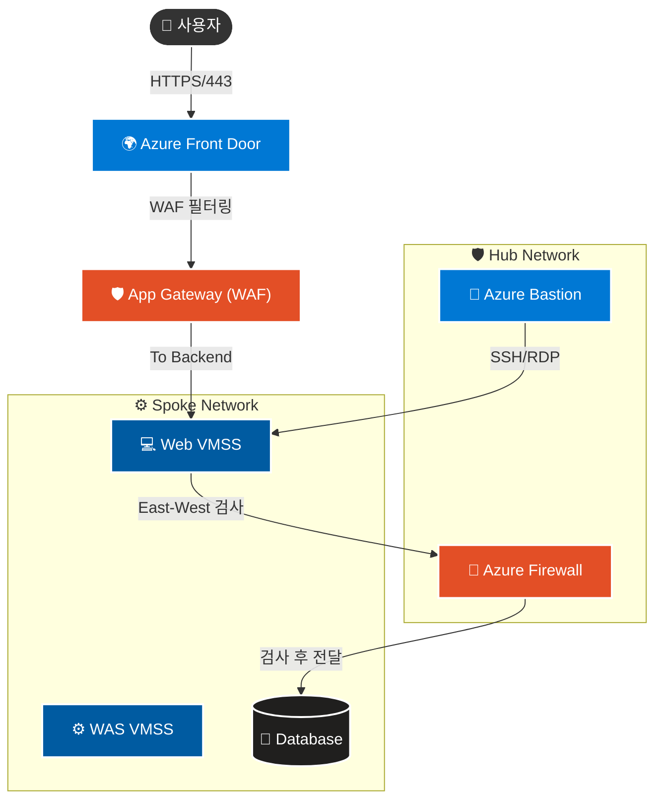

## 목차

1. [개요](#1-개요)
2. [ID 및 액세스 관리](#2-id-및-액세스-관리)
    *   [2.1 Entra ID 권한 분리 검증](#21-entra-id-권한-분리-검증)
    *   [2.2 RBAC 상속 권한 구조의 제약 사항 식별](#22-rbac-상속-권한-구조의-제약-사항-식별)
    *   [2.3 Custom RBAC (사용자 정의 역할)](#23-custom-rbac-사용자-정의-역할)
    *   [2.4 Managed Identity (시스템 할당 관리 ID)](#24-managed-identity-시스템-할당-관리-id)
    *   [2.5 Azure Policy (배포 제어)](#25-azure-policy-배포-제어)
3. [플랫폼 보호](#3-플랫폼-보호)
    *   [3.1 네트워크 보안 아키텍처](#31-네트워크-보안-아키텍처)
    *   [3.2 WAF 및 DDoS 방어 검증 (Locust)](#32-waf-및-ddos-방어-검증-locust)
    *   [3.3 내부망 NSG 차단 및 SQL 방화벽](#33-내부망-nsg-차단-및-sql-방화벽)
    *   [3.4 Hub Firewall 트래픽 제어](#34-hub-firewall-트래픽-제어)
    *   [3.5 JIT VM Access](#35-jit-vm-access)
    *   [3.6 내부 확산 방지 (Lateral Movement Prevention)](#36-내부-확산-방지-lateral-movement-prevention)
    *   [3.7 호스트 보호 (FIM)](#37-호스트-보호-fim)
    *   [3.8 컨테이너 보호 (ACR 보안)](#38-컨테이너-보호-acr-보안)
4. [데이터 및 애플리케이션 보호](#4-데이터-및-애플리케이션-보호)
    *   [4.1 Key Vault RBAC 기반 자격 증명 관리](#41-key-vault-rbac-기반-자격-증명-관리)
    *   [4.2 DB Security (SSL & TDE)](#42-db-security-ssl-tde)
    *   [4.3 Disk Encryption (ADE)](#43-disk-encryption-ade)
    *   [4.4 Storage SAS 만료 정책](#44-storage-sas-만료-정책)
    *   [4.5 SQL Auditing (감사 로그)](#45-sql-auditing-감사-로그)
5. [보안 운영 관리](#5-보안-운영-관리)
    *   [5.1 Azure Monitor 구성](#51-azure-monitor-구성)
    *   [5.2 Microsoft Defender for Cloud](#52-microsoft-defender-for-cloud)
    *   [5.3 Microsoft Sentinel 데이터 연결](#53-microsoft-sentinel-데이터-연결)
6. [Lupang 애플리케이션 취약점 진단 및 방어 검증](#6-lupang-애플리케이션-취약점-진단-및-방어-검증)
    *   [6.1 취약점 진단 도구](#61-취약점-진단-도구)
    *   [6.2 SSRF 방어 검증](#62-ssrf-방어-검증)
    *   [6.3 Command Injection 방어 검증](#63-command-injection-방어-검증)
    *   [6.4 SQL Injection 방어 검증](#64-sql-injection-방어-검증)
    *   [6.5 취약점 상세 진단: 인증 토큰 검증 부재](#65-취약점-상세-진단-인증-토큰-검증-부재)
    *   [6.6 보안 취약점 조치 방안](#66-보안-취약점-조치-방안)
    *   [6.7 WAF 방어 효용성 검증 결론](#67-waf-방어-효용성-검증-결론)
7. [결론](#7-결론)

---

## 1. 개요

본 문서는 **Azure 클라우드 환경의 데이터 및 애플리케이션 보안**을 검증한 보고서입니다. 평가 기준에 따라 **ID 및 액세스 관리, 플랫폼 보호, 데이터/앱 보호, 보안 운영 관리** 4개 영역을 중심으로 검증을 수행했습니다.

**"공격자가 침투하지 못하도록 잘 잠겨있는가?"**라는 질문에 답하기 위해, 각 보안 통제(Security Controls)의 **차단 테스트**와 **설정 검증**을 진행했습니다.

---

## 2. ID 및 액세스 관리

### 2.1 Entra ID 권한 분리 검증

최소 권한 원칙(Least Privilege)에 따라 사용자별로 적절한 권한이 부여되었는지, 그리고 계층 구조에 따른 권한 상속 동작을 검증했습니다.

*   **시나리오:** `student420` 계정에 'DB 독자' 권한만 부여.
*   **검증:** Azure Portal '액세스 제어(IAM)' 메뉴에서 역할 할당 상태 확인 및 실제 DB 생성 시도.

*   **결과:**
    *   개별 DB **독자(Reader)** 권한을 부여했음에도, 상위 수준(구독)에서 상속된 **기여자(Contributor) 및 소유자(Owner)** 권한이 존재함.
    *   결과적으로 **`test` 데이터베이스 생성이 차단되지 않고 성공**함.

*   **분석:** 권한 할당 시 상위 스코프(구독/리소스그룹)의 상속 관계가 하위 리소스 권한을 덮어쓸 수 있음을 확인.

### 2.2 RBAC 상속 권한 구조의 제약 사항 식별
*   **검증:** 구독 소유자(`student421`) 계정으로 상속된 불필요한 권한(Contributor) 제거 시도.

*   **결과:** 구독 소유자(Owner) 권한 보유 계정(`student421`)으로도 **상속된 권한 삭제가 불가능(비활성화)**함을 확인.
*   **원인 분석:** 해당 권한이 구독보다 상위인 **관리 그룹(Management Group)** 수준에서 강제 상속되고 있어, 프로젝트(Subscription) 단위에서는 제어할 수 없음.
*   **시사점:** 완벽한 격리를 위해서는 **Tenant Level의 권한 재설계**가 선행되어야 함을 규명.

### 2.3 Custom RBAC (사용자 정의 역할)

기본 제공(Built-in) 역할만으로 충족되지 않는 제약 조건을 위해, 커스텀 역할을 생성하고 테스트했습니다.

*   **시나리오:** **"VM Restart Operator"** (VM 재시작만 가능하고, 삭제나 생성은 불가능한 역할) 생성 및 할당.
*   **정의 (JSON):**

*   **검증:**

    1.  `az role definition create` 명령어로 역할 생성.

    2.  `az role assignment create` 명령어로 `student420` 사용자에게 역할 할당.

*   **결과:** CLI 명령은 성공적으로 수행되었으나, 기존의 **상속된 기여자(Contributor)** 권한이 여전히 유효함.
*   **한계점:** Custom Role은 정상적으로 적용되었으나, **상속된 기여자(Contributor) 권한 때문에** 결과적으로 VM 삭제 등의 작업을 **막을 수 없었음 (권한 제한 무력화)**.

### 2.4 Managed Identity (시스템 할당 관리 ID)

애플리케이션 코드 내에 자격 증명(Access Key, Password)을 하드코딩하지 않는 **Keyless 인증** 체계를 검증했습니다.

*   **대상:** VMSS(Web/WAS)에 할당된 **System-assigned Managed Identity**.
*   **검증 방법:** VM 내부에서 메타데이터 서비스(IMDS)를 호출하여 Access Token 발급 시도.


    ```bash
    curl -H Metadata:true "http://169.254.169.254/metadata/identity/oauth2/token?api-version=2018-02-01&resource=https://management.azure.com/"
    ```

*   **결과:** 별도의 로그인 절차 없이 **JWT 토큰**이 정상적으로 반환됨. (Key Vault 등 리소스 접근 가능 확인)

### 2.5 Azure Policy (배포 제어)


*   **설정:** '리소스 종류를 사용할 수 없습니다' 정책을 할당하여 **스토리지 계정(`Microsoft.Storage/storageAccounts`)** 차단 목록에 추가.

*   **검증:** Azure Portal 및 CLI를 통해 신규 스토리지 계정 생성 시도.

*   **결과:**
    *   **Portal:** 배포 전 유효성 검사 단계에서 실패.
    *   **CLI:** `RequestDisallowedByPolicy` 에러 코드와 함께 생성 거부됨.

---

## 3. 플랫폼 보호

### 3.1 네트워크 보안 아키텍처

전체 네트워크 트래픽이 보안 장비를 경유하여 안전하게 처리되는 흐름을 시각화했습니다.



### 3.2 WAF 및 DDoS 방어 검증 (Locust)

웹 서버에 대한 무차별 대입 공격 및 DoS 시도를 시뮬레이션하여, Azure App Gateway WAF의 방어 성능을 검증했습니다.

*   **시나리오:** 공격자가 웹 서버를 마비시키기 위해 단시간에 대량의 HTTP 요청(Flooding)을 전송.

*   **검증:** Locust를 활용하여 1분간 지속적인 부하 발생 (User: 10, Spawn Rate: 1).
    *   Command: `locust -f locustfile.py --headless -u 10 -r 1 --run-time 1m`


*   **결과:**
    *   총 5,880건 요청 중 **5,685건 차단 (차단율 96.68%)**.
    *   WAF가 비정상 트래픽을 감지하고 `503 Service Unavailable`을 반환하여 백엔드를 보호함.

### 3.3 내부망 NSG 차단 및 SQL 방화벽

**1) Subnet 간 트래픽 격리 (NSG)**

*   **시나리오:** Web 서버를 장악한 공격자가 DB 서버로 직접 SSH 접속을 시도하여 내부 확산(Lateral Movement)을 시도.
*   **정책:** Web, WAS, DB 각 서브넷에 전용 NSG를 할당하여 트래픽을 정밀 제어. 계층 간 직접 통신을 차단.
*   **검증:** Web VM에서 DB VM(MySQL)으로 SSH 시도.
    ```bash
    ssh -v -o ConnectTimeout=5 www@www-mysql-server-d0gn.mysql.database.azure.com
    ```

*   **결과:** **`Connection timed out`** 발생. NSG가 패킷을 Drop하여 **정상 차단됨**을 확인.

**2) SQL 방화벽 / VNet 규칙**

*   **시나리오:** 허가되지 않은 외부 IP에서 Azure SQL Database로의 직접 접속 시도.
*   **정책:** SQL Server 방화벽에 **특정 VNet 서브넷만 화이트리스트**로 등록하여, 외부 및 비인가 서브넷의 접근을 차단.
*   **검증:**

    1.  로컬 PC(등록되지 않은 공인 IP)에서 SQL Server 접속 시도.

    2.  Azure Portal에서 방화벽 규칙 추가.

    3.  접속 재시도.
*   **결과:**
    *   **규칙 추가 전:** `az sql server firewall-rule create` 실패 또는 접속 거부.
    *   **규칙 추가 후:** 화이트리스트 등록된 IP에서만 접속 성공.

### 3.4 Hub Firewall 트래픽 제어

본 섹션은 Hub VNet에 배치된 **Azure Firewall**이 전체 네트워크 트래픽(East-West, North-South)을 중앙에서 얼마나 효과적으로 통제하는지 기술합니다.

**1) Application Rule: 허용된 도메인만 접근 가능**
*   **시나리오:** 내부 서버가 악성 사이트나 허용되지 않은 외부 도메인으로 통신을 시도.
*   **정책:** `Allow-Windows-Update`, `Allow-Azure-Services`, `Allow-Package-Repos` 등 **승인된 FQDN만 Allow**, 나머지는 **Default Deny**.
*   **검증:** Spoke VM에서 허용되지 않은 사이트로 curl 시도.

    ```bash
    # 허용되지 않은 도메인 (google.com)
    curl -I https://www.google.com
    
    # 허용되지 않은 도메인 (dropbox.com - C&C 시뮬레이션)
    curl -I https://www.dropbox.com
    ```

*   **결과:** 
    *   `google.com`: **SSL_ERROR_ZERO_RETURN** (방화벽이 SNI 필터링 후 SSL 연결 끊음 - 차단 성공)
    *   `dropbox.com`: **Connection timed out** 또는 **SSL Error** - 차단됨.

**2) Network Rule: 필수 포트 허용**
*   **정책:** DNS(53), NTP(123), MySQL(3306), Redis(6379/6380) 포트만 허용.
*   **검증:**
    1.  **허용된 포트(DNS):** 외부 도메인 질의 테스트.
    2.  **비허용 포트(8080):** 외부 IP로의 비인가 연결 시도.

    ```bash
    # 1. 허용된 트래픽 (DNS 53)
    nslookup google.com

    # 2. 차단될 트래픽 (TCP 8080)
    curl -v telnet://1.1.1.1:8080
    ```

*   **결과:**
    *   **DNS:** 질의 성공 (Hub Firewall Rule 'Allow-DNS' 통과).
    *   **TCP 8080:** **Connection timed out** (Firewall 차단 성공).

### 3.5 JIT VM Access

관리 포트(SSH/22)를 상시 개방하지 않고, 필요할 때만 여는 동적 접근 제어를 테스트했습니다.

*   **설정:** Defender for Cloud의 JIT 정책을 통해 Mail VM의 22번 포트를 기본 차단.
*   **시나리오:**
    1.  초기 상태에서 접속 시도 (Fail).
    2.  관리자 권한으로 '3시간 동안 포트 개방' 요청 (`az security jit-policy request`).
    3.  요청 승인 후 다시 접속 시도.


*   **결과:** 요청 승인 직후 NSG 규칙이 일시적으로 **Allow**로 변경되어 접속 성공. (지정 시간 후 자동 차단됨)

### 3.6 내부 확산 방지 (Lateral Movement Prevention)

**"Assume Breach"** (이미 뚫렸다고 가정) 시나리오 하에, 해커가 Web 서버를 장악했을 때 다른 서버로 이동할 수 있는지 검증했습니다.

**1) Web -> DB/Storage 직접 침투 공격**
*   **시나리오:** Web VM 에서 `nc`(Netcat) 등을 이용해 DB(3306), Redis(6379) 포트 스캔.

*   **결과:** **Timeout**. (Failed to connect)
*   **분석:** WAS 를 경유하지 않은 직접 데이터 접근은 NSG 에 의해 차단됨.

**2) Web -> WAS 접속**
*   **시나리오:** Web VM(공인 IP)을 통해 내부망의 WAS VM(사설 IP)으로 SSH 접속 시도.
    *   `ssh www@$WAS_PRIVATE_IP`: 로컬에서 직접 접속 시도 -> **Timeout (차단됨)**
    *   Web VM 접속 후 `was` 명령어(alias) 사용 -> **접속 성공 (`was-vmss...`)**

*   **분석:** Web 서버에서 WAS 서버로의 SSH 접근은 관리 및 배포 목적으로 허용되어 있음 (Risk Acceptance).

**3) Web -> Management Zone 역접속 (Isolation)**
*   **시나리오:** 침해된 Web VM에서 역으로 관리망(Hub VNet)의 Bastion Host 또는 관리 도구로 접속을 시도했습니다.

*   **결과:** **접속 불가 (Timeout).** Spoke(Workload) 네트워크에서 Hub(Management) 네트워크로 향하는 비인가 트래픽은 NSG 및 Firewall 정책에 의해 엄격히 차단되고 있습니다.

### 3.7 호스트 보호 (FIM)

**File Integrity Monitoring**을 통해 중요 시스템 파일 변조를 감지합니다.

*   **설정:** Defender for Servers 플랜에서 FIM 기능을 활성화하고, 감시 대상 경로(`/etc/*` 등) 설정.

*   **검증:** 리눅스 VM의 중요 설정 파일(`/etc/passwd`) 내용을 임의로 수정하여 해시값 변경 유도.

*   **결과:** **실패 (미지원).** Student 구독 제한(Plan 1)으로 인해 FIM 활성화 불가. (대시보드상 '비활성화' 상태 확인)


### 3.8 컨테이너 보호 (ACR 보안)

**Azure Container Registry (ACR)**에 대한 비인가 접근 차단 및 보안 설정을 검증했습니다.


*   **설정:**
    *   **AdminEnabled: False** (관리자 계정 비활성화).
    *   **Public Access:** 차단 (Private Endpoint 사용).

*   **검증:** 인증 토큰 없이 `curl`을 사용하여 ACR 레지스트리 API에 접근 시도.
    ```bash
    curl -v https://$LOGIN_SERVER/v2/
    ```

*   **결과:** **차단 성공 (Unauthorized).** 인증되지 않은 요청에 대해 `401 Unauthorized` 응답을 반환하며 접근이 거부됨을 확인.

---

## 4. 데이터 및 애플리케이션 보호

### 4.1 Key Vault & Key Rotation

애플리케이션의 중요 정보(DB PW, API Key)를 코드에서 분리하고, 암호화 키 수명 주기를 관리합니다.

**1) Key Vault RBAC 기반 자격 증명 관리**

*   **설정:** Key Vault 생성 시 접근 정책을 **RBAC 모델(`--enable-rbac-authorization`)**로 설정하여 중앙 집중적 권한 관리 체계 적용.
*   **검증 수행:**
    1.  **Key Vault 생성:** `testKey251208` 키 자격 증명 모음 생성.

    2.  **역할 할당 (Role Assignment):** 관리자 계정(`student421`)에게 `Key Vault Secrets Officer` 역할 부여 (`az role assignment create`).

    3.  **Secret 생성:** DB 암호 등 중요 정보를 Secret(`DbPassword`)으로 저장 (`az keyvault secret set`).

    4.  **조회 검증:** 저장된 Secret 값을 정상적으로 조회 및 확인할 수 있는지 테스트 (`az keyvault secret show`).
*   **결과:**
    *   **성공 (Succeeded):** RBAC 권한이 부여된 관리자 계정으로 `DbPassword` 생성 및 `"MyStrongPassword123!"` 값 조회를 성공적으로 수행함.

**2) Key Encryption Key (KEK) 자동 회전**

*   **시나리오:** 데이터 암호화에 사용되는 마스터 키(`lupang-enc-key`)가 노출되었다고 가정하고 긴급 교체.
*   **검증:** Azure Portal 또는 CLI를 통해 수동으로 **'지금 회전(Rotate)'**을 수행하여 새 버전 생성.

*   **결과:**
    *   새로운 키 버전(Version ID)이 생성되어 'Current' 상태로 활성화됨.
    *   이전 키는 보관(Archived) 상태로 전환되어, 기존 데이터 복호화는 지원하되 신규 암호화에는 사용되지 않음.

### 4.2 DB Security (SSL & TDE)

**1) 전송 구간 암호화 (SSL Enforce)**

*   **설정:** Azure MySQL Flexible Server 파라미터 중 `require_secure_transport`를 **ON**으로 변경.
*   **검증:** SSL 옵션을 끄고 DB 접속 시도.
    ```bash
    mysql -h <DB_HOST> -u <USER> -p --ssl-mode=DISABLED
    ```

*   **결과:** 접속 거부됨.
    *   Error Message: `ERROR 9002 (28000): SSL connection is required. Please specify SSL options and retry.`

**2) 저장 데이터 암호화 (TDE)**

*   **설정:** 플랫폼 관리 키(Platform Managed Key)를 사용한 **투명한 데이터 암호화(TDE)** 활성화.

*   **검증:** Azure Portal > MySQL Flexible Server > **[데이터 암호화]** 메뉴 확인.

*   **결과:** **Service-managed key (서비스 관리형 키)** 사용 상태 확인.
    *   **효과:** 물리적 디스크가 탈취되더라도, 암호화 키 없이는 데이터를 복원하거나 읽을 수 없음.

### 4.3 Disk Encryption (ADE)

VM의 OS 및 데이터 디스크를 암호화하여 오프라인 공격으로부터 보호합니다. 이를 위해 **디스크 암호화 전용 Key Vault**를 별도로 생성하여 적용했습니다.

**1) 전용 Key Vault 생성 (Access Policy)**
*   **설정:** 디스크 암호화용 Key Vault는 호환성을 위해 **Access Policy(액세스 정책)** 모델로 생성했습니다.
*   **수행:** `diskKey251208` 생성.
    ```bash
    az keyvault create --name "diskKey251208" --resource-group "04-t1-www-rg" --enable-rbac-authorization false
    ```

**2) VM 디스크 암호화 적용**
*   **수행:** 위에서 생성한 Key Vault를 지정하여 `mail-vm`에 암호화 활성화.
    ```bash
    az vm encryption enable --resource-group "04-t1-www-rg" --name "mail-vm" --disk-encryption-keyvault "diskKey251208"
    ```

*   **결과:**
    *   `az vm encryption show` 명령 결과 **`"Encryption is enabled on disk"`** 상태 확인.
    *   **Key Vault 연동 확인:** `secretUrl` 필드에서 `diskkey251208` 주소가 명시됨을 확인.

### 4.4 Storage SAS 만료 정책

스토리지 접근 권한을 영구적인 Key가 아닌, **일회성/단기 토큰(SAS)**으로 제어합니다.

*   **설정:** 유효 기간이 단 **1분**인 SAS(Shared Access Signature) 토큰 생성.
*   **검증:** 토큰 생성 2분 후, 해당 SAS URL을 사용하여 파일 다운로드 시도(`wget`).

*   **결과:** **403 Authentication Failed** 에러 발생.
    *   Server Response: `<Error><Code>AuthenticationFailed</Code><Message>Signature fields not well formed or valid...</Message></Error>`

### 4.5 SQL Auditing (감사 로그)

데이터베이스에 대한 모든 접근 이력을 기록하여 사후 추적성을 확보합니다.

*   **목표:** "누가(Client IP), 언제, 어떤 쿼리(Query Text)를 실행했는가" 기록.
*   **설정:** SQL Server 감사(Auditing)를 활성화하고, 로그 타겟을 **전용 스토리지 계정**으로 지정.
*   **검증:** 고의로 `SELECT * FROM users` 등 민감 데이터 조회 쿼리 실행 후 로그 확인.

*   **결과:** 지정된 스토리지 컨테이너에 `.xel` 확장자 로그 파일 생성됨.
    *   로그 내용: `client_ip`, `statement`, `succeeded: true` 등의 필드가 정확히 기록됨을 확인.

---

## 5. 보안 운영 관리

### 5.1 Azure Monitor 구성

Azure 리소스의 로그 및 메트릭을 중앙 수집하여 보안 작업을 모니터링합니다.

**1) Log Analytics Workspace 구성**
*   **Workspace Name:** `www-law`
*   **역할:** 모든 Azure 리소스의 로그 및 보안 이벤트를 수집하는 중앙 저장소.
*   **연결된 리소스:** VM(Syslog/Auditd), App Gateway(WAF), Key Vault, NSG(Flow Logs) 등.

**2) 진단 설정 (Diagnostic Settings) 활성화 현황**
*   **대상:** `www-appgw` (App Gateway), `www-kv-95710734` (Key Vault).
*   **설정 내용:** 모든 로그를 `www-law` 워크스페이스로 전송하도록 `diagnostic-settings`(`appgw-diag`, `kv-diagnostics`) 생성.


*   **검증 명령 (CLI):**
    ```bash
    # App Gateway 진단 설정 확인
    az monitor diagnostic-settings list --resource "/subscriptions/<SUB_ID>/resourceGroups/04-t1-www/providers/Microsoft.Network/applicationGateways/www-appgw"
    
    # Key Vault 진단 설정 확인
    az monitor diagnostic-settings list --resource "/subscriptions/<SUB_ID>/resourceGroups/04-t1-www/providers/Microsoft.KeyVault/vaults/www-kv-95710734"
    ```


*   **결과:** 
    *   App Gateway: `"ApplicationGatewayFirewallLog": { "enabled": true }` 확인됨.
    *   Key Vault: `"AuditEvent": { "enabled": true }` 확인됨. WAF 및 키 접근 로그가 정상 수집 중.

### 5.2 Microsoft Defender for Cloud

**1) Defender Plans 활성화 현황**

`az security pricing list` 명령어를 통해 확인된 실제 활성화 상태입니다.

| 워크로드 | 상태 | 비고 |
|:---|:---:|:---|
| **Defender for Servers** | ✅ On | VirtualMachines |
| **Defender for Storage** | ✅ On | StorageAccounts |
| **Defender for SQL** | ✅ On | SqlServers |
| **Defender for Containers** | ✅ On | ContainerRegistry & Containers |
| **Defender for Key Vault** | ✅ On | KeyVaults |
| **Defender for App Service** | ✅ On | AppServices |
| **Defender for ARM** | ✅ On | Resource Manager |
| **Defender for DNS** | ✅ On | Azure DNS |
| **Defender for Open Source DB** | ✅ On | OpenSourceRelationalDatabases |
| **Defender for CSPM** | ✅ On | Cloud Posture Management |

**2) Secure Score**
*   **통합 관리:** 모든 보안 데이터는 **`www-law`** 워크스페이스로 수집되어 분석됩니다.
*   **권장 사항 이행:** 다음 항목들에 대한 조치를 완료하여 점수 개선 중.
    *   인터넷에 노출된 포트 제한 (NSG)
    *   스토리지 계정 공용 액세스 차단
    *   SQL Server 방화벽 설정

### 5.3 Microsoft Sentinel 데이터 연결

클라우드 네이티브 SIEM인 **Microsoft Sentinel (`www-law`)**을 구축하여 지능형 위협 탐지 체계를 완성했습니다.

**1) 데이터 커넥터 현황**

**`www-law`**에 로그 수집이 활성화된 **7개의 핵심 커넥터** 목록입니다.


| 커넥터 이름 (Exact Name) | 수집 데이터 | 상태 |
|:---|:---|:---:|
| **Azure Activity** | 구독 내 리소스 활동 로그 | ✅ Connected |
| **Azure Web Application Firewall (WAF)** | App Gateway WAF 차단/탐지 로그 | ✅ Connected |
| **Azure Key Vault** | Secret 조회, 권한 변경 등 감사 로그 | ✅ Connected |
| **Azure Storage Account** | Blob/File 데이터 접근 및 변경 로그 | ✅ Connected |
| **Network Security Groups** | NSG 트래픽 흐름 로그 (Flow Logs) | ✅ Connected |
| **Syslog via AMA** | Linux VM (`web`, `was`) 시스템 로그 (Agent 기반) | ✅ Connected |
| **Subscription-based Microsoft Defender for Cloud (Legacy)** | Defender 보안 경고 및 위협 인텔리전스 동기화 | ✅ Connected |

> **📌 기타 설치된 커넥터 (15개)**
> Microsoft Defender XDR, Endpoint, Identity, Office 365, Entra ID Protection 등 총 22개 커넥터가 설치되어 있으나, 라이선스(E5/P2) 또는 구성 대기 상태로 실제 데이터 수집은 위 7개를 중심으로 이루어집니다.

**2) 분석 규칙**
*   **Fusion (Advanced Multistage Attack Detection):** 활성화됨.
*   **WAF 공격 탐지:** "SQL Injection 시도 빈도 급증" 등 커스텀 쿼리 적용.

---

## 6. Lupang 애플리케이션 취약점 진단 및 방어 검증

본 섹션의 핵심 목표는 **"취약하게 개발된 애플리케이션을 WAF(Web Application Firewall)가 얼마나 효과적으로 보호할 수 있는가"**를 검증하는 것입니다.
이를 위해 자체 구축한 이커머스 플랫폼 **'Lupang'**에 의도적으로 OWASP Top 10 주요 취약점을 내장시켰으며, 실제 공격을 수행하여 **WAF의 실시간 탐지 및 차단 능력**을 확인했습니다.

### 6.1 취약점 진단 도구

개발 단계에서 보안 취약점을 식별하기 위해 자체 제작된 **'Web Security Check'** 도구를 활용하여 주요 취약점을 점검했습니다.

*   **진단 대상:** `04www.cloud` 웹 서비스

*   **대표 진단 항목 (Top 3):**
    1.  **SQL Injection:** 로그인 우회 및 데이터 유출 가능성 점검.
    2.  **Stored XSS:** 게시판 등에 악성 스크립트 저장 및 실행 여부 확인.
    3.  **IDOR (Insecure Direct Object References):** 파라미터 변조를 통한 타인 주문 내역 열람 가능성 확인.
*   **점검 결과:**
    *   WAF가 없는 상태에서는 공격 성공 확인 (취약점 존재).
    *   **WAF(Azure Application Gateway) 적용 시:** 모든 대표 공격 패턴이 정상적으로 **차단(Block)**됨을 확인.

---

### 6.2 SSRF 방어 검증 (URL Fetcher)

**취약한 코드 (was_init.tftpl/admin.php):**
```php
// VULNERABLE: SSRF - No validation on URL
$content = @file_get_contents($url);
```

**공격 테스트:**

- **입력:** `http://169.254.169.254/metadata/instance?api-version=2021-02-01` (Azure Instance Metadata Service 접근 시도)

- **결과:** **403 Forbidden (Blocked by WAF)**
- **분석:** WAF가 요청 파라미터 내의 의심스러운 URL 패턴(SSRF 시도)을 감지하여 차단했습니다.

---

### 6.3 Command Injection 방어 검증 (Server Health Check)

**취약한 코드 (was_init.tftpl/admin.php):**
```php
// VULNERABLE: Command Injection
echo htmlspecialchars(shell_exec("ping -c 2 " . $target));
```

**공격 테스트:**

- **입력:** `8.8.8.8 ; cat /etc/passwd` (시스템 파일 읽기 시도)

- **결과:** **403 Forbidden (Blocked by WAF)**
- **분석:** WAF의 **OWASP Core Rule Set(CRS)**이 OS 명령어 주입 패턴(`; cat`, `/etc/passwd`)을 탐지하여 요청을 거부했습니다.

---

### 6.4 SQL Injection 방어 검증

**취약한 코드 (was_init.tftpl/product.php):**
```php
// VULNERABLE: Direct concatenation of user input
$sql = "SELECT * FROM products WHERE id = " . $id; 
```

**공격 테스트:**

- **입력:** `product.php?id=1%27` (Single Quote `'` 주입을 통한 SQL 구문 오류 유도)

- **결과:** **403 Forbidden (Blocked by WAF)**
- **분석:** WAF가 SQL 키워드나 특수문자 삽입(SQL Injection)을 효과적으로 차단했습니다.

---

### 6.5 취약점 상세 진단: 인증 토큰 검증 부재

Lupang 애플리케이션의 소스코드(`header.php`, `login.php`) 진단 중, 사용자 인증 토큰의 **무결성 검증 로직이 부재**한 치명적인 취약점이 식별되었습니다. 이는 OWASP Top 10의 **Broken Authentication**에 해당합니다.

#### 6.5.1 취약점 식별 내용

| 진단 항목 | 인증 토큰 무결성 및 만료 처리 검증 |
|:---:|:---|
| **위험도** | 🔴 **Critical** |
| **현상** | `lupang_token` 쿠키가 단순 Base64 인코딩된 JSON으로 구성되어 있으며, 서명 검증이 없음. |
| **영향** | 악의적인 사용자 또는 퇴사자가 토큰을 임의로 생성/변조하여 **관리자 권한 획득** 및 **지속적인 비인가 접근** 가능. |

**코드 분석 (`header.php`):**
```php
// [취약] 서명(Signature) 검증 없이 디코딩된 데이터를 그대로 신뢰함
if (isset($_COOKIE['lupang_token'])) {
    $decoded = base64_decode($_COOKIE['lupang_token']);
    $json = json_decode($decoded, true); // ⚠️ 조작된 JSON도 그대로 수락
    $currentUser = $json;
}
```

#### 6.5.2 권한 탈취 공격 검증

서명이 없는 취약점을 악용하여, 일반 사용자 권한을 관리자로 격상시키는 공격을 시연했습니다.

1.  **공격 구문 생성:**
    ```bash
    # 'role' 필드를 'admin'으로 변조한 JSON을 Base64 인코딩
    PAYLOAD='{"username":"attacker","role":"admin"}'
    FORGED_TOKEN=$(echo -n $PAYLOAD | base64)
    ```

2.  **공격 실행:**
    ```bash
    # 위조된 토큰으로 관리자 페이지 요청
    curl -b "lupang_token=$FORGED_TOKEN" https://www.04www.cloud/admin.php
    ```

3.  **결과:** 인증 로직이 위조된 토큰을 정상으로 인식하여 **관리자 페이지 접근 허용**.

#### 6.5.3 시큐어 코딩 적용

토큰의 기밀성과 무결성을 보장하기 위해 **HMAC-SHA256 서명**이 포함된 **JWT(Json Web Token)** 구조로 인증 로직을 재설계했습니다.

**1) 보안 토큰 생성 유틸리티 (`auth_utils.php`):**
```php
function verifySecureToken($token) {
    $secret_key = getenv('JWT_SECRET'); // Azure Key Vault에서 로드
    
    // 1. 토큰 구조 분리 (Header.Payload.Signature)
    $parts = explode('.', $token);
    if (count($parts) !== 3) return false;
    
    // 2. 서명 재검증 (무결성 확인)
    $signature_check = base64url_encode(hash_hmac('sha256', "$parts[0].$parts[1]", $secret_key, true));
    if (!hash_equals($signature_check, $parts[2])) return false; // 🚫 변조됨
    
    // 3. 만료 시간 및 DB 상태 교차 검증 (퇴사자/비활성 계정 확인)
    $payload = json_decode(base64url_decode($parts[1]), true);
    if ($payload['exp'] < time()) return false; // 🚫 만료됨
    if (!checkUserActive($payload['sub'])) return false; // 🚫 계정 비활성/퇴사
    
    return $payload;
}
```

**2) Azure 기반 키 관리 강화:**
*   **Key Storage:** 소스코드 내 하드코딩을 제거하고 **Azure Key Vault**에 서명키(`JWT_SECRET`) 저장.
*   **Key Rotation:** 정기적으로 서명키를 교체하여, 유출된 토큰이 있더라도 자동으로 무효화되도록 구성.


---

### 6.6 보안 취약점 조치 방안

비록 WAF가 방어하고 있지만, **심층 방어(Defense in Depth)** 원칙에 따라 애플리케이션 코드 자체도 수정해야 합니다.

**1) Command Injection 대응**
*   **TO-BE:** `escapeshellarg()` 사용 및 IP 형식 검증 (`filter_var`).

**2) SSRF 대응**
*   **TO-BE:** 입력된 URL의 프로토콜/도메인 화이트리스트 검증 및 사설 IP 대역 접근 차단.

**3) SQL Injection 대응**
*   **TO-BE:** **Prepared Statement** 사용 (`$stmt->bind_param`).
    ```php
    $stmt = $conn->prepare("SELECT * FROM products WHERE id = ?");
    $stmt->bind_param("i", $id);
    $stmt->execute();
    ```

**4) 인증 토큰 검증 강화**
*   **TO-BE:** JWT 서명 검증 도입 및 Azure Key Vault 키 관리 연동.

### 6.7 WAF 방어 효용성 검증 결론

이번 모의해킹 실습을 통해 **Azure WAF(Application Gateway)가 애플리케이션 보안의 핵심 방어막 역할**을 수행함을 입증했습니다.


| 공격 유형 | 애플리케이션 코드 상태 | WAF 적용 상태 | 최종 결과 | 비고 |
|:---:|:---:|:---:|:---:|:---|
| **SQL Injection** | **Vulnerable** (보호 없음) | **Enabled** (OWASP CRS 3.2) | **✅ 차단 (Blocked)** | 403 Forbidden |
| **Command Injection** | **Vulnerable** (보호 없음) | **Enabled** (OWASP CRS 3.2) | **✅ 차단 (Blocked)** | 403 Forbidden |
| **SSRF** | **Vulnerable** (보호 없음) | **Enabled** (OWASP CRS 3.2) | **✅ 차단 (Blocked)** | 403 Forbidden |


**결론:** 시큐어 코딩이 미흡한 레거시 애플리케이션이라도, **WAF를 적용함으로써 즉각적인 보안 효과(Virtual Patching)를 확보**할 수 있음을 확인했습니다. 이는 실제 운영 환경에서 소스 코드 수정이 어려운 긴급 상황 시 매우 유효한 대응 전략이 됩니다.

---

## 7. 결론

본 **데이터 및 App 보안 검증**을 통해, Azure 클라우드 환경이 다음 영역에서 안전하게 보호되고 있음을 확인했습니다.

| 영역 | 핵심 성과 |
|:---|:---|
| **ID 및 액세스** | RBAC 최소 권한, Custom Role, Managed Identity Keyless 인증 |
| **플랫폼 보호** | Hub-Spoke 분리, NSG 격리, **WAF를 통한 DDoS 방어**, Lateral Movement 차단 |
| **데이터 보호** | Key Vault 중앙 관리, TDE/ADE 암호화, SAS 만료 정책 |
| **보안 운영** | Defender for Cloud 활성화, Sentinel 로그 수집 |

다만, **Entra ID Premium 기능(MFA, PIM)** 및 **Defender 고급 기능(FIM, ACR 스캔)**은 라이선스 등급 제한(Student Subscription)으로 인해 구현하지 못했습니다.
이는 **NSG/방화벽 IP 제한**과 **Security Defaults**로 대체하거나, **현황 분석(Status Check)**을 통해 미지원 항목을 정확히 식별하고 문서화하여 관리 가능성을 확보했습니다.

---
