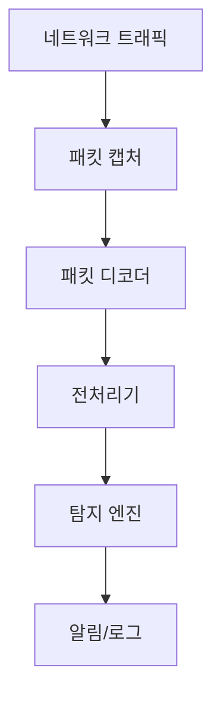

## 1. 개념

**Snort**는 실시간 트래픽 분석과 패킷 로깅을 수행하는 오픈소스 네트워크 침입 탐지/방지 시스템(IDS/IPS)입니다.
사전에 정의된 룰(Signature) 기반으로 패킷을 매칭하여 공격을 탐지하고 차단합니다.

### 기본 정보

| 항목 | 설명 |
|------|------|
| 유형 | NIDS (Network IDS) |
| 탐지 | 시그니처 기반 |
| 모드 | Sniffer, Packet Logger, IDS |

### IDS vs IPS

| 유형 | 동작 | 배치 |
|------|------|------|
| IDS | 탐지 + 알림 | 미러링 (SPAN) |
| IPS | 탐지 + 차단 | 인라인 |

### Snort 동작 방식



---

## 2. 설치 방법

### CentOS/Rocky Linux
```bash
# 의존성 설치
dnf install -y epel-release
dnf install -y gcc gcc-c++ pcre-devel libdnet-devel \
    hwloc-devel libmnl-devel luajit-devel openssl-devel \
    zlib-devel libnghttp2-devel

# DAQ 설치
cd /usr/local/src
wget https://github.com/snort3/libdaq/archive/refs/tags/v3.0.9.tar.gz
tar xzf v3.0.9.tar.gz
cd libdaq-3.0.9
./bootstrap
./configure
make && make install

# Snort 3 설치
cd /usr/local/src
wget https://github.com/snort3/snort3/archive/refs/tags/3.1.x.x.tar.gz
tar xzf 3.1.x.x.tar.gz
cd snort3-3.1.x.x
./configure_cmake.sh --prefix=/usr/local/snort
cd build && make -j$(nproc) && make install
```

### 환경 변수 설정
```bash
echo 'export PATH=$PATH:/usr/local/snort/bin' >> ~/.bashrc
echo '/usr/local/lib' >> /etc/ld.so.conf.d/snort.conf
ldconfig
source ~/.bashrc
```

### 설치 확인
```bash
snort -V
```

---

## 3. Snort 룰 문법

### 기본 구조
```
action protocol src_ip src_port -> dst_ip dst_port (options)
```

### 예시
```snort
alert tcp any any -> $HOME_NET 80 (msg:"HTTP Request"; sid:1000001; rev:1;)
```

### 구성 요소

| 요소 | 설명 | 예시 |
|------|------|------|
| action | 탐지 시 동작 | alert, drop, log |
| protocol | 프로토콜 | tcp, udp, icmp, ip |
| src/dst | 출발/목적지 | any, $HOME_NET |
| port | 포트 | any, 80, 1:1024 |
| direction | 방향 | ->, <> |
| options | 탐지 옵션 | msg, content, sid |

### 주요 옵션

| 옵션 | 설명 |
|------|------|
| msg | 알림 메시지 |
| content | 페이로드 패턴 |
| nocase | 대소문자 무시 |
| sid | 룰 ID (유니크) |
| rev | 룰 버전 |
| classtype | 분류 |
| priority | 우선순위 |

---

## 4. 실습 예시

### SQL Injection 탐지 룰
```snort
alert tcp any any -> $HOME_NET 80 (
    msg:"SQL Injection Attempt";
    content:"SELECT"; nocase;
    content:"FROM"; nocase;
    classtype:web-application-attack;
    sid:1000002; rev:1;
)

alert tcp any any -> $HOME_NET 80 (
    msg:"SQL Injection - OR 1=1";
    content:"' or 1=1"; nocase;
    sid:1000003; rev:1;
)
```

### Nmap 스캔 탐지
```snort
alert tcp any any -> $HOME_NET any (
    msg:"Nmap SYN Scan Detected";
    flags:S;
    threshold:type both, track by_src, count 10, seconds 5;
    sid:1000004; rev:1;
)
```

### 설정 파일 테스트
```bash
snort -c /usr/local/snort/etc/snort/snort.lua --daq-dir /usr/local/lib/daq -T
```

### IDS 모드 실행
```bash
snort -c /usr/local/snort/etc/snort/snort.lua \
      -i eth0 -A alert_fast -l /var/log/snort
```

---

## 5. 트러블슈팅

### 라이브러리 오류
```bash
# 라이브러리 경로 확인
ldconfig -p | grep snort

# LD_LIBRARY_PATH 설정
export LD_LIBRARY_PATH=/usr/local/lib:$LD_LIBRARY_PATH
```

### 룰 문법 오류
```bash
# 상세 오류 확인
snort -c snort.lua -T 2>&1 | less
```

### strace로 디버깅
```bash
strace -f snort -c snort.lua -T
```

<hr class="short-rule">
