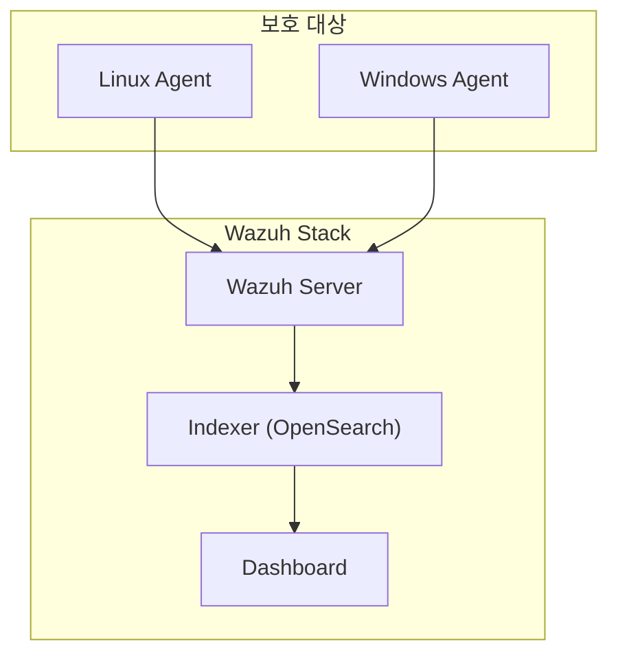

## 1. 개념

**Wazuh**는 로그 분석, 파일 무결성 모니터링, 취약점 탐지 등을 통합한 오픈소스 SIEM 및 XDR 플랫폼입니다.
OSSEC을 기반으로 하며, 엔드포인트의 보안 이벤트를 중앙에서 수집하고 분석하여 위협에 대응합니다.

### 기본 정보

| 항목 | 설명 |
|------|------|
| 기반 | OSSEC 포크 |
| 구성 | Wazuh Server + Agent + Indexer + Dashboard |
| 기능 | 로그 분석, 무결성 점검, 위협 탐지 |

### 주요 기능
- **로그 수집 및 분석**: 중앙 집중식 로그 관리
- **FIM**: 파일 무결성 모니터링
- **취약점 탐지**: CVE 기반 스캔
- **컴플라이언스**: PCI-DSS, HIPAA 등
- **위협 인텔리전스**: MITRE ATT&CK 매핑

### 아키텍처



---

## 2. 설치 방법

### 올인원 설치 (Quick Start)
```bash
# 최소 사양: 4GB RAM, 2 CPU
curl -sO https://packages.wazuh.com/4.7/wazuh-install.sh
sudo bash ./wazuh-install.sh -a
```

### 설치 결과 확인
```bash
# 생성된 비밀번호 확인
tar -O -xvf wazuh-install-files.tar wazuh-install-files/wazuh-passwords.txt
```

### 대시보드 접속
```
https://<server-ip>:443
기본 계정: admin / (설치 시 생성된 비밀번호)
```

---

## 3. Agent 설치

### Linux Agent
```bash
# Wazuh 저장소 추가
curl -s https://packages.wazuh.com/key/GPG-KEY-WAZUH | gpg --deref --output /usr/share/keyrings/wazuh.gpg

# Agent 설치
apt install wazuh-agent

# 매니저 등록
/var/ossec/bin/agent-auth -m <MANAGER_IP>

# 서비스 시작
systemctl enable --now wazuh-agent
```

### Windows Agent
1. MSI 다운로드: `https://packages.wazuh.com/4.x/windows/`
2. 설치 시 Manager IP 입력
3. 서비스 시작

---

## 4. 주요 기능 설정

### 파일 무결성 모니터링 (FIM)
`/var/ossec/etc/ossec.conf`:
```xml
<syscheck>
  <directories check_all="yes">/etc,/usr/bin</directories>
  <directories check_all="yes">/home</directories>
  <frequency>43200</frequency>
</syscheck>
```

### 로그 수집
```xml
<localfile>
  <log_format>syslog</log_format>
  <location>/var/log/secure</location>
</localfile>

<localfile>
  <log_format>apache</log_format>
  <location>/var/log/httpd/access_log</location>
</localfile>
```

### 사용자 정의 룰
`/var/ossec/etc/rules/local_rules.xml`:
```xml
<group name="custom,">
  <rule id="100001" level="10">
    <if_sid>5710</if_sid>
    <srcip>!192.168.1.0/24</srcip>
    <description>SSH login from external network</description>
  </rule>
</group>
```

---

## 5. 대시보드 활용

### Security Events
- 실시간 이벤트 모니터링
- 심각도별 필터링
- MITRE ATT&CK 매핑 확인

### Integrity Monitoring
- 파일 변경 이력
- 추가/삭제/수정 트래킹

### Vulnerability Detection
- Agent별 취약점 목록
- CVE 상세 정보

---

## 6. 트러블슈팅

### Agent 연결 안됨
```bash
# Agent 상태 확인
/var/ossec/bin/wazuh-control status

# Manager에서 Agent 목록
/var/ossec/bin/agent_control -l

# 방화벽 확인 (1514, 1515 포트)
firewall-cmd --list-ports
```

### 로그 수집 안됨
```bash
# ossec.log 확인
tail -f /var/ossec/logs/ossec.log
```

### Elasticsearch/OpenSearch 메모리 부족
```bash
# JVM 힙 크기 조정
vi /etc/wazuh-indexer/jvm.options
-Xms2g
-Xmx2g
```

<hr class="short-rule">
