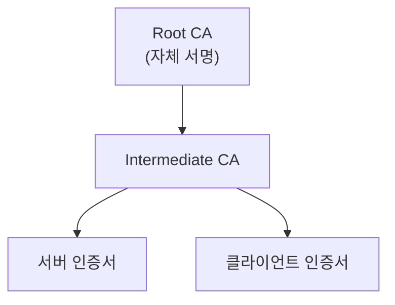

## 1. 개념

**PKI (Public Key Infrastructure)**는 공개키 암호 방식을 이용하여 디지털 인증서를 생성, 관리, 배포하는 보안 인프라입니다.
OpenSSL은 이러한 전자 서명, 인증서(X.509) 발급, 암호화 통신(SSL/TLS) 기능을 제공하는 라이브러리이자 도구입니다.

### 기본 용어

| 용어 | 설명 |
|------|------|
| CA | Certificate Authority (인증 기관) |
| CSR | Certificate Signing Request |
| Private Key | 비밀키 (서명용) |
| Public Key | 공개키 (검증용) |
| X.509 | 인증서 표준 형식 |

### 인증서 체계



---

## 2. OpenSSL 설치

```bash
# 대부분 기본 설치됨
dnf install -y openssl

# 버전 확인
openssl version
```

---

## 3. 사설 CA 구축

### 디렉터리 구조 생성
```bash
mkdir -p /etc/pki/CA/{certs,crl,newcerts,private}
chmod 700 /etc/pki/CA/private
touch /etc/pki/CA/index.txt
echo 1000 > /etc/pki/CA/serial
```

### Root CA 키 생성
```bash
cd /etc/pki/CA

# 4096비트 RSA 키 생성
openssl genrsa -aes256 -out private/ca.key 4096
chmod 400 private/ca.key
```

### Root CA 인증서 생성
```bash
openssl req -config /etc/pki/tls/openssl.cnf \
    -key private/ca.key \
    -new -x509 -days 3650 -sha256 \
    -extensions v3_ca \
    -out certs/ca.crt

# 정보 입력
# Country: KR
# State: Seoul
# Organization: MyCompany
# Common Name: MyCompany Root CA
```

---

## 4. 서버 인증서 발급

### 1) 서버 키 생성
```bash
openssl genrsa -out server.key 2048
```

### 2) CSR 생성
```bash
openssl req -new -key server.key -out server.csr

# Common Name에 도메인 입력
# CN = www.example.com
```

### 3) CA가 CSR 서명 (인증서 발급)
```bash
openssl x509 -req -in server.csr \
    -CA /etc/pki/CA/certs/ca.crt \
    -CAkey /etc/pki/CA/private/ca.key \
    -CAcreateserial \
    -out server.crt \
    -days 365 -sha256
```

### SAN (Subject Alternative Name) 포함
`san.cnf`:
```ini
[req]
distinguished_name = req_distinguished_name
req_extensions = v3_req

[req_distinguished_name]
CN = www.example.com

[v3_req]
subjectAltName = @alt_names

[alt_names]
DNS.1 = www.example.com
DNS.2 = example.com
IP.1 = 192.168.1.10
```

```bash
openssl req -new -key server.key -out server.csr -config san.cnf
openssl x509 -req -in server.csr -CA ca.crt -CAkey ca.key \
    -CAcreateserial -out server.crt -days 365 \
    -extfile san.cnf -extensions v3_req
```

---

## 5. 인증서 확인 및 변환

### 인증서 정보 확인
```bash
# 인증서 내용 확인
openssl x509 -in server.crt -text -noout

# 만료일 확인
openssl x509 -in server.crt -enddate -noout

# CSR 확인
openssl req -in server.csr -text -noout
```

### 형식 변환
```bash
# PEM → DER
openssl x509 -in cert.pem -outform der -out cert.der

# PEM → PKCS#12 (pfx)
openssl pkcs12 -export -out cert.pfx \
    -inkey server.key -in server.crt -certfile ca.crt
```

---

## 6. Apache/Nginx 적용

### Apache
```apache
<VirtualHost *:443>
    SSLEngine on
    SSLCertificateFile /etc/pki/tls/certs/server.crt
    SSLCertificateKeyFile /etc/pki/tls/private/server.key
    SSLCertificateChainFile /etc/pki/tls/certs/ca.crt
</VirtualHost>
```

### Nginx
```nginx
server {
    listen 443 ssl;
    ssl_certificate /etc/pki/tls/certs/server.crt;
    ssl_certificate_key /etc/pki/tls/private/server.key;
}
```

---

## 7. 트러블슈팅

### 인증서 체인 검증
```bash
openssl verify -CAfile ca.crt server.crt
```

### 키-인증서 매칭 확인
```bash
# 해시가 동일해야 함
openssl x509 -noout -modulus -in server.crt | openssl md5
openssl rsa -noout -modulus -in server.key | openssl md5
```

<hr class="short-rule">
