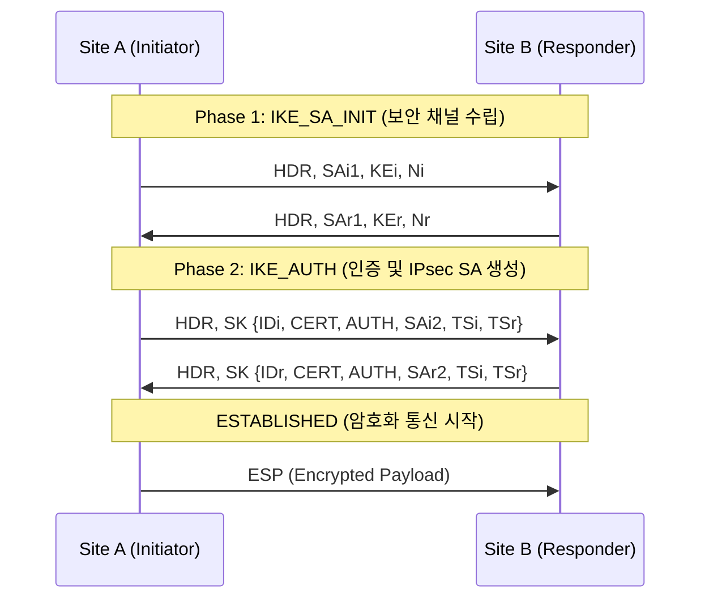

---
layout: post
title: "StrongSwan"
date: 2025-09-02 17:00:00 +0900
categories: [security-solutions]
---

## 1. 개요

**StrongSwan**은 Linux 커널 기반의 완전한 IPsec VPN 구현체로, IKEv1 및 IKEv2 프로토콜을 모두 지원하는 오픈소스 소프트웨어이다.
주로 서로 다른 네트워크를 안전하게 연결하는 **Site-to-Site VPN**이나, 모바일 사용자가 내부망에 접속하기 위한 **Remote Access VPN** 구축에 사용된다.

### 기본 정보
| 항목 | 설명 |
|---|---|
| **프로토콜** | IKEv1, IKEv2 (Internet Key Exchange) |
| **암호화** | AES, 3DES, ChaCha20 등 강력한 암호화 지원 |
| **인증 방식** | PSK(Pre-Shared Key), X.509 인증서, EAP |

### VPN 유형 비교
| 유형 | 설명 | 용도 |
|---|---|---|
| **Site-to-Site** | 두 개의 네트워크(지사-본사)를 터널로 연결 | 사무실 간 연결 |
| **Remote Access** | 개별 사용자가 클라이언트를 통해 접속 (Road Warrior) | 재택 근무 |

### IPsec 동작 흐름 (IKEv2)


---

## 2. 설치 및 환경 설정 (CentOS/Rocky Linux)

### 1) 패키지 설치
EPEL 저장소를 활성화한 후 StrongSwan을 설치한다.
```bash
dnf install -y epel-release
dnf install -y strongswan

# 서비스 상태 확인
systemctl status strongswan
```

### 2) 커널 파라미터 설정 (IP 포워딩)
VPN 라우터 역할을 하려면 패킷 포워딩을 활성화해야 한다.
```bash
# /etc/sysctl.conf 파일 수정
cat <<EOF >> /etc/sysctl.conf
net.ipv4.ip_forward = 1
net.ipv4.conf.all.accept_redirects = 0
net.ipv4.conf.all.send_redirects = 0
EOF

# 설정 적용
sysctl -p
```

---

## 3. Site-to-Site VPN 구축 실습

### 네트워크 구성 시나리오

```
[Site A (본사)] 
Public IP: 1.1.1.1
Internal Network: 192.168.1.0/24
      |
(Internet)
      |
[Site B (지사)]
Public IP: 2.2.2.2
Internal Network: 192.168.2.0/24
```

### Site A 설정 (1.1.1.1)

**1. 설정 파일 (`/etc/strongswan/ipsec.conf`)**
```conf
config setup
    charondebug="ike 2, knl 2, cfg 2"
    # 로그 레벨 설정 (디버깅용)

conn site-to-site
    type=tunnel
    auto=start                  # 데몬 실행 시 자동 연결
    keyexchange=ikev2           # IKE 버전
    authby=secret               # PSK 인증 사용
    
    left=1.1.1.1                # 내 공인 IP
    leftsubnet=192.168.1.0/24   # 내 내부 네트워크
    
    right=2.2.2.2               # 상대방 공인 IP
    rightsubnet=192.168.2.0/24  # 상대방 내부 네트워크
    
    ike=aes256-sha256-modp2048! # IKE 암호화 알고리즘
    esp=aes256-sha256!          # IPsec 암호화 알고리즘
```

**2. 비밀키 파일 (`/etc/strongswan/ipsec.secrets`)**
양쪽 서버가 동일한 비밀키(PSK)를 가져야 한다.
```
1.1.1.1 2.2.2.2 : PSK "MySecureSharedKey123!"
```

### Site B 설정 (2.2.2.2)

**1. 설정 파일 (`/etc/strongswan/ipsec.conf`)**
left와 right가 반대로 설정된다.
```conf
conn site-to-site
    type=tunnel
    auto=start
    keyexchange=ikev2
    authby=secret
    
    left=2.2.2.2                # 내 공인 IP (Site B)
    leftsubnet=192.168.2.0/24
    
    right=1.1.1.1               # 상대방 공인 IP (Site A)
    rightsubnet=192.168.1.0/24
    
    ike=aes256-sha256-modp2048!
    esp=aes256-sha256!
```

**2. 비밀키 파일 (`/etc/strongswan/ipsec.secrets`)**
```
2.2.2.2 1.1.1.1 : PSK "MySecureSharedKey123!"
```

---

## 4. 서비스 실행 및 상태 확인

### 서비스 시작
```bash
systemctl enable --now strongswan
```

### VPN 연결 및 확인 명령어
```bash
# 수동으로 연결 시도 (auto=start 설정 시 불필요)
ipsec up site-to-site

# 연결 상태 상세 확인
ipsec statusall

# 커널 IPsec 정책 확인 (XFRM)
ip xfrm state
ip xfrm policy
```

### 방화벽(Firewall) 오픈
IPsec 통신을 위해 IKE(UDP 500), NAT-T(UDP 4500), ESP 프로토콜을 허용해야 한다.
```bash
firewall-cmd --permanent --add-port=500/udp
firewall-cmd --permanent --add-port=4500/udp
firewall-cmd --permanent --add-protocol=esp
firewall-cmd --reload
```

---

## 5. 트러블슈팅

### 1) 연결이 맺어지지 않을 때
*   **로그 확인**: `journalctl -u strongswan -f` 명령어로 실시간 로그를 보며 에러 메시지를 분석한다 ("NO_PROPOSAL_CHOSEN" 등).
*   **알고리즘 일치**: `ike`, `esp` 설정의 암호화 알고리즘이 양쪽 서버에서 정확히 일치하는지 확인한다.

### 2) "NO_PROPOSAL_CHOSEN" 에러
*   양쪽의 암호화 알고리즘(AES, SHA, DH Group) 제안이 서로 맞지 않아 협상에 실패한 경우이다. 설정 파일의 `ike`, `esp` 라인을 점검한다.

### 3) NAT 환경일 때 (서버가 사설 IP 뒤에 있을 때)
*   **NAT-T(Traversal)**가 필요하므로 UDP 4500 포트가 열려 있어야 한다.
*   설정 파일에서 `leftid`, `rightid`를 공인 IP로 명시적으로 지정해 주어야 한다. (IP 주소 대신 ID로 식별)

<hr class="short-rule">
