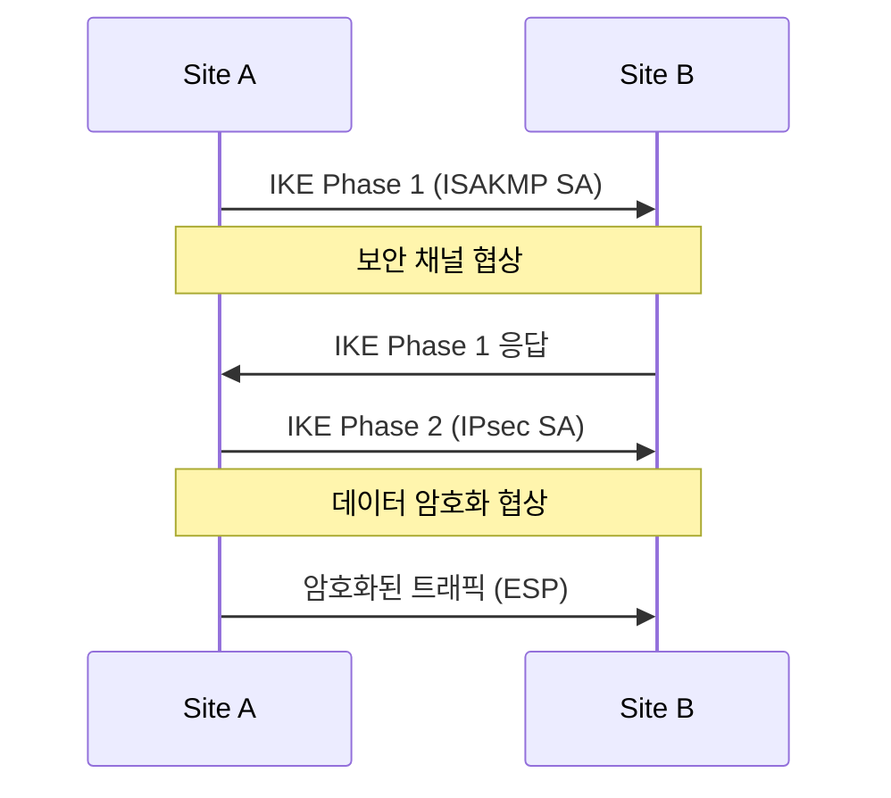

## 1. 개념

**StrongSwan**은 Linux 커널 기반의 완전한 IPsec VPN 구현체로, IKEv1 및 IKEv2 프로토콜을 지원하는 오픈소스 소프트웨어입니다.
주로 지사 간 연결(Site-to-Site)이나 모바일 사용자의 원격 접속(Remote Access) 보안에 사용됩니다.

### 기본 정보
| 항목 | 설명 |
|------|------|
| 프로토콜 | IKEv1, IKEv2 |
| 암호화 | AES, 3DES |
| 인증 | PSK, 인증서, EAP |

### VPN 유형
| 유형 | 설명 |
|------|------|
| Site-to-Site | 네트워크 간 연결 |
| Remote Access (Road Warrior) | 개별 사용자 연결 |

### IPsec 동작 과정



---

## 2. 설치 방법

### CentOS/Rocky Linux
```bash
# StrongSwan 설치
dnf install -y epel-release
dnf install -y strongswan

# 서비스 확인
systemctl status strongswan
```

### 커널 파라미터 설정
```bash
# IP 포워딩 활성화
echo "net.ipv4.ip_forward = 1" >> /etc/sysctl.conf
echo "net.ipv4.conf.all.accept_redirects = 0" >> /etc/sysctl.conf
echo "net.ipv4.conf.all.send_redirects = 0" >> /etc/sysctl.conf
sysctl -p
```

---

## 3. Site-to-Site VPN 설정

### 네트워크 구성
```
Site A: 192.168.1.0/24 - Public IP: 1.1.1.1
Site B: 192.168.2.0/24 - Public IP: 2.2.2.2
```

### Site A 설정
`/etc/strongswan/ipsec.conf`:
```conf
config setup
    charondebug="ike 2, knl 2, cfg 2"

conn site-to-site
    type=tunnel
    left=1.1.1.1
    leftsubnet=192.168.1.0/24
    right=2.2.2.2
    rightsubnet=192.168.2.0/24
    ike=aes256-sha256-modp2048!
    esp=aes256-sha256!
    authby=secret
    auto=start
```

`/etc/strongswan/ipsec.secrets`:
```
1.1.1.1 2.2.2.2 : PSK "MySharedSecretKey12345"
```

### Site B 설정
`/etc/strongswan/ipsec.conf`:
```conf
conn site-to-site
    type=tunnel
    left=2.2.2.2
    leftsubnet=192.168.2.0/24
    right=1.1.1.1
    rightsubnet=192.168.1.0/24
    ike=aes256-sha256-modp2048!
    esp=aes256-sha256!
    authby=secret
    auto=start
```

---

## 4. VPN 시작 및 확인

```bash
# 서비스 시작
systemctl enable --now strongswan

# VPN 연결 시작
ipsec up site-to-site

# 상태 확인
ipsec status
ipsec statusall

# SA 확인
ip xfrm state
ip xfrm policy
```

### 방화벽 설정
```bash
firewall-cmd --permanent --add-port=500/udp    # IKE
firewall-cmd --permanent --add-port=4500/udp   # NAT-T
firewall-cmd --permanent --add-protocol=esp
firewall-cmd --reload
```

---

## 5. 트러블슈팅

### 연결 실패 시
```bash
# 상세 로그 확인
journalctl -u strongswan -f

# 디버그 레벨 증가
# ipsec.conf: charondebug="ike 4, knl 4"
```

### IKE 협상 불일치
- ike=, esp= 설정이 양쪽 동일해야 함
- PSK가 정확히 일치해야 함

### NAT 환경
- UDP 4500 (NAT-T) 사용
- `leftid`, `rightid` 명시 권장

<hr class="short-rule">
