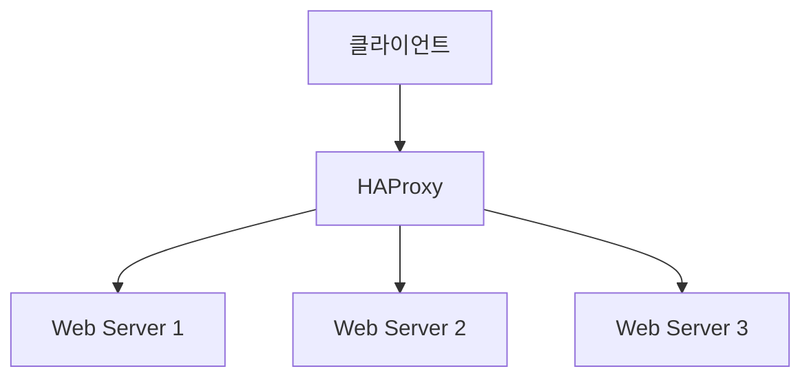

## 1. 개념

**HAProxy**는 높은 가용성과 성능을 제공하는 오픈소스 L4(TCP)/L7(HTTP) 로드 밸런서 및 리버스 프록시 소프트웨어입니다.
수천 개의 동시 연결을 매우 낮은 지연 시간으로 처리할 수 있어 대규모 트래픽 분산에 적합합니다.

### 기본 정보
| 항목 | 설명 |
|------|------|
| 계층 | L4 (TCP) / L7 (HTTP) |
| 특징 | 고성능, SSL 종료, Health Check |
| 용도 | 부하 분산, 고가용성 |

### 로드밸런싱 알고리즘
| 알고리즘 | 설명 |
|----------|------|
| roundrobin | 순차 분배 |
| leastconn | 최소 연결 수 |
| source | 출발지 IP 기반 (세션 고정) |
| uri | URI 해시 기반 |

### 아키텍처



---

## 2. 설치 방법

### CentOS/Rocky Linux
```bash
dnf install -y haproxy
systemctl enable haproxy
```

### 설정 파일 위치
```
/etc/haproxy/haproxy.cfg
```

---

## 3. 설정 방법

### 기본 구조
```cfg
global
    # 전역 설정

defaults
    # 기본 설정

frontend
    # 프론트엔드 (리스너)

backend
    # 백엔드 (서버 풀)
```

### L7 HTTP 로드밸런싱
```cfg
global
    log /dev/log local0
    maxconn 4096
    user haproxy
    group haproxy
    daemon

defaults
    mode http
    log global
    option httplog
    option dontlognull
    timeout connect 5000ms
    timeout client 50000ms
    timeout server 50000ms

frontend http_front
    bind *:80
    default_backend web_servers

backend web_servers
    balance roundrobin
    option httpchk GET /health
    server web1 192.168.1.11:80 check
    server web2 192.168.1.12:80 check
    server web3 192.168.1.13:80 check backup
```

### L4 TCP 로드밸런싱
```cfg
frontend mysql_front
    mode tcp
    bind *:3306
    default_backend mysql_servers

backend mysql_servers
    mode tcp
    balance leastconn
    server db1 192.168.1.21:3306 check
    server db2 192.168.1.22:3306 check backup
```

---

## 4. SSL 종료

```cfg
frontend https_front
    bind *:443 ssl crt /etc/haproxy/certs/combined.pem
    default_backend web_servers
    
    # HTTP로 리다이렉트
    http-request redirect scheme https unless { ssl_fc }
```

### 인증서 준비
```bash
# 키와 인증서 결합
cat server.crt server.key > /etc/haproxy/certs/combined.pem
chmod 600 /etc/haproxy/certs/combined.pem
```

---

## 5. 헬스 체크

### HTTP 헬스 체크
```cfg
backend web_servers
    option httpchk GET /health HTTP/1.1\r\nHost:\ localhost
    http-check expect status 200
    server web1 192.168.1.11:80 check inter 3000 fall 3 rise 2
```

### 헬스 체크 옵션
| 옵션 | 설명 |
|------|------|
| check | 헬스 체크 활성화 |
| inter | 체크 간격 (ms) |
| fall | 실패 횟수 후 down |
| rise | 성공 횟수 후 up |
| backup | 백업 서버 (failover) |

---

## 6. 통계 페이지

```cfg
listen stats
    bind *:8080
    mode http
    stats enable
    stats uri /stats
    stats auth admin:password
    stats refresh 10s
```

접속: `http://<haproxy-ip>:8080/stats`

---

## 7. 실습: Ansible 기반 3-Tier 구축

**HAProxy + Web/WAS + DB**로 구성된 3-Tier 아키텍처를 Ansible을 이용해 자동화하여 구축하는 예시입니다.

### 아키텍처 구성

| 호스트 | IP | 역할 | 소프트웨어 |
|--------|----|------|------------|
| Master | 10.0.0.11 | Load Balancer | HAProxy |
| Node1 | 10.0.0.12 | Web Server | Apache + WordPress |
| Node2 | 10.0.0.13 | WAS | Nginx + WordPress (PHP-FPM) |
| Node3 | 10.0.0.14 | Database | MariaDB |

### Ansible Playbook (`haproxy.yml`)

Ansible을 사용해 HAProxy를 설치하고 설정 파일을 배포합니다.

```yaml
---
- name: Setup HAProxy
  hosts: 10.0.0.11
  gather_facts: no
  tasks:
    - name: Install HAProxy
      yum:
        name: haproxy
        state: present

    - name: Configure HAProxy
      copy:
        dest: /etc/haproxy/haproxy.cfg
        content: |
          global
              log         127.0.0.1 local2
              chroot      /var/lib/haproxy
              pidfile     /var/run/haproxy.pid
              maxconn     4000
              user        haproxy
              group       haproxy
              daemon
          defaults
              mode                    http
              log                     global
              option                  httplog
              option                  dontlognull
              timeout connect         5000ms
              timeout client          50000ms
              timeout server          50000ms

          frontend http_front
              bind *:80
              default_backend web_servers

          backend web_servers
              balance roundrobin
              server node1 10.0.0.12:80 check
              server node2 10.0.0.13:80 check
      notify: Restart HAProxy

  handlers:
    - name: Restart HAProxy
      service:
        name: haproxy
        state: restarted
        enabled: yes
```

### 로드밸런싱 확인

브라우저에서 `http://10.0.0.11`로 접속 시, 새로고침할 때마다 Node1(Apache)과 Node2(Nginx)로 번갈아 연결되는지 확인합니다.

---

## 8. 트러블슈팅

### 설정 검증
```bash
haproxy -c -f /etc/haproxy/haproxy.cfg
```

### 로그 확인
```bash
journalctl -u haproxy -f
```

### SELinux 이슈 (Web 서버)
Web 서버가 DB에 접속하지 못할 때:
```bash
setsebool -P httpd_can_network_connect_db 1
```

<hr class="short-rule">
