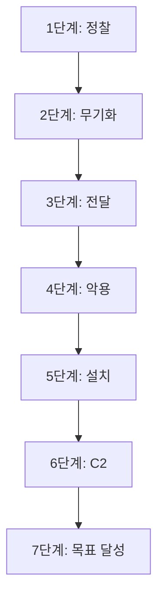

## 1. 개요

공격의 전체 흐름을 설명하기 위해 록히드 마틴의 사이버 킬체인(Cyber Kill Chain) 모델이 사용된다. 킬체인은 공격 과정을 7단계로 정의한다.

> 1.  **정찰 (Reconnaissance):** 공격 대상에 대한 정보를 수집하는 단계. (예: 이메일 주소, 시스템 정보 수집)
> 2.  **무기화 (Weaponization):** 수집한 정보를 바탕으로 악성코드나 익스플로잇 같은 공격 도구를 제작하는 단계.
> 3.  **전달 (Delivery):** 제작된 공격 도구를 이메일, USB 등 다양한 매체를 통해 대상에게 전달하는 단계.
> 4.  **악용 (Exploitation):** 전달된 악성코드가 실행되어 시스템의 취약점을 공격하는 단계.
> 5.  **설치 (Installation):** 공격이 성공한 후, 지속적인 접근을 위해 시스템에 백도어 등 악성 소프트웨어를 설치하는 단계.
> 6.  **명령 및 제어 (Command & Control / C2):** 공격자가 감염된 시스템을 원격으로 제어하기 위해 통신 채널을 구축하는 단계.
> 7.  **목표 달성 (Actions on Objectives):** 내부 정보 유출, 시스템 파괴 등 공격의 최종 목표를 실행하는 단계.

이 모델은 전체 공격 흐름을 이해하는 데 유용하지만 각 단계에서 사용되는 구체적인 공격 기술을 더 상세하게 분류할 필요가 있다.

---

## 2. 킬체인에서 ATT&CK 프레임워크로

MITRE ATT&CK 프레임워크는 킬체인의 개념을 보완하고 구체화한다. 킬체인이 공격의 거시적인 흐름을 순차적으로 보여준다면 ATT&CK는 실제 공격에서 관찰된 구체적인 기술(Techniques)과 전술(Tactics)을 체계적으로 정리한 지식 베이스이다.

특히 초기 침투 이후 시스템 내부에서 발생하는 활동들을 상세하게 분류하고 있어 공격자의 구체적인 행동을 분석하고 그 의도를 파악하는 방법을 공부해보고자 한다.

---

## 3. 핵심 구조: TTPs

ATT&CK는 공격자의 행동을 **TTPs** 즉 **전술(Tactics) · 기술(Techniques) · 절차(Procedures)**라는 세 가지 핵심 요소로 구조화한다.

*   ***전술 (Tactics):*** 공격의 목표 또는 단계를 의미한다. (예: 초기 침투 `Initial Access` · 실행 `Execution` · 계정 정보 접근 `Credential Access`)
*   ***기술 (Techniques):*** 해당 목표를 달성하기 위한 구체적인 방법이다. 각 기술에는 고유한 ID(예: `T1110`)가 부여된다. (예: `Brute Force`)
*   ***절차 (Procedures):*** 특정 공격자가 기술을 사용하는 구체적인 실행 방식을 의미한다. 예를 들면 같은 '무차별 대입' 기술이라도 A는 Hydra 도구를 사용하고 B는 자체 제작 스크립트를 사용할 수 있는데 이처럼 구체적인 실행 내용이 '절차'에 해당한다.

---

## 4. 사용 예시: 학습한 공격 기술 매핑하기

이 프레임워크를 이용하면 이전에 학습한 개별 공격 기술들을 하나의 시나리오로 묶어 체계적으로 정리할 수 있다.

***시나리오: 파일 업로드 취약점을 이용한 웹 서버 공격***

1.  ***웹사이트의 파일 업로드 취약점을 이용해 웹쉘을 업로드했다.***
    *   **전술 (Tactic):** `Initial Access 초기 침투`
    *   **기술 (Technique):** `T1190 - Exploit Public-Facing Application 외부 노출 애플리케이션 취약점 공격`

2.  ***업로드된 웹쉘을 통해 서버에서 시스템 명령어를 실행했다.***
    *   **전술 (Tactic):** `Execution 실행`
    *   **기술 (Technique):** `T1059 - Command and Scripting Interpreter 명령어 및 스크립트 인터프리터`

3.  ***시스템 명령어로 OS 내부에 저장된 계정 정보(패스워드 해시)를 탈취했다.***
    *   **전술 (Tactic):** `Credential Access 계정 정보 접근`
    *   **기술 (Technique):** `T1003 - OS Credential Dumping OS 계정 정보 덤프`

---

## 5. 활용

ATT&CK 프레임워크는 수행한 공격 활동을 분석하는 데 객관적인 기준을 제공한다. 예를 들어 '웹쉘을 업로드했다'는 사실 기록에 더해 이 행동이 ATT&CK 프레임워크 상에서는 **`Initial Access 전술`**에 해당하는 **`Exploit Public-Facing Application (T1190) 기술`**임을 식별하고 분류할 수 있다.

이처럼 ATT&CK는 개별 도구나 행위를 더 큰 공격 흐름의 일부로 이해하고 공격자의 의도를 파악하는 분석의 틀을 제공한다.

