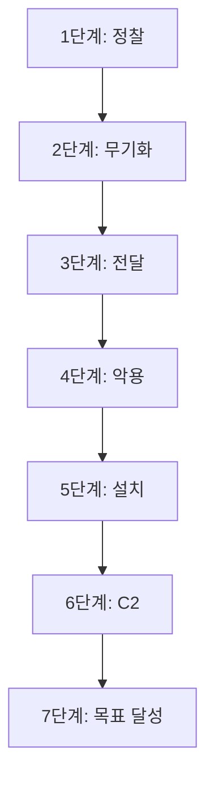

## 1. 개요

**Cyber Kill Chain**은 공격자의 침입 과정을 7단계로 체계화한 모델이며, **MITRE ATT&CK**는 실제 공격 사례를 바탕으로 전술(Tactics)과 기술(Techniques)을 집대성한 지식 베이스이다.
이 두 프레임워크는 방어자가 공격의 흐름을 이해하고, 각 단계별로 효과적인 탐지 및 차단 전략을 수립하는 데 있어 필수적인 기준이 된다.
본 글에서는 킬체인의 기본 개념과 ATT&CK 프레임워크의 핵심 구조인 TTPs를 분석하고, 실제 공격 시나리오를 매핑해보며 활용 방법을 다룬다.

---

## 2. Cyber Kill Chain 모델

록히드 마틴이 정의한 사이버 킬체인은 공격 과정을 다음 7단계로 정의한다.

1.  **정찰 (Reconnaissance)**: 공격 대상에 대한 정보를 수집하는 단계 (예: 이메일 수집, OS 탐지)
2.  **무기화 (Weaponization)**: 수집한 정보를 바탕으로 악성코드나 익스플로잇 도구를 제작하는 단계
3.  **전달 (Delivery)**: 제작된 공격 도구를 이메일, USB 등을 통해 대상에게 전달하는 단계
4.  **악용 (Exploitation)**: 전달된 악성코드가 실행되어 시스템의 취약점을 트리거하는 단계
5.  **설치 (Installation)**: 지속적인 접근을 위해 백도어 등을 설치하는 단계
6.  **명령 및 제어 (C2)**: 공격자가 원격 제어를 위해 통신 채널을 구축하는 단계
7.  **목표 달성 (Actions on Objectives)**: 데이터 유출, 파괴 등 공격의 최종 목표를 실행하는 단계



이 모델은 전체적인 공격 라이프사이클을 이해하는 데 유용하지만, 내부망 침투 이후의 구체적인 행위를 설명하는 데에는 한계가 있다.

---

## 3. TTPs 구조

**MITRE ATT&CK**는 킬체인의 한계를 보완하여 공격자의 행동을 **TTPs**라는 세 가지 핵심 요소로 구조화한다.

*   **전술 (Tactics)**: 공격의 목표 또는 단계 (Why). 예: 초기 침투(`Initial Access`), 실행(`Execution`)
*   **기술 (Techniques)**: 목표를 달성하기 위한 구체적인 방법 (How). 각 기술에는 고유 ID가 부여된다. 예: `Brute Force (T1110)`
*   **절차 (Procedures)**: 특정 공격자가 기술을 사용하는 구체적인 실행 방식 (Details). 예: "APT29 그룹이 Hydra 툴을 사용해 SSH 비밀번호를 무차별 대입함"

---

## 4. 실습 환경

### MITRE ATT&CK Navigator
공격 시나리오를 시각적으로 매핑할 수 있는 웹 도구이다.
*   [https://mitre-attack.github.io/attack-navigator/](https://mitre-attack.github.io/attack-navigator/)

### Atomic Red Team
개별 ATT&CK 기술을 실제로 실행해볼 수 있는 테스트 프레임워크이다.
```powershell
# Windows에서 설치
Install-Module -Name AtomicRedTeam -Force
```

---

## 5. 실습: 공격 기술 매핑

이전에 학습한 개별 공격 기술들을 ATT&CK 프레임워크에 매핑하여 시나리오로 정리해 본다.

**[시나리오: 파일 업로드 취약점을 이용한 웹 서버 장악]**

1.  **웹사이트의 파일 업로드 취약점을 이용해 웹쉘을 업로드했다.**
    *   **전술**: `Initial Access (초기 침투)`
    *   **기술**: `T1190 - Exploit Public-Facing Application`

2.  **업로드된 웹쉘을 통해 서버에서 시스템 명령어를 실행했다.**
    *   **전술**: `Execution (실행)`
    *   **기술**: `T1059 - Command and Scripting Interpreter`

3.  **시스템 명령어로 OS 내부에 저장된 계정 정보(패스워드 해시)를 탈취했다.**
    *   **전술**: `Credential Access (계정 정보 접근)`
    *   **기술**: `T1003 - OS Credential Dumping`

---

## 6. 결론: 프레임워크 활용 가치

ATT&CK 프레임워크는 단순히 공격 기술을 나열한 것이 아니라, 공격자의 행동을 객관적으로 분류하고 분석할 수 있는 언어를 제공한다.
방어자는 이를 통해 "웹쉘이 업로드되었다"는 현상을 넘어, 이것이 `Initial Access` 단계의 `T1190` 기술임을 식별하고, 이에 대응하는 탐지 규칙(예: 웹 서버 프로세스의 쉘 실행 탐지)을 체계적으로 수립할 수 있다.

---

## 7. 방어 대책 (단계별 탐지 전략)

| 킬체인 단계 | 탐지 방법 | 예시 룰 |
|------------|----------|--------|
| **정찰** | 이상 웹 크롤링 탐지 | WAF 로그, DNS 쿼리 분석 |
| **전달** | 메일 첨부파일 검사 | 샌드박스 분석, YARA 룰 |
| **악용** | 취약점 익스플로잇 탐지 | IDS/IPS 시그니처 |
| **설치** | 레지스트리/파일 변경 모니터링 | Sysmon, EDR |
| **C2** | 이상 아웃바운드 통신 탐지 | 프록시 로그, Zeek |
| **목표 달성** | 데이터 유출 탐지 | DLP 솔루션 |

<hr class="short-rule">