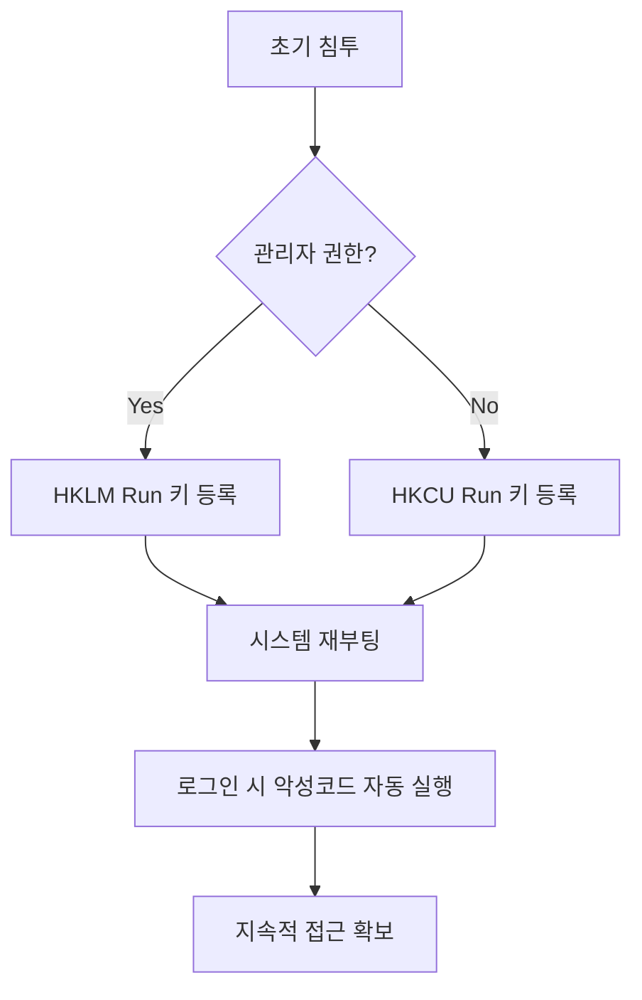

## 1. 개요

**지속성(Persistence)**은 공격자가 시스템에 초기 침투한 후, 재부팅이나 사용자 로그오프 등의 이벤트가 발생하더라도 시스템에 대한 접근 권한을 유지하기 위해 사용하는 핵심 기술이다.
윈도우 환경에서 가장 고전적이면서도 널리 사용되는 방법은 **레지스트리 Run 키**에 악성 프로그램을 등록하는 것이다.

**MITRE ATT&CK**: [T1547.001 - Boot or Logon Autostart Execution: Registry Run Keys](https://attack.mitre.org/techniques/T1547/001/)

---

## 2. 공격 흐름



---

## 3. 실습 환경

### Windows VM
*   **Windows 10/11 VM**: VirtualBox나 VMware로 구성
*   **Windows Sandbox**: 고립된 테스트 환경으로 적합

### Sysinternals Suite
탐지 및 분석을 위한 필수 도구 모음이다.
```powershell
# Autoruns 다운로드
Invoke-WebRequest -Uri "https://live.sysinternals.com/autoruns.exe" -OutFile autoruns.exe
```

---

## 4. 주요 레지스트리 경로

### HKCU (현재 사용자)
```
HKEY_CURRENT_USER\Software\Microsoft\Windows\CurrentVersion\Run
HKEY_CURRENT_USER\Software\Microsoft\Windows\CurrentVersion\RunOnce
```
*   **관리자 권한 불필요** → 공격자가 가장 선호
*   현재 로그인한 사용자에게만 영향

### HKLM (로컬 머신)
```
HKEY_LOCAL_MACHINE\SOFTWARE\Microsoft\Windows\CurrentVersion\Run
HKEY_LOCAL_MACHINE\SOFTWARE\Microsoft\Windows\CurrentVersion\RunOnce
```
*   **관리자 권한 필요**
*   모든 사용자에게 영향

> **Run vs RunOnce**: Run은 매번 실행, RunOnce는 한 번 실행 후 자동 삭제

---

## 5. 공격 실습

### 레지스트리 등록 (CMD)
```cmd
reg add "HKCU\Software\Microsoft\Windows\CurrentVersion\Run" /v MyBackdoor /t REG_SZ /d "C:\Temp\evil.exe" /f
```

### 레지스트리 등록 (PowerShell)
```powershell
Set-ItemProperty -Path "HKCU:\Software\Microsoft\Windows\CurrentVersion\Run" -Name "MyBackdoor" -Value "C:\Temp\evil.exe"
```

### 등록 확인
```cmd
reg query "HKCU\Software\Microsoft\Windows\CurrentVersion\Run"
```


---

## 6. 탐지 방법

### Autoruns (Sysinternals)
```cmd
autorunsc.exe -accepteula -a * -c -h -s -v -vt
```
*   서명되지 않은(Unsigned) 항목
*   의심스러운 경로 (Temp, AppData)

### PowerShell 조회
```powershell
Get-ItemProperty -Path "HKCU:\Software\Microsoft\Windows\CurrentVersion\Run"
Get-ItemProperty -Path "HKLM:\Software\Microsoft\Windows\CurrentVersion\Run"
```

---

## 7. 보안 대책

*   **Autoruns 정기 점검**: 서명되지 않은 자동 실행 항목 식별
*   **레지스트리 접근 제어**: 일반 사용자의 불필요한 레지스트리 수정 제한
*   **EDR/백신 탐지**: `cmd.exe`, `powershell.exe`가 Run 키에 쓰기 작업 시 탐지
*   **파일 무결성 검사**: 중요 시스템 설정 변경 모니터링

<hr class="short-rule">
