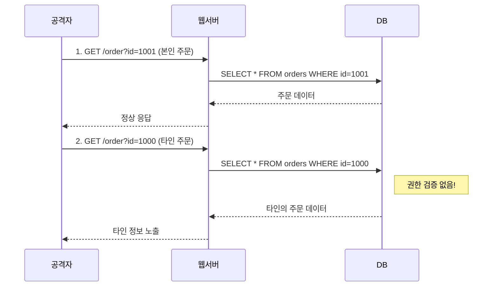

---
layout: post
title: "IDOR"
date: 2025-08-25 17:00:00 +0900
categories: [web-hacking]
tags: [IDOR, Access Control, Web Hacking, Burp Suite, OWASP Top 10]
description: "IDOR(Insecure Direct Object References) 취약점의 원리, 공격 시나리오 및 방어 코드 예시"
---

## 1. 개요

**IDOR (Insecure Direct Object References)**는 웹 애플리케이션이 사용자의 권한을 검증하지 않고, 사용자가 입력한 파라미터(객체 참조값)를 신뢰하여 데이터베이스나 파일에 접근할 때 발생하는 취약점이다.

공격자는 단순히 ID 값을 변경하는 것만으로 타인의 중요 데이터(게시글, 프로필, 주문 내역 등)를 무단으로 열람하거나 수정할 수 있다.

---

## 2. 위험도

| 항목 | 값 |
|------|-----|
| **OWASP Top 10** | A01:2025 - Broken Access Control |
| **CWE** | CWE-639 (Authorization Bypass Through User-Controlled Key) |
| **CVSS** | 6.5 ~ 9.8 (Medium ~ Critical) |

---

## 3. 공격 유형

### Horizontal IDOR

**같은 권한 수준**의 다른 사용자 데이터에 접근하는 공격이다.
*   일반 사용자 A → 일반 사용자 B의 주문 내역 열람
*   파라미터: `user_id`, `order_id`, `document_id`

> **공격 흐름**: 공격자가 자신의 주문 조회 URL `/order?id=1001` 에서 `id=1000`으로 변경 → 타인의 주문 정보 노출.

**IDOR 공격 흐름:**


---

### Vertical IDOR

**더 높은 권한**(예: 관리자)의 데이터나 기능에 접근하는 공격이다.
*   일반 사용자 → `role=admin` 조작으로 관리자 대시보드 접근
*   파라미터: `role`, `is_admin`, `access_level`

> **공격 흐름**: 일반 사용자가 `/admin?user_id=1`을 `/admin?user_id=0` (관리자 ID)으로 변경하여 관리자 페이지 접근 시도.

---

## 4. 공격 실습: Burp Suite

### Repeater를 이용한 파라미터 변조
1.  정상 요청을 Intercept 하여 Repeater(`Ctrl+R`)로 보냄
2.  `user_id`, `document_id` 등을 다른 값으로 변경
3.  `Send` 후 응답 확인
    *   **취약함**: 다른 사용자 정보가 보이거나 `200 OK` 반환
    *   **안전함**: `403 Forbidden` 또는 `401 Unauthorized` 반환


### Intruder를 이용한 자동화
숫자 범위(1~1000)를 자동으로 대입하여 유효한 ID를 탐색한다.

---

## 5. 보안 고려사항

IDOR는 애플리케이션 로직 레벨에서 발생하므로, WAF나 시큐어 코딩 가이드만으로는 완전히 방어하기 어렵다. **모든 데이터 접근에 소유권 검증**이 필수이다.

### 5.1. 공격 시연 (Lab 환경)

#### 공격 1: Horizontal IDOR - 타인 주문 정보 열람

**[취약한 환경]**
*   주문 조회 API가 `order_id`만으로 조회
*   사용자 소유권 검증 없음

**[공격 과정]**
```http
# 1. 본인 주문 조회 (정상)
GET /api/orders/1001 HTTP/1.1
Cookie: session=user_a_token

# 응답: {"order_id": 1001, "user": "A", "items": [...], "address": "서울시..."}

# 2. 타인 주문 조회 (공격)
GET /api/orders/1000 HTTP/1.1
Cookie: session=user_a_token

# 응답: {"order_id": 1000, "user": "B", "items": [...], "address": "부산시..."}
# → 타인의 주소, 전화번호, 구매 내역 노출!
```

**[공격 결과]**: ID 변경만으로 타인 데이터 접근 🔓

---

#### 공격 2: Vertical IDOR - 관리자 권한 획득

**[취약한 환경]**
*   관리자 페이지 접근 시 `user_id` 파라미터로 권한 확인
*   클라이언트에서 전달된 값을 신뢰

**[공격 과정]**
```http
# 1. 일반 사용자 대시보드 접근
GET /dashboard?user_id=500 HTTP/1.1
# 응답: 일반 사용자 페이지

# 2. 관리자 ID로 변경 (공격)
GET /dashboard?user_id=1 HTTP/1.1
# 응답: 관리자 대시보드 노출!

# 3. 또는 role 파라미터 조작
POST /api/profile HTTP/1.1
{"user_id": 500, "role": "admin"}  ← 권한 상승
```

**[공격 결과]**: 파라미터 조작으로 관리자 권한 획득 🔓

---

#### 공격 3: Mass Assignment - 숨겨진 필드 수정

**[취약한 환경]**
*   API가 요청 본문을 그대로 DB에 저장
*   `is_admin`, `balance` 같은 민감 필드도 수정 가능

**[공격 과정]**
```http
# 1. 정상적인 프로필 수정 요청
PUT /api/users/500 HTTP/1.1
{"name": "홍길동", "email": "hong@example.com"}

# 2. 숨겨진 필드 추가 (공격)
PUT /api/users/500 HTTP/1.1
{"name": "홍길동", "is_admin": true, "balance": 9999999}
# → 서버가 검증 없이 모든 필드를 저장하면 권한 상승 + 잔액 조작!
```

**[공격 결과]**: 클라이언트가 보내지 않아야 할 필드 조작 🔓

---

### 5.2. 방어 대책

| 공격 | 방어 |
|:---|:---|
| Horizontal IDOR | 방어 1, 2 |
| Vertical IDOR | 방어 2, 3 |
| Mass Assignment | 방어 4 |

---

#### 방어 1: 소유권 검증 (필수)

모든 데이터 접근 시 세션의 사용자 ID와 리소스 소유자를 비교한다.

**취약한 코드:**
```php
$id = $_GET['id'];
$data = $db->query("SELECT * FROM orders WHERE id = $id");
```

**안전한 코드:**
```php
$id = $_GET['id'];
$current_user_id = $_SESSION['user_id'];

// 조회 조건에 사용자 ID 포함
$data = $db->query("SELECT * FROM orders WHERE id = $id AND user_id = $current_user_id");

if (!$data) {
    http_response_code(403);
    die("접근 권한이 없습니다.");
}
```

---

#### 방어 2: 참조값 난독화

순차적 ID(`1001, 1002`) 대신 추측 불가능한 UUID를 사용한다.

```php
// 순차적 ID 대신 UUID 사용
$order_id = bin2hex(random_bytes(16));  // e.g., "a3f8b2c4d5e6f7a8b9c0d1e2f3a4b5c6"

// URL: /orders/a3f8b2c4d5e6f7a8b9c0d1e2f3a4b5c6
```

> ⚠️ **주의**: UUID만으로는 불충분! 반드시 **소유권 검증(방어 1)**과 병행해야 한다.

---

#### 방어 3: 서버 측 권한 검증

클라이언트에서 전달된 `role`, `is_admin` 같은 값을 절대 신뢰하지 않는다.

```php
// ❌ 잘못된 방식: 클라이언트 값 신뢰
$role = $_POST['role'];

// ✅ 올바른 방식: 세션/DB에서 권한 확인
$user = $db->query("SELECT role FROM users WHERE id = ?", [$_SESSION['user_id']]);
if ($user['role'] !== 'admin') {
    http_response_code(403);
    die("관리자 권한이 필요합니다.");
}
```

---

#### 방어 4: 화이트리스트 필드 검증

API가 수정 가능한 필드를 명시적으로 제한한다.

```php
// Mass Assignment 방어
$allowed_fields = ['name', 'email', 'phone'];
$input = array_intersect_key($_POST, array_flip($allowed_fields));

// $input에는 허용된 필드만 포함됨
$db->update('users', $input, ['id' => $_SESSION['user_id']]);
```

```python
# Django/Flask: Serializer에서 read_only 필드 지정
class UserSerializer(serializers.ModelSerializer):
    class Meta:
        model = User
        fields = ['name', 'email', 'is_admin']
        read_only_fields = ['is_admin']  # 수정 불가
```

---

## 6. 실습 환경

### DVWA
```bash
docker run -d -p 80:80 vulnerables/web-dvwa
```
*   Insecure CAPTCHA, Authorisation Bypass 메뉴에서 실습

### Juice Shop
```bash
docker run -d -p 3000:3000 bkimminich/juice-shop
```
*   OWASP Juice Shop: 다양한 IDOR 챌린지 포함

---

## OWASP Top 10 매핑

| 관련 항목 | 설명 |
|----------|------|
| **A01: Broken Access Control** | 권한이 없는 사용자가 다른 사용자의 리소스에 접근하는 접근 제어 실패 사례이다. |

<hr class="short-rule">
