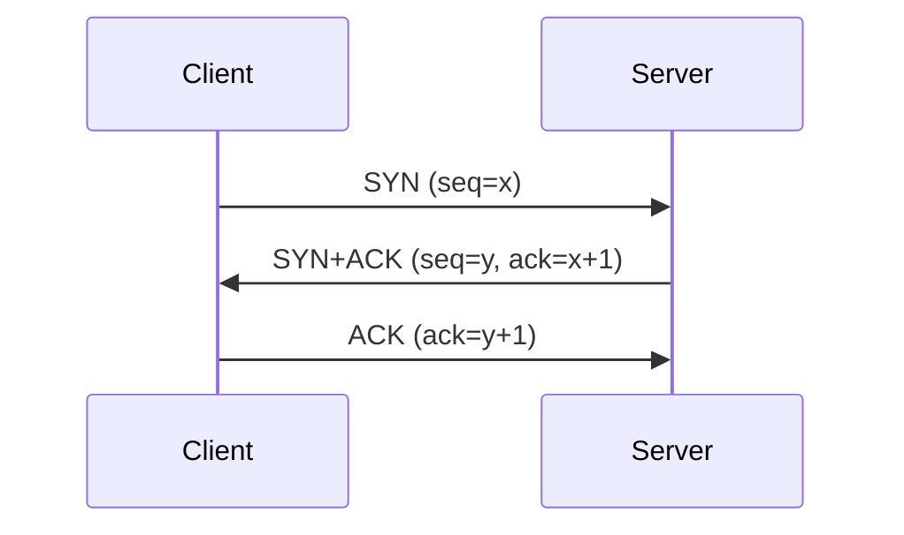

## 1. 개요

TCP 핸드셰이크는 신뢰성 있는 통신을 위해 연결을 설정하고 해제하는 절차를 정의한 과정이다.

TCP는 신뢰성 있는 데이터 전송을 보장하는 프로토콜이며 이 신뢰성을 확보하기 위한 절차가 바로 Handshake 과정이다. **`3-way Handshake`**는 통신을 시작하기 전에 클라이언트와 서버가 서로 통신할 준비가 되었는지 확인하는 과정이며 **`4-way Handshake`**는 통신을 정상적으로 종료하기 위해 서로의 의사를 확인하는 절차이다. 이 과정은 모든 TCP 기반 통신에 적용된다.

---

## 2. 동작 원리

#### ***3-way Handshake (연결 수립)***
클라이언트와 서버는 총 3번의 패킷을 주고받으며 연결을 설정한다.

1.  ***[Client → Server] SYN (Synchronize)***
    *   클라이언트가 서버에 접속을 요청하며 `SYN` 패킷을 보낸다. 이때 통신에 사용할 임의의 시퀀스 번호(예: `seq=x`)를 함께 보낸다.
2.  ***[Server → Client] SYN + ACK (Acknowledge)***
    *   서버는 클라이언트의 요청을 받고 통신을 수락한다는 의미로 `SYN`과 `ACK`를 함께 보낸다.
    *   `ACK`에는 클라이언트가 보낸 시퀀스 번호에 1을 더한 값(`ack=x+1`)을 담아 "당신의 요청을 잘 받았다"고 응답한다.
    *   `SYN`에는 서버가 사용할 임의의 시퀀스 번호(예: `seq=y`)를 담아 보낸다.
3.  ***[Client → Server] ACK***
    *   클라이언트는 서버의 응답을 받고 서버가 보낸 시퀀스 번호에 1을 더한 값(`ack=y+1`)을 `ACK`에 담아 보낸다.
    *   이 패킷을 받은 서버는 연결이 완전히 수립되었다고 판단하고 데이터 통신을 시작한다.

#### ***4-way Handshake (연결 종료)***
연결 종료는 총 4번의 패킷을 주고받으며 이루어진다.

1.  ***[Client → Server] FIN (Finish)***
    *   클라이언트가 서버에 연결을 종료하고 싶다는 의사를 `FIN` 패킷에 담아 보낸다.
2.  ***[Server → Client] ACK***
    *   서버는 클라이언트의 종료 요청을 받았다는 의미로 `ACK`를 보낸다. 이 상태에서 서버는 아직 보낼 데이터가 남아있다면 마저 전송할 수 있다.
3.  ***[Server → Client] FIN***
    *   서버가 모든 데이터 전송을 마치고 연결을 종료할 준비가 되면 클라이언트에게 `FIN` 패킷을 보낸다.
4.  ***[Client → Server] ACK***
    *   클라이언트는 서버의 종료 요청을 받았다는 `ACK`를 보낸다. 이 패킷을 받은 서버는 연결을 완전히 종료한다. 클라이언트는 일정 시간(TIME_WAIT) 동안 대기한 후 접속을 최종적으로 닫는다.

    하지만 실제 네트워크에서는 서버가 클라이언트의 FIN 요청을 받았을 때 더 이상 보낼 데이터가 없는 경우가 대부분이다. 이런 경우, 서버는 2번(ACK)과 3번(FIN) 과정을 **하나의 `[FIN, ACK]` 패킷으로 합쳐서 보내** 통신을 더 효율적으로 종료한다.

---

## 3. 보안 관점에서의 의미

*   ***SYN Flooding (DoS 공격):***
    공격자는 3-way Handshake의 1단계인 `SYN` 패킷만 대량으로 보내고 마지막 `ACK`를 보내지 않아 서버가 수많은 연결을 미완성 상태(Half-Open)로 유지하게 만든다. 이로 인해 서버의 연결 자원이 고갈되어 정상적인 사용자의 접속을 막는 서비스 거부(DoS) 공격이 발생한다.

*   ***Nmap 스캔 원리:***
    *   ***TCP Connect Scan (`-sT`):*** Nmap은 완전한 3-way Handshake를 수행하여 연결을 수립한다. 연결이 성공하면 포트가 열린 것(Open)으로 판단한다. 이 방식은 로그에 명확한 기록을 남긴다.
    *   ***SYN Scan (`-sS`, Stealth Scan):*** Nmap은 `SYN` 패킷만 보내고 서버로부터 `SYN+ACK` 응답을 받으면 포트가 열렸다고 판단한 뒤, 마지막 `ACK`를 보내지 않고 `RST`(Reset)를 보내 연결을 끊는다. Handshake를 완료하지 않으므로 로그에 잘 남지 않아 더 은밀한 스캔이 가능하다.

