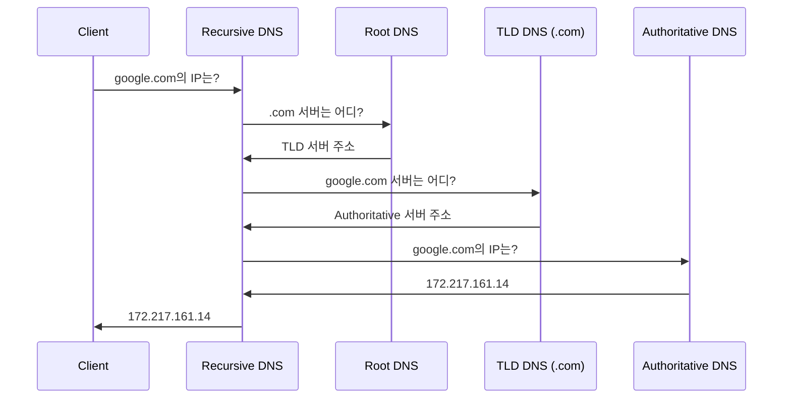

---
layout: post
title: "DNS"
date: 2025-08-11 17:00:00 +0900
categories: [web-technology]
---

## 1. 개요

DNS는 사람이 기억하기 쉬운 도메인 이름(예: **`google.com`**)을 컴퓨터가 통신하는 데 사용하는 IP 주소(예: **`172.217.161.14`**)로 변환해주는 시스템이다. 인터넷의 주소록 역할을 하며 DNS가 없다면 우리는 모든 웹 사이트의 IP 주소를 직접 외워서 입력해야 한다.

---

## 2. 동작 원리 (DNS Query 과정)

   
사용자가 브라우저에 도메인 이름을 입력하면 PC는 IP 주소를 찾기 위해 아래와 같은 과정을 거친다.

1.  **로컬 캐시 확인:** PC 내부에 해당 도메인의 IP 주소 기록이 있는지 먼저 확인한다.
2.  **Recursive DNS 서버에 질의:** 캐시에 정보가 없으면 통신사나 사용자가 직접 설정한 DNS 서버(**`Recursive DNS`** 예: KT DNS, Google DNS `8.8.8.8`)에게 물어본다.
3.  **Root DNS 서버에 질의:** Recursive DNS 서버는 전 세계에 13개가 있는 **`Root DNS`** 서버에게 `.com` 주소를 관리하는 서버가 어디인지 물어본다.
4.  **TLD DNS 서버에 질의:** Root 서버로부터 응답받은 **`.com` TLD 서버**에게 `google.com`을 관리하는 서버가 어디인지 물어본다.
5.  **Authoritative DNS 서버에 질의:** TLD 서버로부터 응답받은 `google.com`의 **`Authoritative Name Server`**(실제 도메인 정보가 저장된 서버)에게 최종적으로 `google.com`의 IP 주소를 물어본다.
6.  **응답 및 캐싱:** 최종 IP 주소 정보를 받아 PC에 전달하고 Recursive DNS 서버는 이 정보를 일정 시간 동안 저장(캐싱)하여 다음 요청에 빠르게 응답한다.

---

## 3. 주요 레코드 타입

DNS 서버에는 도메인에 대한 다양한 정보가 레코드 형태로 저장된다.

*   **`A`**: 도메인에 연결된 IPv4 주소.
*   **`AAAA`**: 도메인에 연결된 IPv6 주소.
*   **`CNAME`**: 특정 도메인을 다른 도메인의 별칭으로 지정.
*   **`MX`**: 메일을 수신하는 메일 서버의 주소.
*   **`TXT`**: 임의의 텍스트 정보. SPF(메일 발송 서버 인증), DKIM(메일 서명) 등 보안 설정에 주로 사용된다.

---

## 4. 보안 고려사항

*   ***정찰 (Reconnaissance):***
    공격의 첫 단계에서 DNS는 타겟의 인프라 정보를 수집하는 핵심적인 수단이 된다. **`nslookup`** **`dig`** 같은 도구로 서브도메인(`dev.company.com`, `mail.company.com`)을 찾거나 MX/TXT 레코드를 분석하여 사용하는 메일 시스템이나 클라우드 서비스 정보를 유추할 수 있다.

*   ***DNS 스푸핑 (Spoofing) 및 캐시 포이즈닝 (Cache Poisoning):***
    공격자가 DNS 질의 응답 과정을 가로채거나 Recursive DNS 서버의 캐시를 오염시켜 사용자가 정상적인 도메인으로 접속해도 가짜 IP 주소(피싱 사이트)로 연결되도록 만드는 공격이다.

*   ***DNS 하이재킹 (Hijacking):***
    도메인 등록 기관의 계정을 탈취하거나 DNS 서버 자체를 해킹하여 도메인의 네임서버`Authoritative DNS` 정보를 공격자의 서버로 변경해버리는 공격이다. 해당 도메인으로의 모든 트래픽을 공격자가 가로챌 수 있다.

*   ***DNS 터널링 (Tunneling):***
    내부망에서 외부로의 통신이 방화벽에 의해 엄격히 통제될 때 DNS 질의를 이용하여 데이터를 외부로 유출하거나 외부에서 명령을 수신하는 고급 공격 기법이다. 방화벽은 보통 53번 포트의 DNS 트래픽을 허용하기 때문에 이를 악용한다.

