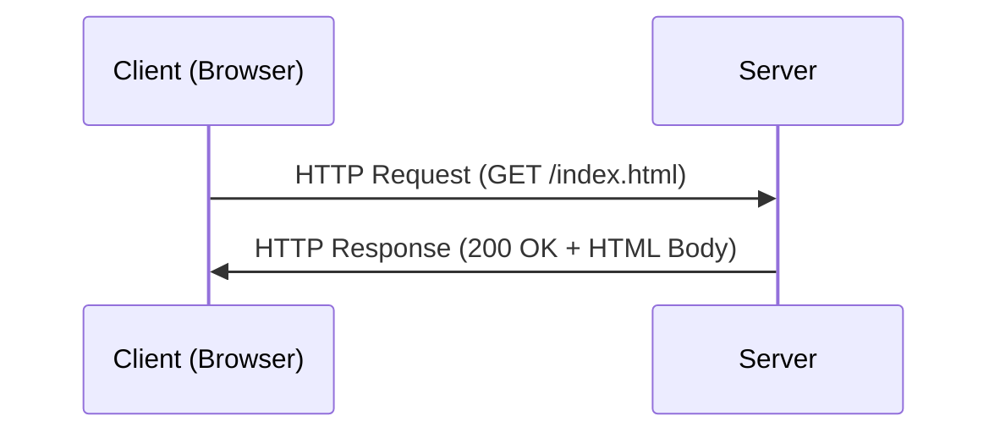

---
layout: post
title: "HTTP"
date: 2025-08-12 17:00:00 +0900
categories: [web-technology]
---

## 1. 개요

HTTP는 웹 브라우저와 웹 서버가 데이터를 주고받기 위해 사용하는 통신 규칙이다.

HTTP(HyperText Transfer Protocol)는 월드 와이드 웹(WWW)에서 데이터를 주고받기 위한 프로토콜로, 클라이언트와 서버가 어떻게 통신해야 하는지에 대한 규칙의 집합이다. HTTP는 상태를 저장하지 않는(Stateless) 특성이 있어 각 요청은 이전 요청과 독립적으로 처리된다. 서버는 이전 요청을 기억하지 않기 때문에 로그인 상태 등을 유지하기 위해 쿠키(Cookie)나 세션(Session) 같은 기술이 사용된다.

#### ***HTTP vs HTTPS***
*   **HTTP**: 데이터가 평문으로 전송되어 네트워크 감청(Sniffing) 시 내용이 그대로 노출된다.
*   **HTTPS**: HTTP에 TLS/SSL 암호화 계층을 추가하여 전송 중인 데이터를 보호한다. 포트 443을 사용한다.

---

## 2. HTTP 메시지 구조

HTTP 통신은 요청(Request)과 응답(Response) 메시지로 구성된다. 이 메시지 구조를 이해하는 것은 Burp Suite로 패킷을 분석할 때 가장 기본이 된다.

   

#### ***요청 메시지 (Request)***
1.  ***시작 줄 (Start Line)***: 요청의 종류 · 대상 · 프로토콜 버전을 나타낸다.
    *   `POST /dvwa/login.php HTTP/1.1`
2.  ***헤더 (Headers)***: 요청에 대한 부가 정보를 담는 키-값 쌍이다.
    *   `Host`: 요청을 보내는 서버의 도메인.
    *   `User-Agent`: 요청을 보낸 클라이언트(브라우저)의 정보.
    *   `Cookie`: 서버에 저장된 쿠키 값.
3.  ***본문 (Body)***: 서버로 전송할 실제 데이터. `POST` 메서드에서 주로 사용된다.

#### ***응답 메시지 (Response)***
1.  ***상태 줄 (Status Line)***: 프로토콜 버전 · 상태 코드 · 상태 텍스트를 나타낸다.
    *   ``HTTP/1.1 302 Found`
2.  ***헤더 (Headers)***: 응답에 대한 부가 정보를 담는다.
    *   `Content-Type`: 응답 본문의 데이터 타입. (예: `text/html`)
    *   `Set-Cookie`: 클라이언트에게 쿠키를 설정하라는 명령.
3.  ***본문 (Body)***: 클라이언트에게 전송할 실제 데이터. 클라이언트가 다른 위치로 이동해야 함을 의미하는 `302`응답의 경우 보통 본문이 비어있다.

---

## 3. 주요 HTTP 메서드

*   ***GET***: 서버로부터 정보를 요청할 때 사용한다. 데이터가 URL의 쿼리 스트링에 포함되어 전송된다. (예: `?id=1`)
*   ***POST***: 서버에 데이터를 제출할 때 사용한다. 데이터가 요청 본문에 담겨 전송되므로 GET보다 보안성이 높고 대용량 데이터를 보내기에 적합하다.

---

## 4. 주요 HTTP 상태 코드

*   **2xx (성공)**: 요청이 성공적으로 처리됨.
    *   `200 OK`: 요청 성공.
*   **3xx (리다이렉션)**: 요청을 완료하기 위해 추가적인 행동이 필요함.
    *   `302 Found`: 요청한 리소스가 일시적으로 다른 URL로 이동됨. (로그인 성공 후 메인 페이지로 이동 시)
*   **4xx (클라이언트 오류)**: 클라이언트의 요청에 오류가 있음.
    *   `403 Forbidden`: 서버가 요청을 거부함. (권한 없음)
    *   `404 Not Found`: 요청한 리소스를 찾을 수 없음.
*   **5xx (서버 오류)**: 서버 측에 문제가 발생함.
    *   `500 Internal Server Error`: 서버 내부 오류. 공격자에게 중요한 정보가 될 수 있다.

---

## 5. 보안 고려사항

*   **평문 전송 위험**: HTTP는 데이터를 암호화하지 않으므로 네트워크 감청(Sniffing) 시 민감 정보(로그인 정보, 세션 쿠키)가 그대로 노출된다. 반드시 **HTTPS**를 사용해야 한다.
*   **메서드 제한**: 서버에서 불필요한 HTTP 메서드(PUT, DELETE, TRACE)를 비활성화하여 공격 표면을 줄인다.
*   **에러 메시지 숨기기**: `500` 에러 발생 시 상세한 스택 트레이스나 서버 정보를 응답에 포함하지 않도록 설정한다.
*   **보안 헤더 적용**: `X-Content-Type-Options`, `X-Frame-Options`, `Content-Security-Policy` 등의 보안 헤더를 설정하여 클라이언트 측 공격을 방어한다.

