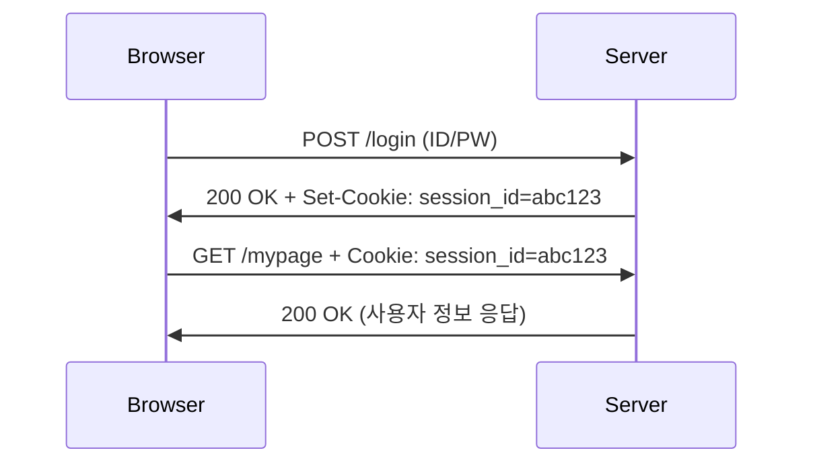

## 1. 개요

쿠키와 세션은 상태를 기억하지 못하는 HTTP의 한계를 보완하여 사용자의 로그인 상태 등을 유지하는 기술이다.

HTTP 프로토콜은 상태를 저장하지 않는(Stateless) 특성이 있어 서버는 각 요청을 독립적인 것으로 간주하며 이전 요청을 기억하지 못한다. 이러한 한계를 극복하고 사용자의 상태를 유지하기 위해 **`쿠키`**와 **`세션`** 기술이 사용된다.

---

## 2. 쿠키 (Cookie)

쿠키는 서버가 사용자의 웹 브라우저에 저장하는 작은 데이터 조각이다. 브라우저는 서버에 요청을 보낼 때마다 저장된 쿠키를 함께 전송하여 서버가 이전 상태를 기억하고 사용자를 식별할 수 있게 한다.

*   ***동작 원리:***
    1.  사용자가 로그인에 성공하면 서버는 응답 헤더 `Set-Cookie` 에 사용자 식별 정보 등을 담아 브라우저로 보낸다.
    2.  브라우저는 이 쿠키를 PC에 저장한다.
    3.  이후 브라우저가 동일한 서버에 요청을 보낼 때마다 요청 헤더 `Cookie` 에 저장된 쿠키를 자동으로 포함하여 전송한다.

*   ***주요 속성:***
    *   **`Domain` / `Path`**: 쿠키가 전송될 서버의 도메인과 경로를 지정한다.
    *   **`Expires` / `Max-Age`**: 쿠키의 만료 시간을 지정한다.
    *   **`HttpOnly`**: (보안) JavaScript의 `document.cookie`로 쿠키에 접근하는 것을 막아 XSS 공격으로 인한 쿠키 탈취를 방지한다.
    *   **`Secure`**: (보안) HTTPS 프로토콜을 통해서만 쿠키가 전송되도록 강제한다.

---

## 3. 세션 (Session)

세션은 사용자의 상태 정보를 브라우저가 아닌 **`서버 측`**에 저장하고 관리하는 방식이다. 클라이언트(브라우저)에는 사용자를 식별하기 위한 최소한의 정보인 **`세션 ID`**만 쿠키 형태로 저장하고 실제 중요한 정보(로그인 정보, 장바구니 등)는 서버의 메모리나 데이터베이스에 저장한다.

*   ***동작 원리:***
    1.  사용자가 로그인에 성공하면 서버는 고유한 세션 ID를 생성하고 해당 ID와 사용자 정보를 서버 내 세션 저장소에 기록한다.
    2.  서버는 응답 시 `Set-Cookie` 헤더를 통해 이 세션 ID만을 브라우저에 전달한다.
    3.  브라우저는 이 세션 ID를 쿠키로 저장한다.
    4.  이후 요청 시 브라우저는 세션 ID 쿠키를 서버로 전송하고 서버는 이 ID를 통해 세션 저장소에서 실제 사용자 정보를 찾아 로그인 상태를 유지한다.

---

## 4. 보안 관점에서의 의미

*   ***세션 하이재킹 (Session Hijacking):***
    공격자가 XSS 취약점이나 네트워크 감청 등을 통해 다른 사용자의 세션 ID 쿠키를 탈취하는 공격이다. 공격자는 이 세션 ID를 자신의 브라우저에 주입하여 정상적인 인증 절차 없이 탈취한 사용자의 계정으로 로그인할 수 있다. `HttpOnly` 속성은 이를 방어하는 중요한 수단이다.

*   ***세션 고정 (Session Fixation):***
    공격자가 미리 발급받은 세션 ID를 피해자에게 전달하여 로그인하도록 유도하는 공격이다. 만약 서버가 로그인 성공 후에도 세션 ID를 갱신하지 않는다면 공격자는 원래 알고 있던 세션 ID로 피해자의 로그인된 세션을 가로챌 수 있다. 로그인 성공 시 세션 ID를 강제로 재발급(`session_regenerate_id()`)하여 이를 방어해야 한다.

*   ***CSRF (Cross-Site Request Forgery):***
    사용자가 특정 사이트에 로그인된 상태(쿠키가 브라우저에 저장된 상태)에서 공격자가 만든 악의적인 페이지에 접속했을 때 사용자의 의도와 무관하게 브라우저가 자동으로 쿠키를 포함하여 서버에 요청을 보내도록 만드는 공격이다.

