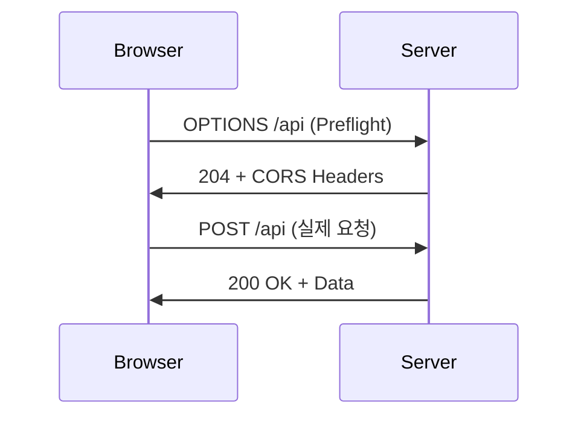

## 1. 개요

SOP는 다른 출처의 리소스로부터 문서를 보호하는 브라우저 보안 정책이며 CORS는 특정 교차 출처 요청을 안전하게 허용하는 메커니즘이다.

현대 웹은 여러 출처(Origin)의 리소스를 조합하여 하나의 페이지를 구성한다. 만약 아무런 제약이 없다면 악의적인 사이트가 사용자의 브라우저를 이용해 사용자가 로그인해 있는 은행 사이트의 정보를 읽어갈 수 있다. 이를 방지하기 위해 브라우저는 **SOP**`Same-Origin Policy 동일 출처 정책`라는 보안 모델을 가지고 있으며 이 정책을 안전하게 완화하기 위한 메커니즘이 **CORS**`Cross-Origin Resource Sharing 교차 출처 리소스 공유`이다.

---

## 2. SOP (Same-Origin Policy)

SOP는 '같은 출처에서 온 리소스만 상호작용할 수 있다'는 규칙이다. 여기서 **`출처(Origin)`**는 다음 세 가지 요소의 조합으로 결정된다.

1.  **프로토콜 (Protocol):** `http`, `https`
2.  **호스트 (Host):** `example.com`, `sub.example.com`
3.  **포트 (Port):** `80`, `443`

이 세 가지가 모두 동일해야 '동일 출처'로 인정된다. 예를 들어 `https://example.com` 에서 로드된 스크립트는 `https://api.example.com` 이나 `http://example.com` 의 리소스를 기본적으로 읽어올 수 없다.

SOP는 다른 출처의 리소스를 **`불러오는 것(Embedding)`**은 허용하지만 그 내용을 **`읽는 것(Reading)`**은 차단한다.

---

## 3. CORS (Cross-Origin Resource Sharing)

CORS는 서버가 HTTP 헤더를 통해 자신의 리소스를 다른 출처와 공유할 수 있도록 허용하는 표준 메커니즘이다. 즉, SOP라는 원칙을 지키면서도 특정 출처에게는 예외적으로 리소스 접근을 허용해주는 '허가증'과 같다.

#### ***동작 원리 (Simple Request)***
1.  브라우저가 다른 출처(`https://api.example.com`)에 리소스를 요청할 때 요청 헤더에 자신의 출처를 알리는 `Origin` 헤더를 포함한다.
    `Origin: https://my-app.com`
2.  서버는 이 `Origin` 헤더를 보고 요청을 허용할지 결정한다. 만약 허용한다면 응답 헤더에 `Access-Control-Allow-Origin` 헤더를 포함하여 응답한다.
    `Access-Control-Allow-Origin: https://my-app.com`
3.  브라우저는 응답 헤더에 `Access-Control-Allow-Origin`이 있고 그 값이 자신의 출처와 일치하는 것을 확인하면 비로소 이 응답 데이터를 스크립트가 읽을 수 있도록 허용한다.

#### ***Preflight Request (사전 요청)***
실제 요청이 서버에 영향을 줄 수 있는 경우(예: `POST`, `PUT`, `DELETE` 메서드) 브라우저는 본 요청을 보내기 전에 `OPTIONS` 메서드를 이용해 '이런 요청을 보내도 괜찮은지'를 서버에 먼저 물어보는 **사전 요청(Preflight Request)**을 보낸다. 서버가 이 `OPTIONS` 요청에 대해 허용 헤더로 응답해야만 브라우저는 실제 요청을 보낸다.

   

---

## 4. 보안 관점에서의 의미

*   ***잘못 설정된 CORS 정책 (`*`)***:
    만약 서버가 `Access-Control-Allow-Origin: *` 로 설정되어 있다면 이는 '어떤 사이트에서든 내 정보를 가져가도 좋다'고 허용하는 것과 같다. 이 경우 악의적인 사이트는 로그인한 사용자의 브라우저를 통해 해당 서버의 민감한 정보를 탈취할 수 있다.

*   ***Origin 헤더 신뢰***:
    일부 서버는 `Origin` 요청 헤더 값을 그대로 `Access-Control-Allow-Origin` 응답 헤더에 반환(Reflection)하도록 잘못 설정되어 있다. 공격자는 `Origin` 헤더를 조작하여 서버를 속이고 CORS 정책을 우회할 수 있다.

*   ***CSRF (Cross-Site Request Forgery)와의 관계***:
    SOP는 다른 출처로 요청을 보내는 것 자체를 막지는 않는다. 따라서 `` 태그나 `<form>` 제출 등을 이용해 사용자의 의도와 무관하게 서버의 상태를 변경하는 요청(글쓰기, 삭제 등)을 보내는 CSRF 공격은 여전히 가능하다. CORS는 리소스를 '읽는' 권한을 제어하는 것이 주 목적이다.

