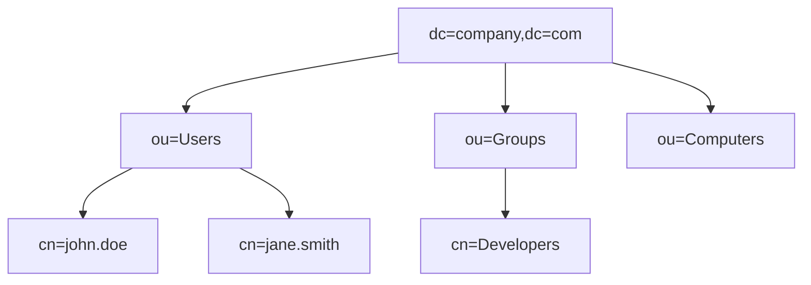
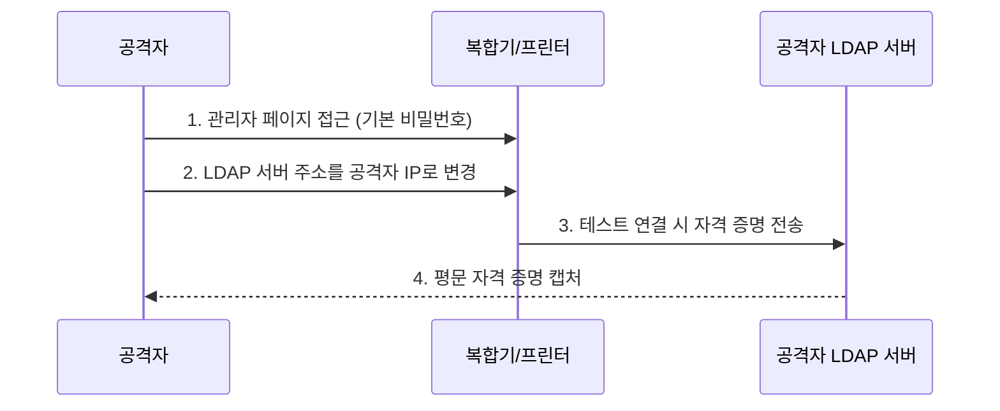

## 1. 개요

**LDAP (Lightweight Directory Access Protocol)**은 네트워크 상에서 조직의 자원(사용자, 컴퓨터 등) 정보를 계층적으로 구성하여 조회하고 관리하기 위한 표준 프로토콜이다.
사용자 인증 처리를 중앙 집중화하여 보안을 강화하고 관리 효율성을 높이는 디렉터리 서비스의 핵심 기술이다.

### 핵심 역할
1.  **중앙 인증**: 사용자가 한 번의 로그인으로 여러 시스템을 이용할 수 있도록 통합 인증(SSO) 기반을 제공한다.
2.  **계층적 관리**: 회사-부서-팀-사용자 형태의 트리 구조로 자원을 체계적으로 관리한다.
3.  **표준 프로토콜**: Active Directory, OpenLDAP 등 다양한 디렉터리 서비스 솔루션의 통신 규약으로 사용된다.

### 기본 정보
| 항목 | 설명 |
|------|------|
| **포트** | 389 (LDAP, 평문), 636 (LDAPS, 암호화) |
| **용도** | 사용자 계정 관리, 주소록 검색, 인증 |
| **구현체** | Microsoft Active Directory, OpenLDAP, 389 DS |

### 디렉터리 구조 예시


### DN (Distinguished Name) 구조
```
cn=john.doe,ou=Users,dc=company,dc=com
```
*   **dc**: Domain Component (도메인 구성요소)
*   **ou**: Organizational Unit (조직 단위)
*   **cn**: Common Name (이름)
*   **uid**: User ID (사용자 아이디)

---

## 2. Active Directory

### AD 구성 요소
| 요소 | 설명 |
|------|------|
| **Domain Controller** | AD 서비스를 실행하고 인증을 담당하는 서버 |
| **Forest** | 하나 이상의 도메인 트리를 포함하는 최상위 논리 컨테이너 |
| **Domain** | 보안 및 관리 정책의 경계가 되는 조직 단위 |
| **OU** | 사용자, 컴퓨터 등을 그룹화하여 정책(GPO)을 적용하는 단위 |
| **Group Policy** | 시스템 설정, 보안 정책, 소프트웨어 배포 등을 제어하는 규칙 |

### AD 쿼리 (PowerShell)
```powershell
# 모든 사용자 조회
Get-ADUser -Filter *

# 특정 OU 사용자 조회
Get-ADUser -Filter * -SearchBase "OU=Users,DC=company,DC=com"

# 그룹 멤버 조회
Get-ADGroupMember -Identity "Administrators"

# 사용자 속성 전체 조회
Get-ADUser -Identity "john.doe" -Properties *
```

### AD 실무 쿼리 활용
실무에서 자주 사용되는 PowerShell 쿼리 예제이다.

**부서별 사용자 이메일 추출**
```powershell
Get-ADUser -Filter {Department -eq "영업부"} -Properties mail, Department | 
    Select-Object Name, SamAccountName, mail, Department |
    Export-Csv -Path "C:\sales_users.csv" -NoTypeInformation -Encoding UTF8
```

**비활성화된 계정 조회**
```powershell
Search-ADAccount -AccountDisabled | 
    Select-Object Name, SamAccountName, DistinguishedName
```

**만료 예정 계정 확인 (30일 이내)**
```powershell
Search-ADAccount -AccountExpiring -TimeSpan 30.00:00:00 |
    Select-Object Name, AccountExpirationDate
```

**중첩 그룹 멤버 전체 조회**
```powershell
Get-ADGroupMember -Identity "Domain Admins" -Recursive | 
    Select-Object Name, SamAccountName, objectClass
```

**사용자 OU 간 이동**
```powershell
Get-ADUser -Identity "john.doe" | 
    Move-ADObject -TargetPath "OU=Managers,DC=company,DC=com"
```

**특정 속성 일괄 수정**
```powershell
# 부서 전체 사용자의 전화번호 일괄 변경
Get-ADUser -Filter {Department -eq "IT부서"} | 
    Set-ADUser -OfficePhone "02-1234-5678"
```

---

## 3. OpenLDAP (Linux)

### 설치
```bash
# CentOS/Rocky 패키지 설치
dnf install -y openldap openldap-servers openldap-clients

# 서비스 시작 및 활성화
systemctl enable --now slapd
```

### 기본 설정
```bash
# 관리자 비밀번호 생성
slappasswd

# 초기 설정 (LDIF 파일 작성)
cat << 'EOF' > init.ldif
dn: olcDatabase={2}mdb,cn=config
changetype: modify
replace: olcSuffix
olcSuffix: dc=company,dc=com

dn: olcDatabase={2}mdb,cn=config
changetype: modify
replace: olcRootDN
olcRootDN: cn=admin,dc=company,dc=com
EOF

# 설정 적용
ldapmodify -Y EXTERNAL -H ldapi:/// -f init.ldif
```

### Base DN 생성
```bash
cat << 'EOF' > base.ldif
dn: dc=company,dc=com
objectClass: dcObject
objectClass: organization
dc: company
o: Company Inc.

dn: ou=Users,dc=company,dc=com
objectClass: organizationalUnit
ou: Users
EOF

# 데이터 추가
ldapadd -x -D "cn=admin,dc=company,dc=com" -W -f base.ldif
```

---

## 4. LDAP 명령어 도구

### ldapsearch
```bash
# 모든 항목 검색
ldapsearch -x -b "dc=company,dc=com" -H ldap://localhost

# 특정 사용자 검색
ldapsearch -x -b "dc=company,dc=com" "(uid=john)"

# 복합 필터 검색 (AND 조건)
ldapsearch -x -b "ou=Users,dc=company,dc=com" "(&(objectClass=person)(mail=*@company.com))"
```

### ldapadd / ldapmodify
```bash
# 사용자 추가 LDIF 작성
cat << 'EOF' > user.ldif
dn: uid=john,ou=Users,dc=company,dc=com
objectClass: inetOrgPerson
uid: john
cn: John Doe
sn: Doe
mail: john@company.com
userPassword: {SSHA}xxxxx
EOF

# 사용자 추가
ldapadd -x -D "cn=admin,dc=company,dc=com" -W -f user.ldif
```

### ldapdelete
```bash
ldapdelete -x -D "cn=admin,dc=company,dc=com" -W "uid=john,ou=Users,dc=company,dc=com"
```

---

## 5. 보안 고려사항

### LDAPS 활성화
기본 LDAP(389)은 데이터를 평문으로 전송하므로 스니핑에 취약하다.
반드시 인증서를 적용하여 암호화된 **LDAPS (636)** 또는 **StartTLS**를 사용해야 한다.

**Windows AD에서 LDAPS 확인**
```powershell
# LDAPS 연결 테스트
Test-NetConnection -ComputerName dc01.company.com -Port 636

# 인증서 확인
Get-ChildItem Cert:\LocalMachine\My | Where-Object {$_.Subject -like "*dc01*"}
```

**OpenLDAP에서 TLS 설정**
```bash
# TLS 인증서 설정 확인
ldapsearch -x -H ldaps://localhost -b "dc=company,dc=com" -D "cn=admin,dc=company,dc=com" -W
```

### 접근 제어 (ACL)
중요한 속성(예: 비밀번호)에 대한 접근 권한을 엄격히 제어해야 한다.
```
access to attrs=userPassword
    by self write
    by anonymous auth
    by * none
```

---

## 6. 보안 위협과 대응

### 주요 LDAP 관련 위협

| 위협 | 설명 | 심각도 |
|------|------|--------|
| **LDAP Injection** | 쿼리 조작을 통한 인증 우회 및 데이터 유출 | 🔴 높음 |
| **Anonymous Binding** | 익명 접근을 통한 디렉터리 정보 열거 | 🟠 중간 |
| **LDAP Pass-back Attack** | 프린터/MFP의 LDAP 설정 변경으로 자격 증명 캡처 | 🟠 중간 |
| **LDAP Reconnaissance** | BloodHound 등을 이용한 AD 구조 분석 | 🟡 정보 수집 |
| **평문 LDAP 스니핑** | 389 포트 트래픽 캡처로 자격 증명 탈취 | 🔴 높음 |
| **Credential Stuffing** | 유출된 자격 증명으로 대량 인증 시도 | 🟠 중간 |

### 공격 시나리오: LDAP Injection

**취약한 코드 예시 (PHP)**
```php
// 취약: 사용자 입력을 직접 LDAP 쿼리에 삽입
$username = $_POST['username'];
$filter = "(uid=" . $username . ")";
$result = ldap_search($ldap_conn, "dc=company,dc=com", $filter);
```

**공격 입력값**
```
username: *)(uid=*))(|(uid=*
```

**결과 필터**
```
(uid=*)(uid=*))(|(uid=*)
```
→ 모든 사용자 정보를 반환하거나 인증 우회

**대응책: 입력값 이스케이프**
```php
// 안전: 특수 문자 이스케이프
$username = ldap_escape($_POST['username'], "", LDAP_ESCAPE_FILTER);
$filter = "(uid=" . $username . ")";
```

### 공격 시나리오: LDAP Pass-back



**탐지 방법**
*   복합기/프린터의 LDAP 설정 변경 로그 모니터링
*   내부 네트워크에서 비정상적인 389/636 포트 연결 탐지

### 방어 대책 체크리스트

| 통제 항목 | 구현 방법 | 우선순위 |
|-----------|-----------|----------|
| **LDAPS 강제** | 389 포트 차단, 636 포트만 허용 | 🔴 필수 |
| **익명 바인딩 비활성화** | `olcDisallows: bind_anon` 설정 | 🔴 필수 |
| **Channel Binding** | LDAP 채널 바인딩 토큰 요구 | 🟠 권장 |
| **쿼리 로깅** | Event ID 2889 (평문 LDAP 바인딩) 모니터링 | 🟠 권장 |
| **바인딩 계정 최소 권한** | 읽기 전용 계정 사용, 필요한 OU만 접근 | 🟠 권장 |
| **계정 잠금 정책** | 5회 실패 시 30분 잠금 | 🟠 권장 |
| **LDAP Signing 요구** | GPO에서 서명 필수화 | 🟡 선택 |

### 보안 점검 PowerShell

**평문 LDAP 바인딩 시도 탐지 (Event ID 2889)**
```powershell
Get-WinEvent -FilterHashtable @{
    LogName = 'Directory Service'
    Id = 2889
} -MaxEvents 100 | Select-Object TimeCreated, Message
```

**익명 바인딩 가능 여부 확인**
```powershell
# 익명으로 LDAP 쿼리 시도
$searcher = New-Object DirectoryServices.DirectorySearcher
$searcher.SearchRoot = "LDAP://dc=company,dc=com"
$searcher.Filter = "(objectClass=user)"
$searcher.AuthenticationType = [System.DirectoryServices.AuthenticationTypes]::Anonymous
try {
    $searcher.FindAll()
    Write-Host "경고: 익명 바인딩이 허용됨!" -ForegroundColor Red
} catch {
    Write-Host "정상: 익명 바인딩이 차단됨" -ForegroundColor Green
}
```

**LDAPS 연결 상태 확인**
```powershell
# 도메인 컨트롤러 LDAPS 포트 확인
$DCs = Get-ADDomainController -Filter *
foreach ($DC in $DCs) {
    $result = Test-NetConnection -ComputerName $DC.HostName -Port 636
    Write-Host "$($DC.HostName): LDAPS = $($result.TcpTestSucceeded)"
}
```

<hr class="short-rule">
