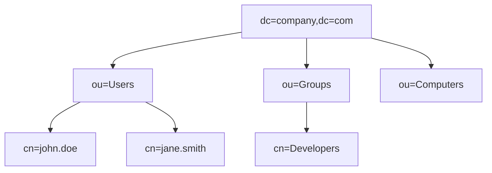

## 1. 개요

**LDAP (Lightweight Directory Access Protocol)**은 네트워크 상에서 조직의 자원(사용자, 컴퓨터 등) 정보를 계층적으로 구성하여 조회하고 관리하기 위한 표준 프로토콜이다.
사용자 인증 처리를 중앙 집중화하여 보안을 강화하고 관리 효율성을 높이는 디렉터리 서비스의 핵심 기술이다.

### 핵심 역할
1.  **중앙 인증**: 사용자가 한 번의 로그인으로 여러 시스템을 이용할 수 있도록 통합 인증(SSO) 기반을 제공한다.
2.  **계층적 관리**: 회사-부서-팀-사용자 형태의 트리 구조로 자원을 체계적으로 관리한다.
3.  **표준 프로토콜**: Active Directory, OpenLDAP 등 다양한 디렉터리 서비스 솔루션의 통신 규약으로 사용된다.

### 기본 정보
| 항목 | 설명 |
|------|------|
| **포트** | 389 (LDAP, 평문), 636 (LDAPS, 암호화) |
| **용도** | 사용자 계정 관리, 주소록 검색, 인증 |
| **구현체** | Microsoft Active Directory, OpenLDAP, 389 DS |

### 디렉터리 구조 예시


### DN (Distinguished Name) 구조
```
cn=john.doe,ou=Users,dc=company,dc=com
```
*   **dc**: Domain Component (도메인 구성요소)
*   **ou**: Organizational Unit (조직 단위)
*   **cn**: Common Name (이름)
*   **uid**: User ID (사용자 아이디)

---

## 2. Active Directory

### AD 구성 요소
| 요소 | 설명 |
|------|------|
| **Domain Controller** | AD 서비스를 실행하고 인증을 담당하는 서버 |
| **Forest** | 하나 이상의 도메인 트리를 포함하는 최상위 논리 컨테이너 |
| **Domain** | 보안 및 관리 정책의 경계가 되는 조직 단위 |
| **OU** | 사용자, 컴퓨터 등을 그룹화하여 정책(GPO)을 적용하는 단위 |
| **Group Policy** | 시스템 설정, 보안 정책, 소프트웨어 배포 등을 제어하는 규칙 |

### AD 쿼리 (PowerShell)
```powershell
# 모든 사용자 조회
Get-ADUser -Filter *

# 특정 OU 사용자 조회
Get-ADUser -Filter * -SearchBase "OU=Users,DC=company,DC=com"

# 그룹 멤버 조회
Get-ADGroupMember -Identity "Administrators"

# 사용자 속성 전체 조회
Get-ADUser -Identity "john.doe" -Properties *
```

---

## 3. OpenLDAP (Linux)

### 설치
```bash
# CentOS/Rocky 패키지 설치
dnf install -y openldap openldap-servers openldap-clients

# 서비스 시작 및 활성화
systemctl enable --now slapd
```

### 기본 설정
```bash
# 관리자 비밀번호 생성
slappasswd

# 초기 설정 (LDIF 파일 작성)
cat << 'EOF' > init.ldif
dn: olcDatabase={2}mdb,cn=config
changetype: modify
replace: olcSuffix
olcSuffix: dc=company,dc=com

dn: olcDatabase={2}mdb,cn=config
changetype: modify
replace: olcRootDN
olcRootDN: cn=admin,dc=company,dc=com
EOF

# 설정 적용
ldapmodify -Y EXTERNAL -H ldapi:/// -f init.ldif
```

### Base DN 생성
```bash
cat << 'EOF' > base.ldif
dn: dc=company,dc=com
objectClass: dcObject
objectClass: organization
dc: company
o: Company Inc.

dn: ou=Users,dc=company,dc=com
objectClass: organizationalUnit
ou: Users
EOF

# 데이터 추가
ldapadd -x -D "cn=admin,dc=company,dc=com" -W -f base.ldif
```

---

## 4. LDAP 명령어 도구

### ldapsearch
```bash
# 모든 항목 검색
ldapsearch -x -b "dc=company,dc=com" -H ldap://localhost

# 특정 사용자 검색
ldapsearch -x -b "dc=company,dc=com" "(uid=john)"

# 복합 필터 검색 (AND 조건)
ldapsearch -x -b "ou=Users,dc=company,dc=com" "(&(objectClass=person)(mail=*@company.com))"
```

### ldapadd / ldapmodify
```bash
# 사용자 추가 LDIF 작성
cat << 'EOF' > user.ldif
dn: uid=john,ou=Users,dc=company,dc=com
objectClass: inetOrgPerson
uid: john
cn: John Doe
sn: Doe
mail: john@company.com
userPassword: {SSHA}xxxxx
EOF

# 사용자 추가
ldapadd -x -D "cn=admin,dc=company,dc=com" -W -f user.ldif
```

### ldapdelete
```bash
ldapdelete -x -D "cn=admin,dc=company,dc=com" -W "uid=john,ou=Users,dc=company,dc=com"
```

---

## 5. 보안 고려사항

### LDAPS 활성화
*   기본 LDAP(389)은 데이터를 평문으로 전송하므로 스니핑에 취약하다.
*   반드시 인증서를 적용하여 암호화된 **LDAPS (636)** 또는 **StartTLS**를 사용해야 한다.

### 접근 제어 (ACL)
중요한 속성(예: 비밀번호)에 대한 접근 권한을 엄격히 제어해야 한다.
```
access to attrs=userPassword
    by self write
    by anonymous auth
    by * none
```

### 주요 취약점 및 대응
*   **익명 바인딩**: 인증 없는 정보 조회를 허용하지 않도록 설정한다.
*   **LDAP Injection**: 웹 애플리케이션 입력값 검증을 통해 쿼리 조작을 방지한다.

<hr class="short-rule">
