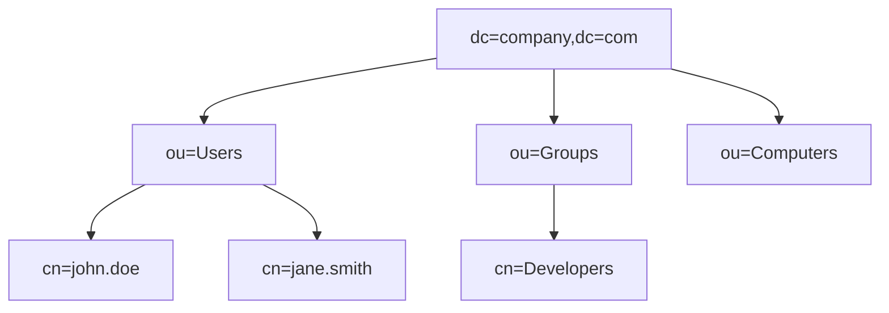

## 1. 개념

**LDAP (Lightweight Directory Access Protocol)**은 IP 네트워크 상에서 분산 디렉터리 정보 서비스를 조회하고 수정하기 위한 개방형 표준 응용 프로토콜입니다.
사용자, 시스템, 네트워크, 서비스 등의 정보를 계층적 구조로 구성하여 중앙에서 효율적으로 관리할 수 있게 합니다.

### 기본 정보
| 항목 | 설명 |
|------|------|
| 포트 | 389 (LDAP), 636 (LDAPS) |
| 용도 | 중앙 집중식 인증, 사용자 관리 |
| 구현 | Active Directory, OpenLDAP, 389 DS |

### 디렉터리 서비스 구조



### DN (Distinguished Name)
```
cn=john.doe,ou=Users,dc=company,dc=com
```

| 약어 | 의미 |
|------|------|
| dc | Domain Component |
| ou | Organizational Unit |
| cn | Common Name |
| uid | User ID |

---

## 2. Active Directory

### AD 구성 요소
| 요소 | 설명 |
|------|------|
| Domain Controller | AD 서버 |
| Forest | 최상위 컨테이너 |
| Domain | 조직 단위 |
| OU | 사용자/컴퓨터 그룹 |
| Group Policy | 정책 적용 |

### AD 쿼리 (PowerShell)
```powershell
# 모든 사용자 조회
Get-ADUser -Filter *

# 특정 OU 사용자
Get-ADUser -Filter * -SearchBase "OU=Users,DC=company,DC=com"

# 그룹 멤버 조회
Get-ADGroupMember -Identity "Administrators"

# 사용자 속성
Get-ADUser -Identity "john.doe" -Properties *
```

---

## 3. OpenLDAP (Linux)

### 설치
```bash
# CentOS/Rocky
dnf install -y openldap openldap-servers openldap-clients

# 서비스 시작
systemctl enable --now slapd
```

### 기본 설정
```bash
# 관리자 비밀번호 생성
slappasswd

# 초기 설정 (LDIF)
cat << 'EOF' > init.ldif
dn: olcDatabase={2}mdb,cn=config
changetype: modify
replace: olcSuffix
olcSuffix: dc=company,dc=com

dn: olcDatabase={2}mdb,cn=config
changetype: modify
replace: olcRootDN
olcRootDN: cn=admin,dc=company,dc=com
EOF

ldapmodify -Y EXTERNAL -H ldapi:/// -f init.ldif
```

### Base DN 생성
```bash
cat << 'EOF' > base.ldif
dn: dc=company,dc=com
objectClass: dcObject
objectClass: organization
dc: company
o: Company Inc.

dn: ou=Users,dc=company,dc=com
objectClass: organizationalUnit
ou: Users
EOF

ldapadd -x -D "cn=admin,dc=company,dc=com" -W -f base.ldif
```

---

## 4. LDAP 명령어

### ldapsearch
```bash
# 모든 항목 검색
ldapsearch -x -b "dc=company,dc=com" -H ldap://localhost

# 특정 사용자 검색
ldapsearch -x -b "dc=company,dc=com" "(uid=john)"

# 필터 조합
ldapsearch -x -b "ou=Users,dc=company,dc=com" "(&(objectClass=person)(mail=*@company.com))"
```

### ldapadd / ldapmodify
```bash
# 사용자 추가
cat << 'EOF' > user.ldif
dn: uid=john,ou=Users,dc=company,dc=com
objectClass: inetOrgPerson
uid: john
cn: John Doe
sn: Doe
mail: john@company.com
userPassword: {SSHA}xxxxx
EOF

ldapadd -x -D "cn=admin,dc=company,dc=com" -W -f user.ldif
```

### ldapdelete
```bash
ldapdelete -x -D "cn=admin,dc=company,dc=com" -W "uid=john,ou=Users,dc=company,dc=com"
```

---

## 5. 보안 고려사항

### LDAPS 활성화
- 인증서 기반 암호화 (636 포트)
- StartTLS 지원

### 접근 제어
```
access to attrs=userPassword
    by self write
    by anonymous auth
    by * none
```

### 취약점
- 익명 바인딩 취약점
- LDAP Injection
- 평문 LDAP 스니핑

<hr class="short-rule">
