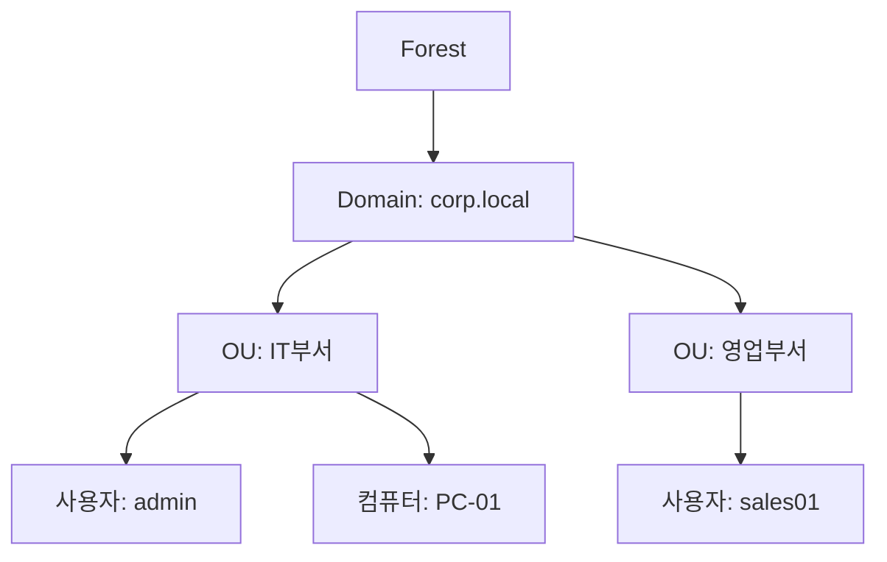
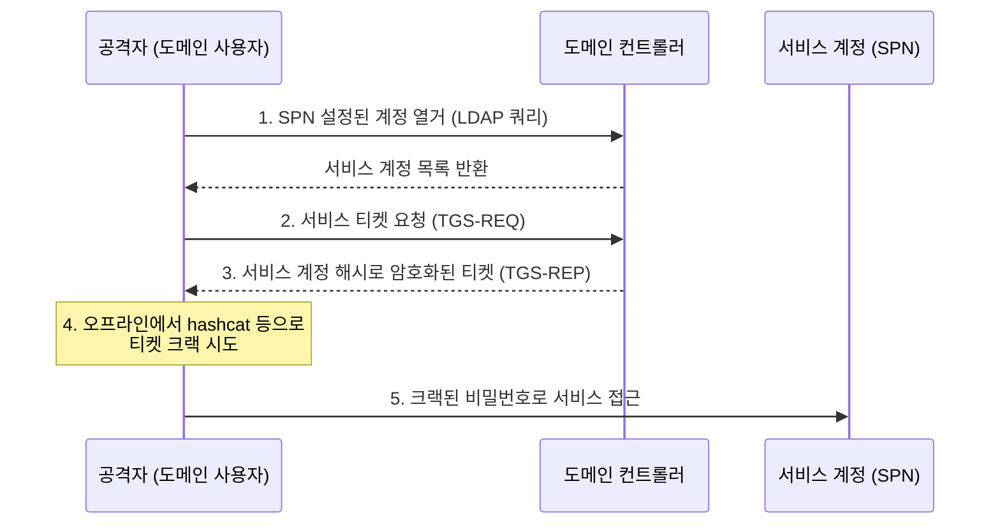

## 1. 개요

**Active Directory (AD)**는 Windows Server 환경에서 사용자, 컴퓨터, 그룹 등의 자원을 중앙에서 통합 관리하는 디렉터리 서비스이다.
도메인 컨트롤러(DC)를 통해 인증과 권한 부여를 수행하며, 그룹 정책(GPO)을 이용하여 대규모 조직의 IT 환경을 효율적으로 제어한다.

### 핵심 기능
1.  **중앙 집중식 관리**: 수천 대의 PC와 사용자를 하나의 중앙 서버(DC)에서 생성, 수정, 삭제하므로 관리 비용이 절감된다.
2.  **단일 사인온 (SSO)**: 한 번의 도메인 계정 로그인으로 파일 서버, 메일 서버, 인트라넷 등 다양한 사내 시스템을 이용할 수 있다.
3.  **정책 기반 제어**: GPO를 통해 USB 차단, 바탕화면 설정, 소프트웨어 자동 설치 등 보안 및 환경 설정을 일괄 적용한다.

### AD 도입 전후 비교
| 구분 | Workgroup 환경 (AD 없음) | Domain 환경 (AD 있음) |
|------|---------|---------|
| **계정 관리** | 각 PC마다 사용자 계정 생성 필요 | AD 서버에서 통합 관리 |
| **인증** | 로컬 PC에 저장된 정보로 인증 | 중앙 DC에서 인증 처리 (Kerberos) |
| **보안 정책** | PC마다 수동 설정 | GPO를 통해 네트워크 전체 적용 |
| **데이터 공유** | 개별 권한 설정 복잡 | 그룹 기반의 체계적 권한 관리 |

### AD 구조 다이어그램


---

## 2. 설치 방법 (GUI)

### 사전 준비사항
1.  **Windows Server OS**: Windows Server 2019 또는 2022.
2.  **고정 IP 주소**: 도메인 컨트롤러는 서버이므로 고정 IP가 필수이다.
3.  **호스트 이름 변경**: 식별하기 쉬운 이름(예: `DC01`)으로 변경한다.

### AD DS 역할 설치
1.  **서버 관리자** 실행 → '역할 및 기능 추가' 클릭.
2.  서버 역할 선택 단계에서 **Active Directory Domain Services** 체크.
3.  필요한 기능(DNS 등) 확인 후 설치 진행.

### 도메인 컨트롤러 승격
역할 설치 후 서버를 도메인 컨트롤러(DC)로 승격해야 한다.
1.  서버 관리자 우측 상단 깃발(알림) 아이콘 클릭 → **이 서버를 도메인 컨트롤러로 승격** 선택.
2.  배포 구성: **새 포리스트 추가** 선택.
3.  루트 도메인 이름 입력: 예) `corp.local`.
4.  DSRM(디렉터리 서비스 복원 모드) 암호 설정.
5.  DNS 옵션 등 기본값 확인 후 설치 완료 및 자동 재부팅.

---

## 3. 기본 사용법

### 사용자 및 그룹 관리
1.  **Active Directory 사용자 및 컴퓨터 (`dsa.msc`)** 실행.
2.  **OU(조직 단위) 생성**: 도메인 우클릭 → 새로 만들기 → 조직 단위.
3.  **사용자 생성**: 해당 OU 우클릭 → 새로 만들기 → 사용자. 이름과 로그온 ID 입력 및 암호 설정.
4.  **그룹 생성**: '새로 만들기' → 그룹. 보안 그룹/전역 그룹 선택.

### 그룹 정책(GPO) 관리
1.  **그룹 정책 관리 (`gpmc.msc`)** 실행.
2.  새 정책 생성: 도메인 우클릭 → **이 도메인에서 GPO 만들기 및 연결**.
3.  정책 편집: 생성된 GPO 우클릭 → **편집**. (예: 제어판 접근 금지 설정 등)

---

## 4. 실습 배포 및 확인

### AD 랩 환경 구성도
구축한 AD 실습 환경의 전체 구성도는 다음과 같다.


| 호스트 | IP | 역할 | 주요 기능 |
|--------|----|------|-----------|
| **W2K25-AD** | 10.0.0.10 | AD DC, DNS, DHCP | `hamap.local` 포리스트 루트 |
| **W2K25-MEM1** | 10.0.0.20 | AD DC (추가) | 복제 및 부하 분산 |
| **W2K25-MEM2** | 10.0.0.30 | Child Domain | `busan.hamap.local` 자식 도메인 |
| **Rocky Linux** | 10.0.0.11~ | Linux 클라이언트 | DNS/SSSD 연동 테스트 |
| **PC-Client** | 10.0.0.101~ | Windows 10/11 | 도메인 조인 테스트 |

### PowerShell을 이용한 AD 배포
GUI 대신 PowerShell 스크립트를 사용하면 배포 과정을 자동화할 수 있다.

**1. 부모 도메인 (hamap.local) 생성**
```powershell
Import-Module ADDSDeployment
Install-ADDSForest `
-CreateDnsDelegation:$false `
-DatabasePath "C:\WINDOWS\NTDS" `
-DomainMode "Win2025" `
-DomainName "hamap.local" `
-DomainNetbiosName "HAMAP0" `
-ForestMode "Win2025" `
-InstallDns:$true `
-Force:$true
```

**2. 자식 도메인 (busan.hamap.local) 생성**
```powershell
Import-Module ADDSDeployment
Install-ADDSDomain `
-DomainType "ChildDomain" `
-ParentDomainName "hamap.local" `
-NewDomainName "busan" `
-NewDomainNetbiosName "BUSAN" `
-Credential (Get-Credential) `
-Force:$true
```

### FSMO 역할 확인 및 관리
**CMD에서 역할 소유자 확인**
```cmd
netdom query fsmo
```

**ntdsutil을 이용한 역할 전송**
DC 장애 시나 유지보수 시 역할을 다른 DC로 강제 이동할 때 사용한다.
```cmd
ntdsutil
roles
connections
connect to server W2K25-AD.hamap.local
quit
transfer rid master
quit
```

---

## 5. 트러블슈팅

### 주요 문제 및 해결
| 문제 증상 | 원인 | 해결 방법 |
|---|---|---|
| **도메인 조인 실패** | DNS 설정 오류 | 클라이언트 PC의 DNS 서버 주소를 반드시 AD 서버(DC)의 IP로 설정해야 한다. |
| **DC 간 통신 불가** | 방화벽 포트 차단 | Windows 방화벽에서 '도메인 네트워크' 프로파일이 허용되어 있는지 확인하거나 필요한 포트(53, 88, 389, 445 등)를 개방한다. |
| **복제 오류** | 네트워크 단절 또는 시간 동기화 | `repadmin /replsummary` 명령어로 복제 상태를 점검하고, NTP 설정으로 서버 간 시간을 동기화한다. |

---

## 6. AD 운영 실무

### 대량 사용자 관리
수백 명의 사용자를 일괄 생성해야 하는 경우 CSV 파일과 PowerShell 조합이 효과적이다.

**CSV 템플릿 (users.csv)**
```csv
Name,SamAccountName,Department,Title,Password
홍길동,hong.gd,영업부,대리,P@ssw0rd123!
김철수,kim.cs,개발부,과장,P@ssw0rd123!
이영희,lee.yh,인사부,사원,P@ssw0rd123!
```

**일괄 생성 스크립트**
```powershell
Import-Csv -Path "C:\users.csv" | ForEach-Object {
    New-ADUser `
        -Name $_.Name `
        -SamAccountName $_.SamAccountName `
        -UserPrincipalName "$($_.SamAccountName)@hamap.local" `
        -Department $_.Department `
        -Title $_.Title `
        -AccountPassword (ConvertTo-SecureString $_.Password -AsPlainText -Force) `
        -Enabled $true `
        -Path "OU=Users,DC=hamap,DC=local"
}
```

### 권한 위임 (Delegation)
Help Desk 담당자에게 비밀번호 리셋 권한만 부여하는 등, OU 단위로 세분화된 권한을 위임할 수 있다.

1.  `dsa.msc` → 대상 OU 우클릭 → **제어 위임...**
2.  사용자 또는 그룹 선택 (예: `HelpDesk` 그룹)
3.  위임할 작업 선택:
    *   사용자 암호 재설정 및 강제 변경
    *   사용자 계정 활성화/비활성화

| 위임 대상 | 권한 | 적용 OU |
|-----------|------|---------|
| Help Desk | 비밀번호 리셋, 계정 잠금 해제 | `OU=Users` |
| 부서 관리자 | 그룹 멤버십 수정 | `OU=부서명` |
| IT 운영팀 | 컴퓨터 계정 생성/삭제 | `OU=Computers` |

### Fine-Grained Password Policy (FGPP)
Windows Server 2008 이후, 도메인 내에서 그룹별로 다른 암호 정책을 적용할 수 있다.

**PowerShell로 정책 생성**
```powershell
# 관리자 그룹: 강화된 정책
New-ADFineGrainedPasswordPolicy -Name "AdminPasswordPolicy" `
    -Precedence 10 `
    -MinPasswordLength 14 `
    -PasswordHistoryCount 24 `
    -MaxPasswordAge "90.00:00:00" `
    -MinPasswordAge "1.00:00:00" `
    -LockoutThreshold 3 `
    -LockoutDuration "00:30:00"

# 정책을 Domain Admins 그룹에 적용
Add-ADFineGrainedPasswordPolicySubject -Identity "AdminPasswordPolicy" `
    -Subjects "Domain Admins"
```

### 삭제된 객체 복원 (AD 휴지통)
Windows Server 2008 R2 이상에서 AD 휴지통을 활성화하면 삭제된 객체를 복원할 수 있다.

**휴지통 활성화**
```powershell
Enable-ADOptionalFeature -Identity 'Recycle Bin Feature' `
    -Scope ForestOrConfigurationSet `
    -Target 'hamap.local'
```

**삭제된 사용자 조회 및 복원**
```powershell
# 삭제된 객체 조회
Get-ADObject -Filter {isDeleted -eq $true} -IncludeDeletedObjects

# 특정 사용자 복원
Get-ADObject -Filter {DisplayName -eq "홍길동"} -IncludeDeletedObjects | 
    Restore-ADObject
```

---

## 7. GPO 활용 시나리오

### 시나리오 1: USB 저장장치 차단
정보유출 방지를 위해 이동식 저장장치 사용을 전사적으로 차단한다.

**설정 경로**
```
컴퓨터 구성 → 정책 → 관리 템플릿 → 시스템 → 이동식 저장소 액세스
```

| 설정 | 값 |
|------|-----|
| 이동식 디스크: 읽기 권한 거부 | 사용 |
| 이동식 디스크: 쓰기 권한 거부 | 사용 |
| CD 및 DVD: 쓰기 권한 거부 | 사용 |

### 시나리오 2: 화면보호기 및 화면 잠금 강제
보안 기준 준수를 위해 자리 비움 시 자동 화면 잠금을 설정한다.

**설정 경로**
```
사용자 구성 → 정책 → 관리 템플릿 → 제어판 → 개인 설정
```

| 설정 | 값 |
|------|-----|
| 화면 보호기 활성화 | 사용 |
| 화면 보호기 시간 제한 | 600초 (10분) |
| 화면 보호기에 암호 보호 사용 | 사용 |

### 시나리오 3: 소프트웨어 자동 배포
MSI 패키지를 이용하여 전사 PC에 소프트웨어를 자동 설치한다.

**설정 경로**
```
컴퓨터 구성 → 정책 → 소프트웨어 설정 → 소프트웨어 설치
```

1.  MSI 파일을 네트워크 공유 폴더에 배치 (예: `\\DC01\Software\7zip.msi`)
2.  GPO에서 '새로 만들기' → '패키지...' → MSI 파일 선택
3.  배포 방법: **할당됨** (자동 설치) 또는 **게시됨** (사용자 선택)

### 시나리오 4: AppLocker 정책
허가된 실행 파일만 실행되도록 화이트리스트 정책을 적용한다.

**설정 경로**
```
컴퓨터 구성 → 정책 → Windows 설정 → 보안 설정 → 응용 프로그램 제어 정책 → AppLocker
```

**기본 규칙 생성**
```powershell
# AppLocker 서비스 자동 시작 설정
Set-Service -Name AppIDSvc -StartupType Automatic
Start-Service AppIDSvc

# 기본 실행 규칙 생성 (Windows 폴더, Program Files 허용)
Get-AppLockerPolicy -Effective | Format-List
```

### GPO 적용 확인
```cmd
# 클라이언트 PC에서 정책 강제 적용
gpupdate /force

# 적용된 정책 확인
gpresult /r

# 상세 리포트 생성
gpresult /h C:\GPOReport.html
```

---

## 8. 모니터링 및 감사

### 필수 감사 정책 설정
보안 이벤트 로깅을 위한 기본 감사 정책을 활성화한다.

**GPO 설정 경로**
```
컴퓨터 구성 → Windows 설정 → 보안 설정 → 고급 감사 정책 구성
```

| 범주 | 하위 범주 | 권장 설정 |
|------|----------|----------|
| 계정 로그온 | 자격 증명 유효성 검사 | 성공 및 실패 |
| 계정 관리 | 사용자 계정 관리 | 성공 및 실패 |
| DS 액세스 | 디렉터리 서비스 액세스 | 성공 및 실패 |
| 로그온/로그오프 | 로그온 | 성공 및 실패 |
| 개체 액세스 | 파일 시스템 | 실패 |

### 주요 이벤트 ID
| 이벤트 ID | 설명 | 중요도 |
|-----------|------|--------|
| **4624** | 로그온 성공 | 정보 |
| **4625** | 로그온 실패 | 경고 ⚠️ |
| **4720** | 사용자 계정 생성 | 중요 |
| **4726** | 사용자 계정 삭제 | 중요 |
| **4728** | 보안 그룹에 멤버 추가 | 중요 |
| **4732** | 로컬 그룹에 멤버 추가 | 중요 |
| **4768** | Kerberos TGT 요청 | 정보 |
| **4769** | Kerberos Service Ticket 요청 | 정보 |
| **4771** | Kerberos 사전 인증 실패 | 경고 ⚠️ |
| **4776** | NTLM 인증 시도 | 경고 ⚠️ |

### PowerShell 모니터링 스크립트

**최근 생성된 사용자 조회**
```powershell
Get-ADUser -Filter * -Properties whenCreated | 
    Where-Object { $_.whenCreated -gt (Get-Date).AddDays(-7) } |
    Select-Object Name, SamAccountName, whenCreated |
    Sort-Object whenCreated -Descending
```

**비활성 계정 탐지 (90일 이상 미접속)**
```powershell
$90DaysAgo = (Get-Date).AddDays(-90)
Get-ADUser -Filter {LastLogonDate -lt $90DaysAgo} -Properties LastLogonDate |
    Select-Object Name, SamAccountName, LastLogonDate |
    Export-Csv -Path "C:\InactiveUsers.csv" -NoTypeInformation
```

**잠긴 계정 확인 및 해제**
```powershell
# 잠긴 계정 조회
Search-ADAccount -LockedOut | Select-Object Name, LockedOut

# 계정 잠금 해제
Unlock-ADAccount -Identity "hong.gd"
```

**그룹 멤버십 변경 추적**
```powershell
# Domain Admins 그룹 변경 이벤트 조회 (Event ID 4728, 4729)
Get-WinEvent -FilterHashtable @{
    LogName = 'Security'
    Id = 4728, 4729
} -MaxEvents 50 | ForEach-Object {
    [PSCustomObject]@{
        TimeCreated = $_.TimeCreated
        EventId = $_.Id
        Message = $_.Message.Split("`n")[0]
    }
}
```

---

## 9. 보안 위협과 대응

### 주요 AD 공격 기법

| 공격 기법 | 설명 | MITRE ID |
|-----------|------|----------|
| **Kerberoasting** | SPN이 설정된 서비스 계정의 TGS 티켓을 요청하여 오프라인에서 크랙 | T1558.003 |
| **AS-REP Roasting** | "사전 인증 필요 없음" 설정된 계정의 AS-REP를 크랙 | T1558.004 |
| **Pass-the-Hash (PtH)** | 탈취한 NTLM 해시로 인증 우회 | T1550.002 |
| **Pass-the-Ticket (PtT)** | 탈취한 Kerberos 티켓으로 인증 우회 | T1550.003 |
| **Golden Ticket** | KRBTGT 해시를 이용해 모든 서비스에 접근 가능한 TGT 생성 | T1558.001 |
| **DCSync** | 도메인 컨트롤러 복제 권한을 악용하여 모든 해시 추출 | T1003.006 |
| **NTLM Relay** | NTLM 인증을 중계하여 다른 서버에 인증 | T1557.001 |

### 공격 시나리오: Kerberoasting



**탐지 방법**
*   Event ID 4769를 모니터링하여 비정상적인 TGS 요청 패턴 탐지
*   암호화 타입 0x17 (RC4-HMAC) 요청 급증 탐지

### 방어 대책 매트릭스

| 방어 통제 | 대응 공격 | 구현 방법 |
|-----------|-----------|-----------|
| **gMSA 사용** | Kerberoasting | 서비스 계정을 그룹 관리 서비스 계정으로 대체, 128자 자동 비밀번호 |
| **사전 인증 강제** | AS-REP Roasting | 사용자 속성에서 "Kerberos 사전 인증 필요 없음" 비활성화 |
| **Credential Guard** | PtH, PtT | Windows 10/Server 2016 이상에서 LSASS 격리 |
| **SMB Signing 강제** | NTLM Relay | GPO에서 서버/클라이언트 디지털 서명 필수화 |
| **Protected Users 그룹** | 다수 | 관리자 계정을 Protected Users 그룹에 추가 |
| **LAPS 구현** | 로컬 관리자 공유 | 로컬 관리자 비밀번호를 AD에서 자동 관리 |
| **KRBTGT 비밀번호 갱신** | Golden Ticket | 최소 180일마다 2회 연속 변경 |
| **Tier 모델** | 권한 상승 | 관리 계정을 Tier 0/1/2로 분리 |

### 보안 점검 PowerShell

**Kerberoasting 취약 계정 탐지**
```powershell
# SPN이 설정된 일반 사용자 계정 조회 (취약)
Get-ADUser -Filter {ServicePrincipalName -ne "$null"} -Properties ServicePrincipalName |
    Select-Object Name, SamAccountName, ServicePrincipalName
```

**AS-REP Roasting 취약 계정 탐지**
```powershell
# "사전 인증 필요 없음" 설정된 계정 조회 (취약)
Get-ADUser -Filter {DoesNotRequirePreAuth -eq $true} -Properties DoesNotRequirePreAuth |
    Select-Object Name, SamAccountName, DoesNotRequirePreAuth
```

**도메인 관리자 그룹 멤버 목록**
```powershell
# 권한 있는 그룹 멤버 확인
Get-ADGroupMember -Identity "Domain Admins" -Recursive |
    Select-Object Name, SamAccountName, objectClass
```

**비밀번호 만료되지 않는 계정 탐지**
```powershell
Get-ADUser -Filter {PasswordNeverExpires -eq $true} -Properties PasswordNeverExpires |
    Select-Object Name, SamAccountName
```

<hr class="short-rule">
