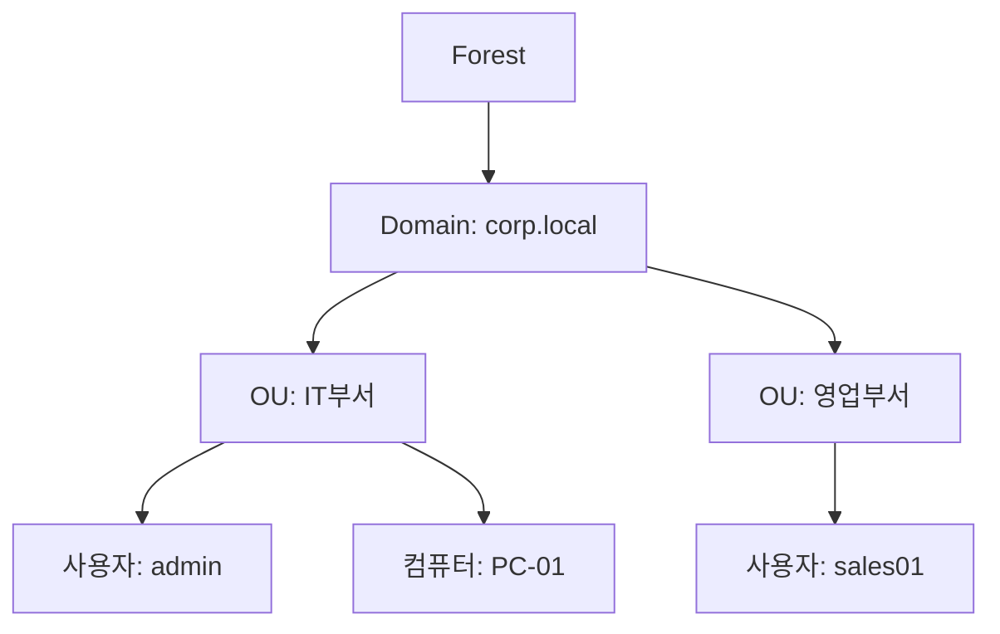

## 1. 개념

**Active Directory (AD)**는 Windows Server에서 사용자, 컴퓨터, 그룹을 중앙 관리하는 디렉토리 서비스.

### AD가 없을 때 vs 있을 때
| 구분 | AD 없음 | AD 있음 |
|------|---------|---------|
| 계정 관리 | PC마다 개별 생성 | DC에서 중앙 관리 |
| 로그인 | 로컬 계정 | 도메인 계정 |
| 정책 적용 | 수동 설정 | GPO로 일괄 적용 |
| 리소스 접근 | 개별 권한 설정 | 그룹 기반 관리 |

### 핵심 구성 요소
| 구성 | 설명 |
|------|------|
| Domain | 관리 단위 (예: corp.local) |
| DC (Domain Controller) | AD 서비스 실행 서버 |
| OU (Organizational Unit) | 조직 구조 단위 |
| GPO (Group Policy Object) | 정책 설정 |
| LDAP | 디렉토리 접근 프로토콜 |

### AD 구조


---

## 2. 설치 방법 (GUI)

### 사전 준비
1. Windows Server 설치 (2019/2022)
2. 고정 IP 설정
3. 컴퓨터 이름 변경 (예: DC01)

### AD DS 역할 설치
1. **서버 관리자** → 역할 및 기능 추가
2. 역할 선택: **Active Directory Domain Services**
3. 기능 추가 → 설치

### 도메인 승격
1. 서버 관리자 → 알림 → **이 서버를 도메인 컨트롤러로 승격**
2. 배포 구성: **새 포리스트 추가**
3. 루트 도메인 이름: `corp.local`
4. DSRM 암호 설정
5. DNS 서버 자동 설치
6. 설치 완료 후 자동 재부팅

---

## 3. 사용법

### 사용자 생성
1. **Active Directory 사용자 및 컴퓨터** 실행
2. OU 우클릭 → 새로 만들기 → 사용자
3. 사용자 정보 입력 (이름, 로그온 이름)
4. 암호 설정

### 그룹 생성
1. OU 우클릭 → 새로 만들기 → 그룹
2. 그룹 이름, 범위, 유형 설정

### GPO 생성
1. **그룹 정책 관리** 실행
2. 도메인 우클릭 → 이 도메인에서 GPO 만들기
3. GPO 편집 → 정책 설정

---

## 4. 실습 배포 및 확인

### AD 랩 환경 구성도

이번 실습에서 구축한 AD 환경의 전체 구성입니다.


| 호스트 | IP | 역할 | 주요 기능 |
|--------|----|------|-----------|
| W2K25-AD | 10.0.0.10 | AD DC, DNS, DHCP | `hamap.local` 포리스트 루트 |
| W2K25-MEM1 | 10.0.0.20 | AD DC (추가) | 복제 및 부하 분산 |
| W2K25-MEM2 | 10.0.0.30 | Child Domain | `busan.hamap.local` 자식 도메인 |
| rocky9-1~3 | 10.0.0.11~13 | Linux 서버 | DNS/DHCP/WEB 등 연동 테스트 |
| Client | 10.0.0.101~ | Windows 10/11 | 도메인 조인 테스트 |

### PowerShell을 이용한 AD 배포

GUI 대신 PowerShell 스크립트로 AD를 신속하게 배포할 수 있습니다.

**1. 부모 도메인 (hamap.local) 생성**
```powershell
Import-Module ADDSDeployment
Install-ADDSForest `
-CreateDnsDelegation:$false `
-DatabasePath "C:\WINDOWS\NTDS" `
-DomainMode "Win2025" `
-DomainName "hamap.local" `
-DomainNetbiosName "HAMAP0" `
-ForestMode "Win2025" `
-InstallDns:$true `
-Force:$true
```

**2. 자식 도메인 (busan.hamap.local) 생성**
```powershell
Import-Module ADDSDeployment
Install-ADDSDomain `
-DomainType "ChildDomain" `
-ParentDomainName "hamap.local" `
-NewDomainName "busan" `
-NewDomainNetbiosName "BUSAN" `
-Credential (Get-Credential) `
-Force:$true
```

### FSMO 역할 확인 및 관리

**CMD에서 확인**
```cmd
netdom query fsmo
```

**ntdsutil을 이용한 역할 전송**
```cmd
ntdsutil
roles
connections
connect to server W2K25-AD.hamap.local
quit
transfer rid master
# 필요한 역할(PDC, naming master 등) 전송 수행
quit
```

---

## 5. 트러블슈팅

| 문제 | 원인 | 해결 |
|------|------|------|
| 도메인 조인 실패 | DNS 설정 오류 | 클라이언트 DNS를 DC로 설정 |
| DC 통신 불가 | 방화벽 | 도메인 프로파일 허용 |
| 복제 오류 | 네트워크 문제 | `repadmin /replsummary` 확인 |

<hr class="short-rule">
