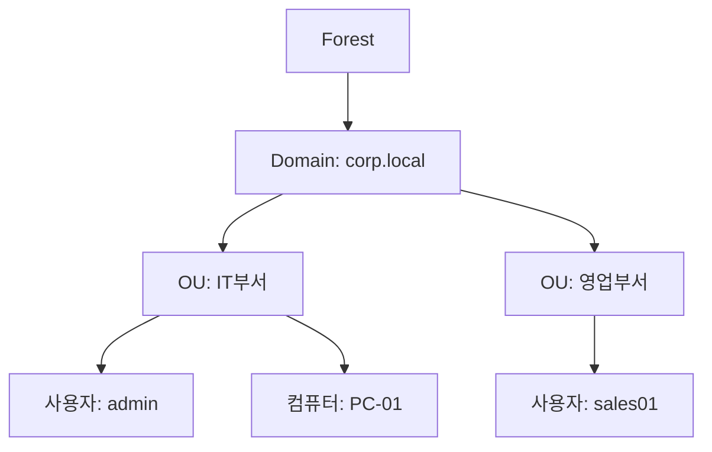

## 1. 개요

**Active Directory (AD)**는 Windows Server 환경에서 사용자, 컴퓨터, 그룹 등의 자원을 중앙에서 통합 관리하는 디렉터리 서비스이다.
도메인 컨트롤러(DC)를 통해 인증과 권한 부여를 수행하며, 그룹 정책(GPO)을 이용하여 대규모 조직의 IT 환경을 효율적으로 제어한다.

### 핵심 기능
1.  **중앙 집중식 관리**: 수천 대의 PC와 사용자를 하나의 중앙 서버(DC)에서 생성, 수정, 삭제하므로 관리 비용이 절감된다.
2.  **단일 사인온 (SSO)**: 한 번의 도메인 계정 로그인으로 파일 서버, 메일 서버, 인트라넷 등 다양한 사내 시스템을 이용할 수 있다.
3.  **정책 기반 제어**: GPO를 통해 USB 차단, 바탕화면 설정, 소프트웨어 자동 설치 등 보안 및 환경 설정을 일괄 적용한다.

### AD 도입 전후 비교
| 구분 | Workgroup 환경 (AD 없음) | Domain 환경 (AD 있음) |
|------|---------|---------|
| **계정 관리** | 각 PC마다 사용자 계정 생성 필요 | AD 서버에서 통합 관리 |
| **인증** | 로컬 PC에 저장된 정보로 인증 | 중앙 DC에서 인증 처리 (Kerberos) |
| **보안 정책** | PC마다 수동 설정 | GPO를 통해 네트워크 전체 적용 |
| **데이터 공유** | 개별 권한 설정 복잡 | 그룹 기반의 체계적 권한 관리 |

### AD 구조 다이어그램


---

## 2. 설치 방법 (GUI)

### 사전 준비사항
1.  **Windows Server OS**: Windows Server 2019 또는 2022.
2.  **고정 IP 주소**: 도메인 컨트롤러는 서버이므로 고정 IP가 필수이다.
3.  **호스트 이름 변경**: 식별하기 쉬운 이름(예: `DC01`)으로 변경한다.

### AD DS 역할 설치
1.  **서버 관리자** 실행 → '역할 및 기능 추가' 클릭.
2.  서버 역할 선택 단계에서 **Active Directory Domain Services** 체크.
3.  필요한 기능(DNS 등) 확인 후 설치 진행.

### 도메인 컨트롤러 승격
역할 설치 후 서버를 도메인 컨트롤러(DC)로 승격해야 한다.
1.  서버 관리자 우측 상단 깃발(알림) 아이콘 클릭 → **이 서버를 도메인 컨트롤러로 승격** 선택.
2.  배포 구성: **새 포리스트 추가** 선택.
3.  루트 도메인 이름 입력: 예) `corp.local`.
4.  DSRM(디렉터리 서비스 복원 모드) 암호 설정.
5.  DNS 옵션 등 기본값 확인 후 설치 완료 및 자동 재부팅.

---

## 3. 기본 사용법

### 사용자 및 그룹 관리
1.  **Active Directory 사용자 및 컴퓨터 (`dsa.msc`)** 실행.
2.  **OU(조직 단위) 생성**: 도메인 우클릭 → 새로 만들기 → 조직 단위.
3.  **사용자 생성**: 해당 OU 우클릭 → 새로 만들기 → 사용자. 이름과 로그온 ID 입력 및 암호 설정.
4.  **그룹 생성**: '새로 만들기' → 그룹. 보안 그룹/전역 그룹 선택.

### 그룹 정책(GPO) 관리
1.  **그룹 정책 관리 (`gpmc.msc`)** 실행.
2.  새 정책 생성: 도메인 우클릭 → **이 도메인에서 GPO 만들기 및 연결**.
3.  정책 편집: 생성된 GPO 우클릭 → **편집**. (예: 제어판 접근 금지 설정 등)

---

## 4. 실습 배포 및 확인

### AD 랩 환경 구성도
구축한 AD 실습 환경의 전체 구성도는 다음과 같다.


| 호스트 | IP | 역할 | 주요 기능 |
|--------|----|------|-----------|
| **W2K25-AD** | 10.0.0.10 | AD DC, DNS, DHCP | `hamap.local` 포리스트 루트 |
| **W2K25-MEM1** | 10.0.0.20 | AD DC (추가) | 복제 및 부하 분산 |
| **W2K25-MEM2** | 10.0.0.30 | Child Domain | `busan.hamap.local` 자식 도메인 |
| **Rocky Linux** | 10.0.0.11~ | Linux 클라이언트 | DNS/SSSD 연동 테스트 |
| **PC-Client** | 10.0.0.101~ | Windows 10/11 | 도메인 조인 테스트 |

### PowerShell을 이용한 AD 배포
GUI 대신 PowerShell 스크립트를 사용하면 배포 과정을 자동화할 수 있다.

**1. 부모 도메인 (hamap.local) 생성**
```powershell
Import-Module ADDSDeployment
Install-ADDSForest `
-CreateDnsDelegation:$false `
-DatabasePath "C:\WINDOWS\NTDS" `
-DomainMode "Win2025" `
-DomainName "hamap.local" `
-DomainNetbiosName "HAMAP0" `
-ForestMode "Win2025" `
-InstallDns:$true `
-Force:$true
```

**2. 자식 도메인 (busan.hamap.local) 생성**
```powershell
Import-Module ADDSDeployment
Install-ADDSDomain `
-DomainType "ChildDomain" `
-ParentDomainName "hamap.local" `
-NewDomainName "busan" `
-NewDomainNetbiosName "BUSAN" `
-Credential (Get-Credential) `
-Force:$true
```

### FSMO 역할 확인 및 관리
**CMD에서 역할 소유자 확인**
```cmd
netdom query fsmo
```

**ntdsutil을 이용한 역할 전송**
DC 장애 시나 유지보수 시 역할을 다른 DC로 강제 이동할 때 사용한다.
```cmd
ntdsutil
roles
connections
connect to server W2K25-AD.hamap.local
quit
transfer rid master
quit
```

---

## 5. 트러블슈팅

### 주요 문제 및 해결
| 문제 증상 | 원인 | 해결 방법 |
|---|---|---|
| **도메인 조인 실패** | DNS 설정 오류 | 클라이언트 PC의 DNS 서버 주소를 반드시 AD 서버(DC)의 IP로 설정해야 한다. |
| **DC 간 통신 불가** | 방화벽 포트 차단 | Windows 방화벽에서 '도메인 네트워크' 프로파일이 허용되어 있는지 확인하거나 필요한 포트(53, 88, 389, 445 등)를 개방한다. |
| **복제 오류** | 네트워크 단절 또는 시간 동기화 | `repadmin /replsummary` 명령어로 복제 상태를 점검하고, NTP 설정으로 서버 간 시간을 동기화한다. |

<hr class="short-rule">
